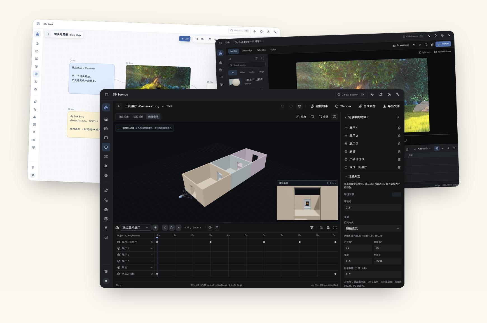
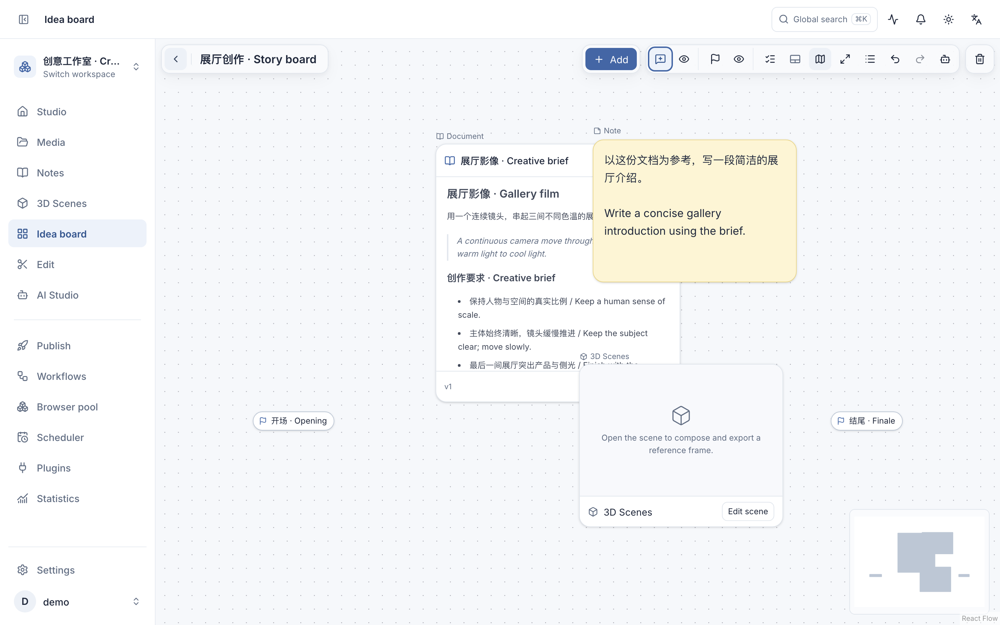
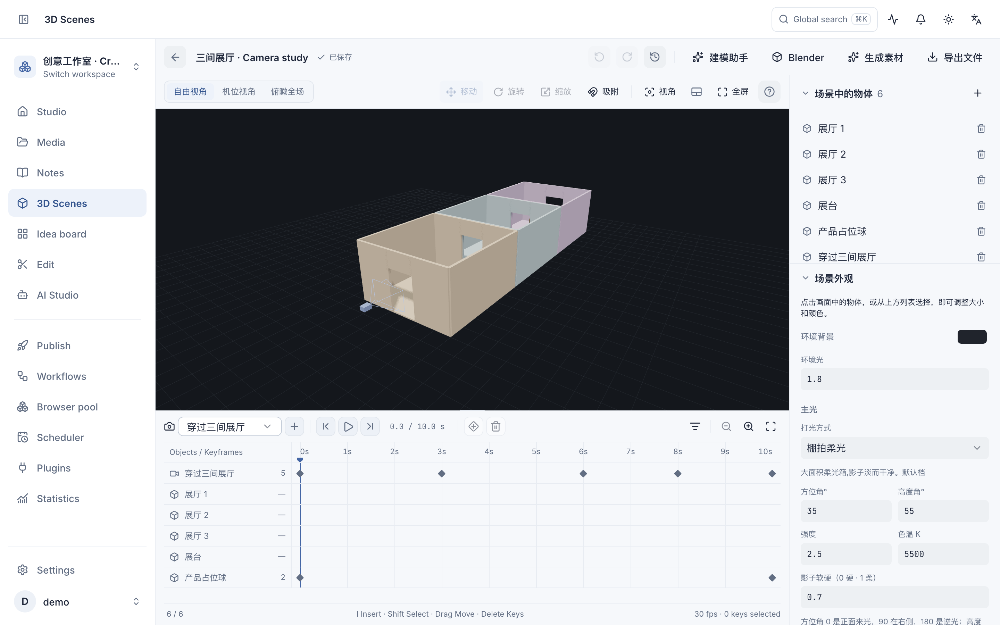
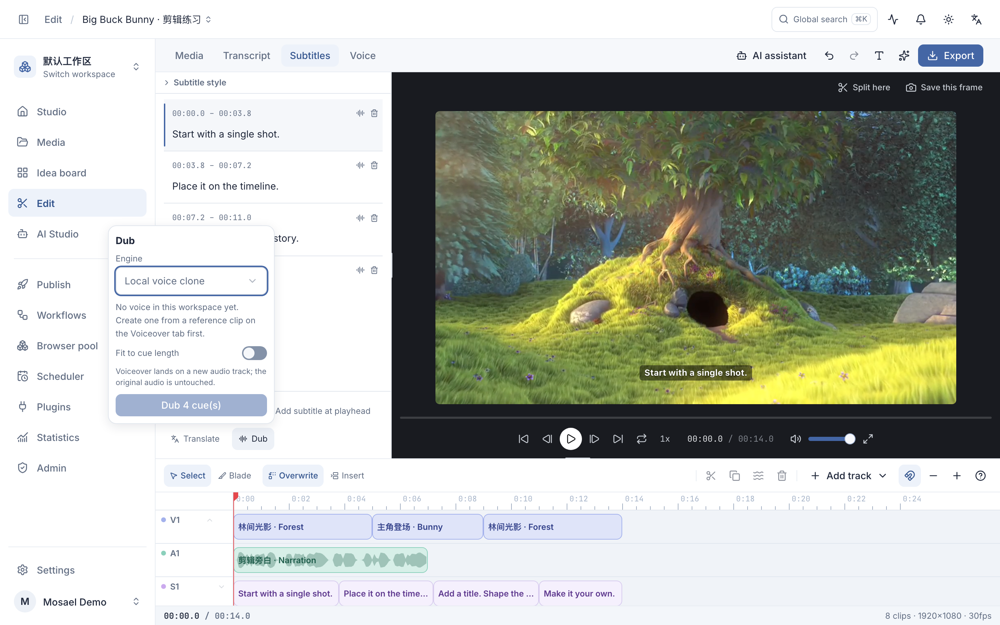
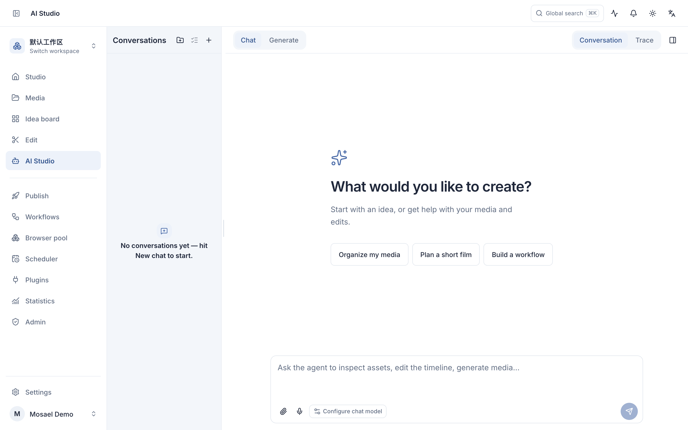
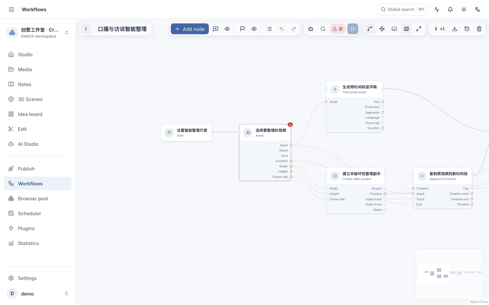

<p align="center">
  
</p>

<p align="center">
  <strong>Where ideas find their timeline.</strong><br />
  An AI video studio that lives on your computer, from the first clip to the final publish.
</p>

<p align="center">
  <a href="https://mosael.com/en">Website</a> ·
  <a href="https://github.com/Alndaly/Mosael/releases">Download</a> ·
  <a href="https://mosael.com/en/docs/start/intro">Guide</a> ·
  <a href="https://mosael.com/en/docs/about/contact#wechat">WeChat community</a> ·
  <a href="https://x.com/KindaHuaX">Maker on X</a>
</p>

**English** | [简体中文](README.zh-CN.md)

Mosael brings documents, infinite boards, 3D scenes, AI generation, editing and publishing into one desktop workspace. Gather references, rehearse a camera move, generate media and shape it into a finished piece.

> Projects and media stay on your computer by default. Cloud models, URL downloads, online tools and publishing use the network; connecting a remote backend stores shared data on that server.



<p align="center"><sub>Unaltered captures, composed like the homepage · Caveat / Newsreader / Space Grotesk · <a href="website/public/media/homepage/en">Original screenshots</a> · <a href="docs/media/mosael-promo.mp4">Watch the tour</a> · <a href="docs/media/README.md">Media credits</a></sub></p>

## Download and run

Current stable release: **[GitHub Releases](https://github.com/Alndaly/Mosael/releases/latest)**.

Download a build from [GitHub Releases](https://github.com/Alndaly/Mosael/releases):

- macOS: `.dmg` for Apple silicon
- Windows: installer for Windows 10/11 x64

Launch the installed app directly. It starts the bundled backend (default `127.0.0.1:8800`), loads
the frontend, and starts the publishing executor; no services need to be launched manually. If a
healthy Mosael backend is already listening on port 8800, the desktop app reuses it.

Local features can be explored without additional setup. Before using AI chat, image or video
generation, voiceover, or transcription, add a connection and model under the appropriate **Settings → AI Chat / AI Image / AI Video / AI Audio** section.

## A connected creative workspace

### Collect research and plan the story

Import footage, images and sound into the media library, record your screen or camera, or download a supported video URL. Use tags, search and previews to find material again. Save scripts, transcripts and agent answers as documents with revision history and source references.

Lay those documents beside images, videos and 3D scenes on an infinite board. Connect nodes to pass text and reference media to generation, and use comments, member mentions and position markers to review the work. Comments and markers have separate modes and visibility controls.



[Media library](https://mosael.com/en/docs/guides/media) · [Notes & documents](https://mosael.com/en/docs/guides/notes) · [Creative boards](https://mosael.com/en/docs/guides/boards)

### Build the scene before generating the shot

Arrange objects and lighting, then keyframe cameras and objects on one timeline. Switch between the camera composition and a global view of its movement, or keep both visible. The resulting frame, first/last frames or camera preview video can guide the image or video model you choose.

Import GLB/glTF models, export a frame or camera preview, and exchange scenes with Blender through its MCP connection. Mosael provides scene layout and shot previsualization; advanced modeling, simulation and Blender-native effects remain in Blender.



[3D scenes & animation](https://mosael.com/en/docs/guides/scenes)

### Edit picture, words and sound together

Work with multiple timelines and tracks, splitting, snapping, ripple deletion, speed changes, fades and picture-in-picture. Edit from a transcript, add or translate captions, and place generated voiceover on a separate track. Curves, LUTs and scopes help with color; export the finished sequence from the editor.



[Editing & color](https://mosael.com/en/docs/guides/editing) · [Voice interaction](https://mosael.com/en/docs/guides/voice)

### Work with AI on your terms

Connect your own model services through API keys or supported subscription sign-in. Connections store credentials; models declare chat, image, video and audio capabilities. Model-specific controls and reference roles keep inputs appropriate to the selected model. Generated results return to the media library.

Agents can read project context and use tools across media, notes, boards, scenes, editing and workflows. Actions that need approval show a confirmation card. Sessions, tool results, citations and execution traces stay available for review; workspace assistants can dock beside the work or float above it.



[Model connections](https://mosael.com/en/docs/guides/providers) · [AI Studio & agents](https://mosael.com/en/docs/guides/ai-studio)

### Reuse a process and publish the result

Connect models, media and tools in a visual workflow. Check required inputs, run the flow, inspect node results and reuse it manually, on a schedule or through a webhook. Local schedules need the backend to remain running.

Browser Pool manages persistent sign-ins and proxies for uploads, URL imports and browser automation. Agents ask before borrowing a profile. Publishing forms follow each destination's capabilities; review the video, account and post before submitting, then track the result. Browser uploads require a connected desktop executor.



[Workflows](https://mosael.com/en/docs/guides/workflows) · [Scheduled tasks](https://mosael.com/en/docs/guides/scheduler) · [Browser profiles](https://mosael.com/en/docs/guides/browser-pool) · [Publishing](https://mosael.com/en/docs/guides/publishing)

### Extend your workspace

The **Chrome video companion** opens in the browser's Side Panel to read transcripts, seek to words, translate and import media or clean video frames. Supported URLs depend on the installed yt-dlp build; page controls require a usable video player. It uses its own Mosael session and does not read Chrome cookies.

**Plugins** connect local scripts or MCP services to agents and workflows. Review the manifest, tool permissions and credentials before enabling a connection. Local process plugins run with your operating-system user permissions.

[Chrome companion](browser-extension/README.md) · [Using plugins](https://mosael.com/en/docs/guides/plugins) · [Writing a plugin](https://mosael.com/en/docs/guides/writing-plugins)

## Documentation

Complete user guides live at **[mosael.com](https://mosael.com)**; their source is under
`website/content/docs/`. Implementation references in this repository:

| Document | Covers |
| --- | --- |
| [CHANGELOG.md](CHANGELOG.md) | User-visible changes by release |
| [docs/3D_SCENES.md](docs/3D_SCENES.md) | Editable 3D scenes, camera paths, exports and model-independent generation |
| [docs/ARCHITECTURE.md](docs/ARCHITECTURE.md) | Bootstrap, domain boundaries, data model, and key conventions |
| [docs/PUBLISHING.md](docs/PUBLISHING.md) | Publishing matrix, embedded browser, worker protocol, and troubleshooting |
| [docs/MCP.md](docs/MCP.md) | Agent tools and confirmation cards |
| [docs/AGENT_PERMISSION_MODES.md](docs/AGENT_PERMISSION_MODES.md) | Agent permission modes |
| [docs/PERMISSION_MODEL.md](docs/PERMISSION_MODEL.md) | Three principals and authorization decisions |
| [docs/PLUGIN_MANIFEST.md](docs/PLUGIN_MANIFEST.md) | Plugin manifest and permissions |
| [docs/PLUGIN_ARCHITECTURE.md](docs/PLUGIN_ARCHITECTURE.md) | Plugin packaging, instances, and capability injection |
| [docs/CONVENTIONS.md](docs/CONVENTIONS.md) | Coding conventions and architectural ratchets |
| [docs/PROCESS_STATE.md](docs/PROCESS_STATE.md) | In-process state, what a restart loses, and what blocks a second backend process |
| [docs/MAINTENANCE_HOTSPOTS.md](docs/MAINTENANCE_HOTSPOTS.md) | High-risk areas and required verification |
| [browser-extension/README.md](browser-extension/README.md) | Chrome Side Panel extension setup, usage, and permissions |
| [docs/adr/](docs/adr/) | Architecture decision records |

## Local development

### Requirements

- Node.js 22+
- pnpm
- Python 3.13 and [uv](https://docs.astral.sh/uv/)
- ffmpeg (required by the complete media test suite)

Install dependencies:

```bash
pnpm install
cd backend && uv sync && cd ..
```

Browser development mode with frontend hot reload:

```bash
# Terminal 1: backend
cd backend && uv run --frozen python -m uvicorn app.main:app --reload --host 127.0.0.1 --port 8800

# Terminal 2: frontend
cd frontend && pnpm dev
```

Open `http://localhost:5173`. Electron-only capabilities such as the embedded publishing browser,
system tray, and file associations require desktop mode:

```bash
pnpm dev
```

The desktop command starts Vite, the publishing bundle watcher, and Electron together. Restart the
process after editing `electron/main.cjs` or `electron/preload.cjs`; the main-window DevTools shortcut
on macOS is `Cmd+Option+I`.

### Tests and checks

```bash
(cd backend && uv run --frozen python -m pytest -q)
pnpm --dir frontend exec vitest run
pnpm --dir frontend exec tsc -b --noEmit
pnpm --dir frontend gen:api        # after backend OpenAPI changes
pnpm --dir website build           # after website or documentation changes
```

Run checks from the repository root. Current results are recorded in [GitHub Actions](https://github.com/Alndaly/Mosael/actions); test counts change as the project grows.

### Common issues

Electron install script did not run:

```bash
pnpm rebuild electron
```

The virtual environment reports `bad interpreter` after the repository was moved:

```bash
cd backend && uv venv --clear && uv sync --frozen
```

## Building and releasing

```bash
pnpm build:mac   # build an unpacked macOS app
pnpm dist:mac    # build a macOS DMG
```

| Command | Output |
| --- | --- |
| `pnpm build:frontend` | `frontend/dist` |
| `pnpm build:publisher` | `electron/publish.bundle.cjs` |
| `pnpm build:system` | `electron/system.bundle.cjs` |
| `pnpm build:preload` | `electron/preload.bundle.cjs` |
| `pnpm build:sidecar` | `agent-sidecar/dist/sidecar.cjs` |
| `pnpm build:extension` | `browser-extension/dist` |
| `pnpm fetch:tts-python` | Standalone CPython used for voice cloning |
| `pnpm build:backend` | `backend/dist/mosael-backend` |

A release updates the root `package.json` and tag together:

```bash
VERSION=x.y.z
npm pkg set version="$VERSION"
git commit -am "chore(release): v$VERSION"
git tag -a "v$VERSION" -m "Mosael v$VERSION"
git push origin main "v$VERSION"
```

`.github/workflows/release.yml` validates the backend, frontend, browser extension, and website before
creating a draft Release. It then builds the macOS DMG, Windows NSIS installer, Chrome extension, and
plugin zip files. A stable tag is promoted to Latest only after both desktop packages pass packaging and
database-upgrade smoke tests. A tag containing a prerelease suffix, such as `v1.0.0-beta1`, is published as
a GitHub prerelease and does not replace the latest stable version. Manually dispatching the workflow
produces artifacts only and does not publish a version.

Packaged builds check the latest stable Release and prompt when an update is available. Prereleases must be
downloaded explicitly from GitHub Releases. The macOS release pipeline requires Developer ID signing and Apple notarization. Updates still prompt for
download and installation. See [macOS signing and Touch ID](docs/MACOS_SIGNING.md) for release setup.

## Data and logs

| Location | Contents |
| --- | --- |
| `~/.mosael/mosael.db` | Main SQLite database |
| `~/.mosael/media/` | Imported, generated, and exported media |
| `<userData>/logs/backend.log` | Packaged backend log |
| `<userData>/logs/publisher.log` | Publishing executor log |
| `<userData>/Partitions/` | Persistent browser profiles |
| `<userData>/custom.css` | Custom CSS from Settings → Appearance |

On macOS, `<userData>` is `~/Library/Application Support/Mosael`; on Windows it is
`%APPDATA%\Mosael`. The app displays resolved paths for dynamic locations such as plugins.

## Repository layout

```text
backend/          FastAPI, SQLAlchemy, domain services, and pytest
frontend/         React 19, Vite, TypeScript, Tailwind v4, and Radix/shadcn
electron/         Main process, preload, publishing, and system-integration bundles
agent-sidecar/    Agent runtime
browser-extension/ Chrome Side Panel video companion
contracts/        Executable contract corpus shared across implementations
plugins/          Plugin examples and manifests
website/          The mosael.com documentation site
docs/             Architecture, permissions, publishing, and ADRs
scripts/          Build and documentation-sync scripts
```

## Teams and remote backends

The app connects to the local backend by default. To use a team server, choose **Backend server ·
switch** before signing in, enter the address, run the health probe, and reload. Settings → Local
backend exposes the same entry point. Browser profiles remain bound to the machine that created them
and do not migrate automatically with SQLite data.

Google and Apple sign-in are optional and configured in `backend/.env`:

```dotenv
MOSAEL_GOOGLE_CLIENT_ID=...
MOSAEL_GOOGLE_CLIENT_SECRET=...
MOSAEL_APPLE_CLIENT_ID=...
MOSAEL_APPLE_CLIENT_SECRET=...
MOSAEL_OAUTH_REDIRECT_BASE=...
```

## License

The source is visible but **all rights are reserved**. It may be used only for evaluation, learning,
and personal non-commercial purposes; commercial use and redistribution require written permission.
See [LICENSE](LICENSE). Contact the maker through the [community and contact page](https://mosael.com/en/docs/about/contact),
or follow [KindaHuaX on X](https://x.com/KindaHuaX), for commercial licensing.

User guides cover the current 1.3.0 interface. Screenshots and recordings use isolated demo data; capture dates, source revisions and media credits are documented in [the media guide](docs/media/README.md).
