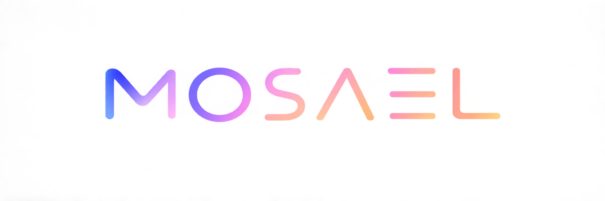

<p align="center">
  
</p>

<p align="center">
  <strong>Where ideas find their timeline.</strong><br />
  An AI video studio that lives on your computer, from the first clip to the final publish.
</p>

<p align="center">
  <a href="https://mosael.com/en">Website</a> ·
  <a href="https://github.com/Alndaly/Mosael/releases">Download</a> ·
  <a href="https://mosael.com/en/docs/start/intro">Guide</a> ·
  <a href="https://mosael.com/en/docs/about/contact#wechat">WeChat community</a> ·
  <a href="https://x.com/KindaHuaX">Maker on X</a>
</p>

**English** | [简体中文](README.zh-CN.md)

Mosael brings editing, AI generation, agents, workflows, and publishing into one desktop app. Start
with a clip, cut the pauses from its transcript, ask AI to find a shot or make a voiceover, and publish
the finished story without shuttling the project between a pile of tools.

> Your media and projects stay local by default. Only AI services you choose to configure and use go online.


## Download and run

Download a build from [GitHub Releases](https://github.com/Alndaly/Mosael/releases):

- macOS: `.dmg` for Apple silicon
- Windows: installer for Windows 10/11 x64

Launch the installed app directly. It starts the bundled backend (default `127.0.0.1:8800`), loads
the frontend, and starts the publishing executor; no services need to be launched manually. If a
healthy Mosael backend is already listening on port 8800, the desktop app reuses it.

Local features can be explored without additional setup. Before using AI chat, image or video
generation, voiceover, or transcription, add a connection and model under **Settings → Providers**.

## What you can make with it

### Cut from the transcript

- Multiple timelines and tracks with split, snap, ripple delete, speed ramps, fades,
  picture-in-picture, and undo/redo.
- The transcript and timeline share the same editing semantics: delete a sentence or word and the
  corresponding footage is cut.
- Timestamp, speaker, and the first text line stay aligned; long text wraps in full rather than being
  truncated.
- Subtitles, translation, and voiceover live in one panel; dubbed audio lands on a dedicated track
  without overwriting the original sound.
- Curves, LUTs, scopes, filters, and subtitles follow the same preview/export contract.


### Let AI lend a real hand

The agent uses MCP tools to inspect and operate media, timelines, workflows, browser profiles, and
publishing tasks. Any action that changes the project or external state first surfaces a confirmation
card and runs only after you approve it.

- AI Studio, the editor, workflows, and creative boards share one conversation pool.
- Workspace assistants dock as real layout columns by default and can float when needed, so opening
  one does not cover the timeline.
- The top-left heading is the current conversation title; click it to search or switch sessions.
- The main agent can dispatch read-only subagents in parallel; every subagent is an independent,
  inspectable session.
- The trajectory view shows execution across input, model, and tool lanes, including timing,
  arguments, and results.
- Context can be compacted automatically near the limit or manually, with the compaction kept in the
  conversation record.


### Turn an idea into picture and sound

Provider configuration has two levels: a **connection** stores the endpoint, API key, or OAuth state;
a **model** declares chat, image, video, and audio capabilities along with context, reasoning, vision,
and generation parameters. The UI only shows controls supported by the exact model and does not
guess from a similar model name.

- Supports API-key and subscription/OAuth models.
- Media inputs preserve semantic roles such as first frame, last frame, reference image, edit source,
  and extension clip.
- Evolink can act as a unified image/video gateway; completed results are downloaded into the local
  media library promptly.
- ByteDance integrations are separated by product protocol: Ark hosts Seedream/Seedance, while
  Volcano speech hosts TTS and podcast APIs.
- Custom models without a catalogued descriptor remain usable but do not inherit another model's
  parameter rules.

### Spread ideas out on a creative board

- Import local video, audio, and images with automatic thumbnails and preview proxies.
- URL import probes a listing first, then lets you choose entries, audio/video, and quality tiers that
  actually exist; authenticated sources can reuse a Browser Pool profile.
- Video-to-GIF creates a derived asset without touching the original; a matching workflow node handles
  batch conversion.
- Creative boards support notes, media, links, trimming, `@` asset references, and AI-assisted edits;
  node state and generation lifecycle are persisted.


### Draw the repetitive part once

The visual DAG connects retrieval, generation, transcription, assembly, export, and publishing into
reusable flows triggered manually, on a schedule, or by webhook. Node groups collapse into arbitrarily
nested subgraphs with boundary references reconnected automatically; loops use the same parallel
execution engine as the top level.


### Publish to more places from one window

All persistent logins are stored as browser profiles shared by publishing, workflow RPA, URL import,
and the agent. Before borrowing an identity, the agent must receive explicit per-use authorization;
the confirmation card names the exact profile.

Publishing forms are generated from each platform's actual capabilities for TikTok, YouTube, Douyin,
Bilibili, Xiaohongshu, and WeChat Channels. Options a platform does not provide are not presented as
universal features. A separate executor claims publishing tasks, so progress remains traceable across
app restarts.


### Chrome browser extension

The Chrome extension uses the browser's native Side Panel instead of placing a floating overlay on
the page. Open any video URL recognized by the installed yt-dlp build: YouTube and Bilibili use native
captions when available, while Mosael can download and transcribe other sites. Pages with a usable
HTML5 player get playback following, word-precise seeking, and clean video-frame capture without HTML
controls. The extension uses a separate Mosael session, never stores the password, and does not
read or export Chrome cookies; restricted content can use an existing Browser Pool identity and proxy.
Its UI follows Chrome by default and can be pinned to Simplified Chinese or English. See
[browser-extension/README.md](browser-extension/README.md) for installation and limitations.

### Plugins

A plugin can be a local subprocess script or a connection to an existing MCP server. Before
installation, Mosael reads the manifest and shows its permissions, credentials, and tools.
Once enabled, the same tools are available to both agents and workflows. Plugins can receive media,
return files, and use persistent secrets managed by the host.

## Documentation

Complete user guides live at **[mosael.com](https://mosael.com)**; their source is under
`website/content/docs/`. Implementation references in this repository:

| Document | Covers |
| --- | --- |
| [CHANGELOG.md](CHANGELOG.md) | User-visible changes by release |
| [docs/ARCHITECTURE.md](docs/ARCHITECTURE.md) | Bootstrap, domain boundaries, data model, and key conventions |
| [docs/PUBLISHING.md](docs/PUBLISHING.md) | Publishing matrix, embedded browser, worker protocol, and troubleshooting |
| [docs/MCP.md](docs/MCP.md) | Agent tools and confirmation cards |
| [docs/AGENT_PERMISSION_MODES.md](docs/AGENT_PERMISSION_MODES.md) | Agent permission modes |
| [docs/PERMISSION_MODEL.md](docs/PERMISSION_MODEL.md) | Three principals and authorization decisions |
| [docs/PLUGIN_MANIFEST.md](docs/PLUGIN_MANIFEST.md) | Plugin manifest and permissions |
| [docs/PLUGIN_ARCHITECTURE.md](docs/PLUGIN_ARCHITECTURE.md) | Plugin packaging, instances, and capability injection |
| [docs/CONVENTIONS.md](docs/CONVENTIONS.md) | Coding conventions and architectural ratchets |
| [docs/MAINTENANCE_HOTSPOTS.md](docs/MAINTENANCE_HOTSPOTS.md) | High-risk areas and required verification |
| [browser-extension/README.md](browser-extension/README.md) | Chrome Side Panel extension setup, usage, and permissions |
| [docs/adr/](docs/adr/) | Architecture decision records |

## Local development

### Requirements

- Node.js 22+
- pnpm
- Python 3.13 and [uv](https://docs.astral.sh/uv/)
- ffmpeg (required by the complete media test suite)

Install dependencies:

```bash
pnpm install
cd backend && uv sync && cd ..
```

Browser development mode with frontend hot reload:

```bash
# Terminal 1: backend
cd backend && uv run --frozen python -m uvicorn app.main:app --reload --host 127.0.0.1 --port 8800

# Terminal 2: frontend
cd frontend && pnpm dev
```

Open `http://localhost:5173`. Electron-only capabilities such as the embedded publishing browser,
system tray, and file associations require desktop mode:

```bash
pnpm dev
```

The desktop command starts Vite, the publishing bundle watcher, and Electron together. Restart the
process after editing `electron/main.cjs` or `electron/preload.cjs`; the main-window DevTools shortcut
on macOS is `Cmd+Option+I`.

### Tests and checks

```bash
cd backend && uv run --frozen python -m pytest -q
cd frontend && pnpm vitest run
cd frontend && pnpm exec tsc -b --noEmit
cd frontend && pnpm gen:api        # after backend OpenAPI changes
cd website && pnpm build           # after website or documentation changes
```

Current baseline: 2,451 backend tests and 818 frontend tests.

### Common issues

Electron install script did not run:

```bash
pnpm rebuild electron
```

The virtual environment reports `bad interpreter` after the repository was moved:

```bash
cd backend && uv venv --clear && uv sync --frozen
```

## Building and releasing

```bash
pnpm build:mac   # build an unpacked macOS app
pnpm dist:mac    # build a macOS DMG
```

| Command | Output |
| --- | --- |
| `pnpm build:frontend` | `frontend/dist` |
| `pnpm build:publisher` | `electron/publish.bundle.cjs` |
| `pnpm build:system` | `electron/system.bundle.cjs` |
| `pnpm build:preload` | `electron/preload.bundle.cjs` |
| `pnpm build:sidecar` | `agent-sidecar/dist/sidecar.cjs` |
| `pnpm build:extension` | `browser-extension/dist` |
| `pnpm fetch:tts-python` | Standalone CPython used for voice cloning |
| `pnpm build:backend` | `backend/dist/mosael-backend` |

A release updates the root `package.json` and tag together:

```bash
VERSION=x.y.z
npm pkg set version="$VERSION"
git commit -am "chore(release): v$VERSION"
git tag -a "v$VERSION" -m "Mosael v$VERSION"
git push origin main "v$VERSION"
```

`.github/workflows/release.yml` validates the backend, frontend, browser extension, and website before
creating a draft Release. It then builds the macOS DMG, Windows NSIS installer, Chrome extension, and
plugin zip files. A stable tag is promoted to Latest only after both desktop packages pass packaging and
database-upgrade smoke tests. A tag containing a prerelease suffix, such as `v1.0.0-beta1`, is published as
a GitHub prerelease and does not replace the latest stable version. Manually dispatching the workflow
produces artifacts only and does not publish a version.

Packaged builds check the latest stable Release and prompt when an update is available. Prereleases must be
downloaded explicitly from GitHub Releases. The macOS package is currently unsigned, so updates use
check-and-download rather than silent installation.

## Data and logs

| Location | Contents |
| --- | --- |
| `~/.mosael/mosael.db` | Main SQLite database |
| `~/.mosael/media/` | Imported, generated, and exported media |
| `<userData>/logs/backend.log` | Packaged backend log |
| `<userData>/logs/publisher.log` | Publishing executor log |
| `<userData>/Partitions/` | Persistent browser profiles |
| `<userData>/custom.css` | Custom CSS from Settings → Appearance |

On macOS, `<userData>` is `~/Library/Application Support/Mosael`; on Windows it is
`%APPDATA%\Mosael`. The app displays resolved paths for dynamic locations such as plugins.

## Repository layout

```text
backend/          FastAPI, SQLAlchemy, domain services, and pytest
frontend/         React 19, Vite, TypeScript, Tailwind v4, and Radix/shadcn
electron/         Main process, preload, publishing, and system-integration bundles
agent-sidecar/    Agent runtime
browser-extension/ Chrome Side Panel video companion
contracts/        Executable contract corpus shared across implementations
plugins/          Plugin examples and manifests
website/          The mosael.com documentation site
docs/             Architecture, permissions, publishing, and ADRs
scripts/          Build and documentation-sync scripts
```

## Teams and remote backends

The app connects to the local backend by default. To use a team server, choose **Backend server ·
switch** before signing in, enter the address, run the health probe, and reload. Settings → Local
backend exposes the same entry point. Browser profiles remain bound to the machine that created them
and do not migrate automatically with SQLite data.

Google and Apple sign-in are optional and configured in `backend/.env`:

```dotenv
MOSAEL_GOOGLE_CLIENT_ID=...
MOSAEL_GOOGLE_CLIENT_SECRET=...
MOSAEL_APPLE_CLIENT_ID=...
MOSAEL_APPLE_CLIENT_SECRET=...
MOSAEL_OAUTH_REDIRECT_BASE=...
```

## License

The source is visible but **all rights are reserved**. It may be used only for evaluation, learning,
and personal non-commercial purposes; commercial use and redistribution require written permission.
See [LICENSE](LICENSE). Contact the maker through the [community and contact page](https://mosael.com/en/docs/about/contact),
or follow [KindaHuaX on X](https://x.com/KindaHuaX), for commercial licensing.
