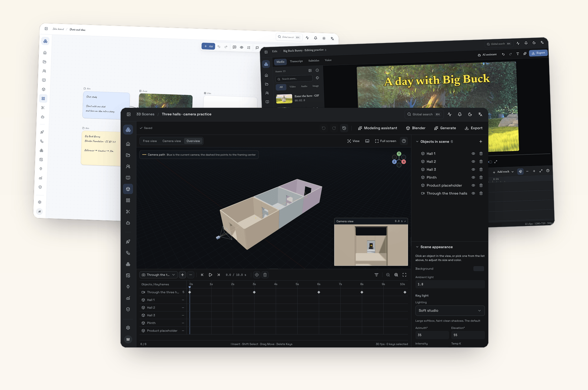
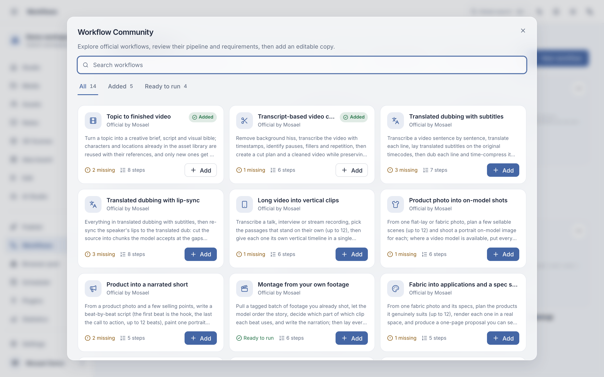
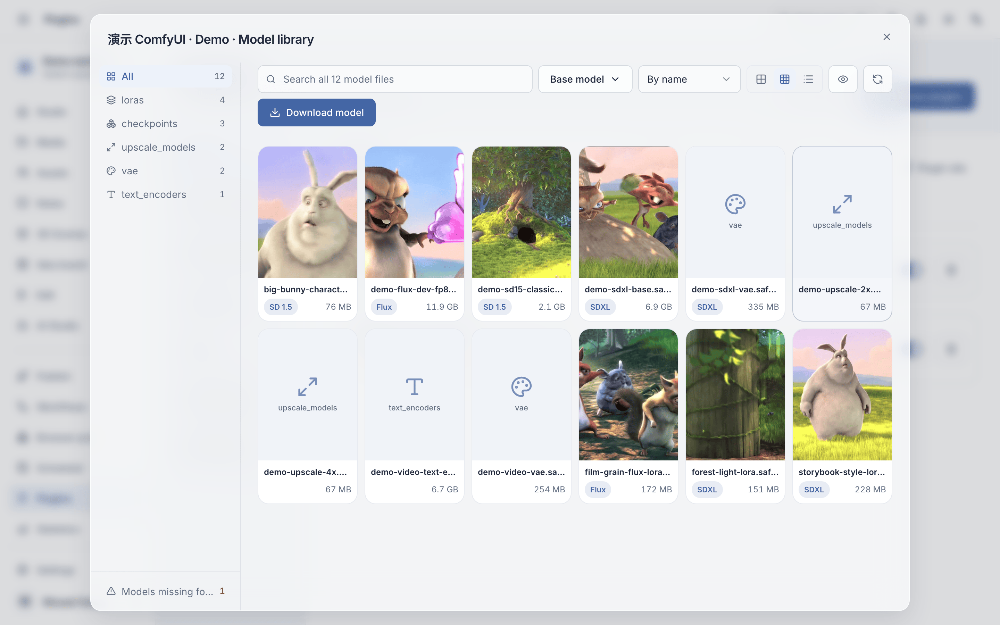
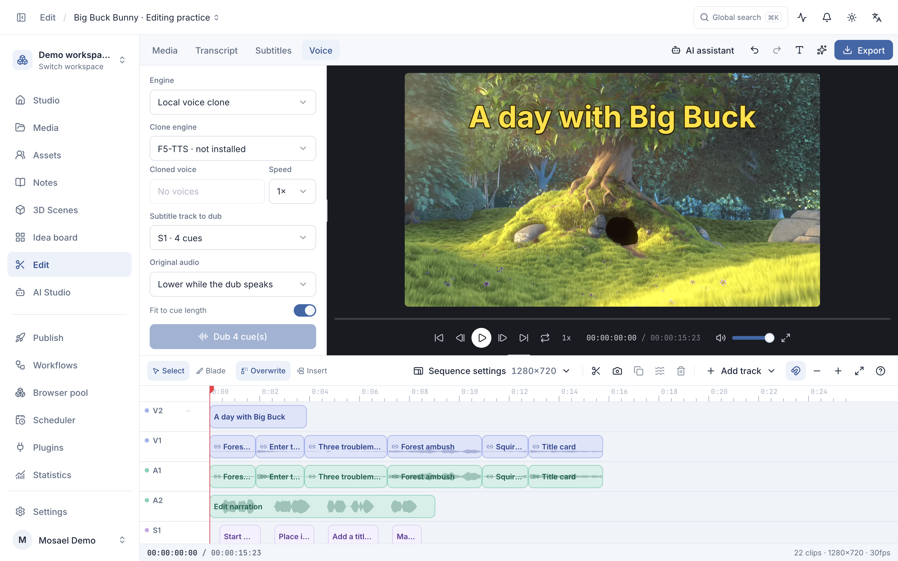
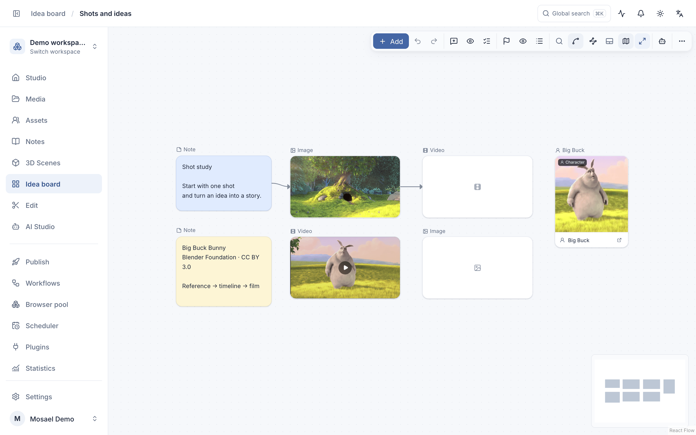

<p align="center">
  
</p>

<h1 align="center">Mosael — local-first AI video studio for Mac &amp; Windows</h1>

<p align="center">
  <strong>Generate, edit and dub AI video on your own computer.</strong><br />
  Bring your own API keys for Seedance, Kling, Veo, Wan and more — or your own ComfyUI — then cut on a timeline,
  clone a voice, translate and lip-sync, make a photo talk, and turn a product photo into a narrated short.
</p>

<p align="center">
  <a href="https://github.com/Alndaly/Mosael/releases/latest"><strong>Download for macOS / Windows</strong></a> ·
  <a href="https://mosael.com/en">Website</a> ·
  <a href="https://mosael.com/en/docs/start/intro">Guide</a> ·
  <a href="https://mosael.com/en/workflows">Workflow templates</a> ·
  <a href="https://mosael.com/en/docs/about/contact#wechat">WeChat community</a> ·
  <a href="https://x.com/KindaHuaX">Maker on X</a>
</p>

**English** | [简体中文](README.zh-CN.md)

Mosael is a desktop app that takes a video from idea to upload: **AI generation, a multi-track editor, voice cloning
and dubbing, digital humans, workflow automation and publishing in one place**. It connects to the model providers you
already pay for — Mosael doesn't resell credits — and keeps your projects and media on your computer by default.



<p align="center"><sub>Unaltered captures, composed like the homepage · <a href="website/public/media/homepage/en">Original screenshots</a> · <a href="docs/media/mosael-promo.mp4">Watch the tour</a> · <a href="docs/media/README.md">Media credits</a></sub></p>

## Download

| Platform | Installer | Notes |
| --- | --- | --- |
| macOS | `Mosael-<version>-arm64.dmg` | Apple silicon (M-series); signed and notarized |
| Windows | `Mosael.Setup.<version>.exe` | Windows 10 / 11, x64 |

Get the latest stable build from **[GitHub Releases](https://github.com/Alndaly/Mosael/releases/latest)** (users in
mainland China can use the [Baidu Netdisk mirror](https://mosael.com/zh/docs/start/download)). Free for personal,
non-commercial use — see [License](#license).

Launch the installed app directly. It starts the bundled backend (default `127.0.0.1:8800`), loads the frontend and
starts the publishing executor; nothing needs to be launched by hand. If a healthy Mosael backend is already listening
on port 8800, the desktop app reuses it. Local features work without setup; before using AI chat, image or video
generation, voice-over or transcription, add a connection under **Settings → AI Chat / AI Image / AI Video / AI Audio**,
or connect your ComfyUI under **Plugins**.

## What you can make

Official [workflow templates](https://mosael.com/en/workflows) are complete pipelines: import one, point it at your own
models and footage, and run it. A few of them:

| Template | What it does |
| --- | --- |
| [Product photo → narrated promo short](https://mosael.com/en/workflows/product-pitch-short) | Beat-by-beat script from hook to call to action, a product shot per beat, voice-over and on-screen captions, exported vertical — using only the selling points you give it |
| [Product → presenter-led short](https://mosael.com/en/workflows/product-pitch-presenter) | A character from your asset library speaks the hook and the call to action; the beats in between show the product |
| [Flat-lay photo → on-model shots and clips](https://mosael.com/en/workflows/product-on-model) | Up to 12 scenes, a vertical on-model image for each, animated when a video model is available |
| [Topic → finished video](https://mosael.com/en/workflows/full-video-generation) | Script, characters, storyboard and a 3D blockout per shot, then first frames, video, narration and subtitles assembled in order |
| [Video translation with lip-sync](https://mosael.com/en/workflows/translated-dub-lipsync) | Transcribe, translate and subtitle every line, dub it in a cloned voice, then re-sync the speaker's lips |
| [Long video → vertical clips](https://mosael.com/en/workflows/highlight-shorts) | Up to 12 stand-alone passages from a talk, interview or stream, each on its own vertical timeline with captions |
| [Script → talking-head video](https://mosael.com/en/workflows/talking-script-video) | One portrait and a script become a talking video with subtitles timed to the voice |
| [Why a video went viral](https://mosael.com/en/workflows/viral-video-breakdown) | Data, top comments and the transcript of a Douyin, Xiaohongshu or Bilibili video become a breakdown and a script outline |

Others cover transcript-based cleanup of talking-head footage, translated dubbing with subtitles only, montages from
your own footage, fabric lookbooks, and account and comment analysis.



## Features

### AI video, image and music generation with your own API keys

AI Studio generates images, video, music and sound effects from text, a first and last frame or reference images. Pick
any model from the providers you connect and the controls follow that model; results land in the media library and
remember what they were made from. Spending is recorded from the usage and charges providers report.
[AI Studio](https://mosael.com/en/docs/guides/ai-studio) · [Model connections](https://mosael.com/en/docs/guides/providers)

### ComfyUI client: workflows become models and tools

Connect a ComfyUI server on this computer or your LAN — or let Mosael start one you already installed, or install one
for you (Apple silicon, Windows or Linux with NVIDIA). Every saved workflow becomes a model you can pick in AI Studio
and on boards, and a tool the agent and workflows can run. The **model library** lists the server's checkpoints, LoRAs
and other files with preview images, base model and trigger words, and downloads what's missing; the **workflow
library** organizes workflows in folders, creates and imports them, and completes missing models and custom nodes. An
**simplified form** shows only the few fields others need to fill in, and the desktop **ComfyUI workbench** opens ComfyUI's own
canvas with Mosael's model library, missing items, form and run results docked beside it. Mosael doesn't replace
ComfyUI's own interface — it puts your workflows next to cloud models, the editor and automation. [Generating with ComfyUI](https://mosael.com/en/docs/guides/comfyui)



### AI video editor: timeline, transcript editing and subtitles

Edit on multiple timelines and tracks with overwrite and insert modes, linked picture and sound, ripple edits and the
usual J / K / L, I / O and Q / W shortcuts. Cut by deleting words in the transcript, import and export .srt / .vtt
captions, stack bilingual subtitles, grade with curves, presets and LUTs, and normalize loudness on export. People and
agents can edit the same timeline at once, and ⌘Z undoes only your own step. [Editing & color](https://mosael.com/en/docs/guides/editing)

### Voice cloning, AI dubbing and video translation

Dub a subtitle track line by line with a voice cloned **locally** (F5-TTS or Fish Speech), with a copy of that voice in
your own Alibaba Cloud Bailian account for **CosyVoice**, with free Edge voices, or with OpenAI and Volcengine voices.
Split a clip into voice and background, denoise it, or keep only the voice. The translated-dubbing templates transcribe,
translate, subtitle and dub a whole video, and can re-sync the speaker's lips. [Voice-over](https://mosael.com/en/docs/guides/editing#voiceover)



### AI digital humans: talking photos and lip-sync

Turn a portrait or a character asset plus a voice-over into a talking video with OmniHuman (Jimeng), Kling Avatar,
HeyGen Avatar IV, Hedra Character-3 or Wan, or re-sync the lips of existing footage with Bailian videoretalk, Kling or
HeyGen. A real person needs a consent declaration before their face or voice is used.
[Digital humans](https://mosael.com/en/docs/guides/digital-humans)

### Workflow automation

Connect models, media and tools on a visual node canvas. Required inputs are checked before anything runs, and
references that could never resolve are caught up front. Run a flow by hand, on a schedule or from a webhook, or let the
agent call it. [Workflows](https://mosael.com/en/docs/guides/workflows) · [Scheduled tasks](https://mosael.com/en/docs/guides/scheduler)

### AI infinite canvas

Lay documents, media, character assets, 3D scenes and generations side by side on an infinite board. Connections pass
text and reference media to generation; cells transcribe, translate, denoise or split a grid on their own; a timeline
cell gives you a rough cut on the board. Comments, mentions and markers keep review anchored.
[Creative boards](https://mosael.com/en/docs/guides/boards)



### 3D previs and Blender

Arrange objects and lighting, keyframe cameras and objects on one timeline, and watch the shot and the camera path side
by side. Use the frame, first/last frames or the camera preview video as a reference for the image or video model you
choose. Import GLB/glTF and exchange scenes with Blender through its MCP connection; advanced modeling and simulation
stay in Blender. [3D scenes & animation](https://mosael.com/en/docs/guides/scenes)

### Agent, media library, notes and documents

The agent reads project context and uses tools across media, notes, boards, scenes, editing and workflows; actions that
need approval show a confirmation card. Import footage, record your screen or camera, or download a supported video
URL; PDFs, Word files, slides and spreadsheets are parsed into text on your machine. Notes keep scripts and research,
and a selected passage can be polished, rewritten or translated with each change shown for approval. Recurring
characters, locations and props live in the asset library — `@` one while generating and its references come along.
[AI Studio & agents](https://mosael.com/en/docs/guides/ai-studio) · [Media library](https://mosael.com/en/docs/guides/media) · [Notes](https://mosael.com/en/docs/guides/notes) · [Asset library](https://mosael.com/en/docs/guides/assets)

### Publish to Douyin, TikTok, Bilibili, Xiaohongshu and YouTube

Browser Pool keeps persistent sign-ins and proxies for several accounts. Publishing forms follow each destination's
options; review the video, account and post before submitting, then track the result.
[Publishing](https://mosael.com/en/docs/guides/publishing) · [Browser profiles](https://mosael.com/en/docs/guides/browser-pool)

### Plugins and the Chrome companion

ComfyUI, object storage and MinerU document parsing ship with the app; Blender, Manim, Remotion, TikHub, Baidu Netdisk
and more are in the [plugin market](https://mosael.com/en/plugins). Plugins connect local scripts or MCP servers to the
agent and workflows. The Chrome video companion reads transcripts in the side panel, translates and imports media.
[Using plugins](https://mosael.com/en/docs/guides/plugins) · [Writing a plugin](https://mosael.com/en/docs/guides/writing-plugins) · [Chrome companion](browser-extension/README.md)

### AI-generated content labels

When an export contains AI-generated or AI-altered content, Mosael writes the standard implicit AIGC label into the
file and, by default, a visible "AI-generated" mark — in line with China's rules on labelling synthetic content.
Turning the visible mark off is your call and is stated in the export dialog.

## Supported models and providers

Bring your own API key, or sign in with a supported subscription. Availability depends on your account and region; the
full list with model names is in [Model connections](https://mosael.com/en/docs/guides/providers).

| Capability | Providers |
| --- | --- |
| Video | Volcengine Ark (Seedance), Kuaishou Kling, Google (Veo), Alibaba Bailian (Wan), MiniMax (Hailuo), Evolink (Seedance, Kling, Veo, Hailuo, Wan, Sora…) |
| Image | OpenAI (GPT Image), Volcengine Ark (Seedream), Alibaba Bailian (Qwen Image), Evolink (GPT Image, Gemini, Seedream…), OpenAI-compatible endpoints |
| Talking photo & lip-sync | Volcengine Jimeng (OmniHuman), Kling, HeyGen, Hedra, Alibaba Bailian (Wan s2v, videoretalk) |
| Music & sound | Google (Lyria), Evolink (Suno), Kling audio, Alibaba Model Studio (Fun-Music), Volcengine AI music |
| Speech & voice | Local voice cloning (F5-TTS, Fish Speech), Alibaba Bailian (CosyVoice), Edge voices, OpenAI, Volcengine TTS and podcast |
| Transcription | FunASR, WhisperX (local) |
| Chat & agent | DeepSeek, Kimi, Alibaba Bailian (Qwen), MiniMax, OpenAI, OpenRouter, Ollama and other OpenAI-compatible endpoints; Google Gemini (AI Studio API key); Claude Pro/Max, ChatGPT Plus/Pro, Kimi Code, GitHub Copilot and xAI sign-in |
| Your own GPU | Any ComfyUI server on this computer or your LAN |

## How Mosael fits next to the tools you know

| If you use… | Where Mosael fits |
| --- | --- |
| CapCut / Jianying | Mosael has a multi-track editor, transcript editing, subtitles and voice-over, keeps projects on your computer and uses your own AI accounts. If you depend on CapCut's templates, stickers and music library, keep CapCut for that. |
| ComfyUI's own interface | Mosael connects to your ComfyUI rather than replacing it: saved workflows become models and tools next to cloud models, the editor and automation, and ComfyUI's interface keeps working. |
| Cloud ComfyUI platforms such as RunningHub | Mosael runs workflows on your own ComfyUI and GPU; there is no hosted compute or credit system. |
| Separate generation, voice and subtitle sites | One project holds the generations, the timeline, the voices and the subtitles, and workflows chain the steps. |

## FAQ

**Is Mosael free?** Downloading it and using it for personal, non-commercial work is free. AI models are billed by the
providers you connect, at their own prices. Commercial use requires written permission from the author; the
[LICENSE](LICENSE) is authoritative. For a commercial license, email [1142704468@qq.com](mailto:1142704468@qq.com).

**Is Mosael open source?** The source code is public here, so you can read it, learn from it and build it locally, but
it is released under a proprietary license, not an open-source one: commercial use and redistribution are not allowed
without permission.

**Do I need a GPU?** Not for Mosael itself. Cloud models run on the provider's servers and ComfyUI runs on whichever
machine you connect. Local transcription, voice cloning and voice separation run on your computer after their models
are downloaded; keep 10 GB or more of disk space free for them.

**Does Mosael upload my videos?** Projects and media stay on your computer by default. A cloud model call sends that
run's inputs to the provider you chose (some providers only accept public links, so files go to object storage you
configure first); URL downloads, online tools and publishing also use the network. With a team server, shared data
lives on that server.

**Which systems are supported?** macOS on Apple silicon and Windows 10/11 x64. There is no Linux installer.

## Documentation

Complete user guides live at **[mosael.com](https://mosael.com)**; their source is under
`website/content/docs/`. Implementation references in this repository:

| Document | Covers |
| --- | --- |
| [CHANGELOG.md](CHANGELOG.md) | User-visible changes by release |
| [docs/3D_SCENES.md](docs/3D_SCENES.md) | 3D scene data shape, the geometry contract shared by three renderers, and the agent's scene/Blender tools |
| [docs/ARCHITECTURE.md](docs/ARCHITECTURE.md) | Bootstrap, domain boundaries, data model, and key conventions |
| [docs/PUBLISHING.md](docs/PUBLISHING.md) | Publishing matrix, embedded browser, worker protocol, and troubleshooting |
| [docs/MCP.md](docs/MCP.md) | Agent tools and confirmation cards |
| [docs/AGENT_PERMISSION_MODES.md](docs/AGENT_PERMISSION_MODES.md) | Agent permission modes |
| [docs/PERMISSION_MODEL.md](docs/PERMISSION_MODEL.md) | Three principals and authorization decisions |
| [docs/PLUGIN_MANIFEST.md](docs/PLUGIN_MANIFEST.md) | Plugin manifest and permissions |
| [docs/PLUGIN_ARCHITECTURE.md](docs/PLUGIN_ARCHITECTURE.md) | Plugin packaging, instances, and capability injection |
| [docs/CONVENTIONS.md](docs/CONVENTIONS.md) | Coding conventions and architectural ratchets |
| [docs/PROCESS_STATE.md](docs/PROCESS_STATE.md) | In-process state, what a restart loses, and what blocks a second backend process |
| [docs/MAINTENANCE_HOTSPOTS.md](docs/MAINTENANCE_HOTSPOTS.md) | High-risk areas and required verification |
| [browser-extension/README.md](browser-extension/README.md) | Chrome Side Panel extension setup, usage, and permissions |
| [docs/adr/](docs/adr/) | Architecture decision records |

## Local development

### Requirements

- Node.js 24+
- pnpm
- Python 3.14 and [uv](https://docs.astral.sh/uv/)
- FFmpeg 8.1+ with ffprobe (required by media import, preview, export, and the complete media test suite)

Install dependencies:

```bash
pnpm install
cd backend && uv sync && cd ..
pnpm fetch:tts-python   # the interpreter local engines' environments are built with — same one the app ships
```

Browser development mode with frontend hot reload:

```bash
# Terminal 1: backend
cd backend && uv run --frozen python -m uvicorn app.main:app --reload --host 127.0.0.1 --port 8800

# Terminal 2: frontend
cd frontend && pnpm dev
```

Open `http://localhost:5173`. Electron-only capabilities such as the embedded publishing browser,
system tray, and file associations require desktop mode:

```bash
pnpm dev
```

The desktop command starts Vite, the publishing bundle watcher, and Electron together. When what the main
process loaded (`electron/main.cjs`, the preload and the bundles) changes, the running process still has the old
code: a notice at the bottom says the main process code was updated, and **Restart** relaunches only Electron while
Vite and the backend keep running (the browser session's top bar shows a restart badge too). The main-window DevTools
shortcut on macOS is `Cmd+Option+I`.

For a separate, isolated stack (its own backend on another port, `MOSAEL_DATA_DIR` pointing at a scratch directory),
start Vite with the backend address so the very first page load talks to it:

```bash
cd frontend && VITE_MOSAEL_API_URL=http://127.0.0.1:8833 pnpm exec vite --host 127.0.0.1 --port 5291 --strictPort
```

A dev server on any port other than 5173 without this variable no longer falls back to 8800; it can't connect and
says why in the console. `vite build` reads the variable too; release builds don't set it and keep using 8800.

### Tests and checks

```bash
(cd backend && uv run --frozen python -m pytest -q)
pnpm --dir frontend exec vitest run
pnpm --dir frontend exec tsc -b --noEmit
pnpm --dir agent-sidecar typecheck && pnpm --dir agent-sidecar build && pnpm --dir agent-sidecar test
pnpm typecheck:electron
pnpm --dir browser-extension test && pnpm --dir browser-extension typecheck && pnpm build:extension
pnpm --dir frontend gen:api        # after backend OpenAPI changes
pnpm --dir website test && pnpm --dir website build
```

Run checks from the repository root. Current results are recorded in [GitHub Actions](https://github.com/Alndaly/Mosael/actions); test counts change as the project grows.

### Common issues

Electron install script did not run:

```bash
pnpm rebuild electron
```

The virtual environment reports `bad interpreter` after the repository was moved:

```bash
cd backend && uv venv --clear && uv sync --frozen
```

## Building and releasing

```bash
pnpm build:mac   # build an unpacked macOS app
pnpm dist:mac    # build a macOS DMG
```

| Command | Output |
| --- | --- |
| `pnpm build:frontend` | `frontend/dist` |
| `pnpm build:publisher` | `electron/publish.bundle.cjs` |
| `pnpm build:system` | `electron/system.bundle.cjs` |
| `pnpm build:preload` | `electron/preload.bundle.cjs` |
| `pnpm build:sidecar` | `agent-sidecar/dist/sidecar.cjs` |
| `pnpm build:extension` | `browser-extension/dist` |
| `pnpm fetch:tts-python` | Standalone CPython used for voice cloning |
| `pnpm build:backend` | `backend/dist/mosael-backend` |

A release updates the root `package.json` and tag together:

```bash
VERSION=x.y.z
npm pkg set version="$VERSION"
git commit -am "chore(release): v$VERSION"
git tag -a "v$VERSION" -m "Mosael v$VERSION"
git push origin main "v$VERSION"
```

`.github/workflows/release.yml` validates the backend, frontend, browser extension, and website before
creating a draft Release. It then builds the macOS DMG, Windows NSIS installer, Chrome extension, and
plugin zip files. A stable tag is promoted to Latest only after both desktop packages pass packaging and
database-upgrade smoke tests. A tag containing a prerelease suffix, such as `v1.0.0-beta1`, is published as
a GitHub prerelease and does not replace the latest stable version. Manually dispatching the workflow
produces artifacts only and does not publish a version.

Packaged builds check the latest stable Release and prompt when an update is available. Prereleases must be
downloaded explicitly from GitHub Releases. The macOS release pipeline requires Developer ID signing and Apple notarization. Updates still prompt for
download and installation. See [macOS signing and Touch ID](docs/MACOS_SIGNING.md) for release setup.

## Data and logs

| Location | Contents |
| --- | --- |
| `~/.mosael/mosael.db` | Main SQLite database |
| `~/.mosael/media/` | Imported, generated, and exported media |
| `<userData>/logs/backend.log` | Packaged backend log |
| `<userData>/logs/publisher.log` | Publishing executor log |
| `<userData>/Partitions/` | Persistent browser profiles |
| `<userData>/custom.css` | Custom CSS from Settings → Appearance |

On macOS, `<userData>` is `~/Library/Application Support/Mosael`; on Windows it is
`%APPDATA%\Mosael`. The app displays resolved paths for dynamic locations such as plugins.

## Repository layout

```text
backend/          FastAPI, SQLAlchemy, domain services, and pytest
frontend/         React 19, Vite, TypeScript, Tailwind v4, and Radix/shadcn
electron/         Main process, preload, publishing, and system-integration bundles
agent-sidecar/    Agent runtime
browser-extension/ Chrome Side Panel video companion
contracts/        Executable contract corpus shared across implementations
plugins/          Plugin examples and manifests
website/          The mosael.com documentation site
docs/             Architecture, permissions, publishing, and ADRs
scripts/          Build and documentation-sync scripts
```

## Teams and remote backends

The app connects to the local backend by default. To use a team server, choose **Backend server ·
switch** before signing in, enter the address, run the health probe, and reload. Settings → Backend
exposes the same entry point. Browser profiles remain bound to the machine that created them
and do not migrate automatically with SQLite data.

Google and Apple sign-in are optional and configured in `backend/.env`:

```dotenv
MOSAEL_GOOGLE_CLIENT_ID=...
MOSAEL_GOOGLE_CLIENT_SECRET=...
MOSAEL_APPLE_CLIENT_ID=...
MOSAEL_APPLE_CLIENT_SECRET=...
MOSAEL_OAUTH_REDIRECT_BASE=...
```

## License

Mosael is **source-available, not open source**. The code is public, but all rights are reserved: you may view it and
build and run it locally for evaluation, learning and personal non-commercial use; commercial use and redistribution
require written permission. See [LICENSE](LICENSE). For commercial licensing, email [1142704468@qq.com](mailto:1142704468@qq.com), or reach the maker
through the [contact page](https://mosael.com/en/docs/about/contact#commercial-licensing) (WeChat) or [KindaHuaX on X](https://x.com/KindaHuaX).

Screenshots and recordings use isolated demo data; capture dates, source revisions and media credits are documented in
[the media guide](docs/media/README.md).
