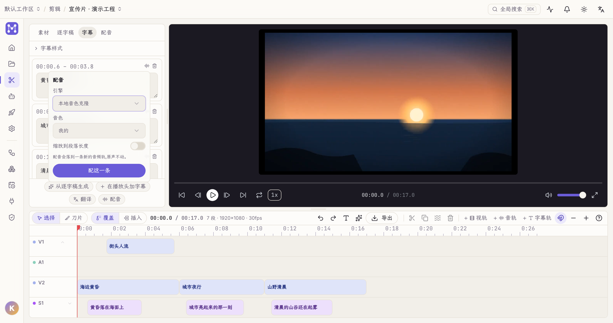
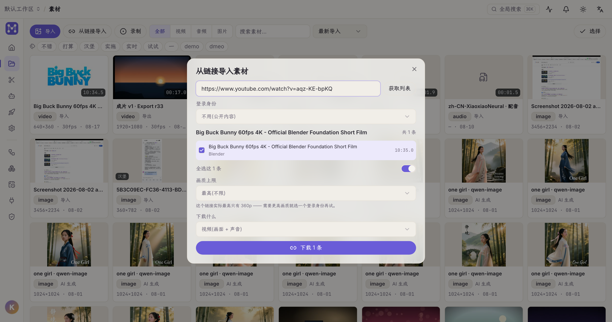
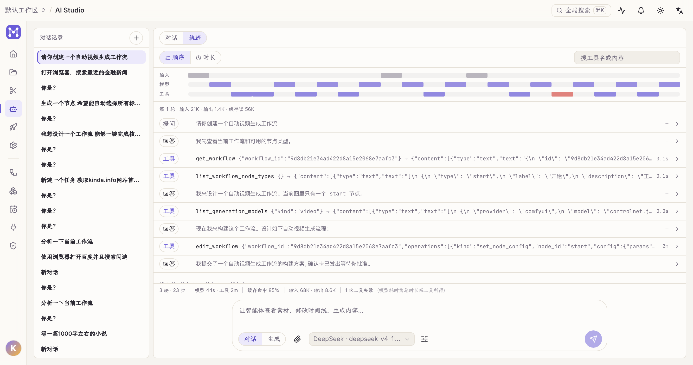
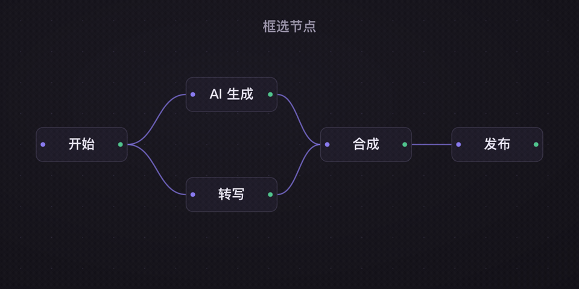
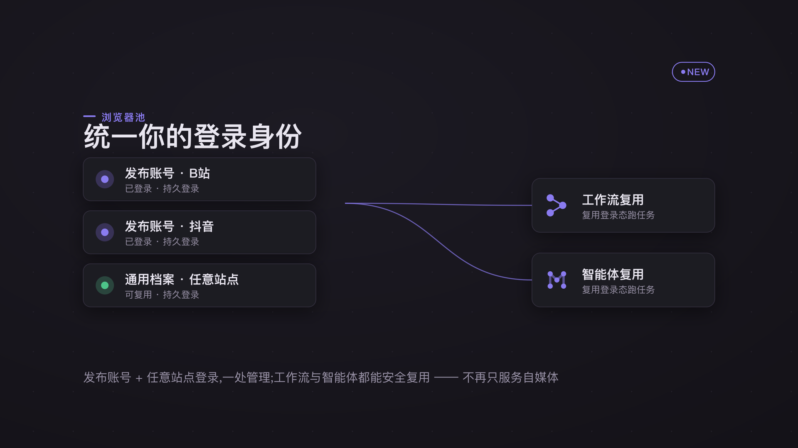
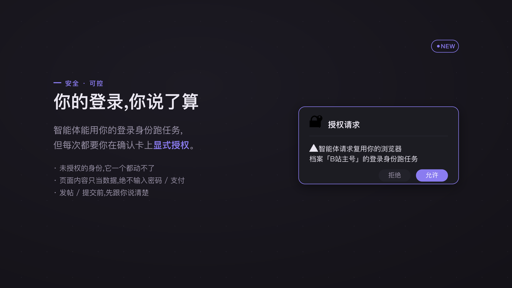

# Open Studio

[English](README.md) | **简体中文**

跑在自己机器上的 AI 视频工作室:**NLE 内核、AI 应用中心、创作型智能体工作台、自媒体矩阵发布**
—— 合成一个桌面应用。

整体是一个 Electron 壳,里面跑着 FastAPI 后端(SQLite)、React 前端,和一个内嵌浏览器发布执行器。
素材导入 → 对着逐字稿剪 → 导出成片 → 发到 TikTok / YouTube / 抖音 / B站 / 小红书 / 视频号。
这一整条链可以由工作流和定时触发器自动串起来;所有持久登录集中在一个**浏览器池**里,发布、
工作流 RPA 和智能体共用同一批身份。


---

## 快速开始

从 [Releases](https://github.com/Alndaly/OpenStudio/releases) 下载安装包 —— macOS `.dmg`
(Apple 芯片)和 Windows 安装程序 —— 或者跑你自己构建的那份:

```bash
open "release/mac-arm64/Open Studio.app"
```

App 会自动拉起内置后端(`127.0.0.1:8800`)、加载前端、启动发布执行器,不需要手动起任何服务。

> 8800 端口上若已有一个健康的后端(比如你开着 dev server),App 会**复用**它,而不是再起一个。

到这儿就能进去随便看了。真要生成或转写,至少得先配一个供应商 —— 设置 → 供应商,那里一条
「供应商」是*一个端点加一份凭据*,模型挂在它下面。

---

## 里面有什么

### 剪辑

时间线 NLE,支持对着逐字稿剪:删掉文字,片段跟着走。字幕、配音、语音识别在同一个面板里,
而不是散在几个工具中。

字幕面板里每条字幕自带配音入口,也可以整批配。产物落到一条专门的配音轨 —— 原声不动,所以
整条删掉就回到原样,再配一次是替换这条轨而不是摞出一叠。「缩放到段落长度」用的是片段自己的
倍速,渲染时落成 `atempo` 变速,所以无损、可撤销、事后还能微调。



这条路上最要紧的一件事:**语言对不上时,TTS 引擎不会报错**。它按自己认识的发音规则硬念一遍,
然后报成功。Open Studio 在你选引擎的那一刻就说清楚,而不是等你听完几十秒才发现。判据只认
书写系统 —— 假名、谚文、西里尔、阿拉伯、天城文是硬证据;拉丁字母证明不了任何事,所以那几门
语言由你在「权重」下拉里明说。

顺着这条线,F5-TTS 的语言能力挂在**权重上,而不是引擎上**:引擎什么都支持,支持范围由权重决定。
十门语言(中英 / 日 / 法 / 德 / 西 / 意 / 俄 / 印地 / 阿拉伯 / 芬兰)按需下载,缺哪份就在配音
弹层当场给下载按钮 —— 用你自己的克隆音色念日文,只是多下一份权重的事。

### 素材

粘一个视频或播放列表链接,**先出清单,再决定下哪几条**。这个顺序是刻意的:一个链接可能是一条
视频,也可能是几百条、几十 GB 的整个播放列表。音频还是视频在下载前选(只要人声去转写的人,
不该为此付几百 MB 和一次转码);画质菜单**只列这条链接真有的档** —— 探测时就知道它最高能给
多少,摆一个选了没用的档位,是让界面替站点撒谎。

需要登录才看得到的内容,直接借浏览器池里的身份,不必去别处导 cookie。YouTube 上差别最明显:
不带登录态只给到 360p,带上之后是 1440p。



### 智能体

一个对话工作台,工具经 MCP 伸到整个应用 —— 时间线、素材、工作流、发布、浏览器池 —— 凡是有
后果的动作都走确认卡。

主智能体可以把独立调查派给**子智能体**:只读工具,中间过程留在它自己的上下文里,主对话只收
结论。省的是上下文,不是算力。派发**默认不阻塞** —— 立即拿到回执接着干别的,要不要等、什么
时候等由它自己决定;同一条消息里派多个就并发跑,没等的报告在收尾时自动送达,一份也不丢。
每个子智能体都是**一段能点进去的会话**,界面和主对话一模一样,右侧面板和头部入口都能进,
运行中每一步实时可见。不同会话的智能体之间还能**相互 @ 通知**:对方空闲就立即开跑,忙就排队,
消息上带「来自其他智能体」徽章。

**轨迹视图**回答的是另一个问题。对话说的是它说了什么,轨迹说的是**它做了什么、时间花在哪**
—— 一屏三条泳道(输入 / 模型 / 工具)把整个会话压成色块,下面是逐步的执行流,点开某一步能看到
入参、返回、耗时。系统提示只在**变化的那一轮**记一份(跨会话记忆和任务计划都拼在里面,每轮
都可能不一样),上下文注入单独成条 —— 你看到的提问,才是模型真正收到的那一份。



上下文水位就显示在输入框的会话设置里。超过窗口八成时,把早期对话交给模型摘要、保留最近若干轮;
也可以随时手动「立即整理」。不管哪种,整理都会作为一条记录留在对话里。

### 工作流

参考 ComfyUI 与 Dify 的节点画布,嵌套是一等公民。框选画布上的一组节点,一键**折叠为子图**,
进出边界的引用自动重连;子图可任意嵌套,`调用工作流`把整条流程当一个工具复用,循环体与顶层
共用同一套并行引擎。



### 浏览器池

把所有持久登录统一成「档案」:挂平台的发布账号,加上任意站点的通用登录。发布、工作流 RPA、
智能体都复用这批会话。

智能体复用需要**逐次显式授权** —— 确认卡点名是哪个身份 —— 所以它动不了你没给的账号。





### 发布

平台专属属性声明在一处,表单按平台自动拼:可见性(私享 / 不公开列出 / 公开)、YouTube 的
「面向儿童」、小红书的原创声明。TikTok 与 YouTube 的自动发布已在真机账号上跑通全程;B 站与
视频号实测确认没有可见性控件,那就不假装有。

### 供应商、插件,以及其余

供应商和模型分两级:一条**供应商**是一个端点加一份凭据,下面可以挂任意多个模型。能力
(对话 / 绘图 / 视频 / 音频)、上下文长度、推理与视觉开关,都属于**模型**。订阅制供应商还能
查剩余额度和重置周期。

插件以子进程脚本运行,或接入 MCP 服务,权限在清单里声明。可以从内置市场装,也可以给一个 zip 地址 ——**落地之前**先把包下下来读一遍清单,把它声明的权限和会带来的工具摊开给你看。文件是**双向**的:插件能交出文件(JSON 通道搬不动大文件,所以要么写进给它的暂存目录,要么交出下载凭据让宿主去取),也能**收下**文件 —— 把某个输入标成 `"format": "asset"`,调用方传来的素材 id 就变成一个本地路径,于是插件能做上传、转码这类事,而全程不知道素材库存在。它还能**记住**跨调用的东西(比如续期出来的 OAuth 令牌 —— 宿主按清单声明的键存好,下次注入回环境变量)。后端也说你的语言 —— 任务消息、
引擎目录、进度句都按请求方的 `Accept-Language` 返回。存的是 key 加参数、出口才翻:任务记录
活得比一次请求久,写入时就翻会把语言冻死在那一刻。

> 浏览器池是真机截图;折叠动画与授权确认卡是按品牌设计系统生成的示意图。

---

## 文档

完整指南在 **[openstudio.team](https://openstudio.team)**(源码在 `website/content/docs/`)。
内部实现看这些:

| 文档 | 内容 |
| --- | --- |
| [docs/ARCHITECTURE.md](docs/ARCHITECTURE.md) | 系统架构:三段自举、领域内核、数据模型、关键模式 |
| [docs/PUBLISHING.md](docs/PUBLISHING.md) | 发布与账号矩阵:内嵌浏览器、worker 协议、**硬约束与排错** |
| [docs/MCP.md](docs/MCP.md) | 智能体的 MCP 工具与确认卡 |
| [docs/AGENT_PERMISSION_MODES.md](docs/AGENT_PERMISSION_MODES.md) | 智能体不问就能做什么,几种模式差在哪 |
| [docs/PERMISSION_MODEL.md](docs/PERMISSION_MODEL.md) | 三种主体,以及授权怎么判 |
| [docs/PLUGIN_MANIFEST.md](docs/PLUGIN_MANIFEST.md) | 插件清单格式与权限 |
| [docs/PLUGIN_ARCHITECTURE.md](docs/PLUGIN_ARCHITECTURE.md) | 插件怎么打包、实例化、拿到能力 |
| [docs/CONVENTIONS.md](docs/CONVENTIONS.md) | 编码约定,以及仓库自己守着的 38 道**棘轮** |
| [docs/MAINTENANCE_HOTSPOTS.md](docs/MAINTENANCE_HOTSPOTS.md) | 已知风险区,以及**改完至少要跑什么** |
| [docs/adr/](docs/adr/) | 架构决策,连同当时的推理 |

---

## 开发

后端与前端分开跑,前端才有热更新:

```bash
pnpm install                 # 仓库根目录,一次
cd backend && uv sync && cd ..
```

```bash
# 终端 1 — 后端
cd backend && uv run uvicorn app.main:app --reload --host 127.0.0.1 --port 8800
```

```bash
# 终端 2 — 前端
cd frontend && pnpm dev      # http://localhost:5173
```

`http://localhost:5173` 能开发绝大部分功能。**例外**是发布用的内嵌浏览器(登录 / 上传 /
地址栏工具栏),它只存在于 Electron 里,网页版在那儿会提示「需要桌面端」。

### 桌面端热调试

要调 Electron 才有的那部分,一条命令同时起 Vite 和 Electron,不用打包:

```bash
pnpm dev
```

三件事并行跑,带颜色前缀:

- `vite` —— 前端热更新,`--strictPort` 让 5173 被占时直接报错,而不是静默换到 5174、
  把 Electron 留在错的服务器上;
- `bundle` —— `esbuild --watch`,改 `electron/publish/**` 就重打 `publish.bundle.cjs`;
- `electron` —— 等 5173 就绪后加载它;`main.cjs` 的 dev 分支会复用或拉起 8800 的 `uvicorn`。

发布 bundle 会自动重打,但**主进程不热更** —— 改完 `main.cjs` 或 `preload.cjs` 要重启
`pnpm dev`。主窗口 DevTools 是 `Cmd+Option+I`;内嵌账号视图在发布页右键账号 →「检查页面」。

### 测试与检查

```bash
cd backend && uv run pytest -q
```

```bash
cd frontend && pnpm vitest run
```

```bash
cd frontend && pnpm exec tsc -b --noEmit
```

```bash
cd frontend && pnpm gen:api
```

写这份文档时是后端 1698 例、前端 536 例。`tsc` 必须在 `frontend` 目录下跑。后端 OpenAPI
变了之后用 `gen:api` 重新生成 TS 类型。

### 排错

**`Electron failed to install correctly`** —— pnpm 偶尔漏跑它的安装脚本:

```bash
pnpm rebuild electron
```

**`bad interpreter: .../.venv/bin/python3: No such file or directory`** —— venv 的 console
script 把解释器路径写死在 shebang 里,仓库目录一改名(或整个搬到别的机器)就全部失效。重建:

```bash
cd backend && uv venv --clear && uv sync
```

> 拉起后端的两处(`dev:backend` 与 `main.cjs`)用的是 `.venv/bin/python -m uvicorn` ——
> `python` 是符号链接、不经 shebang,所以它们本身不受路径变动影响;受影响的是直接调
> `uvicorn`、`pytest` 这类 console script 的用法。

---

## 构建与发版

```bash
pnpm build:mac               # 前端 + 发布器 + 系统 bundle + sidecar + 后端 + .app
```

```bash
pnpm dist:mac                # 同流程,产出 .dmg
```

| 脚本 | 作用 |
| --- | --- |
| `pnpm build:frontend` | Vite 构建前端 → `frontend/dist` |
| `pnpm build:publisher` | esbuild 打包内嵌发布执行器 → `electron/publish.bundle.cjs` |
| `pnpm build:system` | esbuild 打包系统集成层 → `electron/system.bundle.cjs` |
| `pnpm build:sidecar` | 构建 `agent-sidecar/` 里的智能体 sidecar |
| `pnpm fetch:tts-python` | 抓取随包分发的独立 CPython → `build/python`(声音克隆用,~48MB) |
| `pnpm build:backend` | PyInstaller 打包后端 → `backend/dist/open-studio-backend` |
| `pnpm build:mac` / `pnpm dist:mac` | 以上全部,再走 electron-builder |

⚠️ **改了前端就必须重新 `build:frontend`**(`build:mac` 已包含)。只跑 `build:publisher`
再打包,前端会停在上一版 —— 这个坑值得点名,因为症状是 CSS 改了却「没生效」,然后往错的方向
查半小时。

**发版就是打个 tag:**

```bash
git tag v0.20.0 && git push origin v0.20.0
```

`.github/workflows/release.yml` 会构建 macOS `.dmg`(arm64)与 Windows NSIS 安装包,挂到
自动生成变更说明的 GitHub Release 上,两个平台都成功才转正。版本号直接取自 tag,不需要先改
`package.json`;构建产物只进 Releases,**永远不进仓库**。在 Actions 页手动触发同一工作流是
试打包 —— 只出 workflow artifact,不碰 Releases。

### 应用更新

打包版启动 5 秒后静默比对最新 release tag 与当前版本,有新版就引导到下载页。设置 → 本地后端
→ 版本 里也有「检查更新」按钮。

> macOS 的**静默自动安装**需要 Developer ID 签名加公证(未签名包 Squirrel 校验必失败),
> 所以当前走的是「检查 + 提示」这条降级路线。`build.publish` 已配好 GitHub provider,签名
> 具备后换成 electron-updater 即可平滑升级,渲染层接口不变。仓库没有 Release 或不可达时,
> 检查静默失败,不打扰使用。

---

## 数据与日志

| 位置 | 内容 |
| --- | --- |
| `~/.open-studio/open-studio.db` | SQLite 主库(工作区 / 项目 / 素材 / 序列 / 任务 / 账号…) |
| `~/.open-studio/media/` | 导入与导出的媒体文件 |
| `<userData>/logs/publisher.log` | 发布执行器全链路(认领 / goto / 登录 / 巡检 / 回报) |
| `<userData>/logs/backend.log` | 打包版后端 stdout/stderr |
| `<userData>/Partitions/` | 各发布账号的持久登录会话 |
| `<userData>/custom.css` | 你自己写的 CSS,覆盖应用样式(设置 → 外观) |

`~/.open-studio` 在 `Path.home()` 下,Windows 上即 `C:\Users\<用户名>\.open-studio`。
`<userData>` 是 Electron 的用户数据目录:macOS 为 `~/Library/Application Support/Open Studio`,
Windows 为 `%APPDATA%\Open Studio`。插件目录同理 —— 不必照着这张表拼,插件页会直接显示后端
解析出的**真实路径**。

发布出问题先看 `publisher.log`,每一步都有记录。

---

## 仓库结构

```
backend/          FastAPI + SQLAlchemy 2.0(建表走 create_all + _migrate_*,见 ARCHITECTURE)
  app/domain/     领域内核:sequences(剪辑) render workflows publish browser agent
                  scheduler transcripts generation plugins notifications assets sandbox
                  providers / provider_models provider_quota ai_retry
  app/api/routes/ HTTP 路由
  tests/          pytest
frontend/         Vite + React 19 + TS + Tailwind v4 + Radix/shadcn
  src/features/   editor media ai-studio workflows browser-pool publish scheduler
                  plugins settings admin auth home
  src/design/     设计令牌(tokens.css)
  src/app/        壳层、路由、i18n(messages.ts)、全局样式
electron/         main.cjs(主进程)+ publish/ 与 system/(TS 源,由 esbuild 打包)
agent-sidecar/    智能体 sidecar(pi 运行时,Node)
contracts/        跨实现的可执行规约(前后端各跑一遍同一份语料),见 contracts/README.md
plugins/          本地插件(子进程脚本 / 接入 MCP 服务)
website/          文档站(Next.js),openstudio.team 的源码
docs/             架构与子系统文档
scripts/          构建与维护脚本
```

---

## 团队与远程服务器

默认连本机后端。要连团队服务器,用**登录页底部的「后端服务器 · 切换」** —— 必须在登录前选,
因为登录请求本身就要打到目标服务器。填地址 → 探活 → 切换并重载(需重新登录)。设置 →
本地后端 是同一个入口。

### 第三方登录(可选)

Google / Apple 登录按钮只在 `backend/.env` 配了对应凭据时出现:

```
OPEN_STUDIO_GOOGLE_CLIENT_ID=...        # Google Cloud「Web 应用」客户端
OPEN_STUDIO_GOOGLE_CLIENT_SECRET=...    # 重定向 URI 登记 http://127.0.0.1:8800/api/auth/oauth/google/callback
OPEN_STUDIO_APPLE_CLIENT_ID=...         # Apple Services ID;Apple 要求 HTTPS 回调
OPEN_STUDIO_APPLE_CLIENT_SECRET=...     # 按 Apple 规范用团队密钥签好的 JWT
OPEN_STUDIO_OAUTH_REDIRECT_BASE=...     # 团队部署时覆盖回调基址
```

流程是桌面友好的授权码流:系统浏览器完成授权 → 回调打到本机后端 → App 轮询自动落座。首次
登录按邮箱局部名创建本地账号,与密码账号同权,没有本地口令。

---

## 许可

源码可见但**保留所有权利**:仅限评估、学习、个人非商业用途,未经书面授权禁止商用与再分发。
详见 [LICENSE](LICENSE),商业授权请联系作者。
