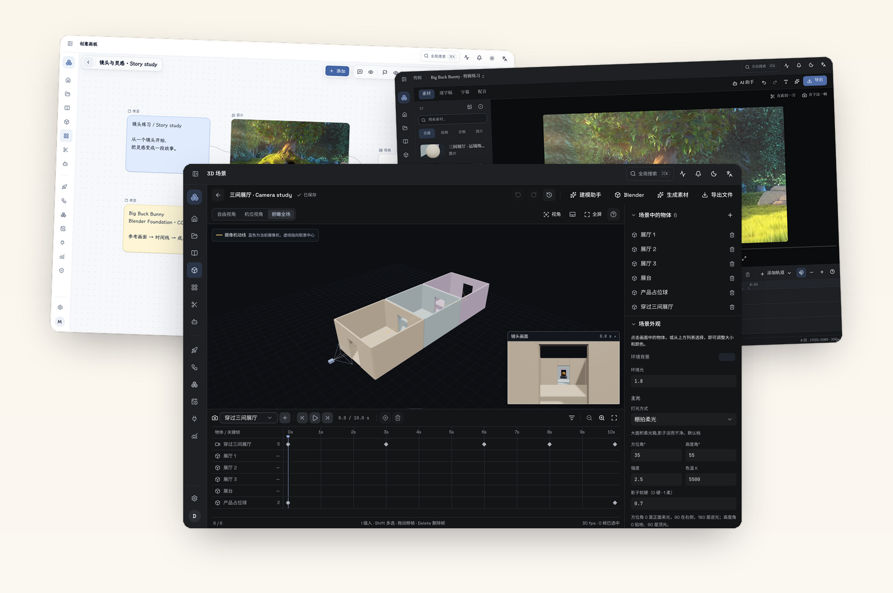
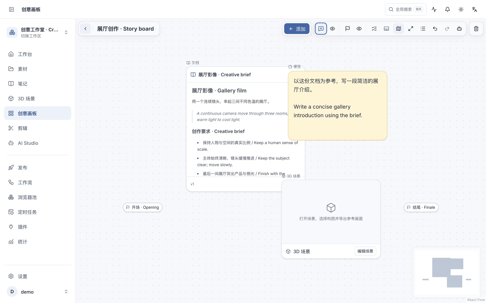
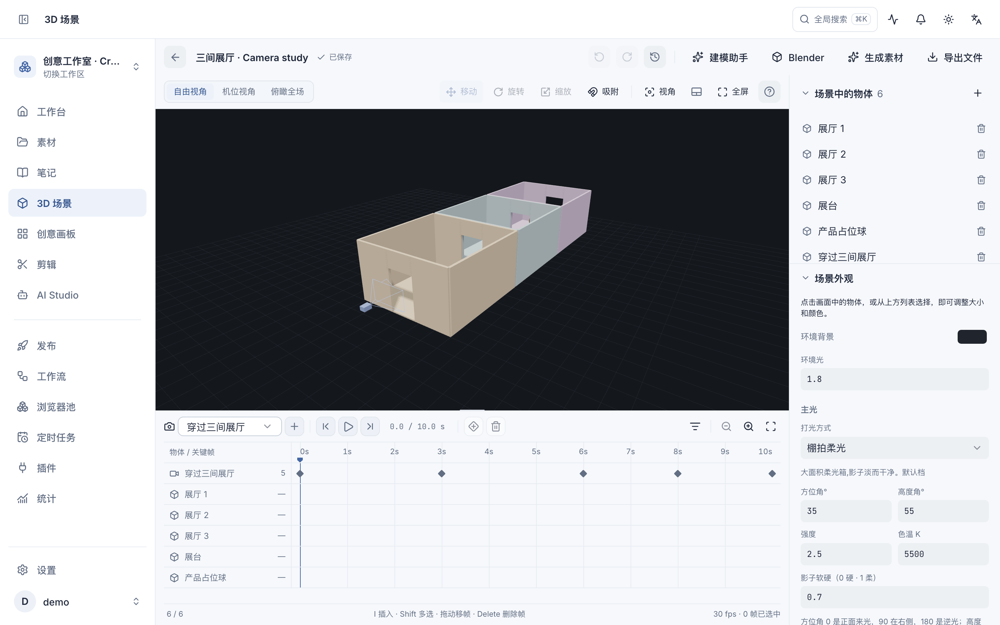
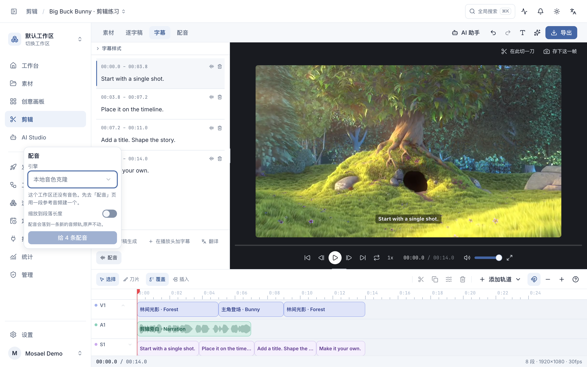
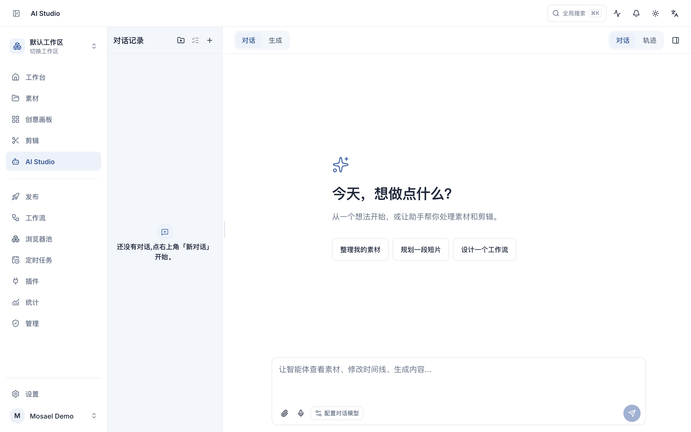
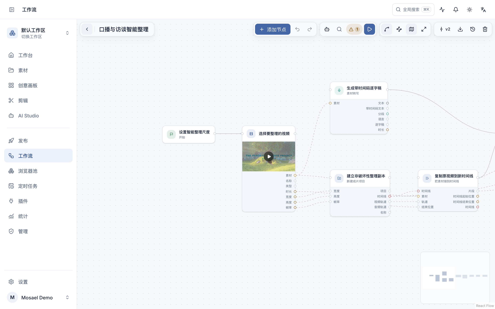

<p align="center">
  
</p>

<p align="center">
  <strong>让灵感落进时间线。</strong><br />
  一间装在电脑里的 AI 影像工作室，从第一段素材陪你走到最后一次发布。
</p>

<p align="center">
  <a href="https://mosael.com">官网</a> ·
  <a href="https://github.com/Alndaly/Mosael/releases">下载</a> ·
  <a href="https://mosael.com/zh/docs/start/intro">使用指南</a> ·
  <a href="https://mosael.com/zh/docs/about/contact#%E5%BE%AE%E4%BF%A1">交流群 / 作者微信</a> ·
  <a href="https://x.com/KindaHuaX">作者 X</a>
</p>

[English](README.md) | **简体中文**

Mosael 将文档、无限画布、3D 场景、AI 生成、剪辑与发布放在同一个桌面工作区。从收集参考、预演运镜，到生成素材、完成剪辑，让每一步创作连接起来。

> 工程和素材默认保存在本机。云模型、链接下载、联网工具与平台发布需要网络；连接远程后端时，共享数据保存在对应服务器。



<p align="center"><sub>原始截图,按官网首页同一套版式叠放 · 霞鹜文楷 / Newsreader / Space Grotesk · <a href="website/public/media/homepage/zh">查看原始截图</a> · <a href="docs/media/mosael-promo.mp4">观看操作演示</a> · <a href="docs/media/README.md">素材署名</a></sub></p>

## 下载与运行

当前正式版本：**[GitHub Releases](https://github.com/Alndaly/Mosael/releases/latest)**。

从 [GitHub Releases](https://github.com/Alndaly/Mosael/releases) 下载：

- macOS：Apple 芯片版 `.dmg`
- Windows：Windows 10/11 x64 安装程序

安装后直接启动即可。应用会自动拉起内置后端（默认 `127.0.0.1:8800`）、加载前端并启动发布执行器，
不需要手动运行服务。如果 8800 端口已经有健康的 Mosael 后端，桌面端会复用它。

浏览本地功能无需额外配置；使用 AI 对话、绘图、视频生成、配音或转写前，请先到
**设置 → AI 对话 / AI 绘图 / AI 视频 / AI 音频** 中对应分区添加连接与模型。

## 相互连接的创作工作区

### 整理资料，展开构思

将视频、图片与声音导入素材库，也可以录制屏幕、摄像头或下载支持的视频链接。用标签、搜索和预览找到素材；把脚本、逐字稿和智能体回答保存为文档，保留版本历史与来源。

在无限画布上并排放置文档、媒体和 3D 场景。连线将文字与参考素材传给下游生成节点；评论、成员提及和位置标记帮助讨论与定位。评论和标记各有独立模式与显示开关。



[素材库](https://mosael.com/zh/docs/guides/media) · [笔记与文档](https://mosael.com/zh/docs/guides/notes) · [创意画板](https://mosael.com/zh/docs/guides/boards)

### 先搭场景，再生成镜头

布置物体与灯光，在同一条时间线上为摄像机和物体添加关键帧。切换镜头构图与全局动线，也可以同时观察两种画面。将当前帧、首尾帧或运镜视频交给自己选择的图片、视频模型作为参考。

支持 GLB/glTF 导入、画面与镜头预览导出，以及通过 MCP 与 Blender 交换场景。Mosael 用于场景搭建与镜头预演；精细建模、模拟与 Blender 原生效果仍在 Blender 中完成。



[3D 场景与动画](https://mosael.com/zh/docs/guides/scenes)

### 一起处理画面、文字与声音

多时间线、多轨道支持切分、吸附、涟漪删除、变速、淡入淡出与画中画。根据逐字稿剪辑，添加或翻译字幕，把生成的配音放到独立轨道。通过曲线、LUT 和示波器调整色彩，完成后从剪辑页导出。



[剪辑与调色](https://mosael.com/zh/docs/guides/editing) · [语音输入与朗读](https://mosael.com/zh/docs/guides/voice)

### 按自己的方式使用 AI

使用 API Key 或支持的订阅登录连接自己的模型服务。连接保存凭据，模型声明对话、图片、视频和音频能力；参数控件与参考素材角色跟随所选模型。生成结果回到素材库继续使用。

智能体可以读取工程上下文，调用素材、笔记、画板、场景、剪辑与工作流工具。需要批准的操作显示确认卡；会话、工具结果、来源引用和执行轨迹可随时回看。工作区助手可以停靠在侧边，也可以悬浮显示。



[模型连接与配置](https://mosael.com/zh/docs/guides/providers) · [AI Studio 与智能体](https://mosael.com/zh/docs/guides/ai-studio)

### 复用流程，发布作品

将模型、素材与工具连接成可视化工作流，检查必填输入、运行流程并查看各节点结果。流程可以手动、定时或通过 Webhook 触发；本地定时任务需要后端持续运行。

浏览器池统一管理上传、链接导入和浏览器自动化使用的登录身份与代理。智能体借用档案前会请求授权。发布表单按目标平台显示选项，检查视频、账号与文案后提交并追踪结果。浏览器上传需要已连接的桌面执行器。



[工作流](https://mosael.com/zh/docs/guides/workflows) · [定时任务](https://mosael.com/zh/docs/guides/scheduler) · [浏览器池与账号](https://mosael.com/zh/docs/guides/browser-pool) · [发布作品](https://mosael.com/zh/docs/guides/publishing)

### 扩展工作空间

**Chrome 视频助手**在浏览器原生侧栏中显示逐字稿，支持逐词跳转、翻译，以及导入视频或不含播放控件的画面。可导入的链接取决于已安装的 yt-dlp；页面交互需要可用的视频播放器。扩展使用独立的 Mosael 会话，不读取 Chrome Cookie。

**插件**把本地脚本或 MCP 服务接入智能体和工作流。启用连接前检查清单、工具权限与凭据；本地进程插件以当前操作系统用户的权限运行。

[Chrome 视频助手](browser-extension/README.zh-CN.md) · [安装与使用插件](https://mosael.com/zh/docs/guides/plugins) · [开发插件](https://mosael.com/zh/docs/guides/writing-plugins)

## 文档

完整使用指南位于 **[mosael.com](https://mosael.com)**，源码在 `website/content/docs/`。
仓库内的实现文档：

| 文档 | 内容 |
| --- | --- |
| [CHANGELOG.md](CHANGELOG.md) | 各版本的用户可见变更 |
| [docs/3D_SCENES.md](docs/3D_SCENES.md) | 3D 场景、相机轨道、导出与生成参考 |
| [docs/ARCHITECTURE.md](docs/ARCHITECTURE.md) | 启动流程、领域边界、数据模型与关键约定 |
| [docs/PUBLISHING.md](docs/PUBLISHING.md) | 发布矩阵、内嵌浏览器、worker 协议与排错 |
| [docs/MCP.md](docs/MCP.md) | 智能体工具与确认卡 |
| [docs/AGENT_PERMISSION_MODES.md](docs/AGENT_PERMISSION_MODES.md) | 智能体权限模式 |
| [docs/PERMISSION_MODEL.md](docs/PERMISSION_MODEL.md) | 三种主体与授权判定 |
| [docs/PLUGIN_MANIFEST.md](docs/PLUGIN_MANIFEST.md) | 插件清单格式与权限 |
| [docs/PLUGIN_ARCHITECTURE.md](docs/PLUGIN_ARCHITECTURE.md) | 插件打包、实例化与能力注入 |
| [docs/CONVENTIONS.md](docs/CONVENTIONS.md) | 编码约定与架构棘轮 |
| [docs/PROCESS_STATE.md](docs/PROCESS_STATE.md) | 进程内状态清单:重启会丢什么,以及什么挡着起第二个后端进程 |
| [docs/MAINTENANCE_HOTSPOTS.md](docs/MAINTENANCE_HOTSPOTS.md) | 高风险区域与验证要求 |
| [browser-extension/README.zh-CN.md](browser-extension/README.zh-CN.md) | Chrome 侧栏扩展的安装、使用与权限 |
| [docs/adr/](docs/adr/) | 架构决策记录 |

## 本地开发

### 环境

- Node.js 22+
- pnpm
- Python 3.13 与 [uv](https://docs.astral.sh/uv/)
- ffmpeg（完整媒体测试需要）

安装依赖：

```bash
pnpm install
cd backend && uv sync && cd ..
```

浏览器开发模式（支持前端热更新）：

```bash
# 终端 1：后端
cd backend && uv run --frozen python -m uvicorn app.main:app --reload --host 127.0.0.1 --port 8800

# 终端 2：前端
cd frontend && pnpm dev
```

打开 `http://localhost:5173`。发布用内嵌浏览器、系统托盘、文件关联等 Electron 能力只在桌面模式可用：

```bash
pnpm dev
```

桌面开发命令会同时启动 Vite、发布 bundle 监听和 Electron。修改 `electron/main.cjs` 或
`electron/preload.cjs` 后需要重启进程；主窗口 DevTools 快捷键为 `Cmd+Option+I`。

### 测试与检查

```bash
(cd backend && uv run --frozen python -m pytest -q)
pnpm --dir frontend exec vitest run
pnpm --dir frontend exec tsc -b --noEmit
pnpm --dir frontend gen:api        # 后端 OpenAPI 变化后运行
pnpm --dir website build           # 修改官网或文档后运行
```

以上命令从仓库根目录运行。最新检查结果以 [GitHub Actions](https://github.com/Alndaly/Mosael/actions) 为准，用例数量随项目变化。

### 常见问题

Electron 安装脚本未执行：

```bash
pnpm rebuild electron
```

移动仓库后虚拟环境出现 `bad interpreter`：

```bash
cd backend && uv venv --clear && uv sync --frozen
```

## 构建与发布

```bash
pnpm build:mac   # 构建未打包的 macOS App
pnpm dist:mac    # 构建 macOS DMG
```

| 命令 | 产物 |
| --- | --- |
| `pnpm build:frontend` | `frontend/dist` |
| `pnpm build:publisher` | `electron/publish.bundle.cjs` |
| `pnpm build:system` | `electron/system.bundle.cjs` |
| `pnpm build:sidecar` | `agent-sidecar/dist/sidecar.cjs` |
| `pnpm build:extension` | `browser-extension/dist` |
| `pnpm fetch:tts-python` | 声音克隆使用的独立 CPython |
| `pnpm build:backend` | `backend/dist/mosael-backend` |

发版时同时更新根 `package.json` 与 tag：

```bash
VERSION=x.y.z
npm pkg set version="$VERSION"
git commit -am "chore(release): v$VERSION"
git tag -a "v$VERSION" -m "Mosael v$VERSION"
git push origin main "v$VERSION"
```

`.github/workflows/release.yml` 会先校验后端、前端、浏览器扩展和官网，再创建草稿 Release，构建 macOS DMG、
Windows NSIS 安装包、Chrome 扩展和插件 zip。两个桌面平台都通过打包与数据库升级冒烟后，稳定版才会标记为
Latest；带预发布后缀的 tag（例如 `v1.0.0-beta1`）会发布为 GitHub Pre-release，不会覆盖当前稳定版。
手动触发同一工作流只生成 workflow artifact，不发布版本。

打包版会检查最新稳定版并提示更新；预发布版需要从 GitHub Releases 主动下载。macOS 发布流程要求 Developer ID 签名与 Apple 公证，
更新仍采用“检查并提示下载”。维护者配置见 [macOS 签名与 Touch ID](docs/MACOS_SIGNING.md)。

## 数据与日志

| 位置 | 内容 |
| --- | --- |
| `~/.mosael/mosael.db` | SQLite 主库 |
| `~/.mosael/media/` | 导入、生成与导出的素材 |
| `<userData>/logs/backend.log` | 打包后端日志 |
| `<userData>/logs/publisher.log` | 发布执行器日志 |
| `<userData>/Partitions/` | 持久浏览器档案 |
| `<userData>/custom.css` | 设置 → 外观中的自定义 CSS |

`<userData>` 在 macOS 上是 `~/Library/Application Support/Mosael`，在 Windows 上是
`%APPDATA%\Mosael`。应用内会显示插件等动态目录的实际路径。

## 仓库结构

```text
backend/          FastAPI、SQLAlchemy、领域服务与 pytest
frontend/         React 19、Vite、TypeScript、Tailwind v4、Radix/shadcn
electron/         主进程、preload、发布与系统集成 bundle
agent-sidecar/    智能体运行时
browser-extension/ Chrome Side Panel 视频助手
contracts/        前后端共享的可执行契约语料
plugins/          插件示例与清单
website/          mosael.com 文档站
docs/             架构、权限、发布和 ADR
scripts/          构建与文档同步脚本
```

## 团队与远程后端

默认连接本机后端。要使用团队服务器，请在登录前通过**后端服务器 · 切换**填写地址、探活并重新加载；
设置 → 本地后端提供同一入口。浏览器档案绑定创建它的机器，不会随 SQLite 数据自动迁移。

Google / Apple 登录是可选能力，通过 `backend/.env` 配置：

```dotenv
MOSAEL_GOOGLE_CLIENT_ID=...
MOSAEL_GOOGLE_CLIENT_SECRET=...
MOSAEL_APPLE_CLIENT_ID=...
MOSAEL_APPLE_CLIENT_SECRET=...
MOSAEL_OAUTH_REDIRECT_BASE=...
```

## 许可

源码可见但**保留所有权利**：仅限评估、学习与个人非商业用途；未经书面授权不得商用或再分发。
详见 [LICENSE](LICENSE)。商业授权可通过[交流群与作者微信](https://mosael.com/zh/docs/about/contact#%E5%BE%AE%E4%BF%A1)
联系，也可以在 X 关注 [KindaHuaX](https://x.com/KindaHuaX)。

使用指南对应当前 1.2.0 界面。截图与录屏使用独立演示数据，拍摄日期、代码版本和素材署名见[实拍素材说明](docs/media/README.md)。
