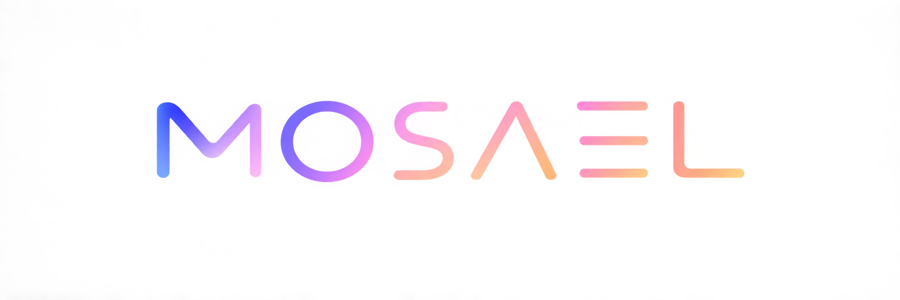
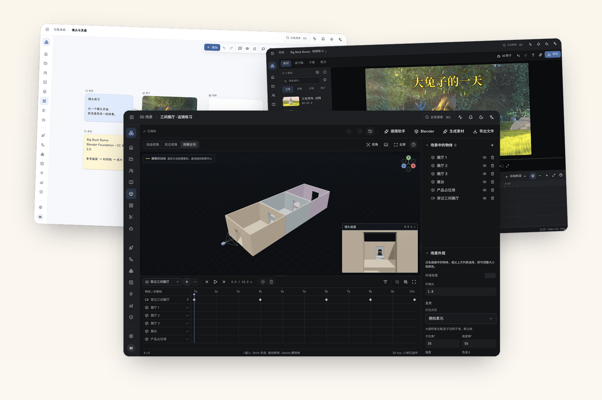
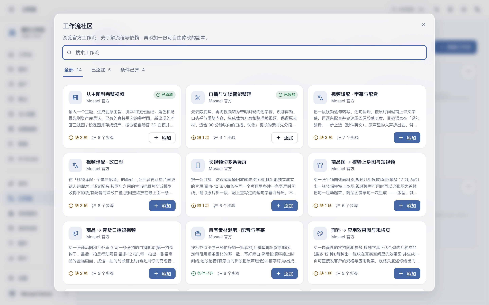
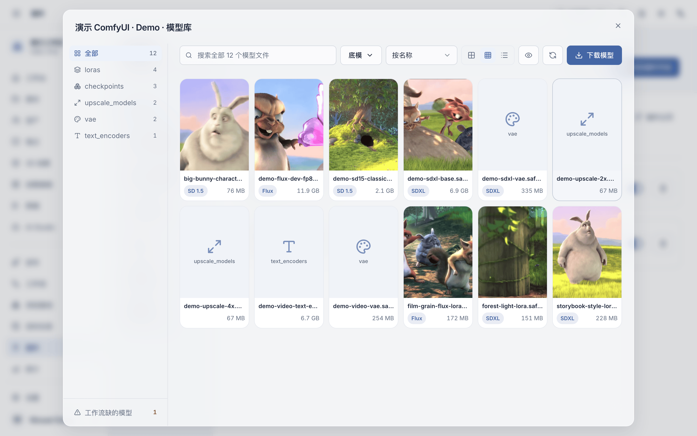
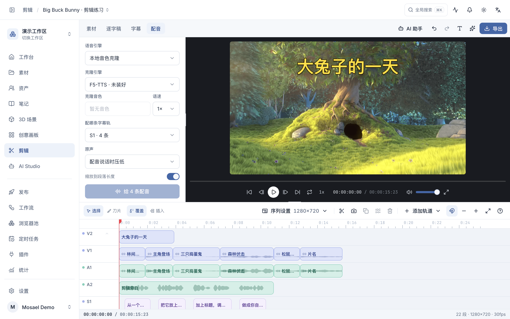
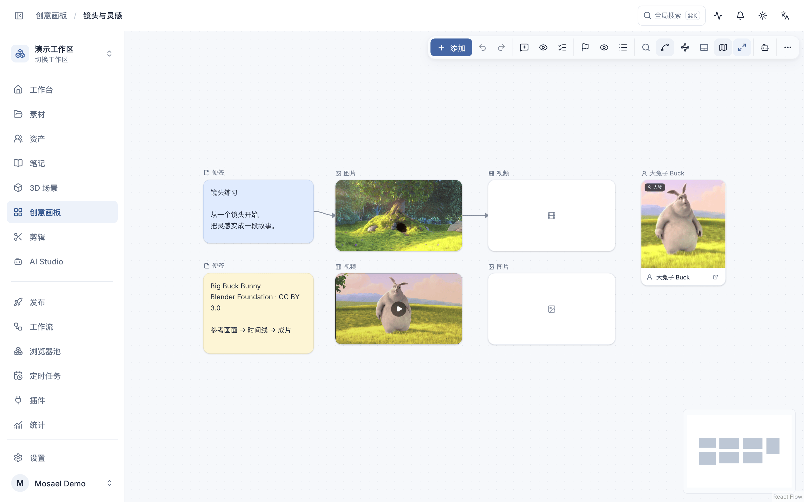

<p align="center">
  
</p>

<h1 align="center">Mosael：本地优先的 AI 视频创作软件(Mac / Windows)</h1>

<p align="center">
  <strong>AI 视频生成、剪辑、配音，在你自己的电脑上完成。</strong><br />
  用你自己的 API Key 接入 Seedance、可灵、Veo、万相等模型，或接上你自己的 ComfyUI；
  多轨剪辑、声音克隆配音、视频翻译改口型、数字人口播，一张商品图就能做成带货口播短视频。
</p>

<p align="center">
  <a href="https://mosael.com/zh/docs/start/download"><strong>下载 Mac / Windows 版</strong></a> ·
  <a href="https://mosael.com/zh">官网</a> ·
  <a href="https://mosael.com/zh/docs/start/intro">使用指南</a> ·
  <a href="https://mosael.com/zh/workflows">工作流模板</a> ·
  <a href="https://mosael.com/zh/docs/about/contact#%E5%BE%AE%E4%BF%A1">交流群 / 作者微信</a> ·
  <a href="https://x.com/KindaHuaX">作者 X</a>
</p>

[English](README.md) | **简体中文**

Mosael 是一款把视频从构思做到发布的桌面软件：**AI 生成、多轨剪辑、声音克隆与配音、数字人、工作流自动化和多平台发布，
都在一个软件里**。模型用你自己已经在付费的账号，Mosael 不转卖点数；工程和素材默认留在你的电脑上。



<p align="center"><sub>原始截图，按官网首页同一套版式叠放 · <a href="website/public/media/homepage/zh">查看原始截图</a> · <a href="docs/media/mosael-promo.mp4">观看操作演示</a> · <a href="docs/media/README.md">素材署名</a></sub></p>

## 下载

| 平台 | 安装包 | 说明 |
| --- | --- | --- |
| macOS | `Mosael-<版本>-arm64.dmg` | Apple 芯片(M 系列)，已签名并通过 Apple 公证 |
| Windows | `Mosael.Setup.<版本>.exe` | Windows 10 / 11，x64 |

国内用户走 **[百度网盘](https://mosael.com/zh/docs/start/download)**，其他地区从
**[GitHub Releases](https://github.com/Alndaly/Mosael/releases/latest)** 下载，两边是同一份安装包。
个人非商业使用免费，详见[许可](#许可)。

安装后直接启动即可。应用会自动拉起内置后端(默认 `127.0.0.1:8800`)、加载前端并启动发布执行器，不需要手动运行服务；
如果 8800 端口已经有健康的 Mosael 后端，桌面端会复用它。本地功能开箱即用；使用 AI 对话、绘图、视频生成、配音或转写前，
先到 **设置 → AI 对话 / AI 绘图 / AI 视频 / AI 音频** 添加连接，或者在 **插件** 里接上你的 ComfyUI。

## 能做什么

官方[工作流模板](https://mosael.com/zh/workflows)都是完整的流程：导入后换成你自己的模型和素材就能跑。举几个例子：

| 模板 | 做什么 |
| --- | --- |
| [商品图 → 带货口播短视频](https://mosael.com/zh/workflows/product-pitch-short) | 从钩子到行动号召分拍写稿，每拍出一张带商品的竖幅画面，配画外音和屏幕短句，导出竖屏成片；卖点只用你给的那几条 |
| [商品 → 数字人出镜带货](https://mosael.com/zh/workflows/product-pitch-presenter) | 资产库里的一位人物出镜说开场和收尾，中间每一拍展示商品 |
| [平铺图 → 模特上身图与短视频](https://mosael.com/zh/workflows/product-on-model) | 最多 12 组投放场景，每组一张竖幅上身图，有视频模型时再动起来 |
| [一个主题 → 完整视频](https://mosael.com/zh/workflows/full-video-generation) | 脚本、角色、分镜，每一镜先搭 3D 白模定机位，再出首帧、生成视频，配口播字幕按顺序组装 |
| [视频翻译配音 · 改口型](https://mosael.com/zh/workflows/translated-dub-lipsync) | 逐句转写、翻译、铺译文字幕，用克隆音色逐条配音，再让说话人的嘴对上新配音 |
| [长视频 → 多条竖屏切片](https://mosael.com/zh/workflows/highlight-shorts) | 从口播、访谈或直播回放里挑出最多 12 段能独立成立的片段，各自一条竖屏时间线并配字幕 |
| [稿子 → 数字人口播](https://mosael.com/zh/workflows/talking-script-video) | 一张正脸加一段稿子，生成说话视频，字幕按配音实际时长铺好 |
| [爆款视频拆解](https://mosael.com/zh/workflows/viral-video-breakdown) | 贴一条抖音、小红书或 B 站链接，取数据、热评和逐字稿，拆出它为什么火，再给一份照着做的脚本提纲 |

另外还有口播与访谈智能整理、只带字幕和配音的视频译配、自有素材混剪、面料效果图与规格页、自媒体账号诊断和评论区洞察。



## 功能

### AI 视频、图片、音乐生成：用你自己的 API Key

AI 工作台用文字、首尾帧或参考图生成图片、视频、音乐和音效。接上哪家服务商就能挑哪家的模型，面板上的参数跟着所选模型变；
生成结果进素材库，记着它是用什么、怎么做出来的。花费按服务商回报的用量与费用记账。
[AI 工作台](https://mosael.com/zh/docs/guides/ai-studio) · [模型连接](https://mosael.com/zh/docs/guides/providers)

### ComfyUI 客户端：保存的工作流变成模型和工具

接上本机或局域网里的一台 ComfyUI，或者让 Mosael 替你起停已经装好的那一份、替你装一份(Apple 芯片 Mac、Windows / Linux + NVIDIA)：保存的每张工作流，都是 AI 工作台和画板里一个可选的模型，也是智能体和工作流能直接调用的工具。
**模型库**按类别列出那台服务器上的 checkpoint、LoRA 等文件，带预览图、基础模型和触发词，没有预览图的能按哈希去 Civitai 找，缺的能下载；
**工作流库**按文件夹管理工作流，能新建、导入、补齐缺失的模型和自定义节点；**精简表单**只露出别人需要填的那几项(类似 RunningHub 的
「AI 应用」，但跑在你自己的 ComfyUI 上)；桌面版的 **ComfyUI 工作台**直接打开 ComfyUI 自己的画布，旁边停着模型库、缺失项、表单和运行结果。
它不替代 ComfyUI 自己的界面，而是把你的工作流放到云端模型、剪辑和自动化旁边。
[用 ComfyUI 生成](https://mosael.com/zh/docs/guides/comfyui)



### AI 剪辑：多轨时间线、逐字稿剪辑、字幕

多条时间线与多轨道，覆盖与插入两种落点，音画链接，波纹剪辑，J / K / L、I / O、Q / W 这些常用快捷键都在。在逐字稿里删字就是剪片，
导入导出 .srt / .vtt 字幕，叠双语字幕；曲线、风格预设和 LUT 调色，导出时可做响度标准化。人和智能体可以同时编辑同一条时间线，
⌘Z 只撤销你自己的那一步。[剪辑与调色](https://mosael.com/zh/docs/guides/editing)

### 声音克隆、AI 配音与视频翻译

给字幕轨逐句配音：用**本机**克隆的音色(F5-TTS 或 Fish Speech)，用复刻到你自己百炼账号里的 **CosyVoice**，用免费的 Edge 音色，
或者 OpenAI、火山引擎的音色。右键片段可以拆成人声和背景、降噪、只留人声。视频译配模板把整条视频逐句转写、翻译、铺字幕、配音，
还可以改口型。[剪辑与配音](https://mosael.com/zh/docs/guides/editing)



### AI 数字人：照片说话、口型同步

一张人像或一个人物资产加一段配音，用即梦 OmniHuman、可灵 Avatar、HeyGen Avatar IV、Hedra Character-3 或万相生成说话视频；
已有的视频可以用百炼 videoretalk、可灵或 HeyGen 重新对口型。用真人的脸或声音之前，要先声明已取得本人授权。
[数字人](https://mosael.com/zh/docs/guides/digital-humans)

### 工作流自动化

在可视化节点画布上把模型、素材和工具连成流程。运行前逐项检查必填的输入，永远解析不到的引用也会提前指出来。可以手动跑、定时跑、
用 Webhook 触发，也可以交给智能体调用。[可视化工作流](https://mosael.com/zh/docs/guides/workflows) · [定时任务](https://mosael.com/zh/docs/guides/scheduler)

### AI 无限画布

把文档、素材、人物资产、3D 场景和生成格子并排摊在一张无限画布上。连线把文字和参考素材传给生成；格子自己会转写、翻译、降噪、
切宫格；放一格时间线就能在画板上粗剪。评论、成员提及和位置标记让讨论落在具体位置。[创意画板](https://mosael.com/zh/docs/guides/boards)



### 3D 分镜预演与 Blender

摆放物体和灯光，在同一条时间线上给摄像机和物体打关键帧，镜头画面和全局动线可以同时看。把这一帧、首尾帧或运镜预览视频交给你选的
图片或视频模型做参考。支持导入 GLB / glTF，通过 MCP 与 Blender 双向交换场景；高级建模和物理模拟仍在 Blender 里做。
[3D 场景与动画](https://mosael.com/zh/docs/guides/scenes)

### 智能体、素材库、笔记与文档

智能体读得懂工程上下文，能调用素材、笔记、画板、场景、剪辑和工作流里的工具；需要批准的操作先弹确认卡。导入素材、录屏录像、
从支持的链接下载视频；PDF、Word、PPT、表格在本机解析成可读全文。笔记保存脚本和研究资料，选中一段就能让 AI 润色、改写、翻译，
每处改动先给你看。反复出现的人物、场景、道具存进资产库，生成时 `@` 一下，参考图和描述就跟着带上。
[AI Studio 与智能体](https://mosael.com/zh/docs/guides/ai-studio) · [素材库](https://mosael.com/zh/docs/guides/media) · [笔记](https://mosael.com/zh/docs/guides/notes) · [资产库](https://mosael.com/zh/docs/guides/assets)

### 发布到抖音、小红书、B 站、TikTok、YouTube

浏览器池为多个账号保存登录状态和代理。发布表单按各平台支持的选项显示；提交前核对视频、账号和文案，之后追踪发布结果。
[发布作品](https://mosael.com/zh/docs/guides/publishing) · [浏览器池](https://mosael.com/zh/docs/guides/browser-pool)

### 插件与 Chrome 视频助手

ComfyUI、对象存储和 MinerU 文档解析随应用内置；Blender、Manim、Remotion、TikHub、百度网盘等在[插件市场](https://mosael.com/zh/plugins)。
插件能把本地脚本或 MCP 服务接给智能体和工作流。Chrome 视频助手在浏览器侧栏里读逐字稿、翻译、导入素材。
[安装与使用插件](https://mosael.com/zh/docs/guides/plugins) · [开发插件](https://mosael.com/zh/docs/guides/writing-plugins) · [Chrome 视频助手](browser-extension/README.md)

### AI 生成内容标识

导出的成片里只要用到 AI 生成或合成的内容，文件里总会写入标准的隐式标识(AIGC 标记)，画面上默认加「AI 生成」显式标识，
对应《人工智能生成合成内容标识办法》的要求。关掉画面标识由你决定，导出框里会写明后果。

## 支持的模型与服务商

用自己的 API Key，或用支持的订阅账号授权登录。能用哪些模型取决于你的账号和所在地区；完整列表和模型名见[模型连接与配置](https://mosael.com/zh/docs/guides/providers)。

| 能力 | 服务商 |
| --- | --- |
| 视频 | 火山方舟(Seedance)、快手可灵、Google(Veo)、阿里云百炼(万相)、MiniMax(海螺)、Evolink(Seedance、可灵、Veo、海螺、万相、Sora 等) |
| 图片 | OpenAI(GPT Image)、火山方舟(Seedream)、阿里云百炼(通义千问图像)、Evolink(GPT Image、Gemini、Seedream 等)、OpenAI 兼容接口 |
| 照片说话与口型同步 | 即梦(OmniHuman)、可灵、HeyGen、Hedra、阿里云百炼(万相 s2v、videoretalk) |
| 音乐与音效 | Google(Lyria)、Evolink(Suno)、可灵音效、阿里云百炼(Fun-Music)、火山引擎 AI 音乐 |
| 语音与配音 | 本机声音克隆(F5-TTS、Fish Speech)、阿里云百炼(CosyVoice)、Edge 音色、OpenAI、火山引擎语音合成与播客 |
| 转写 | FunASR、WhisperX(本机) |
| 对话与智能体 | DeepSeek、Kimi、阿里云百炼(通义千问)、MiniMax、OpenAI、OpenRouter、Ollama 等 OpenAI 兼容接口；Google Gemini(AI Studio 的 API Key)；Claude Pro/Max、ChatGPT Plus/Pro、Kimi Code、GitHub Copilot、xAI 订阅授权 |
| 你自己的显卡 | 本机或局域网里的任意一台 ComfyUI |

## 和你熟悉的工具怎么搭配

| 如果你在用…… | Mosael 的位置 |
| --- | --- |
| 剪映 / CapCut | Mosael 有多轨剪辑、逐字稿剪辑、字幕和配音，工程留在本机，AI 用你自己的账号。如果你主要依赖剪映的模板、贴纸和曲库，那部分继续用剪映。 |
| ComfyUI 自己的界面 | Mosael 连接你的 ComfyUI 而不是替代它：保存的工作流变成模型和工具，和云端模型、剪辑、自动化放在一起；ComfyUI 界面照常可用。 |
| RunningHub 这类云端 ComfyUI 平台 | Mosael 在你自己的 ComfyUI 和显卡上跑工作流，没有托管算力，也没有点数。 |
| 生成、配音、字幕各用一个网站 | 生成结果、时间线、配音和字幕在同一个工程里，工作流把这些步骤串起来。 |

## 常见问题

**Mosael 免费吗？** 下载和个人非商业使用免费。AI 模型的费用由你接入的服务商按各自价格收取。商业用途需要先取得作者的书面授权，
以 [LICENSE](LICENSE) 为准；商业授权请发邮件到 [1142704468@qq.com](mailto:1142704468@qq.com)。

**Mosael 是开源软件吗？** 源码公开在这里，可以查看、学习和在本机构建，但它使用的是专有许可，不是开源许可：未经许可不能商用，
也不能再分发。

**需要显卡吗？** Mosael 本身不需要。云端模型在服务商那边运行，ComfyUI 在你连接的那台机器上运行。本机转写、声音克隆和人声分离
在你的电脑上运行，模型需要先下载，建议预留 10GB 以上的磁盘空间。

**我的视频会被上传吗？** 工程和素材默认保存在本机。调用云端模型时，那一次用到的输入会发给你选的服务商(有的服务商只收公网链接，
会先传到你自己配置的对象存储)；链接下载、联网工具和发布也会联网。连接团队服务器时，共享数据存放在那台服务器上。

**支持哪些系统？** macOS(Apple 芯片)和 Windows 10/11 x64，目前没有 Linux 安装包。

## 文档

完整使用指南位于 **[mosael.com](https://mosael.com)**，源码在 `website/content/docs/`。
仓库内的实现文档：

| 文档 | 内容 |
| --- | --- |
| [CHANGELOG.md](CHANGELOG.md) | 各版本的用户可见变更 |
| [docs/3D_SCENES.md](docs/3D_SCENES.md) | 3D 场景的数据形状、三份渲染实现共用的几何契约,以及智能体的场景/Blender 工具 |
| [docs/ARCHITECTURE.md](docs/ARCHITECTURE.md) | 启动流程、领域边界、数据模型与关键约定 |
| [docs/PUBLISHING.md](docs/PUBLISHING.md) | 发布矩阵、内嵌浏览器、worker 协议与排错 |
| [docs/MCP.md](docs/MCP.md) | 智能体工具与确认卡 |
| [docs/AGENT_PERMISSION_MODES.md](docs/AGENT_PERMISSION_MODES.md) | 智能体权限模式 |
| [docs/PERMISSION_MODEL.md](docs/PERMISSION_MODEL.md) | 三种主体与授权判定 |
| [docs/PLUGIN_MANIFEST.md](docs/PLUGIN_MANIFEST.md) | 插件清单格式与权限 |
| [docs/PLUGIN_ARCHITECTURE.md](docs/PLUGIN_ARCHITECTURE.md) | 插件打包、实例化与能力注入 |
| [docs/CONVENTIONS.md](docs/CONVENTIONS.md) | 编码约定与架构棘轮 |
| [docs/PROCESS_STATE.md](docs/PROCESS_STATE.md) | 进程内状态清单:重启会丢什么,以及什么挡着起第二个后端进程 |
| [docs/MAINTENANCE_HOTSPOTS.md](docs/MAINTENANCE_HOTSPOTS.md) | 高风险区域与验证要求 |
| [browser-extension/README.zh-CN.md](browser-extension/README.zh-CN.md) | Chrome 侧栏扩展的安装、使用与权限 |
| [docs/adr/](docs/adr/) | 架构决策记录 |

## 本地开发

### 环境

- Node.js 24+
- pnpm
- Python 3.14 与 [uv](https://docs.astral.sh/uv/)
- ffmpeg（完整媒体测试需要）

安装依赖：

```bash
pnpm install
cd backend && uv sync && cd ..
pnpm fetch:tts-python   # 本机引擎(声音克隆、转写、分离)建环境用的解释器,和安装包里带的是同一个
```

浏览器开发模式（支持前端热更新）：

```bash
# 终端 1：后端
cd backend && uv run --frozen python -m uvicorn app.main:app --reload --host 127.0.0.1 --port 8800

# 终端 2：前端
cd frontend && pnpm dev
```

打开 `http://localhost:5173`。发布用内嵌浏览器、系统托盘、文件关联等 Electron 能力只在桌面模式可用：

```bash
pnpm dev
```

桌面开发命令会同时启动 Vite、发布 bundle 监听和 Electron。主进程加载的产物(`electron/main.cjs`、preload 和几个 bundle)
变了之后，正在跑的仍是旧代码：界面底部会提示「主进程代码已更新，重启后生效」，点「重启」只重新拉起 Electron，Vite 和后端照常运行
(浏览器会话顶栏里也有一个常驻的重启标记)。主窗口 DevTools 快捷键为 `Cmd+Option+I`。

另起一套互不干扰的环境(自己的后端开在别的端口、`MOSAEL_DATA_DIR` 指向临时目录)时，起 Vite 要带上后端地址，页面第一次加载
就连它：

```bash
cd frontend && VITE_MOSAEL_API_URL=http://127.0.0.1:8833 pnpm exec vite --host 127.0.0.1 --port 5291 --strictPort
```

开在 5173 以外端口的开发服务器没带这个变量时，前端不会再退回去连 8800，而是连不上并在控制台说明原因。构建
(`vite build`)也认这个变量；发版构建不带它，照旧连 8800。

### 测试与检查

```bash
(cd backend && uv run --frozen python -m pytest -q)
pnpm --dir frontend exec vitest run
pnpm --dir frontend exec tsc -b --noEmit
pnpm --dir frontend gen:api        # 后端 OpenAPI 变化后运行
pnpm --dir website build           # 修改官网或文档后运行
```

以上命令从仓库根目录运行。最新检查结果以 [GitHub Actions](https://github.com/Alndaly/Mosael/actions) 为准，用例数量随项目变化。

### 开发中的常见问题

Electron 安装脚本未执行：

```bash
pnpm rebuild electron
```

移动仓库后虚拟环境出现 `bad interpreter`：

```bash
cd backend && uv venv --clear && uv sync --frozen
```

## 构建与发布

```bash
pnpm build:mac   # 构建未打包的 macOS App
pnpm dist:mac    # 构建 macOS DMG
```

| 命令 | 产物 |
| --- | --- |
| `pnpm build:frontend` | `frontend/dist` |
| `pnpm build:publisher` | `electron/publish.bundle.cjs` |
| `pnpm build:system` | `electron/system.bundle.cjs` |
| `pnpm build:sidecar` | `agent-sidecar/dist/sidecar.cjs` |
| `pnpm build:extension` | `browser-extension/dist` |
| `pnpm fetch:tts-python` | 声音克隆使用的独立 CPython |
| `pnpm build:backend` | `backend/dist/mosael-backend` |

发版时同时更新根 `package.json` 与 tag：

```bash
VERSION=x.y.z
npm pkg set version="$VERSION"
git commit -am "chore(release): v$VERSION"
git tag -a "v$VERSION" -m "Mosael v$VERSION"
git push origin main "v$VERSION"
```

`.github/workflows/release.yml` 会先校验后端、前端、浏览器扩展和官网，再创建草稿 Release，构建 macOS DMG、
Windows NSIS 安装包、Chrome 扩展和插件 zip。两个桌面平台都通过打包与数据库升级冒烟后，稳定版才会标记为
Latest；带预发布后缀的 tag（例如 `v1.0.0-beta1`）会发布为 GitHub Pre-release，不会覆盖当前稳定版。
手动触发同一工作流只生成 workflow artifact，不发布版本。

打包版会检查最新稳定版并提示更新；预发布版需要从 GitHub Releases 主动下载。macOS 发布流程要求 Developer ID 签名与 Apple 公证，
更新仍采用“检查并提示下载”。维护者配置见 [macOS 签名与 Touch ID](docs/MACOS_SIGNING.md)。

## 数据与日志

| 位置 | 内容 |
| --- | --- |
| `~/.mosael/mosael.db` | SQLite 主库 |
| `~/.mosael/media/` | 导入、生成与导出的素材 |
| `<userData>/logs/backend.log` | 打包后端日志 |
| `<userData>/logs/publisher.log` | 发布执行器日志 |
| `<userData>/Partitions/` | 持久浏览器档案 |
| `<userData>/custom.css` | 设置 → 外观中的自定义 CSS |

`<userData>` 在 macOS 上是 `~/Library/Application Support/Mosael`，在 Windows 上是
`%APPDATA%\Mosael`。应用内会显示插件等动态目录的实际路径。

## 仓库结构

```text
backend/          FastAPI、SQLAlchemy、领域服务与 pytest
frontend/         React 19、Vite、TypeScript、Tailwind v4、Radix/shadcn
electron/         主进程、preload、发布与系统集成 bundle
agent-sidecar/    智能体运行时
browser-extension/ Chrome Side Panel 视频助手
contracts/        前后端共享的可执行契约语料
plugins/          插件示例与清单
website/          mosael.com 文档站
docs/             架构、权限、发布和 ADR
scripts/          构建与文档同步脚本
```

## 团队与远程后端

默认连接本机后端。要使用团队服务器，请在登录前通过**后端服务器 · 切换**填写地址、探活并重新加载；
设置 → 后端提供同一入口。浏览器档案绑定创建它的机器，不会随 SQLite 数据自动迁移。

Google / Apple 登录是可选能力，通过 `backend/.env` 配置：

```dotenv
MOSAEL_GOOGLE_CLIENT_ID=...
MOSAEL_GOOGLE_CLIENT_SECRET=...
MOSAEL_APPLE_CLIENT_ID=...
MOSAEL_APPLE_CLIENT_SECRET=...
MOSAEL_OAUTH_REDIRECT_BASE=...
```

## 许可

Mosael **源码公开(source-available)，但不是开源软件**，保留所有权利：仅限评估、学习与个人非商业用途查看源码并在本机构建运行；
未经书面授权不得商用或再分发。详见 [LICENSE](LICENSE)。商业授权请发邮件到 [1142704468@qq.com](mailto:1142704468@qq.com)，
或加[作者微信](https://mosael.com/zh/docs/about/contact#%E5%BE%AE%E4%BF%A1)，也可以在 X 关注 [KindaHuaX](https://x.com/KindaHuaX)。

截图与录屏使用独立演示数据，拍摄日期、代码版本和素材署名见[实拍素材说明](docs/media/README.md)。
