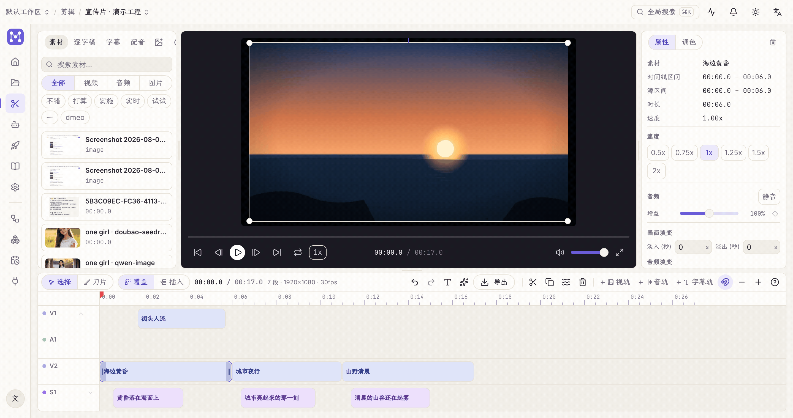

The **Edit** page is a multi-track timeline editor: media / transcript / subtitles on the left, dual monitors in the middle, the timeline at the bottom, properties / grading on the right.

**Create the main timeline and import media** — the Import button sits at the top right of the media pool; video / audio / images all work, with preview proxies and thumbnails generated automatically:

**Drag clips onto the track, move the playhead, press S to split at the playhead**:

## Timeline

- **Multiple tracks**: video, audio and subtitle tracks side by side; tracks can be muted / locked.
- **Tools**: select / blade (split); cross-track drag with snap-to landing.
- **Editing**: split, duplicate, ripple delete, multi-select, speed ramps, fade in/out, picture-in-picture.
- **Playback**: frame stepping, loop, playback rate, volume, fullscreen; the monitor shows waveforms.
- **Undo / redo**: everything is undoable (Cmd/Ctrl+Z).

## Transcript-driven editing

Run ASR on an audio/video asset to get a **word-level transcript**:

- Deleting sentences / words cuts the corresponding segments from the source; silences and filler words ("uh", "you know") can be detected and batch-removed in one click.
- Transcription runs in an external interpreter; models download on first use (see [Download & install](/en/start/download/)).

## Color grading

The **Grading** tab on the right:

- **Curves**: Luma / R / G / B channel curves with an independent undo stack (each drag is one step).
- **Style presets**: vivid / black & white / warm / cool / cinematic / faded.
- **3D LUT**: upload a `.cube` to apply.
- **Scopes**: histogram / waveform, live.

## Subtitles & filters

- Add a subtitle at the playhead on the subtitle track and edit the text in place.
- Filters and subtitles are burned into the exported cut.

## Export

**Export** on the timeline toolbar renders the current timeline into a new asset; once done you can head to [Publishing](/en/guides/publishing/).
