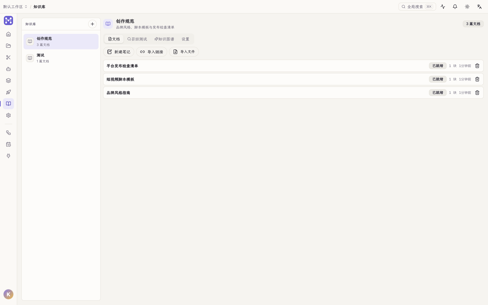

The **Knowledge base** turns your material into searchable knowledge for the agent and the workflow **KB search** node. Everything runs locally.

## Import

Three entry points at the top of the left column:

- **New note**: write directly in the built-in editor (tiptap rich text).
- **Import URL**: fetches the page's main content and converts it to Markdown.
- **Import file**: the document conversion engine (markitdown / MinerU) turns PDF, Office and more into Markdown.

## Retrieval

The search box runs local **hybrid retrieval**:

- Full-text (SQLite FTS5 trigram) + vector (embeddings) + graph (entity-relation expansion), fused with RRF ranking.
- No external services involved — works offline.

## Used elsewhere

- The **AI Studio** agent retrieves from the knowledge base on demand.
- The workflow **KB search** node outputs matching snippets as text for downstream nodes (e.g. LLM).

Documents can be renamed / deleted (right-click).
