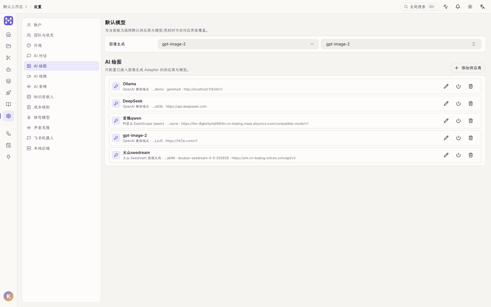
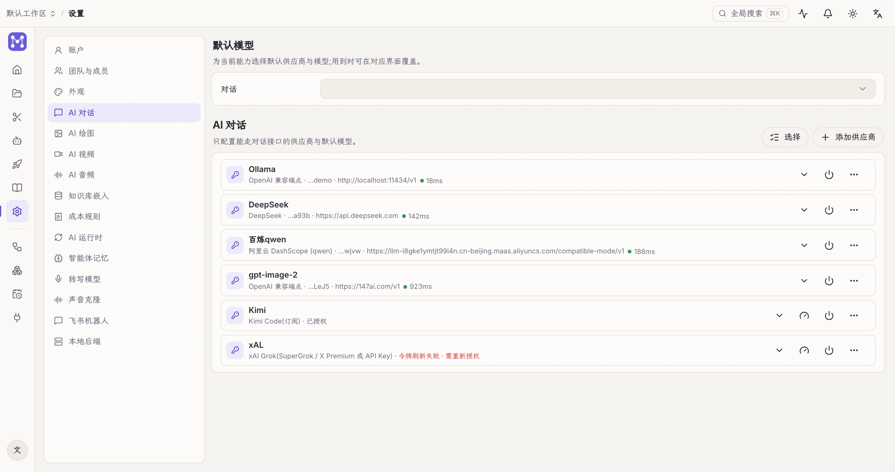

Open Studio's AI features (agent chat, text-to-image / video, voiceover, transcription) are bring-your-own-key. Keys are stored locally only; the settings API returns masked hints, never the plaintext.

## Configured per capability

Settings groups AI providers into four **capability sections**, each configured independently:

| Section | Used by |
| --- | --- |
| **AI Chat** | the agent and workflow LLM nodes |
| **AI Image** | text-to-image generation |
| **AI Video** | text-to-video generation |
| **AI Audio** | TTS voiceover / podcast synthesis |

At the top of each section is the **default model**: the default provider and model for that capability, overridable in place wherever it's used.

**Configure providers per capability** — Chat / Image / Video / Audio each have their own section; after "Add provider" the UI renders exactly the fields that provider declares, and keys are stored locally:

## Add a provider

Click **Add provider** in the relevant section:

1. Pick a **vendor** (built-ins include Alibaba DashScope, Volcengine ARK (video / Seedream image), Kimi, MiniMax, OpenAI, Google, Kuaishou Kling, OpenAI-compatible endpoints; the catalog grows over time).
2. Give it a **name** (e.g. "My Kimi").
3. Paste the **API key**. A "Get API key ↗" link jumps straight to that vendor's key console.
4. **Base URL**: leave empty for the vendor default (the placeholder shows it); OpenAI-compatible endpoints need it filled in.
5. **Default model** is optional; the placeholder shows an example.

Providers can be **enabled / disabled** at any time without deleting. If the same key serves multiple capabilities (e.g. Volcengine video and image), create **separate profiles in each section** — they are independent, so editing one never affects the other.

## Cost rules

Under Settings → **Cost rules** you can price models (per token / per image / per second); Home and the task center accumulate AI spend accordingly. Unpriced usage is labeled "unpriced".

## Bindings: missing config surfaces where it's needed

Models are **bound** to the places that use them. When something isn't configured, that place tells you and links to the fix:

- Workflow **LLM / AI-generate nodes**: with no usable provider (or a deleted one referenced), the inspector shows an amber / red banner with a "Configure" shortcut.
- **AI Studio** generation: with no usable generation model, the list shows the same prompt.

> The generation model catalog always has built-in entries; whether they actually run depends on **the corresponding vendor key being configured**.
