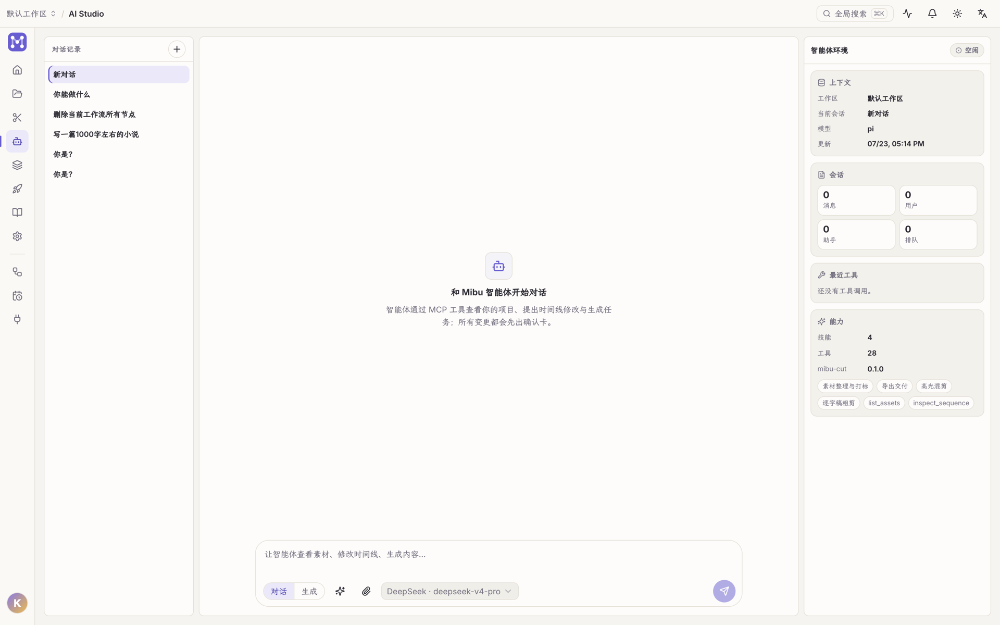
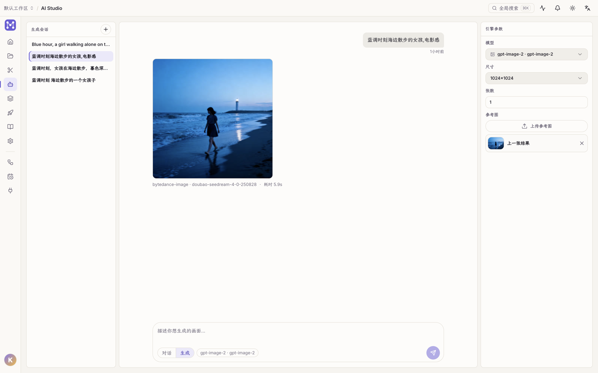
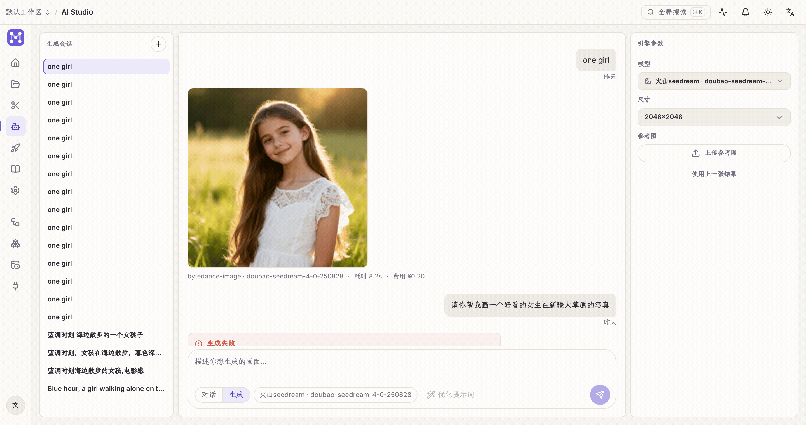

「AI 工作台」有两个模式,输入框左下角切换:**对话** 与 **生成**。

## 对话:智能体操作工程

智能体通过 Open Studio 的 MCP 工具**直接看你的工程、提改动**:检索素材、编排时间线、发起生成、乃至发布。

右栏「最近工具」旁的计数是**当前可用的工具总数**(截图里是 54 个)。它不是写死的:装了插件、
插件里勾了工具,这个数就跟着涨。工作流画布能做的事智能体都能做 —— 这一条由测试钉着,
不是一句愿望(见 [MCP 文档](https://github.com/Alndaly/OpenStudio/blob/main/docs/MCP.md))。

- **确认卡**:任何会改动工程 / 外部状态的操作,都会先弹确认卡,由你批准后才落地。
- **技能(skills)**:composer 左下角可调用预置技能(opencode 式)。
- **附件**:可上传图片 / 视频给智能体分析(多模态)。
- 左栏是**对话记录**,每条会话独立;支持重命名 / 删除。

底层是托管的外部 coding-agent CLI(opencode 式),不是自研聊天循环。需先[配置模型服务商](/guides/providers/)。

### 输入框:每轮都要看的留在外面

输入框那一行只有每次都会用到的东西:**对话 / 生成**切换、附件、**模型**、发送。其余进右边那个滑块图标的
**会话设置**——它们是「配好就不再动」的东西:

- **思考**:关闭 / 低 / 中 / 高。开启后,模型的思考过程会流式显示在一个折叠块里,想看就展开,结束后自动收起。
  「关闭」只表示**不主动要求**它思考:k3、DeepSeek reasoner 这类模型无论如何都会思考,它们的思考照常显示。
- **视频分析方式**:素材分析走整段还是抽帧。
- **上下文**:一条水位条 + 「还剩百分之多少」,以及「**立即整理上下文**」。

### 上下文快满了会怎样

聊得够久时,应用会把**早期对话交给模型摘要**、保留最近几轮,腾出空间继续聊。这件事不是悄悄发生的——
对话里会留下一条记录,写明移出了多少条、腾出了大约多少 token,展开能看到摘要本身。

- 触发点是所选模型上下文窗口的 **80%**。每个模型的窗口不一样,在[模型设置](/guides/providers/)里可以改。
- 不想等它自己到线,可以随时点「立即整理上下文」——它要花一次模型调用,所以是个明确的按钮而不是自动行为。
- 水位读的是**供应商回报的真实用量**(最后一次调用的 input + output),此后的新消息才是估算,不是纯猜。

## 生成:文生图 / 文生视频

**对话 / 生成一键切换**——底部输入框直接描述画面,右栏调引擎参数;生成结果可一键入素材库:

「生成」模式左栏是**生成模型**目录,中间是生成结果流,底部输入框写提示词:

- 选模型 → 写提示词 → 发送,任务进队列,完成后结果进素材库。
- 能不能跑取决于该模型对应**服务商的密钥**是否配好;没有可用模型时顶部会提示去配置。

## 飞书绑定

设置 → 飞书机器人可把智能体接到飞书,直接在飞书里对话。

**需要确认的改动会以卡片发到同一个飞书会话,在飞书里点「同意 / 拒绝」即可**,不用切回 Open Studio。

谁能批准取决于账号绑定:点按钮的人必须已经把飞书账号绑到 Open Studio 账号,并且此刻仍是该
工作区的成员。卡片在群里谁都看得见,但看得见不等于能批。

要用这个功能,还需在飞书开发者后台为该应用做两件事(没有接口可代劳,一键创建也配不了):
事件订阅里添加 `card.action.trigger`、应用功能里打开「交互卡片」,然后重新发布应用。
没配好时机器人会退回纯文本提示,并告诉你要开哪两个开关。
