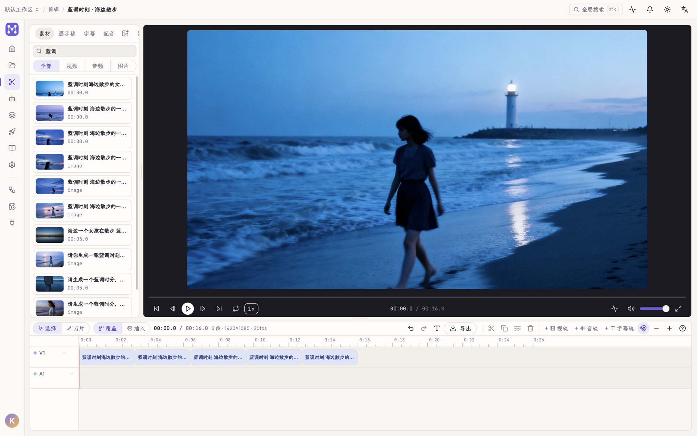

「剪辑」页是一个多轨时间线编辑器:左侧素材 / 逐字稿 / 字幕,中间双监看器,底部时间线,右侧属性 / 调色。

## 时间线

- **多轨道**:视频、音频、字幕轨并存;轨道可静音 / 锁定。
- **工具**:选择 / 刀片(切分);拖拽跨轨移动,带落点吸附。
- **编辑**:切分、复制、涟漪删除、多选、变速、淡入淡出、画中画(PiP)。
- **播放**:逐帧步进、循环、倍速、音量、全屏;监看器带波形。
- **撤销 / 重做**:全程可撤销(Cmd/Ctrl+Z)。

## 逐字稿驱动剪辑

对音视频素材跑 ASR 转写后,得到**逐字**稿:

- 删句 / 删词直接从源片裁掉对应片段;静音、口头禅(呃、那个…)可一键检出并批量删。
- 转写走外部解释器,首次按需下载模型(见[下载与安装](/start/download/))。

## 调色

右侧「调色」标签:

- **曲线**:Luma / R / G / B 通道曲线,独立撤销栈(每次拖动记一步)。
- **风格预设**:鲜艳 / 黑白 / 暖 / 冷 / 电影 / 褪色。
- **3D LUT**:上传 `.cube` 应用。
- **示波器**:直方图 / 波形,实时监看。

## 字幕与滤镜

- 字幕轨在 playhead 处加条,直接编辑文本。
- 滤镜与字幕烧录进导出成片。

## 导出

时间线工具栏「导出」渲染当前时间线,产出一条新素材;导出完成即可进入[发布](/guides/publishing/)。
