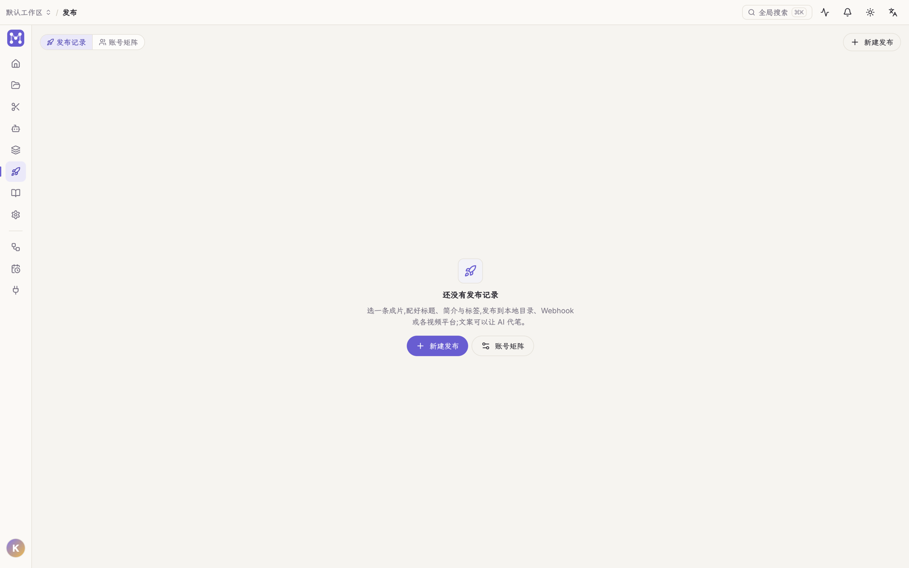
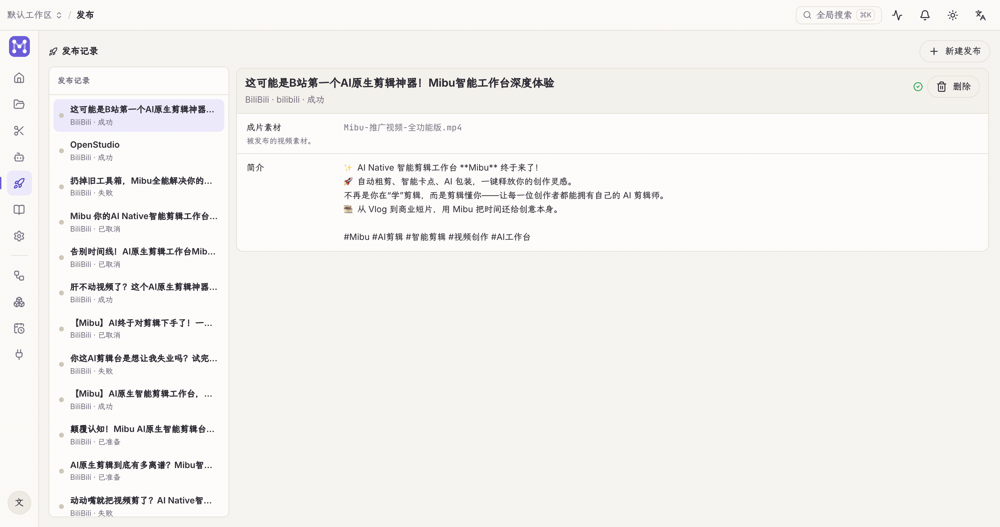

「发布」页有两个页签(刷新后停在你所在的页签):**发布记录** 与 **账号矩阵**。

## 发布页一览

**账号矩阵添加账号、新建发布**——选平台、选成片、填标题简介标签(平台标题上限创建时即校验),「AI 文案」可以按平台调性代写:

## 账号矩阵

账号矩阵管理多平台账号,登录态由桌面端持久分区保存,重启不丢:

- **添加账号**:选平台(抖音 / 小红书 / 视频号 / B 站 等),登录一次即常驻。
- **复检 / 登录 / 切换**:随时复检登录态;失效则重新登录。
- **每账号代理**:可给单个账号设代理(右键 → 代理)。
- **DevTools / 检查**:排障时可对单账号打开开发者工具。

登录走内嵌浏览器视图,顶部有地址栏 / 前进后退 / 刷新 + 「返回 Open Studio」。

## 新建发布

选一条成片,配标题、简介、标签,选目标:

- **本地目录** / **Webhook** / **演示平台** / 已登录的**社媒账号**。
- 文案可让 **AI 代笔**。
- 也可在工作流里用「发布」节点自动化。

## 发布记录

每条发布任务的状态在「发布记录」里跟踪,可查看详情、打开对应页面、删除。任务状态变化会进通知中心 / 任务中心,点击可直达对应记录。
