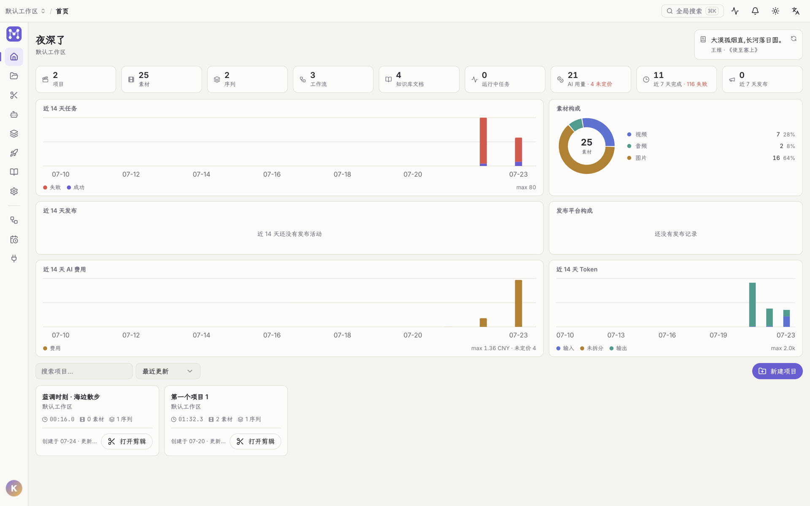

Open Studio 是一个**本地优先的桌面应用**,把内容创作的四段路收进同一个窗口:

1. **剪辑** —— 多时间线、多轨道的专业级编辑器:涟漪编辑、变速、逐字稿驱动剪辑、调色(曲线 / 预设 / LUT / 示波器)、字幕与滤镜、一键导出。
2. **AI 生成** —— 对话式智能体通过工具直接操作工程;文生图 / 文生视频产出素材进素材库。
3. **编排** —— 可视化工作流把检索、生成、转写、导出、发布串成一张图,可手动 / 定时 / Webhook 触发。
4. **分发** —— 成片一键发布到抖音 / 小红书 / 视频号 / B 站,多账号登录态常驻,由桌面端内嵌浏览器完成真实上传。

**从首页到剪辑只要一步**——「新建项目」直接落进编辑器,不弹任何中间对话框:

## 架构一览

- **前端**:Vite + React + TypeScript 单页应用,打包进 Electron。
- **后端**:FastAPI(Python)+ SQLite,负责工程、渲染、AI、工作流与发布任务的全部状态 —— 单一事实源。
- **执行器**:Electron 主进程内置的发布执行器,驱动内嵌浏览器视图完成登录与上传。
- **AI 智能体**:托管一个外部 coding-agent CLI(opencode 式),以 Open Studio 的 MCP server 为工具面;改动先出确认卡。
- **数据**:全部落在本机 `~/.open-studio`,不依赖云端,离线可用。

## 谁适合用

独立创作者、小团队:想在一处完成从剪辑到多平台分发,还能用 AI 与工作流自动化重复劳动,又不想把素材传上第三方云的人。

源码开放在 [GitHub](https://github.com/Alndaly/OpenStudio)(专有许可,详见[项目信息](/about/project/))。

下一步:[快速上手](/start/quickstart/)。
