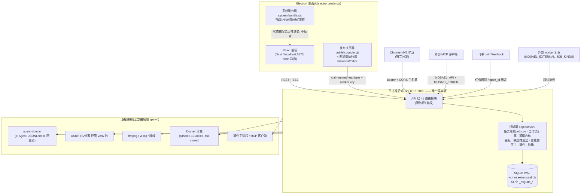
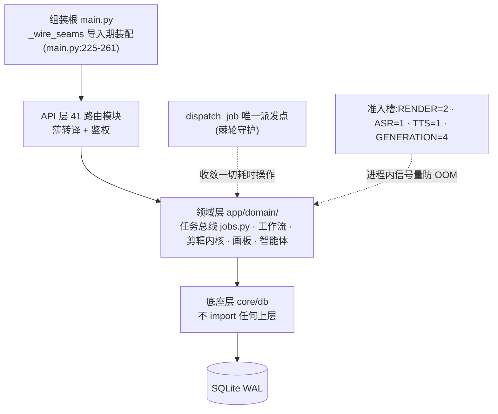
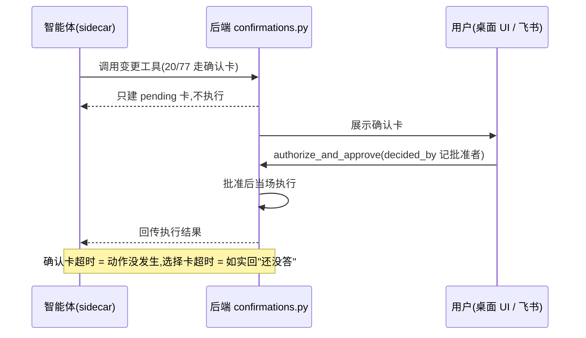
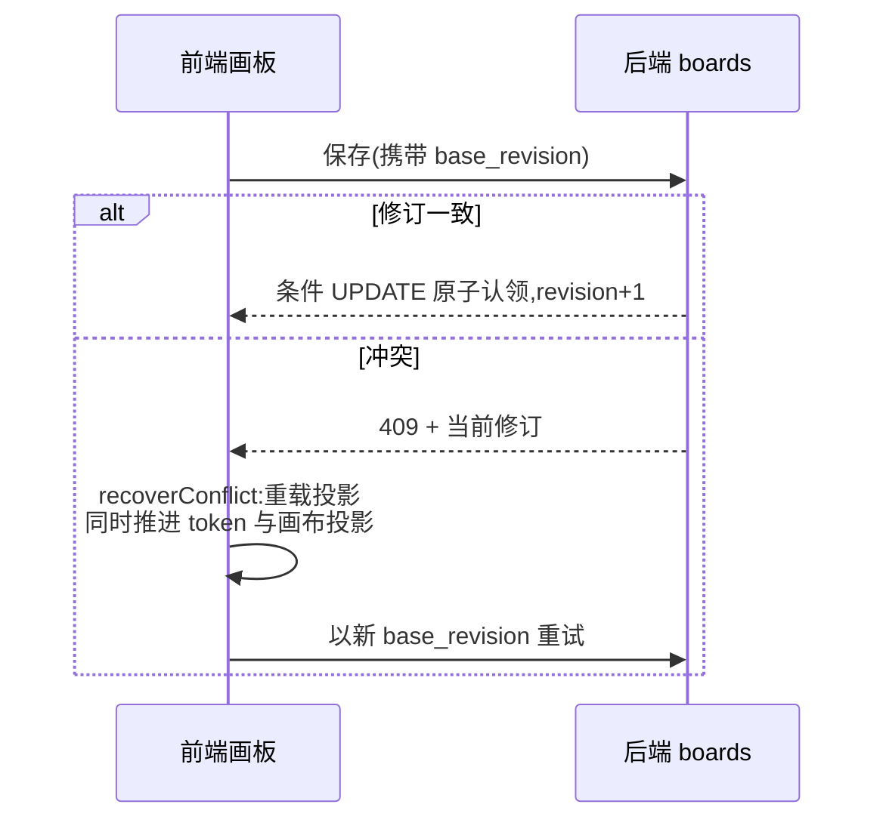
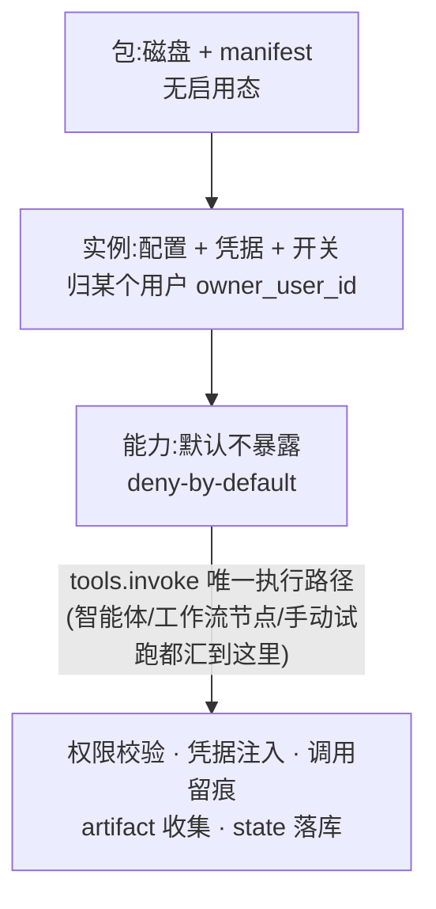
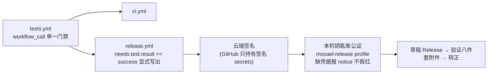
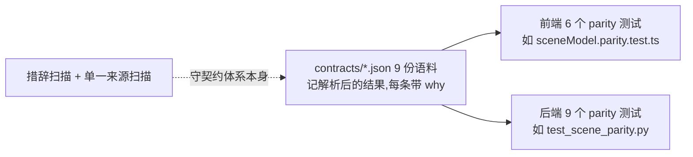
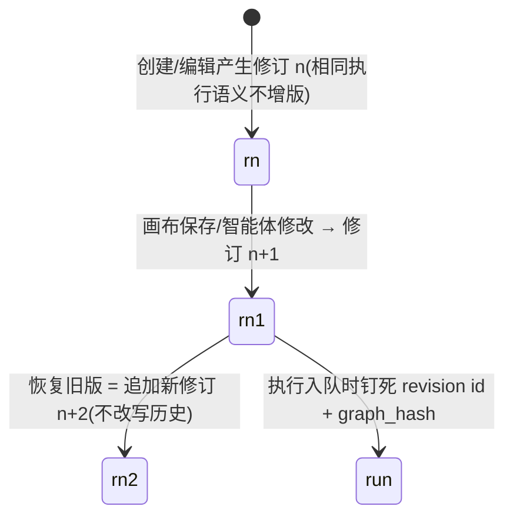

# Mosael 深度分析总报告

> 汇总人:synthesizer(报告总编,任务 t6)
> 输入:`docs/analysis/` 下五位分析员的分报告(架构 / 后端 / 前端·桌面壳·官网 / 扩展与集成 / 工程体系),关键论断已回到代码核实
> 仓库基准:`/Users/kinda/Developer/Mosael`,版本 1.4.0(`package.json`)
> 读者:想快速深入理解此项目的高级工程师
>
> **这五份是 2026-09-18 的快照,讲的是系统形态与各子系统的机制 —— 那部分基本没变。**
> 「那些形态在今天的代码里还处处成立吗」由后来的审计回答,**最新一份是
> [2026-09-22 五路审计综合](2026-09-22-synthesis.md)** —— 从这里开始读。它汇总同日五份只读
> 分领域审计([AI 供应商](2026-09-21-audit-ai-providers.md) /
> [后端领域](2026-09-21-audit-backend-domain.md) / [工程体系](2026-09-21-audit-engineering.md) /
> [前端](2026-09-21-audit-frontend.md) / [进程边界](2026-09-21-audit-processes.md),共 55 条问题)
> 与在先的 [2026-09-21 链条审计](2026-09-21-chain-audit.md)(那一份带动手修复),结论是:
> 问题几乎不在"纪律没执行",而在**执行纪律的那台机器自己有一个没人看的角落**。
> 数字规模见 [architecture.md §0](architecture.md#0-规模速览实测),已按 1.4.2 重测。

---

## 1. 一句话定位与全景架构

**Mosael 是一个本地优先(local-first)的 AI 视频创作工作室:一个单进程 FastAPI 后端是唯一事实源,持有全部持久状态(SQLite WAL);React 前端、Electron 桌面壳、发布/浏览器执行器、agent-sidecar、浏览器扩展、插件、worker 都只是它的客户端。**

它不是"带 AI 功能的剪辑器",也不是"视频版的 Agent 框架",而是把**剪辑内核、AI 生成、工作流编排、多平台发布**四件事收敛到一个本地单体里的完整创作工作台:浏览器里剪片(WebCodecs 预览)、画板上生图生视频、工作流跑自动化流水线、智能体用 77 个工具替你操作整个工作室、发布执行器登录真实平台账号投稿。

### 全景架构图

三条结构性事实决定了这张图的形状(ADR-0001/0002/0008):

1. **明确拒绝网络微服务与消息中间件**——`jobs` 表就是队列;单机拆 HTTP 微服务只引入序列化/部分失败/分布式取消,而独立伸缩的收益在单机上不存在。
2. **"多机"是部署选项不是代码结构**——把某个 job kind 翻成 `external` 执行模式(`MOSAEL_EXTERNAL_JOB_KINDS=render`),渲染就挪到 GPU 机器,领域代码一行不改。
3. **重活出进程、接缝显式化**——每条跨进程边界都有协议(JSONL/stdin、worker 租约、插件 JSON 协议、IPC parse 契约),每条跨语言语义都有契约语料,每条"会静默退化"的规约都有棘轮测试。

---

## 2. 各子系统核心结论摘要

### 2.1 架构总览(详:`architecture.md`)

1. **形态是"模块化单体 + 卫星进程"**:后端 ~6.99 万行 Python、149 个领域文件;前端 ~12.7 万行 TS/TSX;Electron 壳 ~1.6 万行;sidecar ~2,300 行。复杂度未被消灭而是被显式化。
2. **组装根 `_wire_seams()` 在导入期执行**(`main.py:225-261`),不在 lifespan 里——TestClient/脚本等不跑 lifespan 的入口不能拿到半装配系统。五条缝全部体现"基础设施不认识领域"的反向依赖。
3. **任务总线是心脏**:一切耗时操作收敛为 `jobs` + `task_events` 两表 + `domain/jobs.py`(766 行)一个模块;派发点只有 `dispatch_job` 一处(有棘轮守护,历史上有过 4 个裸起线程的反例)。
4. **准入槽即设计文档**:`RENDER=2 / ASR=1 / TTS=1 / GENERATION=4` 进程内信号量,注释直接写明"10 个并发导出 = 10 个 x264 + 80 个 ffprobe,笔记本几乎必然 OOM"。
5. **worker 协议(ADR-0002)是"可拆而未拆"承诺的兑现点**:claim(CAS 原子 + 60s 租约)/ report(终态不可复活)/ heartbeat;失联标失败但**不自动重跑**(避免重复计费副作用)。
6. **工作流三接缝**(节点元数据注册表 / 执行器注册表 / 纯 DAG 引擎)让"加一个节点 = 声明 + 一个执行器,引擎、编辑器、智能体都不动";不可变修订使执行在入队时钉死 `graph_hash`。
7. **剪辑内核"操作即事实"**:一次手势 = 一条批量 SequenceOperation(先全量校验再落库),撤销注册表按操作类型成对登记 inverse/forward,`UNDOABLE_KINDS` 由注册表派生。
8. **单进程是正确性前提**:`docs/PROCESS_STATE.md` 登记"多进程即错"7 处(令牌刷新租约、worker key、OAuth pending、publish 认领原子性等)——这是团队模式的真实扩容天花板,与换不换数据库无关。

### 2.2 后端与 agent-sidecar(详:`backend.md`)

1. **四层严格分层**:组装根(main.py)→ API 层(41 路由,304 路径/388 操作,只做 HTTP 转译)→ 领域层(真正的内核)→ 底座层(core/db,不 import 任何上层)。
2. **数据层**:SQLite WAL + SQLAlchemy 2.0;密钥列挂 `EncryptedText/EncryptedJSON` 列类型(加密挂在类型上,"领域代码一行都不用改");主密钥不进库,兜底 `secret.key` 0600 且注释如实声明"挡不住整个数据目录被拷走"。
3. **不跑迁移框架**:`init_db()` = `create_all` + 51 个 `_migrate_*`;Alembic 曾因"30 个文件从不执行且漂移"整体移除;退休判据 = 引入早于最早仍支持的 Release。
4. **取消语义是真的**:`cancel_job` 沿 `parent_job_id` 级联 + `jobs._CHILDREN` 子进程句柄表真杀 ffmpeg——否则"取消只是翻数据库字段,被取消的导出又出现在素材库里"。
5. **回执挂在状态跳变上而非函数上**(SQLAlchemy `after_flush`/`after_commit`)——此前挂在 `finish_job` 里,而全仓只有 render.py 走它;投递失败只记日志不弄失败任务("产物已在库里")。
6. **安全三重门**:确认卡(20/77 工具,批准后当场执行,`decided_by` 记批准者)/ 选择卡(不能被"本会话始终允许"自动答掉)/ 显式只读声明(35 个,漏声明测试红——历史上 `browser_click` 曾被"算出来的只读"交给子智能体)。权限恒等式:智能体能做的 = 行动人能做的 ∩ 会话授予档位。
7. **AI 判断必须是隔离的判断者**:单独一次调用,只喂工具名+参数+用户准则,**不喂对话历史**——"判断者看到的内容本身可能就是被注入影响过的"。
8. **供应商三层**(连接/模型/能力默认,混成一层是"这块此前所有麻烦的根源")× 执行面(agent / automation=direct+gateway)第二条正交轴;Gateway 安全不变量:不监听端口、OAuth token 不出 sidecar、短期令牌用完即撤、永远没有工具。
9. **agent-sidecar 是精确镜像**:回合级 Node 进程(每轮 spawn 一次),上下文计量与后端 `context_meter.py` 是同一规则的两份实现,由 `contracts/context-meter-cases.json` 钉死;凭据走 acquire→改→commit 三步租约(订阅 refresh token 多为一次性,并发刷新会互废);`--ignore-annotations` 打包参数钉住上游 sideEffects 标注故障。
10. **失败的诚实**:失败回合也回存 adapter_state("工具副作用真的发生了,模型下次醒来不知道就会再做一遍——而它做的是建项目、改时间线");拿不到则由 `unseen_since_last_success` 如实补进下轮提示词。

确认卡审批流(安全三重门的第一道):

### 2.3 前端、Electron 壳与官网(详:`frontend-electron-website.md`)

1. **三段自举**:`ensureBackend()` 探活复用或 spawn → `loadFile`/`loadURL` 开窗(hash 路由,`file://` 下 path 路由不可用)→ 起发布/浏览器执行器。
2. **状态二分纪律**:React Query 持一切服务端实体(staleTime 60s,页面条件挂载防首帧空态闪),Zustand 只放拖拽草稿与瞬时 UI,localStorage 只放本地偏好;logout/401 时 `qc.clear()` 防串号。
3. **预览单路径 + 明说式失败**:WebCodecs 解 720p 代理 → CanvasCompositor 是唯一路径(无 `<video>` 兜底);画不出来由四态机 `ready/transcoding/failed/undecodable` 铺在监视器上明说,而不是降级到另一条画法。
4. **契约语料是前后端一致性的锚**:`sceneModel.ts` 与 `scene.py` 由 `scene-cases.json`(803 行)双侧各跑一遍;改语义先改语料,看两侧一起红,再改实现。
5. **撤销粒度与用户感知对齐,三种机制不强行统一**:剪辑走服务端批量端点(一次手势一条 revision)、工作流走 zundo leading-quiet 合并、画板走序列化快照串——各自贴合其事实来源。
6. **画板乐观并发**:`base_revision` 条件 UPDATE,409 恢复收口在 `recoverConflict`(同时推进 token 与画布投影——"令牌与其描述的投影是一个单元");`itemIsRunning` 要求既有 job_id 又是 queued/running,防脏快照启动永不收敛的轮询。
7. **前端不认识任何具体节点**:工作流表单完全由后端 NODE_TYPES 的 `config` 声明生成(9 个声明键驱动控件派发)——插件节点是运行时类型,写特例永远覆盖不到。
8. **Electron 特权面纵深防御**:IPC 载荷进主进程一律先 `parse*`(URL scheme 白名单、分区前缀、字符集);`mosael://` 只导航不执行(任何网页都能触发协议);单实例锁防两个发布 worker 抢同一批任务。
9. **官网全静态生成**(Next.js 16 按 `LOCALES × plugins` 预渲染),插件市场索引由脚本扫描 examples 生成而非手写,CI 有 `test_plugin_registry_in_sync.py` 钉同步;安装动作只在桌面应用内。
10. **测试同炉**:`vite.config.ts` 的 include 把 `electron/**/*.test.ts` 收进前端 vitest——esbuild 只打包不跑类型与用例,那半边代码的回归"此前只能等打包后在真机上撞见"。

画板乐观并发的 409 恢复闭环(`recoverConflict`):

### 2.4 扩展、插件与对外集成(详:`extension-integration-analysis.md`)

1. **所有集成收敛到后端 API,没有第二条写入路径**:进来(扩展/MCP/飞书/Webhook/worker)与出去(插件/Blender/TikHub/百度网盘)两个方向共享这条骨架。
2. **浏览器扩展是 MV3 side panel**,四束进程(background/content/page-bridge/sidepanel)显式协议通信;**不申请 cookies 权限**(站点身份交给 Browser Pool,扩展只发身份 id);后台代理 fetch 收窄到三个字幕 API 白名单,`<all_urls>` 没有变成任意代理。
3. **插件体系三层**(ADR-0005):包(磁盘+manifest,无启用态)/ 实例(配置+凭据+开关,**归某个用户**)/ 能力(默认不暴露,deny-by-default)。接入归人是结构性防线:`tools.exposed(db, user_id)` 的 user_id 是必填位置参数——漏过滤就是"我的智能体拿着别人的第三方密钥去调"。
4. **`tools.invoke` 是唯一执行路径**:智能体/工作流节点/手动试跑三条入口都汇到它,权限校验、凭据注入、调用留痕、artifact 收集、state 落库全在一处。
5. **JSON 协议三条显式旁路**(只给进程形态,"MCP 是别人的协议,我们不往里加字段"):artifact 交文件(路径强校验落暂存目录)、`format:asset` 喂文件(跨工作区直接拒)、state 记忆(写没声明的键**直接失败而非忽略**)。
6. **插件市场无信任背书是明示取舍**:防线压在安装那一刻——预览先把权限摊开,`_safe_extract` 逐条查符号链接/路径穿越/解压炸弹;浏览市场要部署管理员("看到的下一步就是装,而装是往这台机器上放代码")。
7. **`mcp_server.py` 是唯一工具注册表**(77 工具):manifest 派生消除第二份清单(历史事故:手写副本漂移后静默少了 19 个工具);ContextVar 传 token 解决单进程多用户并发泄漏;插件工具展开成一等公民(`plugin__<实例>__<工具>`,按实例不按包)。
8. **Blender 互通是"插件体系承载一等功能"的样板**:`domain/blender` 不写自己的传输层,三条操作(send/receive/pull)全经插件管道调 `execute_blender_code`;"JSON is data, never interpolated";安装器解决 Blender 4.2+ Extensions 与上游 legacy add-on 的生态错位。
9. **确认流两个入口一个实现**:桌面 UI 与飞书互动卡都汇到 `authorize_and_approve`——"它曾经是两边手抄的,意味着 HTTP 路由上加的第四个检查会静默不对飞书路径生效"。
10. **后端侧防线精确收窄**:CORS 显式枚举 + `^chrome-extension://[a-p]{32}$` 正则(故意比 `.*` 窄);worker key 的信任边界是本地文件("127.0.0.1 不是浏览器尊重的边界");Webhook 用任务级密钥不挂登录态。

插件体系三层(ADR-0005):

### 2.5 工程体系、测试与发布(详:`engineering-quality.md`)

1. **契约语料机制是工程成熟度最高的子系统**:9 份 JSON / 64 条 case,每条带 `why` 记录历史事故;语料记"解析后的结果"而非写法(这是契约能跨语言成立的关键);后端音频 parity 跑真 FFmpeg 逐采样读回;刻意允许的分歧(调色)不进契约。
2. **两道元机制扫描器守契约体系本身**:措辞扫描(`test_cross_runtime_claims_name_a_contract.py`:注释里写"必须与…一致"就必须点名语料)+ 单一来源扫描(`transcriptProjection.singleSource.test.ts`:让第二份不存在,而不是加比较测试)。
3. **测试规模实测**:后端 pytest 369 文件 / ~2746 用例;前端+Electron vitest 267 文件 / ~1472 用例;sidecar 13 个 node 测试;合计已超 4200 条。
4. **89 道结构性棘轮**(61 Py + 28 TS,与生成清单吻合)是全仓最有特征的机制:数据归属、进程状态清单、节点↔执行器锁步、撤销配对、派发唯一入口、装配入口、智能体身份恒等式、i18n 键成对……共同对象是"**违反了不会报错、只会安静退化**"的那类规约。
5. **CI 单一门禁**:`tests.yml` 抽成 `workflow_call` 被 ci 与 release 共用("两份会漂,漂的方向必然是发版那份更严");`needs.test.result == 'success'` 显式写出,堵住 `!cancelled()` 让测试红了照样出包的陷阱。
6. **打包冒烟是真 E2E**:`test/bundle.smoke.mjs` 造最小旧库 fixture,启动真实打包 Electron,断言后端升级+健康+renderer 加载+desktop 桥可用,退出后验证旧库升级正确——钉死"新装机好、老用户崩"这类桌面应用最痛的回归。
7. **发布是"云端签名 + 本机钥匙串公证交接"两段式**:GitHub 只有签名 secrets,Apple 公证凭据只在维护者本机 `mosael-release` profile;缺公证凭据报 notice 而非假红("假红叉比没有红叉更坏");先草稿后转正防半成品版本;八件套附件含 5 个插件 ZIP。
8. **供应链控制细致**:`--frozen-lockfile` 全域、install 脚本逐个点名、pnpm patch 修 app-builder-lib 签名缺陷且有测试覆盖、setup-uv 锁 commit SHA。
9. **lint 哲学"少而精、能当闸用"**:ruff 只选 F/E9/B("开局七百条警告和没有 lint 是同一回事"——首次运行即抓出 judge.py 里活的 NameError);前端因 typescript-eslint 不支持 TS 7 转 oxlint,只开 14 条零告警规则。
10. **文档自身被测试守住**:`test_docs_do_not_point_at_ghosts.py`(文档指的代码路径必须存在)、`test_ratchet_docs_in_sync.py`(棘轮的棘轮)、`test_site_docs_stay_in_sync.py`(官网中英对齐);18 份 ADR + 302 行 CONTEXT.md + 623 行 CHANGELOG。

发布流水线两段式(证据:`.github/workflows/`、`docs/RELEASING.md`):

---

## 3. 贯穿全项目的核心设计思想

这五份分报告各自独立,却反复撞到同一组思想——它们是这个项目真正的"基因":

### 3.1 事实源在后端,其他一切都是客户端

后端不知道前端存在(系统层状态是渲染层轮询后**推进去**的);worker 拉取式认领,后端从不反向连接;插件/扩展/飞书/MCP 全部汇到同一个 HTTP API 与领域函数。整条拓扑里**没有第二条写入路径**。这条原则使得权限、记账、取消、确认门控只需要实现一次。

### 3.2 契约语料钉死双实现——承认"必然两份",而非追求"只有一份"

预览/导出、sidecar/后端、前端/后端的共享常量,凡"语义只能有一份定义却必然有多份实现"的地方,就放一份语言中立的语料进 `contracts/`,两侧测试各跑一遍。一致性从"靠纪律同步两份代码"变成"一份真相 + 两侧 CI 互相看守"。**这是全仓最具迁移价值的模式**,且配套了两道元机制(措辞扫描 + 单一来源扫描)守住契约覆盖不到的地方。

### 3.3 不可变修订与"操作即事实"

工作流修订不可变、恢复旧版产生新修订、执行在入队时钉死 `graph_hash`;剪辑每次编辑校验不变量后落 operation + revision,撤销从注册表派生;Activity 事件流追加写不可变。**历史从不被改写,改写历史的动作本身变成一条新记录。**

### 3.4 一次手势 = 一条操作 = 一步撤销

批量动作一律做成一个 `*_batch` 操作,先全量校验再落库,一个非法整批不落;禁止前端循环调单条端点、禁止把顺序依赖留在前端。撤销粒度与**用户感知的动作**对齐,而不是与 API 调用对齐。

### 3.5 Fail-closed 与"授权不能补隔离的缺口"

code 节点无 Docker 就拒绝执行,不得以普通子进程回落;worker key 的信任边界是本地文件而非"同机假设";OAuth token 永不出 Gateway;插件权限 deny-by-default;能力默认不暴露。安全边界都画在**机制**上,而不是画在"我们约定不这么做"上。

### 3.6 诚实优先于完备——一切"静默"都被视为 bug

"不认识这个模型"和"这个模型真没参数"是两种处境(生成契约);画不出来就明说四态而不是降级(预览);"这家不支持"和"这次没查成"不抛 5xx(额度);摘要失败降级截断但如实回报(压缩);插件 state 写没声明的键直接失败而非忽略;更新检查解析不出版本号要报错而非假报"已是最新";offline ≠ anonymous(摆登录页等于谎称会话结束)。ADR-0013 甚至为此推翻了自己上一份 ADR 已接受的后果。

### 3.7 棘轮:把"违反了不会报错"的规约变成 CI 事实

89 道棘轮的共同对象是**安静退化型**规约——界面照常渲染只是少一块能力、清单照常存在只是少 19 个工具、撤销照常工作只是撤错了东西。这是"规约密度"远超普通项目的根本原因,也是新人(或 AI 协作者)最大的 Leverage 来源:违反架构纪律不需要有人记得,只需要 CI 红。

### 3.8 注释即事故档案

几乎每个非显然设计都在源码里写着"为什么"+事故复盘+守护它的测试文件名。这是刻意的知识固化策略:**把"得有人记得"系统性降级为"得有人绕开机制"**。对 AI 协作者而言,这是这个仓库最珍贵的上下文资产。

---

## 4. 跨子系统的一致性与矛盾点

### 4.1 交叉验证后确认一致(互相印证)的点

- **任务总线的中心地位**:架构(t1)、后端(t2)、前端(t3 任务中心)三份报告独立得出"jobs 两表 + 一个模块是全仓枢纽"的结论,证据互不相同(执行模式接缝 / 回执挂载点 / TaskCenter 轮询)。
- **契约语料清单**:t3 与 t5 的消费者矩阵完全一致(9 份语料、6 个前端 parity + 9 个后端 parity 测试均实测存在);本次核实 `contracts/*.json` 恰为 9 份。
- **确认门控数字**:t1/t2/t4 三处一致(20 确认 + 1 选择 + 35 只读 + 22 变更 = 77,三集合全覆盖由 `test_tool_read_only_flag.py` 钉住)。
- **进程内状态清单**:t1 的 PROCESS_STATE.md 第一类 7 处与 t2 §15.2.4、扩展维度的 Blender 桥互斥锁互相印证,扩容天花板判断一致。
- **"接入归人"模式**:t4 的插件实例 `owner_user_id` 与 t1/t2 的供应商连接 `resolve_connection` 不跨用户回退、智能体权限恒等式是同一条原则的三种形态。

### 4.2 分报告之间的矛盾(已核实消解)

| 矛盾 | 核实结果 | 结论 |
| --- | --- | --- |
| 契约语料份数:t1 写 10 份,t3/t5 写 9 份 | `contracts/*.json` 实测 **9 份** | **t1 有误**,以 9 份为准(本报告已统一) |
| RetryingClient 引用面:t1 写 23 个模块,t2 §9.6 写 15 个 | 实测 `grep -rl RetryingClient backend/app` = 23 个文件(其中 21 个模块真正 import,另含定义文件与配置);文档(CONTEXT.md/ARCHITECTURE.md)写 15 | **t2 沿用了过时文档数字,t1 为实测值**;以"21 个模块导入 / 23 处引用,文档写 15 已过时"为准 |
| 后端测试文件数:t1 写 369,t2 写 374,t5 写 372 | 当前 checkout 实测 `backend/tests/test_*.py` = **369** | 微小漂移(各报告取样时点不同),以 369 为准 |
| 前端行数:t1 写 12.7 万,t3 写 10.5 万 | 实测 `frontend/src` 全部 TS/TSX = 127,476 行;t3 的 104,650 为**非测试**代码 | 不矛盾,口径不同(含/不含测试),本报告两处都标注口径 |

### 4.3 文档与代码的漂移(分报告共同发现;1/2/3/5 已于 2026-09-18 修复,4 号核实为未跟踪产物已删除)

1. **CONTEXT.md:166 上下文窗口回退值过时**:写"保守回退 32000",代码已是云端 128K / 本机 LAN 32K **双回退**(`host.py:1362-1376` + `compaction.ts:60+`,由 `contracts/context-meter-cases.json` 钉住)。ARCHITECTURE.md:350 同样滞后。✅ **已修复**:两处文档同步为双档回退口径,并顺带修正 ARCHITECTURE.md 中常量位置的二次漂移(pi.ts → compaction.ts)。
2. **RetryingClient 模块数**:CONTEXT.md:279 与 ARCHITECTURE.md:346 写 15,实测 21 个模块直接 import。✅ **已修复**:两处同步为实测口径。
3. **ADR-0007 状态行与落地现状的张力**:头部标"已决定,未实现",但 `docs/AGENT_PERMISSION_MODES.md`(363 行)已是对照代码复验过的落地文档——读 ADR 必须连同注记一起读。✅ **已修复**:状态行改为"已落地"并指向复验文档。
4. **`backend/mosael-backend.spec` 陈旧漂移**:spec 的 `datas` 缺 `separation.py`/`line_protocol.py`/RNNoise 模型,而实际构建走 `package.json` 的 `build:backend` 内联参数——这是"第二事实源"反模式的活体标本。✅ **已处理**:核实发现该文件**未被 git 跟踪**(`*.spec` 在 .gitignore,PyInstaller 每次构建重新生成;`test_frozen_build_is_not_a_python_interpreter.py` 盯的是 build:backend),只是本地残留构建产物,已删除。
5. **`minimumReleaseAgeExclude` 空转**:两个 workspace 文件都配了排除名单,但全仓没有 `minimumReleaseAge` 本体(实测 grep 无)——排除名单的存在还容易给人"已开启"的错觉。✅ **已修复**:两个 `pnpm-workspace.yaml` 补上 `minimumReleaseAge: 4320`(3 天冷静期,分钟制),`pnpm config get` 实测生效。

值得注意的是:这个以"文档与代码同步有测试守护"著称的仓库,漂移点集中在**数字与状态行**这类 `test_docs_do_not_point_at_ghosts.py` 管不到的"事实陈述"上——路径可以验存在,数值的语义正确性验不了。

---

## 5. 优势清单与风险/技术债清单

### 5.1 优势(按杠杆排序)

1. **契约语料三层一致性机制**(语料 + 措辞扫描 + 单一来源扫描):把跨语言双实现一致性这个业界难题做成可执行、可演进、自知边界的体系,每条 case 的 `why` 字段保留事故现场。证据:`contracts/`、`contracts/README.md`、§4.1。
2. **89 道棘轮 + 生成式清单 + 清单同步测试**:架构纪律从 review 负担变成 CI 事实,且清单不会腐烂。证据:`docs/CONVENTIONS.md` RATCHETS 区块、`scripts/sync-ratchet-docs.py`。
3. **任务总线一个抽象承载七件事**:取消、并发控制、父子归属、播报策略、回执、外派扩容、事件保留。证据:`backend/app/domain/jobs.py`。
4. **打包冒烟直接验证升级路径**:旧库 fixture + 真实打包产物 + 逐阶段落盘,钉死桌面应用最痛的回归。证据:`test/bundle.smoke.mjs` + `test/upgrade_db_fixture.py`。
5. **竞态处理的系统性**:条件 UPDATE 贯穿(claim 会话/job/确认卡/画板 revision)、终态防复活、回执挂状态跳变、线程命名收编测试。证据:`jobs.py:183-229`、`engine.py`、`boards/ops.py`。
6. **安全边界全部机制化**:fail-closed 沙箱、隔离的 AI 判断者、worker key 本地文件边界、插件最小环境、CORS 精确收窄、IPC parse 纵深防御。
7. **CI 单一门禁 + 发布诚实设计**:tests.yml 双复用、显式 `needs.test.result`、缺凭据报 notice 不假红、先草稿后转正。证据:`.github/workflows/`。
8. **注释即决策记录的可验证性**:每个"为什么"附测试文件名,`test_docs_do_not_point_at_ghosts.py` 守文档指针——AI 协作者最重要的上下文资产。

### 5.2 风险与技术债(按严重程度排序)

| # | 严重度 | 风险 | 证据 |
| --- | --- | --- | --- |
| 1 | **高(结构性)** | **单进程正确性约束是团队模式的真实扩容天花板**:PROCESS_STATE.md 第一类 7 处(令牌刷新租约、worker key、OAuth pending、publish 认领原子性、agent 会话表、Blender 桥锁、限流窗口)意味着解决它们之前后端无法水平扩第二进程,**与换不换数据库无关**。文档已精确记录扩容顺序(这是优点),但天花板本身是硬约束。 | `docs/PROCESS_STATE.md` + `tests/test_process_state_inventory.py` |
| 2 | **高(质量)** | **无 UI 级 E2E**:编辑器拖拽、画布交互、播放器这些最复杂的用户路径只有单测 + jsdom 组件测试(jsdom 本身也是后补的,vite.config.ts 注释自述"所有 UI 回归此前只能靠人手看")。契约管住了跨端语义,管不住前端单端内的交互回归。 | `frontend/vite.config.ts` test 段;全仓无 Playwright e2e 配置 |
| 3 | **中高** | **SQLite 单写者的尾部风险**:任务事件高频写入(每节点 started/finished 都 commit,`engine.py:181-183`)+ 团队模式多用户并发写,持续依赖 `busy_timeout=5000` 兜底;`lock_active_job` 实质是用写事务当锁,高并发下有 `database is locked` 尾部风险。 | `core/db.py`、`engine.py:181`、`jobs.py:183-199` |
| 4 | **中** | **覆盖率全盲**:无任何覆盖率度量(无 pytest-cov、无 @vitest/coverage),4200+ 条测试的"分布盲区"无从量化;棘轮是定点防守,回答不了"面"的问题。 | `backend/pyproject.toml`、`frontend/package.json` |
| 5 | **中** | **双份实现的未覆盖面**:上下文计量/场景模型/共享常量已进语料,但 thinkingLevelMap 语义、`_ATTACHED_ASSET` 正则与前端 `ATTACHMENT_TOKEN`、画板六态生命周期等仍靠注释约定,是下一批漂移的候选地。 | `backend.md` §15.2.3、`architecture.md` §14 |
| 6 | **中** | **轮询密度**:智能体生态在 SSE 之外叠加 5+ 条 1.2–4s 轮询回路,画板 2.5s 回执轮询、确认卡 2.5s、选择卡 2s——本地单用户无碍,团队服务器模式下并发客户端 QPS 值得关注。 | `frontend-electron-website.md` §5.2 |
| 7 | **中** | **发布 Bus Factor = 1**:公证依赖维护者本机钥匙串 `mosael-release` + 手工十余步;"一个人 + 一台 Mac"。流程文档极佳,但仍是单点。Windows 包无代码签名(SmartScreen 警告伤转化)。 | `docs/RELEASING.md`、`docs/MACOS_SIGNING.md` |
| 8 | ~~低(立刻可修)~~ ✅ 已修复 | ~~**`minimumReleaseAge` 空转配置** + **`mosael-backend.spec` 陈旧漂移**~~:已补 `minimumReleaseAge: 4320`(3 天冷静期);spec 核实为未跟踪的本地构建产物,已删除。 | `pnpm-workspace.yaml:16`、`package.json:17` |
| 9 | **低** | **单体大文件认知负荷**:WorkflowsView.tsx 3,967 行、messages.ts 5,320 行、mcp_server.py 2,183 行等;靠文件头长注释维系,功能内聚但定位成本高。 | t3/t4 报告实测 |
| 10 | **低** | **其余已知取舍**:回合级 sidecar 每轮 spawn 的固定开销;MCP 插件每次调用重连(stdio 冷启延迟未实测);51 个 `_migrate_*` 长期膨胀(退休门槛 v0.1.0);插件市场无签名无审核(防线压在安装时);三个 Python 版本共存(3.11 声明/3.13 CI/3.12.11 随包);扩展无自动更新通道;`react-hooks/exhaustive-deps` 37 处与 React Compiler 规则 ~120 处搁置。 | 各分报告风险节 |

---

## 6. 继续投入的改进建议(按 ROI 排序)

1. ~~**修掉两处"假安全/第二事实源"配置**~~ ✅ **已完成(2026-09-18)**:两个 `pnpm-workspace.yaml` 补上 `minimumReleaseAge: 4320`;`mosael-backend.spec` 核实为 `.gitignore` 覆盖的本地构建产物,已删除。
2. ~~**同步三处文档漂移**~~ ✅ **已完成(2026-09-18)**:上下文回退值(双档 128K/32K)、RetryingClient 数字(21 个模块)、ADR-0007 状态行(已落地)均已同步;文档守护测试 10 passed。
3. **给编辑器核心手势补少量 Playwright 冒烟(数天,补最大质量盲区)**:不必求全覆盖,只钉"一次手势=一条操作、批量撤销、预览四态"这几条最贵的手势路径。R1 是全仓唯一"最复杂路径零自动化回归"的洞。
4. **跑一次覆盖率出基线报告(一天)**:不求门禁,只求回答"哪些领域测试稀薄";落盘 `docs/validation/` 与既有证据惯例一致。
5. **团队模式扩容路径的第一块砖:publish 认领行锁(评估后投入)**:PROCESS_STATE.md 已给出正确顺序——先逐条处理第一类 7 处,而不是先换数据库;其中 publish 认领是唯一真正需要 `SELECT … FOR UPDATE SKIP LOCKED` 的点。建议按文档顺序推进,**不要**先换 Postgres。
6. **把高收益共享语义补进契约语料(随改随补)**:`_ATTACHED_ASSET` 正则 ↔ `ATTACHMENT_TOKEN`、thinkingLevelMap 语义是已点名的漂移候选;措辞扫描器已铺好路,补语料是顺势动作。
7. **团队服务器模式下量化轮询压力(先测再改)**:5+ 条客户端轮询回路在并发下的 QPS 值得一次实测;若成问题,确认卡/回执两条最有希望并入 SSE。
8. **发布流水线脚本化交接 + 中长期云端公证(按发布频率决定)**:短期把 RELEASING.md 十余步脚本化降 Bus Factor;工作流已为五项 secrets 配齐预留零改动恢复路径。
9. **声音克隆 venv 安装路径补一条打包级冒烟(R4 收口)**:bundle 冒烟覆盖了启动与升级,但不覆盖 3.12.11 解释器上 f5-tts 依赖安装这条最重的按需路径。
10. **不建议现在做的**:拆分微服务(ADR-0001 已论证)、统一三种撤销机制(各自贴合事实来源是有意设计)、把调色写进契约("只会逼两边互相迁就到都变差")、给 lint 加规则("开局七百条警告和没有 lint 是同一回事")。

---

## 7. 总评

Mosael 是教科书级的"**模块化单体 + 卫星进程**":它用 ADR-0001 拒绝了微服务的名义,却用 worker 协议、external 执行模式、组装根接缝把"可拆"做成了真实能力。它的工程体系不是工具新颖(pytest/vitest/ruff/pnpm/uv/electron-builder 全是常规选型),而是**每一道机制都附带对自己边界的诚实陈述**——"它挡不住什么"被反复写进测试 docstring 与源码注释。

这个仓库最反直觉的一点:它的复杂度不在视频或 AI,而在**纪律的可执行化**——89 道棘轮、9 份契约语料、51 个迁移函数、18 份 ADR、几千行事故复盘注释,全部服务于同一件事:让那些"违反了不会报错、只会安静退化"的规约,变成 CI 上看得见的红。这既是它对新人和 AI 协作者异常友好的原因,也是它规约密度远超普通项目的根本原因。

最深的两个哲学贯穿全部 18 份 ADR:**诚实优先于完备**(所有"静默"都被视为 bug 的一种形态),**授权不能补隔离的缺口**(安全边界画在机制上,不画在约定上)。

---

## 附:分报告索引与关键文件

| 维度 | 分报告 | 一句话结论 |
| --- | --- | --- |
| 架构 | `docs/analysis/architecture.md` | 模块化单体+卫星进程;复杂度被显式化而非消灭 |
| 后端 | `docs/analysis/backend.md` | 领域内核+薄路由+任务总线枢纽;技术债在"双份实现与进程内状态"两类有意取舍 |
| 前端/壳/官网 | `docs/analysis/frontend-electron-website.md` | 三运行时由 main.cjs 编排;渲染后端声明,不硬编码 |
| 扩展/集成 | `docs/analysis/extension-integration-analysis.md` | 所有集成收敛到后端 API,没有第二条写入路径 |
| 工程体系 | `docs/analysis/engineering-quality.md` | 吃过的亏长出来的体系;每道机制自知边界 |

| 主题 | 关键文件 |
| --- | --- |
| 任务总线 | `backend/app/domain/jobs.py`、`api/routes/job_worker.py` |
| 工作流 | `backend/app/domain/workflows/{__init__,engine,revisions}.py`、`executors/` |
| 剪辑内核 | `backend/app/domain/sequences/`、`undo/` |
| 渲染双实现 | `backend/app/media/scene.py` ↔ `frontend/src/features/editor/playback/sceneModel.ts` |
| 契约语料 | `contracts/*.json`(9 份) |
| 组装根 | `backend/app/main.py` |
| 智能体 | `backend/app/domain/agent/host.py`、`backend/mcp_server.py`、`agent-sidecar/src/` |
| 供应商/生成 | `backend/app/ai/providers/`、`backend/app/domain/generation/` |
| 插件 | `backend/app/domain/plugins/`、`plugins/examples/` |
| 桌面壳 | `electron/main.cjs`、`electron/system/`、`electron/publish/` |
| 工程 | `.github/workflows/`、`test/bundle.smoke.mjs`、`scripts/` |
| 统一语言 | `CONTEXT.md`、`docs/adr/0001`–`0018`、`docs/PROCESS_STATE.md` |
