# Mosael 架构总览与核心机制深度分析

> 分析人:architect(首席架构分析员)· 任务 t1
> 分析基准:仓库 `/Users/kinda/Developer/Mosael` 当前工作区(截至分析时点的磁盘状态)
> 方法:先读统一语言(CONTEXT.md)、18 份 ADR、docs/ 子系统文档,再以 codegraph + 直接读码逐条验证。本文所有论断都标注了文件路径证据;凡文档与代码不一致处,以代码为准并明确指出。

---

## 0. 规模速览(实测)

| 维度 | 实测值 | 说明 |
| --- | --- | --- |
| 后端应用代码 | ~69,900 行 Python(`backend/app`,149 个领域文件) | 41 个路由模块(`backend/app/api/routes/`) |
| 后端测试 | 369 个测试文件、~55,500 行 | 测试/代码比约 0.79,其中大量是"棘轮"测试 |
| 前端 | ~127,500 行 TS/TSX(`frontend/src`) | React 19 + Vite + Tailwind v4 |
| Electron 壳 | ~16,100 行(`electron/*.cjs|ts` + `electron/system/`) | 主进程 + preload + 系统能力层 |
| agent-sidecar | ~2,300 行 TS | pi Agent 运行时,JSONL/stdin 协议 |
| 工作流执行器 | 2,358 行(`backend/app/domain/workflows/executors/`,10 个文件) | 按域分组而非按节点一文件 |
| 数据库迁移函数 | 51 个 `_migrate_*`(`backend/app/db/migrations.py`,2,059 行) | 无迁移框架 |
| 契约语料 | 9 份 JSON(`contracts/`) | 语言中立、多侧测试各跑一遍(实测份数,见总报告 §4.2) |
| ADR | 18 份(`docs/adr/0001`–`0018`) | 2026-08 至 2026-09 密集决策期 |
| MCP 工具 | 77 个(20 个走确认卡、1 个等作答) | `docs/MCP.md` 由工具注册表生成 |

---

## 1. 系统形态:微内核 + 卫星进程(ADR-0001)

### 1.1 一句话架构

**一个单进程 FastAPI 后端是唯一事实源,持有全部持久状态(SQLite WAL);前端、Electron 壳、发布执行器、agent-sidecar、浏览器扩展、插件、worker 都只是它的客户端。** 重活出进程,接缝画在进程边界上,协议显式化。明确拒绝网络微服务与消息中间件——`jobs` 表就是队列。

ADR-0001 的论证链非常干净:本地优先桌面应用 → 单机拆 HTTP 微服务只引入序列化/版本兼容/部分失败/分布式取消,而收益(独立伸缩)在单机上不存在;SQLite 单写者决定数据无法按服务切开;剪辑内核必须单事务原子。「多机」被降级为**部署选项**(把某个 job kind 翻成 external 执行模式),而不是代码结构。

### 1.2 进程拓扑(代码证据)

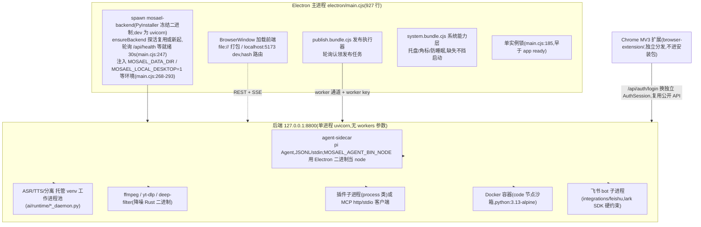

值得强调的拓扑事实(均有代码证据):

- **后端不知道前端的存在**。系统能力层(托盘/角标/防睡眠)的状态是渲染层 TaskCenter 轮询 `/api/jobs` 后**推进去**的,系统层不认识后端(`docs/ARCHITECTURE.md`「状态是推进来的,不是拉出去的」)。
- **worker 通道的信任边界是本地文件**。`app/core/worker_key.py` 启动时铸造每进程随机密钥写入数据目录,三条 worker 路由(`publish_worker` / `job_worker` / `browser_worker`)统一挂 `Depends(require_worker_key)`(`backend/app/main.py:335-338`)。浏览器读不到本地文件,这是真正的信任边界——比"同机"假设精确,也因此 `MOSAEL_WORKER_KEY` 固定后即可跨网络。
- **CORS 是显式枚举而非通配**。`main.py:300-326` 的注释记录了曾被堵上的洞:未鉴权的 publish-worker 通道在通配 CORS 下可被任意网页读回响应。现在 Origin 白名单写死 + `chrome-extension://[a-p]{32}` 正则 + `MOSAEL_CORS_ORIGINS` 扩展。

### 1.3 三段自举与启动装配

`docs/ARCHITECTURE.md` 开头描述的"三段自举"(拉起后端 → 开窗加载前端 → 启动发布执行器)与代码逐行对应,并与后端自己的 `lifespan` 启动序列(`backend/app/main.py:82-131`)拼成完整链路:

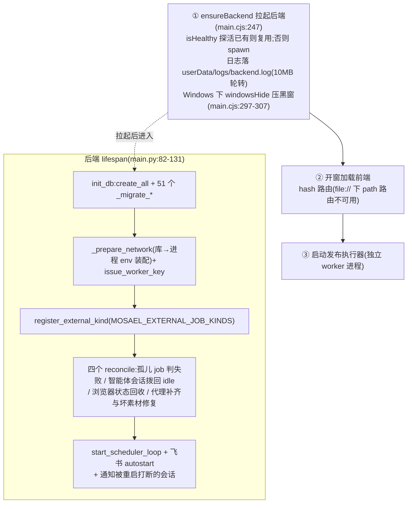

**一个关键架构细节:`_wire_seams()` 在导入期执行,不在 lifespan 里**(`main.py:225-261`)。注释写明了理由:谁实现哪道缝是静态组装事实;放 lifespan 里,TestClient/脚本这类不跑 lifespan 的入口就拿到半装配系统——症状在远离原因处爆发。登记的五条缝全部体现"基础设施不认识领域"的反向依赖:

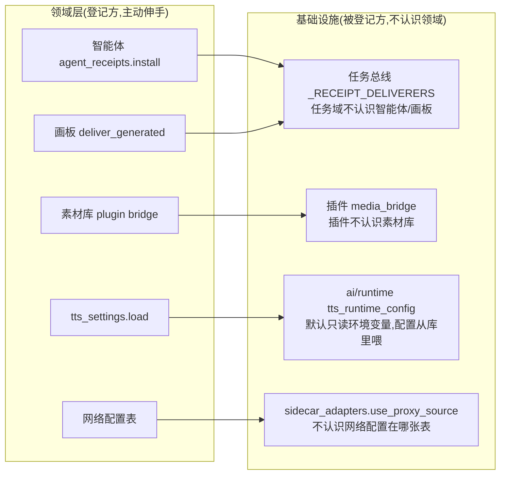

这个组装根模式是 Mosael 依赖方向治理的总开关:**领域在上、基础设施在下,下层绝不 import 上层,跨层全部走注册表回调**。

---

## 2. 核心机制一:任务总线(`backend/app/domain/jobs.py`,766 行)

### 2.1 形态

一切耗时操作收敛为 `jobs` + `task_events` 两张表加这一个模块的接口。前端任务中心只认这两张表,不关心谁在干活。这是全仓最重要的枢纽——导出、转写、生成、工作流、发布、配音、GIF 转换、降噪、分离全部经此。

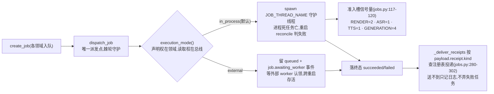

终态机(`TERMINAL_STATUSES = ("succeeded", "failed")`,jobs.py:22)如下:

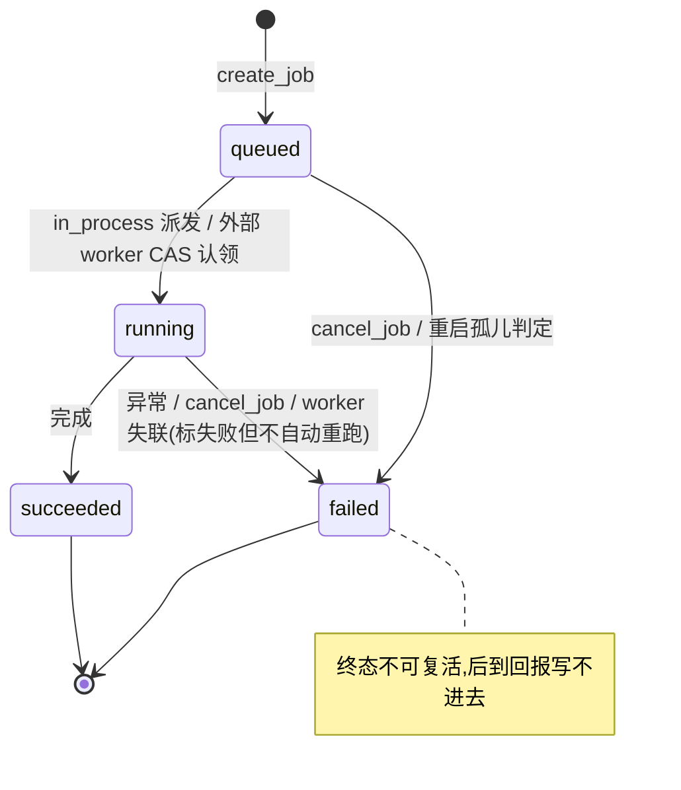

### 2.2 执行模式接缝(jobs.py:323-402)

每种 kind 一个执行模式,声明权在领域(`register_external_kind()` 或 `MOSAEL_EXTERNAL_JOB_KINDS`),读取权在总线(`execution_mode()`):

- `in_process`(默认):`dispatch_job` spawn 名为 `JOB_THREAD_NAME = "job-run"` 的守护线程,进程死任务亡,重启时 `reconcile_orphaned_jobs` 判失败;
- `external`:什么都不做,留在 queued 并落一条 `job.awaiting_worker` 事件,等外部 worker 认领——跨后端重启存活。

代码注释里钉死了一条不变量:**派发点只有 `dispatch_job` 一处**。工作流引擎曾经是唯一裸起 `threading.Thread` 的反例,代价是 external 模式形同虚设 + 测试里 `wait_for_idle_jobs()` 按名字找不到它,`fresh_client()` 在活线程底下 drop_all 炸成 `no such table` 且记在无关用例头上(`engine.py:75-81` 的注释完整记录了这个教训)。现由 `tests/test_jobs_are_dispatched_by_the_bus.py` 守护。

### 2.3 准入槽(jobs.py:117-120)

```python
RENDER_SLOTS = threading.Semaphore(2)
ASR_SLOTS = threading.Semaphore(1)      # torch/funasr: one model in memory at a time
TTS_SLOTS = threading.Semaphore(1)
GENERATION_SLOTS = threading.Semaphore(4)  # mostly waiting on a remote API
```

按 kind 的并发上限防单机 OOM,使用方以 `with RENDER_SLOTS:` 包住执行体(render.py:307、video_gif.py:66、separation.py:152、denoise.py:181、transcription.py:275、voices.py:505)。external 模式下等价于 worker 侧并发容量。槽位数的注释本身就是设计文档:ASR/TTS 是"内存里同时只装得下一个模型",生成是"大部分时间在等远程 API"。

### 2.4 父子任务归属(ADR-0018,jobs.py:23-77)

机制:一个 `_ParentJob` contextvar,两个来源两档强度:

- **strict**(工作流引擎、调度器):父任务已结束就拒绝派生——被取消的工作流不许再开工;
- **derived**(`dispatch_job` 在 `run_as_job` 里设,jobs.py:391-398):父任务刚落终态也照样挂上——导出在收尾时登记产物、顺手排代理转码,那一刻导出已是 succeeded。

关键工程细节:**线程不继承 contextvar**,所以每个起线程的地方都要自己设。这正是 ADR-0018 要修的故障——此前字幕配音逐句建的合成、导出收尾排的代理都成了顶层任务,一次配音弹 15 条完成通知。取消沿 `parent_job_id` 级联。

配套的 `job_catalog.py` 把每种 kind 的界面语义(名字、播报策略 `always/failures/never`、影响的资源、记录页)声明一次,`GET /api/jobs/kinds` 下发;**只有任务中心播报**,发起组件只说"排上了"。棘轮要求 `create_job` 用到的每个 kind 都在目录里、每个 kind 都有图标。

### 2.5 回执机制(jobs.py:60-77, 280-302)

`_current_receipt` contextvar 标记「这次产出属于谁」;job 落终态时 `_deliver_receipts` 按 `payload.receipt.kind` 查 `_RECEIPT_DELIVERERS` 注册表投递(画板的 `deliver_generated`、智能体的对话回执)。两个设计判断值得记录:

1. **用 contextvar 而非给每个 start_* 加参数**——确认卡执行的入口散落各领域,逐个加参意味着"每加一种智能体可触发的任务都要再改一处,而漏掉的那处不会报错";
2. **回执送不到不能把任务弄失败**——产物已在库里,吞掉异常但必须记日志(jobs.py:299-302),否则"智能体不知道任务结束了"会查成玄学问题。

### 2.6 取消语义

`cancel_job()` 把 job 落终态;工作流引擎**在每个节点边界重读 job 状态**决定是否停下——中断是节点粒度的,执行中的单个节点无法安全掐断。进程级取消靠 `jobs._CHILDREN` 的子进程句柄表:没有它,取消只是翻数据库字段,ffmpeg 跑完整段再把取消覆盖成"成功"(jobs.py 头部注释,PROCESS_STATE.md 第二类)。

### 2.7 事件与消息

`emit_job_event()` 是 TaskEvent 的唯一创建点(数据归属规约);任务消息与失败原因**存 i18n key + 参数而非句子**(`say()`/`blame()`),读时按请求方语言翻——用户切语言后历史记录跟着变。终态 job 的事件有保留策略:`TERMINAL_KEEP_EVENTS = 5` + `EVENT_RETENTION_DAYS = 30`(jobs.py:319-320)。

---

## 3. 核心机制二:worker 协议(ADR-0002)

拉取式契约:**claim(CAS 原子认领)→ report(富状态回报)→ heartbeat**;后端从不反向连接 worker。代码形态在 `backend/app/api/routes/job_worker.py`:

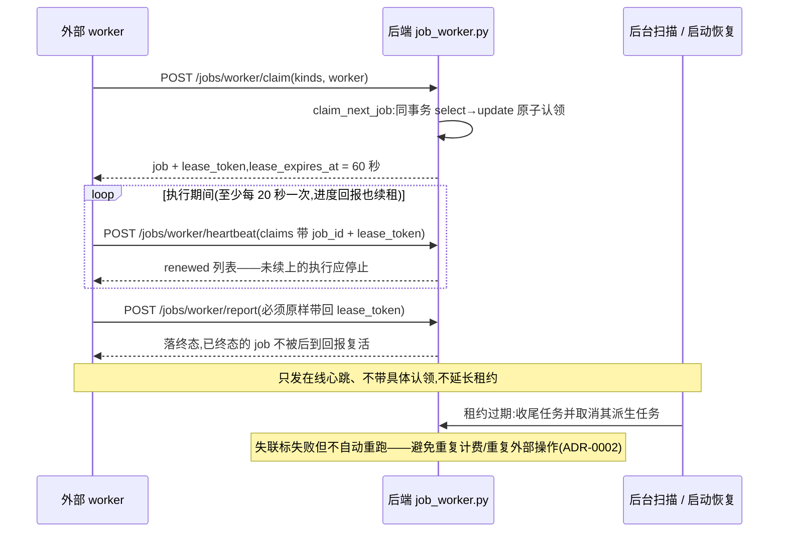

失联处理的三个触发点(后台定时扫描、启动恢复、worker 请求)都已实现;升级前没有租约的旧运行中任务按最后更新时间给 60 秒宽限。

发布执行器因历史契约保留专用通道 `/api/publish/worker/*`(任务粒度是 PublishTask,含账号巡检),语义与通用通道一致;通用 claim 不领取 publish。

这套协议的架构意义:**把渲染挪到 GPU 机器是配置(`MOSAEL_EXTERNAL_JOB_KINDS=render`),不是重构**。它是 ADR-0001"可拆而未拆"承诺的兑现点。

---

## 4. 核心机制三:工作流系统(三接缝 + 不可变修订)

### 4.1 三条接缝

| 接缝 | 位置 | 职责 |
| --- | --- | --- |
| 节点注册表 `NODE_TYPES` | `app/domain/workflows/__init__.py` | 元数据:驱动校验、画布 UI、智能体提示;表单完全由 `config` 声明生成 |
| 执行器注册表 | `executors/`(`__init__.py` 的 `_REGISTRY` + `_PREFIX_REGISTRY`) | 行为:签名 `handler(db, workflow, config) -> dict`,与 NODE_TYPES 一一对应 |
| 引擎 | `executors/../engine.py`(371 行) | 纯 DAG 调度器:拓扑、并行(`MAX_PARALLEL_NODES = 8` 线程池)、条件路由、取消边界、事件与进度。**对具体领域零 import** |

「编辑器不认识任何具体节点」是这条架构的灵魂:加一个节点 = 元数据声明 + 一个执行器,引擎、编辑器、智能体都不动。字段声明表的每一条(`type`/`required`/`advanced`/`options`/`depends_on`/`outputs`/`description`/`allow_custom`/`options_from`)都有棘轮守着,因为共同点是**违反了不会报错**——界面照常渲染,只是安静地少一块能力(`docs/ARCHITECTURE.md` 字段声明表)。实测棘轮包括 `test_node_config_declared.py`、`test_node_outputs_match_the_executor.py`、`test_every_node_type_has_an_icon.py` 等。

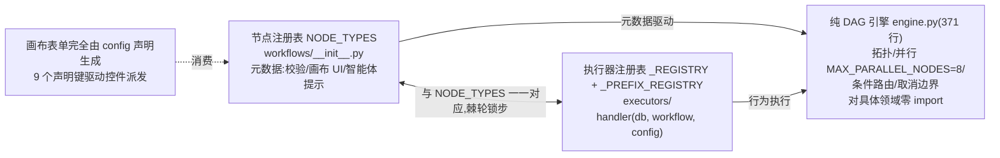

嵌套能力:`subgraph`(内嵌子图)、`call_workflow`(调另一工作流,子 job 收纳 + 级联取消 + 防递归/过深)、`output`(输出契约),子图与循环体跑在同一套引擎上。

### 4.2 工作流修订(`domain/workflows/revisions.py`)

不可变持久快照是执行语义的锚点:

- `Workflow.graph/revision/graph_hash` 只是最新修订的**当前投影**;创建、画布保存、导入、智能体修改、恢复都经 revisions.py 统一 Interface 追加,**相同执行语义不增版**(`_revision_projection` 剥离画布坐标后比对——拖位置不增版);
- **恢复旧版产生新修订,不改写历史**;
- **一次执行在入队时绑定 revision id + graph_hash**(`engine.py:48-61` 的 `pinned_payload`),之后的画布编辑不能改变已排队任务;
- 历史读取窗口 `WORKFLOW_REVISION_HISTORY_LIMIT = 100`,但底层修订永不删——已排队任务经 `workflow_revision_id` 固定在其中一行上。

`graph_digest` 用 canonical JSON(排序键、紧凑分隔符)的 SHA-256,同时校验投影与快照各自没有损坏。

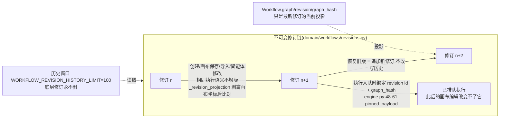

### 4.3 模板版本是另一条轴

官方模板的 `template_version` 在 `graph.meta`,只记录副本来源;模板升级不覆盖用户副本,用户保存不改写模板版本。两条轴混一条会出两类事故:官方更新静默冲掉用户改过的流程,或用户每次保存都假装模板升了一版。

---

## 5. 核心机制四:剪辑内核(sequences/)

### 5.1 操作即事实

`sequences/` + `tracks` + `clips` 是时间线;每次编辑(insert/move/trim/delete/split/cut-range…)校验不变量后落 `sequence_operations` + `sequence_revisions`。撤销/重做拆两层:`history.py` 只管队列(往回找该撤销的那条、能不能重做),**怎么撤销**在 `undo/` 注册表按操作类型成对登记(inverse + forward)。

### 5.2 撤销注册表(`sequences/undo/__init__.py`)

模块 docstring 记录了这个机制换掉的三种实测故障:44 分支 if/elif 阶梯 + 手写 `UNDOABLE_KINDS` 三者不同步时——漏进列表会把更早一条不相干的编辑撤掉(200,无报错,实测);漏进 `_apply_inverse` 按 ⌘Z 才炸;只写逆向重做时炸。现在 `UNDOABLE_KINDS` 由注册表**派生**,一个 kind 要么两个方向都有、要么不在表里;`NOT_UNDOABLE` 只有 undo/redo 两条记账记录并附理由;`tests/test_undo_registry.py` 棘轮守配对。登记方式照 workflows/executors 的 `@undoable("trim_clip")` 装饰器——**同一种注册表模式在全仓复用**,这是 Mosael 架构一致性的一个缩影。

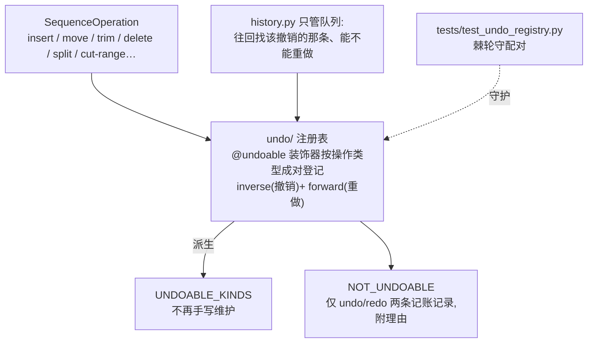

### 5.3 一次手势 = 一条操作

批量动作一律做成一个 `*_batch` SequenceOperation,**先全量校验再落库**——一个非法整批不落。禁止前端循环调单片段操作(删 5 段按 5 次 ⌘Z)和把顺序依赖(波纹删除从后往前)留在前端。这条规约把撤销粒度与**用户感知的动作**对齐,而不是与 API 调用对齐。

### 5.4 逐字稿驱动剪辑

`transcripts/` 把 ASR 结果做 token 级编辑并**投影到时间线**:删句 = 剪源区间。这是"文本式剪辑"产品的内核机制——文稿是时间线的另一张投影,编辑任一侧都落到同一批 sequence operations 上。

---

## 6. 核心机制五:双渲染器与契约语料(ADR-0004)

### 6.1 为什么必然是两套

| | 预览 | 导出 |
| --- | --- | --- |
| 位置 | 浏览器 `CanvasCompositor`(WebCodecs 解 720p 代理 → canvas 2D,**唯一路径,无 `<video>` 兜底**) | 后端 `render_plan.py`(纯函数)+ `render_executor.py` → 单次 ffmpeg |
| 硬约束 | 本地同步 60fps;渲染**未提交**的拖拽草稿 | 无头、跨重启存活、可 external 外派 |

两个约束各自成立 ⇒ "合并成一个渲染器"在结构上不可能。ADR-0004 还记录了对被否方案 Y(canvas 合成导出帧)的完整核算:丢 ffmpeg 独有的 curves/lut3d(OffscreenCanvas 不解析 SVG filter,canvas 2D 无 3D LUT 等价物)、外派能力失效、1080p30 十分钟约 149GB 原始 RGBA 跨进程传输。

### 6.2 一致性按"谁是权威"分层

- **可见层/z 序/base 归属:两侧必须逐字一致**——所有已发生 parity bug 的所在地。`contracts/scene-cases.json` 同时驱动 `frontend/src/features/editor/playback/sceneModel.parity.test.ts` 与 `backend/tests/test_scene_parity.py`。`contracts/README.md` 记录了契约诞生前的两个用户可见事故:上层 video 轨静音导致导出丢整层画面;最底 video 轨为空时两侧对同一片段一个当 overlay 一个提为 base。**"两份实现各自自洽而互不相识"**——这句话是契约机制存在的全部理由。
- **调色:ffmpeg 权威、预览近似**,有意而非缺陷;UI 明示(LUT 选择器下的提示)。
- **文字:两侧同源 CSS**——导出侧 `text_render.TextRasterizer` 用无头 Chromium 加载 app 自己构建的 CSS 与 @font-face 渲成透明 PNG 交给 ffmpeg 叠加;拿不到 Chromium 优雅回落 libass。

### 6.3 契约语料作为机制(contracts/,9 份)

不只是场景:字幕几何与用色、transform、clip 外观、自由元素几何、音频混音、marker 快捷键、**上下文计量**、共享常量——凡"语义只能有一份定义却必然有多份实现"的地方都有一份语料。规约是**改语义先改语料**,看两侧一起红,再改实现;反过来做语料就降级为实现的复读机。`test_scene_parity.py:37` 甚至有一条专门测试断言语料文件存在——"语料找不到就静默跳过是最坏的结果:那样两侧都通过,而契约根本没跑"。

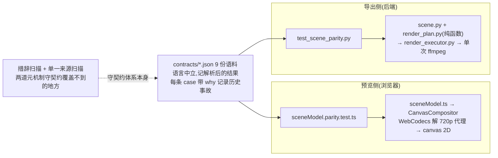

### 6.4 预览失败的处理哲学

预览画不出来时**明说而不是降级**:`previewReadiness.ts` 判定 转码中/生成失败/本机解不动/环境不支持,`PreviewUnavailable` 铺在监视器上;判定只看播放头当前要画的素材。行业惯例(PR/DaVinci)是要精确帧就走真正的导出管线渲一段来看,而不是让两套近似互相追。

---

## 7. 核心机制六:数据归属与表结构演进(ADR-0003 / 0006)

### 7.1 归属规约(`domain/ownership.py`)

每张表归一个领域模块所有,`TABLE_OWNERS` 字典登记「允许创建该模型实例的路径前缀」;行创建只发生在拥有方,跨领域需要新行时调用拥有方的领域函数。AST 棘轮 `tests/test_data_ownership_ratchet.py` 强制:**存量越界冻结在 allowlist 只减不增,新增越界与修复后未删条目都失败**。ADR-0003 否掉了两个替代方案:让调用方直接 import 领域切片(文件布局变公共 interface)/ ORM session 事件运行时校验(测试期零成本能挡住的事不该留到运行时)。

### 7.2 切片 + 统一装配入口

ORM(`app/db/model_slices/`)、API schema(`app/api/schemas/`)、前端 client(`frontend/src/api/domains/`)三侧都按领域切片改善 locality,但调用方只认三个装配入口:`app.db.models` / `app.api.schemas` / `@/api/client`。`test_domain_assembly_entries.py` 与 `clientAssembly.test.ts` 钉住重导出身份和 ORM metadata 注册——防"文件移动成功、统一入口漏装配"这种只在运行期出现的错误。ADR-0003 里"Supersedes"注记诚实记录了转向:单文件 models.py 长到 1k-2k 行后,单文件总览的收益小于定位成本。

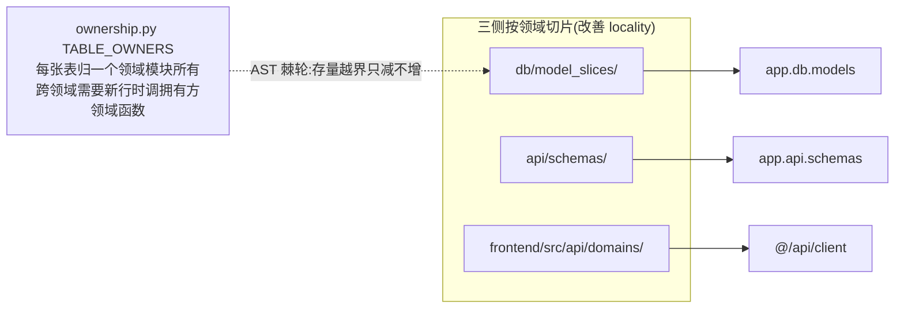

### 7.3 迁移即改写,不留读取期分支(ADR-0006)

运行时**不跑迁移框架**。`init_db()` = `Base.metadata.create_all`(新装机建全表)+ 51 个 `_migrate_*`(已装机补差)。改表 = 改 `model_slices/<domain>.py` **且**加一个 `_migrate_*`,少一步就是"新装机好、老用户崩"。仓库里曾留 30 个从不执行且已漂移的 Alembic 文件,随这条规约一并移除。

- **退休判据**:迁移引入时间早于最早仍支持的 Release(当前 v0.1.0)才可删——它只服务从未公开的 dev 库;删错 = 用户打开看到空工作室。
- **判据是"这份数据归谁"**:我们能改写的(DB、数据目录、插件清单)升级时就地改写,读取代码只认一种形状;改写不了的(导出文件、环境变量、外部报文)才允许在边界上认两种形状、进门就归一。迁移必须幂等;改用户磁盘文件先留 `.bak`。
- **打包路径冒烟**:`test/bundle.smoke.mjs` 用 `test/upgrade_db_fixture.py` 造旧库,真正启动打包后的 Electron,验证冻结后端完成升级并健康、renderer 加载、旧数据正确——覆盖源码单测碰不到的打包路径。

### 7.4 SQLite 与权限基线

SQLite(WAL)+ SQLAlchemy 2.0。工作区资源挂 `workspace_id`:只读入口显式 `ensure_workspace_access`、写入入口显式 `ensure_workspace_perm`——**权限不从 HTTP 方法推断**(曾是 43 条路由靠 ContextVar 按方法推断,已修,`test_write_permission_is_explicit.py` 守着)。非成员统一 404 而非 403,因为 403 等于承认 id 存在(`main.py:170-179` 异常翻译层)。用户级资源(Provider Profile/凭据)按 owner 隔离;实例配置由 `ensure_deployment_admin`(读 `users.is_deployment_admin`,首个引导账号获得,不可自助)守卫。

---

## 8. 核心机制七:智能体架构

### 8.1 进程与协议

智能体 = pi Agent 跑在 agent-sidecar(TypeScript,~2,300 行),后端经 JSONL/stdin 与它通信;后端 `domain/agent/host.py` 管会话、SSE 流(`_streams`)、工具循环编排。后端重启线程即死,所以有 `reconcile_orphaned_agent_sessions()` 启动时统一拨回 idle 并作废残留的确认卡——**否则那张卡还能被点,而它是当场执行工具的**(PROCESS_STATE.md)。

### 8.2 工具注册表:一份定义,多处派生

`backend/mcp_server.py` 是唯一工具定义处(77 个工具);`/api/agent/tools` manifest 派生它,所有 runtime(pi sidecar / MCP 客户端 / 飞书)从 manifest 生成工具。ADR-0016 记录了教训:一份手写第二份的工具表漂移后让智能体悄悄少了 19 个工具。

### 8.3 确认门控与权限三档(ADR-0007)

- 变更工具带 manifest 属性(`confirmation: true`):调用只创建待确认卡,用户批准后才执行;**20/77** 个工具走卡。选择卡(`ask_user`,`awaits_answer`)问"你要哪一个",不能被"本会话始终允许"自动答掉——自动回答等于让模型自己编一个。两种卡到点之后结局相反:确认卡超时 = 动作没发生,抛错;选择卡超时 = 如实回"还没答"并拦住"再问一遍"。
- 三档权限模式(手动/auto/bypass)× 权限档(edit / ai-cost / render-cost / external):auto 下 edit 直接放行,花钱档走"AI 判断",external 永不自动放行。
- **AI 判断必须是隔离的判断者**:单独一次调用,只喂工具名 + 参数 + 用户预写准则,**不喂对话历史、不喂工具返回内容**——判断者看到的内容本身可能就是被注入影响过的。结构化规则先判,AI 只在规则没覆盖处说话且不能翻案。
- **智能体权限恒等式**(ADR-0008 D6):智能体能做的 = 行动人能做的 ∩ 会话授予的档位。上界由 `tests/test_agent_identity_ratchet.py` 钉代码形状(`approve_confirmation` 只能由 `authorize_and_approve` 调),下界跑真实场景(人被移出工作区后,他开着 bypass 的会话做不了决定)。

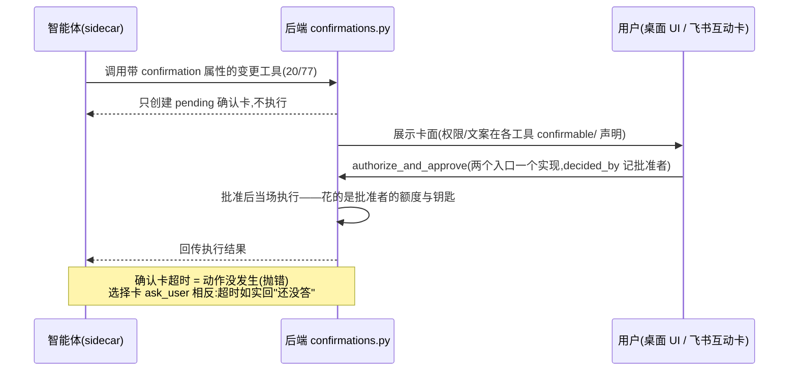

### 8.4 上下文预算与整理(双端一致机制)

- **窗口来自模型**:模型行 `context_window` → 供应商目录 → 回退。**注意:代码已演进为双回退**——云端 128K(`FALLBACK_CONTEXT_WINDOW = 128000`)、本机/LAN 32K(`LOCAL_FALLBACK_CONTEXT_WINDOW = 32000`),按 base_url 的 hostname 判私网;两侧(host.py:1362-1376 与 compaction.ts:60+)同一套规则,由 `contracts/context-meter-cases.json` 钉死。CONTEXT.md 里"保守回退 32000"的表述已落后于代码(见 §13 观察)。
- **用量估算锚定真实 usage**:取最后一条带 usage 的助手消息(input+output),此后新消息按 `CHARS_PER_TOKEN = 3.5` 估——sidecar(compaction.ts:47)与后端(context_meter.py:28)逐字一致。
- **整理发生在两轮之间**,不在 `transformContext`(那个每次 LLM 调用都跑):超窗口 `COMPACT_RATIO = 0.8` 时把早期对话交给模型摘要,保留最近 `KEEP_RECENT = 8` 条;**切点必须回退到一条 user 消息**(否则留下没有 tool_call 的孤儿 tool_result,下一轮 400);摘要失败降级截断但**如实回报**——静默降级会让用户以为上下文还在。

### 8.5 子智能体与智能体互通

- `run_subagent`:同进程另起一个 pi Agent(不另起进程,models/streamFn 已在手上),**只拿只读工具**——确认卡是对用户说的话,发起方是用户看不见的子智能体,这种卡没法批。它解决的是**上下文**问题:中间过程留在子智能体那里,父模型只收结论。派发默认不阻塞(立即返回 `subagent_id`,`wait_subagents` 显式等);没等的报告在回合收尾统一送达,**决不丢**——刻意不做轮中 steering 注入,因为 steering 存在"最后一次取队列之后 settle"的竞态,而 sidecar 是回合级进程,这轮不送就永远没了。存档进工具结果 `details.subagent`(UI 用),**不进 content**——省下父模型上下文正是派子智能体的意义。
- `notify_agent_session`:一个会话给另一个会话发消息,走 `/messages` 原有语义(闲则立即开新一轮、忙则排队);发起方身份取自令牌链上的 `_SESSION_ID`(**不由参数转述,转述可伪造**),来源走结构化字段 `origin_session_id`,任何地方不做信封文案匹配。

---

## 9. 核心机制八:供应商三层与执行面(ADR-0009 / 0010)

### 9.1 连接 / 模型 / 能力默认

三层粒度各异,**混成一层是这块此前所有麻烦的根源**(docs 原话):

| 层 | 表 | 职责 |
| --- | --- | --- |
| 连接 | `provider_profiles` | 端点 + 鉴权方式(api_key/oauth);归创建它的用户(`owner_user_id`) |
| 模型 | `provider_models` | 能力与运行时参数的**唯一挂载点**:`capability_ids`(空则回落 vendor 预设)、`context_window`、`reasoning`/`vision`/`reasoning_effort`/`developer_role`;建行只经 `domain/provider_models.py` 的 `upsert` |
| 能力默认 | `provider_defaults` | 每种能力指向**一行模型**;没有或失效就返回未配置,**不静默替用户挑** |

秘密与连接生命周期分开:`ProviderCredential` 按 `(profile_id, owner_user_id)` 存 API Key/OAuth/密字段/动态模型目录;业务读取只拿 `ResolvedConnection`,`resolve_connection()` 不跨用户回退。早期"一档案一模型 + default_model"迫使**拿模型名当档案名**建一堆档案、同一把 key 重复五遍——三个字段已删,二十来处 `profile.default_model` 收敛到 `provider_models.model_id_for()`。

运行时参数**只下发用户显式设过的键**:`None` 与"显式设成 false"在下游行为不同,带上 None 会让 sidecar 分不清。

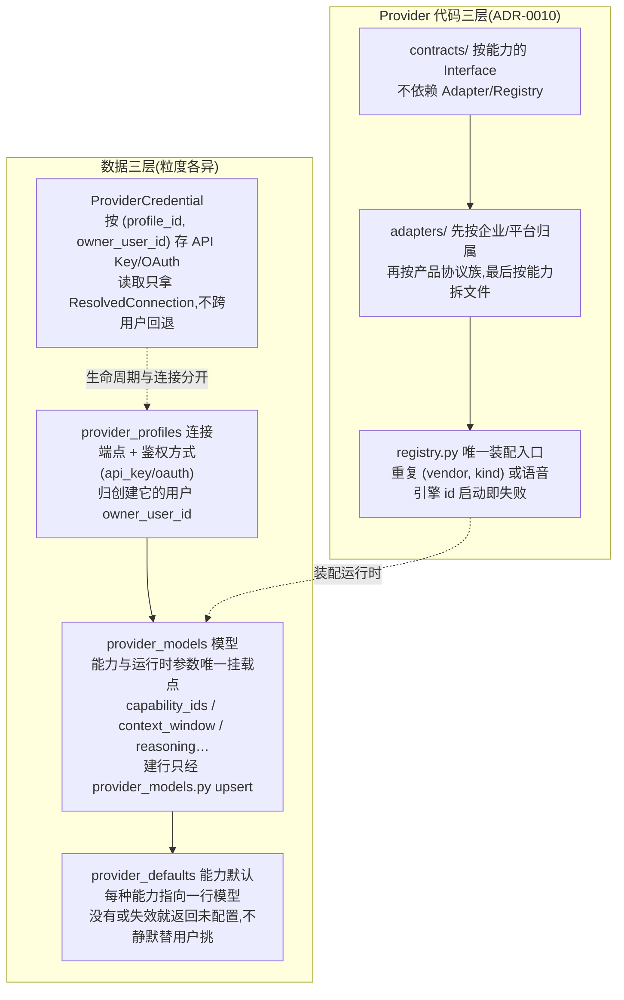

### 9.2 Provider 代码三层(ADR-0010)

`contracts/`(按能力的 Interface,不依赖 Adapter/Registry)→ `adapters/`(先按企业/平台归属,再按产品协议族,最后才按能力拆文件)→ `registry.py`(唯一装配入口,重复 `(vendor, kind)` 或语音引擎 id **启动即失败**)。`app.ai.providers` 是稳定公共门面;架构棘轮验证依赖方向。

校准样例:字节跳动 `bytedance/ark/{image,video}`(方舟)与 `bytedance/volcano/{speech,podcast}`(语音技术控制台)同属一企但凭据、控制台、端点、协议不可互换,所以两套 Adapter、持久化 vendor id 各自独立——**目录路径不充当数据库主键**。阿里云三类能力共享百炼 DashScope 协议,归 `alibaba/dashscope/{image,video,speech}`。Evolink 相反:一份平台协议承载图像+视频多上游引擎,由模型 id 区分(Seedance 2.5 连模式都在 id 里),不按引擎复制 HTTP Adapter。

### 9.3 执行面是与能力正交的第二条轴(ADR-0009)

能力回答"模型会什么",执行面回答"这次调用经哪个 Adapter":

| 调用方 | 执行面 | 语义 |
| --- | --- | --- |
| AI Studio 智能体 | `agent` | 完整 pi Agent:会话、记忆、工具循环、子智能体 |
| 画板写作/工作流 LLM | `automation`(= `direct` + `gateway`) | 无状态单次补全;API Key 连接→后端 direct,OAuth 连接→sidecar gateway |
| 素材分析 | HTTP=`direct`;AI Studio 工具=`automation` | 工具回连从短期令牌绑定的 `agent_session_id` 继承模型,参数不能自报 |

`gateway` 的安全不变量(ADR-0009):不监听端口;不接受调用方任意 `base_url`;OAuth Token 不进浏览器/响应/日志;短期服务令牌绑定凭据主人、补全结束立即撤销(`target_for` 与 `chat` 必须紧邻使用,不能缓存带令牌的 ChatTarget——这个顺序是安全边界);**永远没有智能体工具**。视频在 Gateway 上走采样帧 + 已有转写(pi 单次补全协议没有原生 video block);显式 `native` 明确失败,不暗中改模式。全链**不存在硬编码模型回退**(gpt-4o-mini 之类已清除)。OAuth 刷新动作交给 sidecar 跑 pi 的 `models.getAuth`——自己在 Python 重写六家协议必然漂移;后端只负责**决定什么时候刷**(对话路径、查额度、列档案三处触发,带 5 分钟失败冷却)。

### 9.4 横切:重试、额度、媒体传输、用量台账

- `domain/ai_retry.RetryingClient`(httpx.Client 子类,`send()` 里对 429/5xx/RequestError 指数退避+抖动)是所有 AI 出站调用的统一入口——实测 23 个模块引用(文档写 15,已过时,见 §13);限流对生图/生视频/TTS/向量化一视同仁。
- `domain/provider_quota.py` 六家订阅额度解析器,**只在用户点击时查**(非官方接口,轮询既撞限流又会变成后台一直失败的任务);查不到不抛 5xx——"这家不支持"和"这次没查成"是两种正常结果。
- `ai/providers/media_transfer.py` 统一远程媒体下载:预签名地址不带凭据、跨源重定向丢受信头、流式 `.part` 原子落盘、inline 64MB 上限。
- **用量台账**:`provider_usage_events` + `provider_pricing_rules` + `domain/usage.py`;调用方只上报 provider/model/capability/units/raw_usage,价格估算与幂等写入收敛在台账模块;台账从任务总线、智能体、生成执行器**接收事实,不反向决定业务是否成功**。

---

## 10. 核心机制九:生成能力契约(ADR-0012~0015)

这是全仓 ADR 密度最高的子系统(四份递进),机制链:

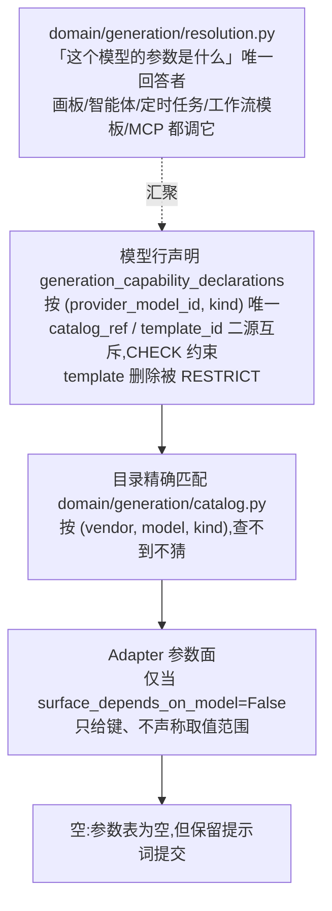

关键设计判断:

1. **"不认识这个模型"和"这个模型真没参数"是两种处境**(`capabilities_known` 区分)——塌成一个,后者就被当成了前者,界面于是安静地什么都不给。
2. **界面不许替目录编值**(ADR-0015 的"第二次修正"):前端曾有的 fabrication 层在"有键无值清单"时编造 `size→["1024x1024"]`、`duration→5` 再取第一项当默认——"我们知道能发哪些键"被偷换成"我们声称这个模型是 720p/16:9/5 秒,而用户一样都没选"。现在未声明的值清单保持为空、未设时长不提交、有键无值渲染为自由输入。不变量从"键必须空"换成"**值必须空**"。
3. **Adapter 参数面的声明由棘轮守住**(`test_adapter_parameter_surface.py`):声明 model-independent 的 Adapter 里新增 `if model ==` 分支就红;面里每一项在用户设置之前都不得出现在请求里。判据的建立靠的是**读 Adapter 源码**("请求是我们自己构造的"),而读出来的性质会静默衰减,所以必须钉进测试。
4. **提交身份是 `(provider_profile_id, model)`**(ADR-0013):同一 vendor+model 可以合法存在于多条连接上(两个中转各代理同一个 Gemini),只带 `(vendor, model)` 的提交要么无歧义解析、要么大声失败——不许随机挑一条连接。
5. **素材角色三条互不相通的路**:首尾帧(决定成片首末格)/ 参考素材(一帧不出现在成片)/ 视频输入(`source_video` 被编辑、`first_clip` 被续写、`driving_audio` 驱动口型);份数上限、互斥组、必填、搭伴、参考图下限、条件时长上限全由描述符声明,数字来自各家接口自己的报错而非文档建议;`SOURCE_ROLE_LABELS/HELP` 只此一份(`test_source_roles_have_one_home.py` 守着)。

`domain/generation/resolution.py` 是"这个模型的参数是什么"的**唯一回答者**:归属检查、启用检查、声明查找、模板花名册、目录回退、已知/未知区分全在一处;画板、智能体、定时任务、工作流模板、MCP 都调它;静态目录是叶子,不向上伸手(分层测试钉住)。

---

## 11. 核心机制十:协作层(ADR-0011)

- **Board revision 乐观并发**:`Board.revision` 是当前投影的并发令牌(不是历史快照号);写入携带 `base_revision`,条件 UPDATE 原子认领并递增;内容未变不递增;冲突返回 409 + 当前修订,客户端重载投影——**不得用一份过期的完整 canvas 静默覆盖队友或异步任务的结果**(这是有真实事故的:stale autosave 把失败任务改回 loading、把异步生成结果推平)。
- **Activity 事件流**:工作区级、追加写、不可变的审计投影;`domain/collaboration.record_activity` 与业务写同一事务发布;`WorkflowRevision.created_by`、`SequenceOperation.actor_id`、`Job.created_by` 投影进同一事件流;**领域历史仍是各自复现/撤销的事实源,Activity 不替代它们**——删 subject 不删审计轨迹。
- **评论/提及/审阅**统一绑定 `(workspace_id, subject_type, subject_id)`;通知只是送达机制不是事实源;审阅决定权在后端,有 pending→approved/changes_requested/cancelled 显式状态机。
- **智能体改画板/工作流走细粒度算子 + 确认卡**(`edit_board`/`edit_workflow`):它表达意图,服务端落到当前画布。让模型吐回整份 canvas 的话,稍复杂的板必然出错(漏项,或推平用户拖好的位置),**而这两种错都不报错**。

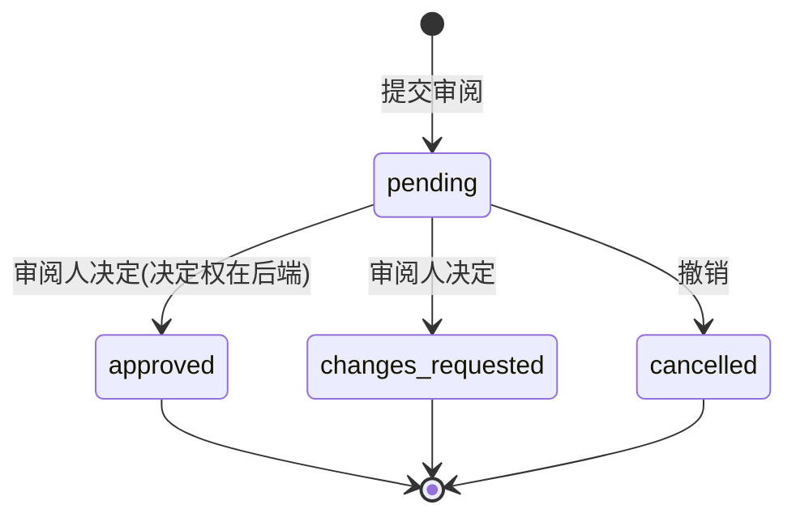

---

## 12. 核心机制十一:沙箱与单进程状态学

### 12.1 code 节点:隔离问题,不是授权问题(ADR-0008 D2)

`app/domain/sandbox`(单文件 `__init__.py`,7.8KB):全平台统一 Docker(`python:3.13-alpine`),无网络、只读根、非 root、禁提权、不挂载宿主机目录;预算 256MiB 内存(=swap)、64 进程、1 CPU、默认 15 秒;stdout/stderr 共享 256KiB 流式预算;每次独立容器,结束/超时/超限强制移除。**无可用隔离后端时 fail closed**——缺镜像或没有资源限制就拒绝执行,编辑保存不受影响。原 macOS `sandbox-exec` 后端因 home 外读取缺口与无硬内存边界被移除;旧的 `PRIVILEGED_NODE_TYPES` / `ensure_graph_node_privileges` 已删,**不得以普通子进程回落**。于是 `code` 节点退回普通内容编辑权限——"谁有资格写 code 节点"被证明是个错问题,正确的问题是"任何人写的代码跑起来能不能伤到别人"。

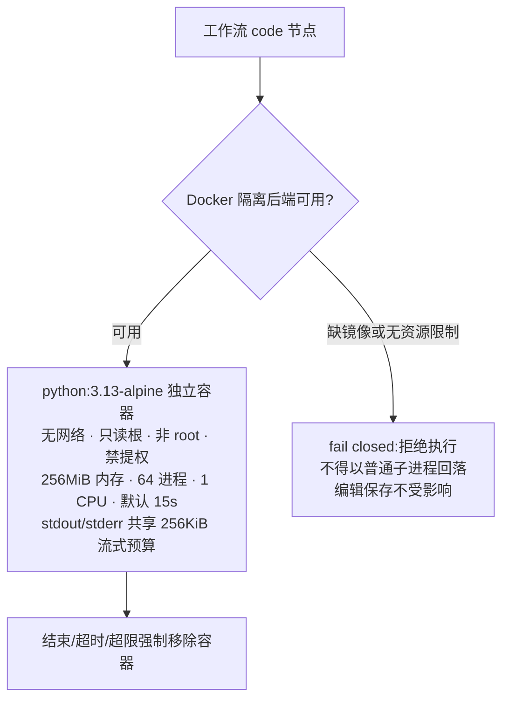

### 12.2 单进程是正确性前提(PROCESS_STATE.md)

`docs/PROCESS_STATE.md` 把散落的模块级可变状态收成一份清单,由 `test_process_state_inventory.py` 棘轮看守(新增模块级可变状态必须登记,否则红)。分四类:

1. **多进程即错**(7 处):provider_auth 令牌刷新租约(两进程同时刷,写回时才发现,后写的赢、先写的 refresh_token 被作废)、worker_key、OAuth `_pending`(回调必须落回发起进程)、publish 认领原子性(注释明写"单进程 SQLite + 单个 worker")、agent/login `_sessions`、Blender 桥互斥锁、限流窗口。
2. **功能只在一个进程在场**(8 处):ASR/TTS 常驻池(第二个进程再养一份、显存翻倍)、agent SSE 流、job 子进程句柄、worker 在线状态、飞书 bot 子进程、调度线程(多进程下同一条定时任务触发多次)。
3. **启动装配快照**(多进程安全,只是每个进程各自装配一次)。
4. **纯缓存去重**(不构成约束,列出来是为了让前三类边界清楚)。

文档末尾给出了"想起第二个后端进程"的正确顺序:**先逐条处理第一类,而不是先换数据库**——换 Postgres 的真正理由只有 publish 认领需要 `SELECT … FOR UPDATE SKIP LOCKED` 行锁,而不是"SQLite 不够大"。这种把扩容路径精确到单条约束的写法,是这份工程文档体系质量的典型样本。

---

## 13. 观察、不一致与风险

分析中发现的事实性问题与值得 captain/总编注意的点:

1. **CONTEXT.md 的上下文窗口回退值已过时**。CONTEXT.md:166 写"保守回退 32000",docs/ARCHITECTURE.md:350 同样只写 32000;但代码已演进为**双回退**(云端 128K / 本机 LAN 32K,`host.py:1362-1376`、`compaction.ts:60+`),且由 `contracts/context-meter-cases.json` 钉住。✅ 已于 2026-09-18 修复:两处文档同步为双档回退口径,ARCHITECTURE.md 中常量位置的二次漂移(pi.ts → compaction.ts)一并修正。
2. **RetryingClient 使用面已扩大**。ARCHITECTURE.md:346 与 CONTEXT.md:279 写"15 个模块",实测直接 import 为 **21** 个模块。方向是对的(更统一了),但文档数字已旧。✅ 已于 2026-09-18 修复:两处同步为实测口径。
3. **ADR-0007 状态标注为"已决定,未实现",但落地文档已存在**。`docs/AGENT_PERMISSION_MODES.md`(363 行)对照代码复验并修正了三处(browser_pool_open 错档、档位不能查静态表、结构化规则先判),且 PERMISSION_MODEL.md §4 已把"三档权限模式下 auto 不放行 external"列为现状。ADR 头部的状态行与正文注记存在张力,读 ADR 必须连同注记一起读——本报告已按落地后口径陈述。✅ 已于 2026-09-18 修复:ADR-0007 状态行改为"已落地"并指向复验文档。
4. **进程内状态是刻意架构,但构成真实的扩容天花板**。PROCESS_STATE.md 第一类 7 处意味着:在解决令牌租约/OAuth pending/publish 行锁之前,后端**无法**水平扩第二进程,无论换什么数据库。团队模式扩容路径已被精确记录(这是优点),但天花板本身值得在总报告中明确。
5. **棘轮测试体系是本项目最有特征的工程机制**。除常规单测外,仓库存在一整层"不变量即测试":数据归属棘轮、进程状态清单棘轮、节点/执行器锁步、字段声明棘轮、撤销配对棘轮、任务派发唯一入口棘轮、Adapter 参数面棘轮、装配入口棘轮、智能体身份恒等式棘轮、契约语料双侧 parity、i18n 键成对、`test_ratchet_docs_in_sync.py`(文档同步棘轮)。它们的共同对象是**违反了不会报错、只会安静退化**的那类规约。这是"规约密度"远超普通项目的根本原因,也是新人(或 AI 协作者)最大的 Leverage 来源。
6. **ADR-0004 对"删除未接线方案"的处理值得作为范式记录**:方案 Y 的未接线代码(OfflineFrameRenderer 等)被明确删除而非保留——"留着一堆有测试、看着像承重、实际零调用且会持续漂移的代码,比删掉更贵",git 历史即存档。
7. **插件与扩展的架构形状**(细节归 t4):包/实例/能力三层、能力默认不暴露(deny-by-default)、节点类型绑包而实例进节点 config(因为工作流要导出到别的机器,实例是本机事实);浏览器扩展是独立分发的受认证外部客户端,不申请 cookies 权限,网页中无可见注入节点。

---

## 14. 架构总评

**形态判断**:Mosael 是教科书级的"模块化单体 + 卫星进程"——它用 ADR-0001 拒绝了微服务的名义,却用 worker 协议、external 执行模式、组装根接缝把"可拆"做成了真实能力。复杂度没有被消灭,而是被**显式化**:每条跨进程边界都有协议文档,每条跨语言语义都有契约语料,每条"会静默退化"的规约都有棘轮测试。

**三个最强的架构决策**(按杠杆排序):

1. **任务总线 + 执行模式接缝**:一个抽象同时承载了取消语义、并发控制、父子归属、播报策略、回执投递和"多机"扩容路径,且领域代码对"由谁跑"无感知。
2. **契约语料机制**:承认了"双实现必然存在"的现实(预览/导出、sidecar/后端),把一致性从"靠纪律同步两份代码"变成"一份语言中立的真相 + 两侧 CI 互相看守"。这是全仓最具迁移价值的模式。
3. **数据归属棘轮 + 统一装配入口**:让"按领域拆文件"和"保持单一口径"两个通常互相矛盾的目标同时成立——切片改善 locality,棘轮守住真正的写入 seam。

**两个最深的设计哲学**(贯穿全部 18 份 ADR):

- **诚实优先于完备**:"不认识这个模型"必须说得出来(生成契约),"画不出来"必须明说(预览),"查不到额度"不抛 5xx,"摘要失败降级截断也要如实回报"。所有"静默"都被视为 bug 的一种形态——ADR-0013 甚至为此推翻了自己上一份 ADR 已接受的后果(dangling ref)。
- **授权不能补隔离的缺口**:code 节点从"特权角色止血"演进到 Docker 沙箱 fail closed;确认卡隔离 AI 判断者;OAuth Token 永不出 Gateway。安全边界都画在机制上,而不是画在"我们约定不这么做"上。

**主要风险面**:单进程正确性约束(§13.4)是团队模式的真实天花板;TTS/ASR/分离三个托管 venv 是持续的安装面维护成本(ADR-0016 已自知);契约语料覆盖不到的跨端语义(如画板六态生命周期)仍依赖文档级规约,存在静默漂移空间。

---

## 附:关键文件索引(供下游任务引用)

| 主题 | 文件 |
| --- | --- |
| 任务总线 | `backend/app/domain/jobs.py`、`backend/app/api/routes/job_worker.py`、`backend/app/domain/job_catalog.py` |
| 工作流 | `backend/app/domain/workflows/{__init__,engine,revisions,binding,field_options}.py`、`executors/` |
| 剪辑内核 | `backend/app/domain/sequences/{operations,history}.py`、`undo/` |
| 渲染双实现 | `backend/app/media/{scene,render_plan,render_executor,text_render}.py`、`frontend/src/features/editor/playback/` |
| 契约语料 | `contracts/*.json` + `backend/tests/test_*_parity.py` + `frontend/src/**/*.parity.test.ts` |
| 组装根 | `backend/app/main.py`(`_wire_seams`、`lifespan`、CORS、异常翻译) |
| Electron 壳 | `electron/main.cjs`、`electron/system/*.ts`、`electron/publish/` |
| 智能体 | `backend/app/domain/agent/host.py`、`agent-sidecar/src/{pi,compaction,subagent,tools}.ts`、`backend/mcp_server.py` |
| 供应商 | `backend/app/ai/providers/{contracts,adapters,registry.py,media_transfer.py}`、`backend/app/domain/provider_*.py` |
| 生成契约 | `backend/app/domain/generation/{catalog,resolution,custom_profiles,operations,runner}.py` |
| 数据演进 | `backend/app/db/migrations.py`、`backend/app/domain/ownership.py`、`test/bundle.smoke.mjs` |
| 状态清单 | `docs/PROCESS_STATE.md` + `backend/tests/test_process_state_inventory.py` |
| 沙箱 | `backend/app/domain/sandbox/__init__.py`、`tests/test_sandbox.py` |
