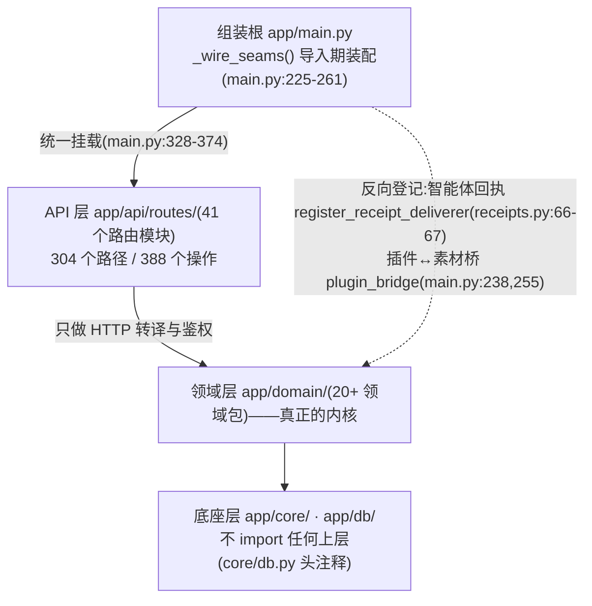
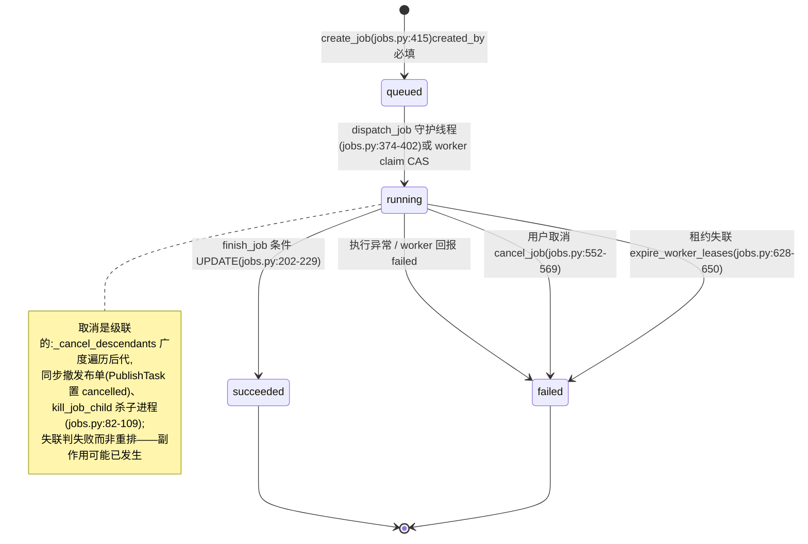
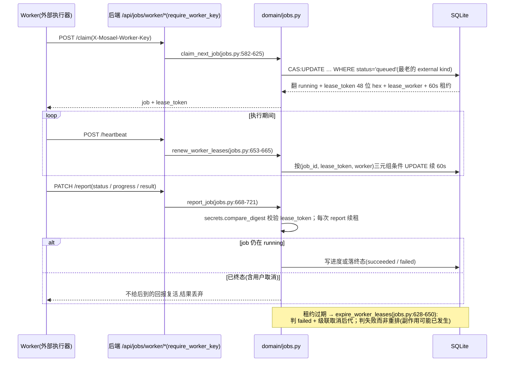
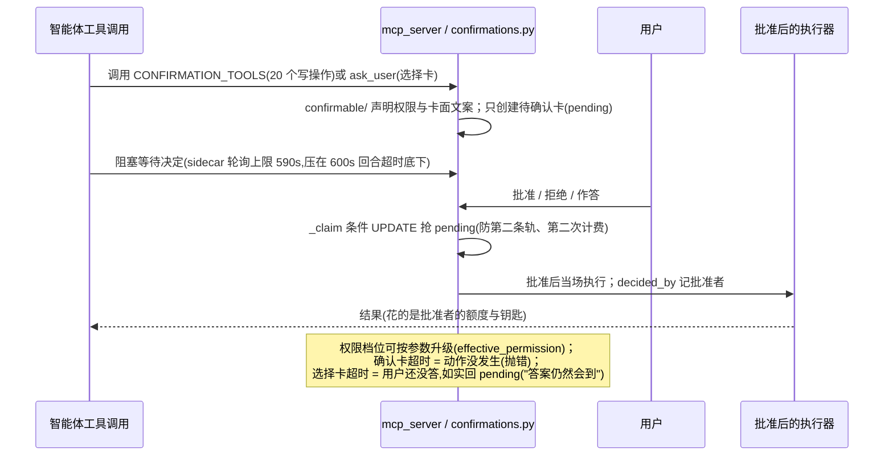
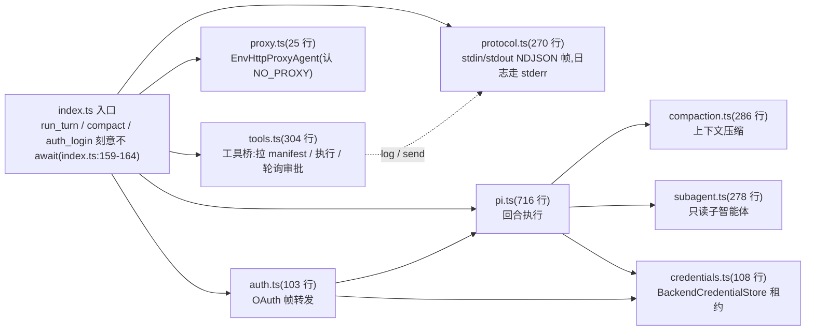
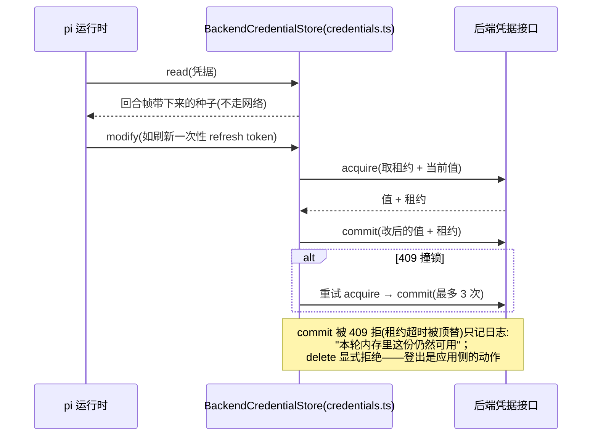
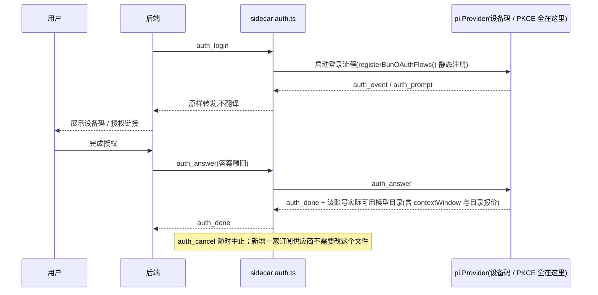

# Mosael 后端与 agent-sidecar 深度分析

> 分析对象:`backend/`(FastAPI 事实源,348 个 Python 文件,`backend/tests/` 374 个测试文件)与 `agent-sidecar/`(Node/TypeScript 智能体卫星进程,9 个源文件约 2351 行)。
> 依据:`CONTEXT.md`、`docs/ARCHITECTURE.md`、`docs/adr/`(18 份 ADR)与源码逐文件核对;所有论断均给出文件路径与代码证据。

---

## 1. 后端整体分层与启动装配

### 1.1 分层骨架

`backend/app/` 严格分为四层,依赖方向自上而下:

| 层 | 位置 | 职责 | 证据 |
| --- | --- | --- | --- |
| 组装根 | `app/main.py` | 唯一的"谁实现谁"装配点 | `_wire_seams()`(`app/main.py:225-261`)在**导入期**登记全部接缝:智能体回执、插件↔素材桥、画板回执、TTS 配置源、sidecar 代理源 |
| API 层 | `app/api/routes/`(41 个路由模块) | 只做 HTTP 转译与鉴权,不含业务规则 | `main.py:328-374` 统一挂载;`openapi.json` 实测 **304 个路径、388 个操作** |
| 领域层 | `app/domain/`(20+ 领域包) | 真正的内核 | `docs/ARCHITECTURE.md:46`:"`backend/app/domain/` 是真正的内核,`api/routes/` 只做 HTTP 转译与鉴权" |
| 底座层 | `app/core/`、`app/db/` | 引擎、会话、安全、子进程;**不 import 任何上层** | `app/core/db.py` 头注释:"`app/core` 是最底层——谁都可以 import 它,它不 import 任何人。所以这里**不放迁移**" |



关键设计:**组装根 `_wire_seams()` 在导入期执行而非 lifespan**(`app/main.py:225`):
> "放在 lifespan 里的话,任何不跑 lifespan 的入口(TestClient、脚本、worker)拿到的就是一个半装配的系统——而症状是运行到某一行才抛'没有装配',离原因很远。"

反向依赖一律经注册表反向登记:任务域不认识智能体,是智能体在 `main.py` 里把自己登记进 `register_receipt_deliverer`(`app/domain/agent/receipts.py:66-67`);插件不认识素材库,由 `domain/assets/plugin_bridge` 登记(`main.py:238,255`)。

### 1.2 启动序列(lifespan)

`app/main.py:81-131` 的 `lifespan` 做了七件事,顺序有讲究:

1. `configure_logging()` —— 先配日志,后续步骤才可追溯;
2. `init_db()` —— `create_all`(新装机)+ 一串 `_migrate_*`(老机补差),详见 §3.3;
3. `_prepare_network()` —— 把库里的出站代理/重试次数装进进程环境(`main.py:134-160`),明确注释"**这不是迁移,是启动装配**";
4. `issue_worker_key()` —— 在任何请求到达前铸造 worker 共享密钥(§9.2);
5. `register_external_kind()` —— 先登记 external 执行模式,**再做孤儿任务 reconcile**,否则 external 任务会被误判失败(`main.py:92-97` 注释);
6. 五类 reconcile:孤儿 job 判失败(`reconcile_orphaned_jobs`)、卡在 running 的智能体会话拨回 idle(`reconcile_orphaned_agent_sessions`)、浏览器状态回收、代理视频补转码、坏素材修复(`main.py:98-109`);
7. 启动调度器循环与飞书 bot 自启(含"被重启打断的飞书会话补发中断说明",`main.py:115-125`)。

### 1.3 进程形态

- 开发:`uvicorn`;打包:PyInstaller 冻结二进制 `mosael-backend`(`run_backend.py`,仅绑定 127.0.0.1:8800)。
- 由 Electron 壳 spawn,壳轮询 `/api/health` 等就绪(30s 超时);已有健康实例则复用(`docs/ARCHITECTURE.md:7-8`)。
- FastAPI app 由 `create_app()` 构建(`main.py:264`),挂载顺序即信任分级:health/auth/oauth/hooks 免鉴权;三个 worker 路由挂 `require_worker_key`;其余 30+ 路由全部挂 `get_current_user`(`main.py:335-374`)。

---

## 2. 配置体系与数据目录

### 2.1 `MOSAEL_` 环境变量前缀

`app/core/config.py` 用 pydantic-settings,`ENV_PREFIX = "MOSAEL_"`(`config.py:9`)。全部配置集中在一个 `Settings` 类:数据目录(`MOSAEL_DATA_DIR`,默认 `~/.mosael`)、端口(8800)、`external_job_kinds`(执行模式开关)、`cors_origins`(服务器部署追加来源,**显式拒绝 `*`**)、ffmpeg/ffprobe 路径、代理转码/硬件编码/文字栅格化开关、ASR/TTS 解释器路径等。

两条值得注意的规约:

- **版本号唯一真相在根 `package.json`**,由 Electron 壳经 `MOSAEL_APP_VERSION` 传入;`app_version()`(`config.py:138-159`)回落读仓库 package.json,注释记录了漂移事故:"后端自己维护第二个版本号必然漂移——智能体的能力面板此前就一直显示 pyproject 里那个从未跟着发版更新过的 0.1.0"。
- **「允许自助注册」从环境变量搬进了库**(`DeploymentConfig`),`MOSAEL_OPEN_REGISTRATION` 只在首次迁移时播种一次(`config.py:27-29`)。

凭据周期常量也住在这里而不是 `core/security`(`config.py:162-170`),注释解释了原因:避免 `db ⇄ security ⇄ models` 的循环 import(分层棘轮会红)。`LOGIN_SESSION_TTL=30天`(活跃续期),`SERVICE_SESSION_TTL=30分钟`(对话轮次/工具通道用)。

### 2.2 `~/.mosael/` 数据目录布局

由代码可还原的布局:

| 路径 | 内容 | 证据 |
| --- | --- | --- |
| `mosael.db` | SQLite 主库(WAL) | `config.py:118-124` |
| `secret.key` | 落盘加密主密钥,0600 | `core/secrets_at_rest.py:36,52-56` |
| `publish-worker.key` | worker 共享密钥,0600 | `core/worker_key.py:35,39-41` |
| `media/` | 素材文件(file_key 相对此目录) | `config.py:126-128`、`media/paths.resolve_key` |
| `plugins/` | 已安装插件 | `config.py:130-132` |
| `logs/` | 子进程完整输出(装依赖/下权重) | `core/run_log.py`(ARCHITECTURE.md:65) |
| `tts/venv` | 托管的 TTS/克隆虚拟环境(按需装 2.5–3.5GB) | ARCHITECTURE.md:222-224 |

---

## 3. 数据层:SQLite + SQLAlchemy 2.0

### 3.1 引擎底座

`app/core/db.py`:`create_engine(sqlite:///…, check_same_thread=False)`,连接事件里固定三条 pragma:`foreign_keys=ON`、`journal_mode=WAL`、`busy_timeout=5000`。`SessionLocal` 用 `autoflush=False, autocommit=False, expire_on_commit=False`。所有"现在"统一走 `models.now()`(naive UTC,`app/db/model_base.py`),`jobs.py:310` 注释:"`models_now` 是这个仓库里「现在」的唯一写法"。

### 3.2 模型组织:统一装配入口 + 按域切片

- `app/db/models.py`(1283 行)是尚未切片表的居所;已切片领域在 `app/db/model_slices/`(boards / browser / collaboration / jobs / notes / notifications / publish / scenes / scheduler / workflows 共 10 个)。
- **切片不是公共接口**:调用方只从 `app.db.models` 导入;`tests/test_domain_assembly_entries.py` 钉住重导出身份,防"文件移动成功、统一入口漏装配"(CONTEXT.md:196-197)。
- 密钥列用自定义列类型 `EncryptedText`/`EncryptedJSON`(`app/core/secrets_at_rest.py`),加密挂在列类型上,"领域代码一行都不用改——也就没有'这里记得解密、那里忘了'的可能"。登记在案的加密列 6 组(`provider_credentials` 三列、`plugin_credentials.value`、`feishu_bots.app_secret`、`publish_accounts.config`),由 `tests/test_secrets_at_rest.py` 棘轮守护:新增秘密列忘了加密,测试直接红。
- 主密钥**不放在库里**:优先 `MOSAEL_SECRET_KEY`(服务端 systemd/docker secret;桌面版由 Electron 从系统钥匙串取出传入),兜底 `<数据目录>/secret.key`(0600)。注释如实声明边界:"挡不住'整个数据目录被拷走';这是如实的降级,不是等价方案"(`secrets_at_rest.py:23-30`)。

### 3.3 表结构演进:**不跑迁移框架**

`init_db()` = `Base.metadata.create_all` + `app/db/migrations.py`(2059 行)里 **51 个 `_migrate_*` 函数**按需补差(加列/改外键/回填/加密迁移/哈希会话令牌等)。规约(CONTEXT.md:137-149):

- 改表 = 改 `model_slices/*.py` **且** 加一个 `_migrate_*`,少一步就是"新装机好、老用户崩";
- Alembic 已整体移除——"30 个迁移文件从不被执行,且自 2026-07-23 起与 models.py 漂移(模型改 6 次、迁移 0 次)"(ARCHITECTURE.md:184-185);
- 迁移退休判据:引入时间早于最早仍支持的 Release(当前 v0.1.0)才可删(ADR-0006);
- 发版 CI 的 `test/bundle.smoke.mjs` 用 `test/upgrade_db_fixture.py` 造旧库、真正启动打包 Electron 验证升级路径,不是只检查产物存在。

### 3.4 数据归属棘轮

`app/domain/ownership.py` 的 `TABLE_OWNERS` 字典把约 70 张表逐一登记到唯一拥有方路径前缀:"表的行创建只能发生在拥有它的领域模块里;跨领域需要新行时,调用拥有方的领域函数,不直接 `Model(...)`"。例如 `Job`/`TaskEvent` 只属于 `app/domain/jobs.py`,`AuthSession` 只属于 `auth.py` + `core/`。`tests/test_data_ownership_ratchet.py` 执行"存量越界冻结在 allowlist 只减不增,新增越界直接失败"(ADR-0003)。路由层与测试豁免("路由是薄转译,测试要造数据",`ownership.py:116-117`)。

---

## 4. 任务总线(`app/domain/jobs.py`,766 行)——后端的心脏

### 4.1 模型与不变量

一切耗时操作收敛为 `jobs` + `task_events` 两张表。`create_job`(`jobs.py:415`)的 `created_by` 是**必填关键字**:"漏掉的那个调用点会安静地建出一个无主任务,然后在运行时退回'随便找一把钥匙'"。任务消息走 `say()`(`jobs.py:148`):同时写 i18n key、参数、和缺省语言渲染的 message 三样——"落库的那句话不该冻住语言"。

### 4.2 父子任务与级联取消(ADR-0018)

`_current_parent_job` contextvar 两档强度(`jobs.py:24-47`):**strict**(工作流引擎/调度器,父任务结束即拒绝派生)与 **derived**(任务执行体,父任务刚落终态也照样挂——"导出在收尾时登记产物、顺手排代理转码,那一刻导出已经是 succeeded")。用 contextvar 而非穿参的理由写明:"派生任务的入口散落各领域,都汇聚到 create_job,在此一处捕获"。`cancel_job`(`jobs.py:552-569`)广度遍历后代级联取消,并同步撤发布单、杀子进程。

### 4.3 取消语义是节点粒度的 + 真的杀进程

- 工作流引擎在每个节点边界重读 job 状态(`engine.py:170-175` 的 `is_cancelled()`);"执行中的单个节点无法安全掐断"。
- 但子进程真的会被杀:`register_job_child`/`kill_job_child`(`jobs.py:82-109`)把 ffmpeg/ASR 子进程挂在 job 上。注释记录了没有它时的事故:"cancel 只翻了一行数据库:ffmpeg 跑完、烧掉用户要求停掉的 CPU,然后 worker 把取消覆盖成 succeeded——被取消的导出又出现在素材库里"。

### 4.4 准入槽(Admission Slots)

进程内信号量(`jobs.py:117-120`):`RENDER_SLOTS=2`、`ASR_SLOTS=1`(torch/funasr 一次一个模型)、`TTS_SLOTS=1`、`GENERATION_SLOTS=4`(多在等远端 API)。注释:"10 个并发导出 = 10 个 x264 + 80 个 ffprobe,笔记本几乎必然 OOM。Acquire 要在开数据库会话**之前**——睡着的线程便宜,钉住的连接不便宜。"

### 4.5 终态写入的并发防护

`finish_job`(`jobs.py:202-229`)+ `lock_active_job`(`jobs.py:183-199`)用条件 UPDATE 消除"refresh→commit 之间取消被覆盖"的竞态;且**先看手里这份再 refresh**:"只 refresh 的话,本次事务里还没提交的终态会被库里的旧值冲掉——同一个 job 连着 finish 两次都返回 True,回执发两封"。

### 4.6 回执(receipt)机制——挂在状态跳变上,不挂在函数上

SQLAlchemy 事件监听 `after_flush` 记录"从非终态进终态"的 job(`jobs.py:250-269`),`after_commit` 用**新 session** 投递(`jobs.py:272-302`)。设计动机写在注释里:"回执最初挂在 finish_job 里,而全仓库只有 render.py 走它——生成、发布、配音全是直接 `job.status = ...`。于是回执挂在了一条几乎没人走的路上"。投递失败只记日志不让任务失败:"活儿已经干完了,产物已经在库里"。

### 4.7 执行模式接缝:in_process / external

`_EXECUTION_MODES` 注册表(`jobs.py:335-347`):`in_process`(默认,守护线程,进程死任务亡,重启 reconcile 判失败)或 `external`(留在 queued 等外部 worker 认领,跨重启存活)。`dispatch_job`(`jobs.py:374-402`)是**唯一派发点**——`JOB_THREAD_NAME = "job-run"` 由 `tests/test_jobs_are_dispatched_by_the_bus.py` 守着:"这句话曾经有 4 个反例(workflow/proxy/video_to_gif/trim 各自裸起线程)"。`MOSAEL_EXTERNAL_JOB_KINDS=render` 即可把渲染挪到独立 worker 机器,领域代码不改——CONTEXT.md 称这是"多机的接缝,不是新架构"。

job 状态机的全貌(job 只有 `succeeded`/`failed` 两个终态,`TERMINAL_STATUSES` 见 `jobs.py:22`;用户取消落 `failed` + `job.cancelled` 事件,`jobs.py:516-533`):



### 4.8 事件保留策略

`prune_task_events`(`jobs.py:724-754`):终态任务只留最近 5 条事件,30 天后清空;**workflow kind 例外保留完整事件**——"通用的'只留最后 5 条'会稳定地裁掉前半程,让失败运行看起来只执行了最后一个报错节点"。挂在调度器循环上每 6 小时跑一次(`workers/scheduler.py:45-59`)。

---

## 5. worker 协议:claim / report / heartbeat(ADR-0002)

### 5.1 通用 job worker 通道

拉取式契约,后端从不反向连接 worker:

- `POST /api/jobs/worker/claim` → `claim_next_job`(`jobs.py:582-625`):选最老 queued 的 external kind job,**CAS 原子翻 running**(`UPDATE … WHERE status='queued'`),同时铸造 48 位 hex 的 `lease_token`、记 `lease_worker`、设 60 秒租约。只允许认领 external kind——"in_process 的 kind 已有线程在跑,被外部 worker 抢走会双跑"。
- `PATCH /api/jobs/worker/report` → `report_job`(`jobs.py:668-721`):校验 `secrets.compare_digest(lease_token)`;每次 report 续租约;**已终态(含用户取消)的 job 不给后到的回报复活**——"worker 是在为一个已经不存在的意图干活,结果只能丢弃"。
- `POST /api/jobs/worker/heartbeat` → `renew_worker_leases`(`jobs.py:653-665`):按 `(job_id, lease_token, worker)` 三元组条件 UPDATE 续期。
- `expire_worker_leases`(`jobs.py:628-650`):租约过期的判 failed + 级联取消后代,**"never automatically repeat a potentially billable side effect"**——判失败而非重排,因为副作用(渲染/发布)可能已经发生。



### 5.2 发布执行器(历史契约)

publish 因任务粒度是 `PublishTask` 仍走 `/api/publish/worker/*`(`app/domain/publish/worker.py`)。要点:同账号任务必须串行(共享一个登录视图),claim 支持 `exclude_accounts`;`reclaim_orphaned_running` 双判据自愈悬挂任务——判据 1(账号不在 worker 当前集合)**只用于自己认领的任务**,注释记录了反例:"两个执行器会互相把对方正在跑的任务标成中断";判据 2(30 分钟无回报)是全局兜底。置 failed 而非重排:"可能其实已发布,重排会造成重复投稿"。

### 5.3 鉴权:worker key

`app/core/worker_key.py`:启动时铸造 32 字节随机密钥,以 0600 写入数据目录;自定义 header `X-Mosael-Worker-Key`("custom header 强制 CORS preflight,跨域页面过不去")。设计论证完整写在文件头:"127.0.0.1 不是浏览器尊重的边界:任何页面都能 POST 到 8800……真正区分 worker 与网页的是 worker 能读本地文件"。`MOSAEL_WORKER_KEY` 环境变量覆盖,供"执行器和后端不在同一台机器"的服务器拓扑;并明确拒绝"用用户会话换 worker 令牌"的方案——那是提权不是认证(`worker_key.py:51-54`)。

---

## 6. 工作流子系统

### 6.1 三层结构

- **节点注册表** `NODE_TYPES`(元数据:驱动校验、画布 UI、智能体提示;字段声明完全生成表单,ARCHITECTURE.md:134-160 详列 9 个声明键);
- **执行器注册表** `executors/`(行为:每种节点一个 `handler(db, workflow, config) -> dict`,与 NODE_TYPES 一一对应,锁步测试钉死);
- **引擎** `engine.py`(371 行):纯 DAG 调度器,"对具体领域零 import"。

### 6.2 引擎语义(`domain/workflows/engine.py`)

- 线程池并行(`MAX_PARALLEL_NODES=8`),前驱全完成的节点即调度,独立分支**同时**跑;**而同时能占几条数据库连接由另一个数说了算**(`NODE_CONNECTIONS`,从 `core/db.pool_capacity()` 减去给 HTTP/任务总线的预留算出来)。两者不是一回事:并行度嵌套时会相乘(8 × 循环体 4 × 嵌套 8),连接预算是模块级的一份,子图和父图从同一份里取,所以乘积进不来。等待子任务的节点(`wait_for_job(..., release=db)`)在等待期间把会话和预算一起交还 —— 不还就是死锁:一群等着的父节点占满预算,而它们等的正是子图里取不到预算的节点。见 `test_nested_graphs_stay_inside_the_pool.py`;
- **条件路由**:有控制边时只看控制边,数据边不决定"该不该跑"(`engine.py:195-201` 注释记录了教训:"一个挂在条件分支'真'出口上的节点,只要另有一条数据边从别处取值,分支为假时也照跑");未被活跃入边触达的节点整段跳过(Dify 语义);
- 每节点独立 DB session(`engine.py:232`:"每节点独立 session(非线程安全)");线程池新线程显式恢复父任务 contextvar(`set_parent_job`,engine.py:230);
- 任一节点失败即整流失败;取消时给未跑节点补发 `workflow.node.failed` 事件;
- 配置插值 `interpolate_node_config` 对每个字符串值做 `{{}}` 替换,数据边 `apply_data_edges` 绑定。

### 6.3 不可变修订(WorkflowRevision)

`start_workflow_job`(`engine.py:42-83`)把 `revision.id/revision/graph_hash` 钉进 job payload——"之后的画布编辑不能改变已排队任务"。创建/画布保存/导入/智能体修改/恢复都经 `revisions.py` 统一追加修订,相同内容不增版;恢复旧版产生新修订,不改写历史(CONTEXT.md:66-70)。引擎曾经裸起线程绕开总线,现已收编进 `dispatch_job`(`engine.py:75-82` 注释记录了双重代价:执行模式形同虚设 + 测试线程收编问题)。

### 6.4 代码节点隔离:fail closed

`app/domain/sandbox/__init__.py`(173 行):用户代码只跑在 Docker 容器里——`--network=none`、`--read-only`、非 root(65534)、`--memory 256m`、`--pids-limit 64`、`--cpus 1`、`--cap-drop ALL`、`no-new-privileges`,显式清空 Docker 客户端会隐式注入的代理环境变量(`sandbox/__init__.py:114-116`:"Docker implicitly injects proxies from the host CLI config, including credentials")。镜像固定 `python:3.13-alpine`,"不自己烤镜像是因为「沙箱里有什么库」应该是一个能看懂、能复现的事实"。超时 15s,输出上限 256KiB(`run_bounded` 并发收集 + 超限即杀)。**无可用隔离后端时拒绝执行**(`SandboxUnavailable`);原 macOS 原生策略因"home 外文件读取与资源约束缺口"已删除;旧的 `PRIVILEGED_NODE_TYPES`/`ensure_graph_node_privileges` 已删,不得以普通子进程回落(ADR-0008 D2)。

---

## 7. 剪辑内核(`domain/sequences/`)

- `operations.py`(1836 行):insert/move/trim/delete/split/cut-range 等,**一次手势 = 一条 `SequenceOperation`**——多选删除/移动做成一个 `*_batch` 操作,"先全量校验再落库:一个非法就整批不落"(CONTEXT.md:86-90);
- 撤销/重做两层分离:`history.py` 只管队列(找该撤销的那条、能不能重做),**怎么撤销**在 `undo/` 注册表按操作类型成对登记(逆向+正向),`UNDOABLE_KINDS` 由注册表派生。注释记录了手写清单的恶性 bug(`history.py:21-26`):"两边不同步时……用户按一次 ⌘Z,消失的是他没打算撤销的东西"。`_latest_undoable` 刻意**不按 kind 过滤**:未登记逆操作的编辑会被选中然后明确报错,"宁可告诉用户「这个操作撤不了」,也不能替他撤掉别的东西"(`history.py:83-89`);
- 每次操作校验不变量并落 `sequence_operations` + `sequence_revisions`;撤销之后再编辑,重做栈按 revision 顺序失效。

## 8. 导出渲染与场景模型(`app/media/`)

- `scene.py`(119 行):"t 时刻画面上有哪些层、按什么 z 序、谁是 base"。与前端 `sceneModel.ts` 是**有且仅有的两份实现**,由 `contracts/scene-cases.json` 契约语料钉死——两侧测试各跑同一份语料,任一侧单方面改语义两边 CI 一起红(ADR-0004)。文件头记录了诞生前的两个方向相反的 bug:上层 video 轨静音导出丢整层("轨道头是喇叭图标,语义是音频,预览对")、最底空轨时导出把上层提为 base。
- 语义细节:base = 最底"有画面片段"的 video 轨,按 fill_mode 取景;overlay 一律 cover 且**不排除静音轨**;区间取 `[start, end)` 避免切换帧画两层;`audible_tracks` 与画面分开——"静音只关音频,画面照旧"。
- `render_plan.py`(纯函数 序列→RenderPlan)+ `render_executor.py`(单次 ffmpeg);文字由 `text_render.TextRasterizer` 用无头 Chromium 按 app 自己构建的 CSS 渲成透明 PNG 再由 ffmpeg 叠加(拿不到 Chromium 优雅回落 libass);硬件编码探测优先 VideoToolbox/NVENC 等,回落 libx264(`config.py:94-98`)。

## 9. 安全设计

### 9.1 认证与会话

- Bearer token,无 cookie;`AuthSession` 表存 `token_digest`(哈希,`_migrate_hash_session_tokens` 回填),"取凭据只此一处"(`security.py:53-55`)。密码 PBKDF2-SHA256,24 万次迭代(`security.py:29-45`)。
- 双档凭据:login(30 天,活跃续期——"用着用着被登出是回归,不是安全";续期阈值一半 TTL,"不是每次请求都写库")与 service(30 分钟,不续期)。**每一行都必须会过期**(`db/models.py` AuthSession 注释):"此前没有 expires_at……同一个缺陷发作了五次,而漏掉一处不会有任何东西报错"。`prune_expired_sessions` 在铸造时顺手清理,"增长因此自限,不需要再养一个定时任务"。
- turn 结束即 `revoke_session`(`host.py:1100`),此前"AuthSession 没有过期,每次聊天留一把永久全权限钥匙"。

### 9.2 CORS 与来源白名单

`main.py:268-326` 的长注释是一份完整的威胁模型:显式列 `null`(Electron file://)、两个 dev 端口、第二套 dev 实例、`MOSAEL_CORS_ORIGINS` 追加;**拒绝 `*`**——"/api/auth 按性质开放,通配符下任何页面都能在这里给自己开个号并读回 token";Chrome 扩展用精确正则 `^chrome-extension://[a-p]{32}$`。worker 路由挂共享密钥,webhook 触发按任务密钥。

### 9.3 授权:显式写闸,404 而非 403

`domain/permissions.py` 抛领域异常(不抛 HTTPException——"授权必须能从非 HTTP 入口调用:飞书卡片回调不走路由"),由 `main.py:163-198` 统一翻译:`NotVisible`→**404**("403 等于告诉他这个 id 存在")、`PermissionDenied`→403。`ensure_workspace_access`(只读闸)与 `ensure_workspace_perm`(写闸,perm→角色映射 `_PERM_ROLE`)分离——废弃了"从 HTTP 方法推断权限"的做法,因为那个 ContextVar "默认 GET,于是后台线程里同一个函数会安静地放行 viewer"(ADR 0008 §2.2 有复现)。四级角色 owner>admin>editor>viewer;`is_deployment_admin` 是一列**事实**("任何登录用户都能新建工作区当 owner——那个判据是自助的,复现过")。

### 9.4 智能体工具的三重门

- **确认门控**:`mcp_server.CONFIRMATION_TOOLS`(20 个写操作)只创建待确认卡;`confirmations.py` 内核不认识具体工具,每个工具在 `confirmable/` 声明权限/卡面文案/批准后动作;`_claim` 用条件 UPDATE 抢 pending("两个请求都 load 到 pending 行都通过检查都跑执行器——那是第二条轨、第二次计费");批准后当场执行,`decided_by` 记批准者——"智能体花的是批准者的额度、用的是批准者的钥匙"。权限档位可按参数**升级**(`effective_permission`:"一张'可能产生 AI 消耗'的卡能执行 publish/http_request/code/browser_*");
- **选择卡**(`ask_user`/`ANSWER_TOOLS`):与确认卡同形状但**超时结局相反**——确认卡超时=动作没发生(抛错),选择卡超时=用户还没答(如实回 pending,"答案仍然会到");
- **只读声明**:`READ_ONLY_TOOLS`(35 个)显式声明,默认落在"会改东西"一侧。历史教训记了两层:最早"没有确认门就算只读"把浏览器动作(click/type/evaluate,用用户真实登录身份)交给了子智能体;后来改成显式声明,漏声明由 `tests/test_tool_read_only_flag.py` 判红。三个集合必须覆盖全部内置工具(`mcp_server.py:238`)。

确认卡与选择卡的审批流(`confirmations.py` + `agent-sidecar/src/tools.ts`):



### 9.5 速率限制

`core/rate_limit.py`:进程内滚动窗口(单进程应用,"进程内窗口与真实执行模型一致"),只对写操作与计费端点分类(auth 10/min、oauth 30/min、billable 60/min);桌面/回环自动豁免,监听外网自动开启;`X-Forwarded-For` 仅信任显式配置的代理("避免伪造头绕过限流")。见 ADR-0014。

### 9.6 出站与子进程卫生

- `core/http_retry.py`:`RetryingClient`(httpx.Client 子类,在 `send()` 里对 429/5xx/RequestError 指数退避+抖动)是所有 AI 出站调用的统一入口(21 个模块直接 import)。住在 core 而非 domain 的理由写明:避免 `ai → domain` 13 条新边成环。
- `core/child_process.py`:`ChildProcess` 解决"stderr 管道写满父子互等"的死锁("同一个错误独立出现了 4 次");`run_logged` 是外部命令唯一出口,命令行脱敏(URL 凭据、`sk-/ghp-` 等 token 前缀)后才进日志;`popen_text` 统一 UTF-8——"中文 Windows 上问平台要就是 GBK,用户和智能体说的第一句中文就是这么炸的"。
- `media_transfer.py`:预签名地址不带凭据、跨源重定向丢受信头、流式下载经 `.part` 原子落盘(CONTEXT.md:259-260)。

## 10. 供应商体系与用量台账

### 10.1 三层模型

连接(`ProviderProfile`,端点+鉴权)→ 模型(`ProviderModel`,能力与运行时参数唯一挂载点,建行只经 `provider_models.upsert`)→ 能力默认(`ProviderDefault`,指向一行模型,失效不静默换)。秘密单独存 `ProviderCredential`(加密),业务只拿 `ResolvedConnection`,`resolve_connection` 按 `owner_user_id` 选,"不会从另一个用户的第一条连接回退"。运行时参数只下发显式设过的键——"`None` 与'显式设成 false'在下游行为不同"。早期 `profile.default_model` 的事故记录:"同一个端点上的对话模型和生图模型没法分别出现……用户被迫拿模型名当档案名建一堆档案"(ARCHITECTURE.md:254-263)。

### 10.2 Adapter 结构(ADR-0010)

`app/ai/providers/`:`contracts/`(能力接口,不依赖 Adapter)→ `adapters/`(按**企业归属 → 协议族 → 能力**三层组织:bytedance/ark 与 bytedance/volcano 是同企业的两套协议;alibaba/dashscope 三类能力共享百炼协议)→ `registry.py`(唯一装配入口,重复 `(vendor, kind)` 启动失败)→ `app.ai.providers` 公共门面。Evolink 是"平台 Adapter":一份协议承载多上游引擎,模式编码在模型 id 里。

### 10.3 用量台账(`domain/usage.py`,721 行)

`provider_usage_events` + `provider_pricing_rules` 两表。调用方只上报计量,价格估算与幂等写入收敛在台账(`billable` 上下文管理器,`host.py` 用法:幂等键 `agent-message:{id}`)。**幂等键是必填的,没有隐式兜底**:此前兜底键把时间戳编进键里(`f"{operation}:{source_id}:{毫秒}"`),于是任何重放都生成新键、必然重复入账——而文档当时写的是「重放不会重复入账」,一个在它该生效的那次不生效的保护比没有更坏。现在有稳定工作单元的(job / 生成任务 / 智能体消息 / 确认卡)传从它算出来的键,重放不可能发生的(请求作用域内的同步调用)传 `once(operation)`,那个名字本身就写着「这一次不受重放保护」。`test_billing_keys_are_deliberate.py` 盯着每处 `billable(` 都说出自己的键,以及这个参数一直是必填的。另外每处 `chat()` 调用都必须带 `call=`(`test_every_chat_call_is_billed.py`,豁免表断言为空)——`agent/judge` 曾是唯一一个既没传 `call=` 也没有 `billable(...)` 的付费调用点。缓存读/写是独立计价桶("供应商侧 prompt_tokens 含缓存,而 pi 上报前已减掉……此前这两项无单位可匹配,被静默丢弃——长上下文重复对话会显著少算");`prefill_model_pricing` 三原则:**只补不改**("目录报价只是挂牌价,自动覆盖等于悄悄改账")、**0 不写**("0 是'订阅内含'不是'免费'")、**规则始终是唯一计费来源**("pi 自己也算 cost,但那份不进账")。失败轮次也记账:`call.mark_failed()`——"失败的轮次同样花了钱"(host.py:1046-1062)。

### 10.4 订阅额度

`domain/provider_quota.py` 六家解析器,**只在用户点击时查**——"这些端点都不是官方承诺的公开接口,定时轮询既容易撞限流,也会在对方改接口后变成后台一直失败的任务";"这家不支持"与"这次没查成"是两种正常结果,不抛 5xx。

## 11. 智能体宿主(`domain/agent/host.py`,1505 行)

### 11.1 回合生命周期

`post_user_message` → `_claim_idle_session`(条件 UPDATE 原子抢占,"读 status 再赋值不是认领")→ 铸服务令牌(**带 `agent_session_id`**——"确认卡的归属从这里来……转述就可以被伪造")→ `_start_turn`(先 `_stream_reset` 备好流再起线程——"中间那个窗口里 SSE 当场把连接关掉,于是那一整轮的轨迹面板是空的")→ daemon 线程 `_run_turn_thread` → `run_turn("pi", …)` 起 sidecar → 流式回调写 `_streams`(text/thinking/tool/subtool 四类时间线条目)→ 收尾:回存 `adapter_state`(pi 序列化消息=多轮记忆)、落 AgentMessage(usage/timeline/上下文水位/压缩标记/prompt 快照)、记账、`revoke_session`、`_drain_queue` 接下一题。

排队与插队语义分明:默认排队("排队等整个推理-行动循环跑完再自己开一轮");`steer_if_running` 只给"回答选择卡"用("这条消息是对模型自己提的问题的回复");`steer_queued_message` 是逐条消息的显式动作("the way Codex offers it")。`_drain_queue_locked` 先抢占再看队列,抢到没活干必须放回 idle("否则会话永远停在 running,之后每条消息都被排进一个再也不会被 drain 的队列")。

### 11.2 记忆与失败的诚实

- 失败回合**也回存 adapter_state**(拿得到的话):"这一轮是跑过的,失败点之前的工具调用真的发生了……不回存的话模型下次醒来不知道自己已经做过那些事,于是会再做一遍——而它做的是建项目、改时间线这类有副作用的事"(host.py:1026-1033);
- 拿不到时由 `unseen_since_last_success` 把"有过一轮、失败了"如实补进下一次提示词(host.py:565-609)——"用户说「再试一次」,模型答「这句含义不太明确」……它不是在装傻——它确实不知道中间试过什么";
- 系统提示快照按指纹去重,变了才存全文——"排查「它为什么突然改了做法」时这恰恰是第一现场"(host.py:1383-1405);
- 空回合不落库:"空气泡 + 无工具调用 = 上游模型调用失败"(host.py:968-975)。

### 11.3 上下文水位(双侧同构)

`domain/context_meter.py` 与 `agent-sidecar/src/compaction.ts` 是**同一份规则的两份实现**,由 `contracts/context-meter-cases.json` 钉死,两侧测试跑同一语料:以最近一条带 usage 的 assistant 消息为锚(input+output+**cacheRead**——"cacheRead 也占窗口……漏掉它水位系统性偏乐观,而偏乐观的水位是最坏的那种"),锚后按 `CHARS_PER_TOKEN=3.5` 估算;回退窗口云端 128K / 本机-LAN 32K,两侧常量逐字一致(host.py:1359-1363)。`context_breakdown` 把窗口拆成 消息/工具/系统/空闲 四项("这个应用里真正的大头往往不是对话——每次请求约 12k token 里几乎全是工具定义"),并对"减出来的数不可信"做降级重分配(host.py:104-145 注释:实测 39 个会话 27 个的「消息」分项因此恒为 0)。

## 12. MCP 工具注册表(`backend/mcp_server.py`,2183 行)

- **唯一工具定义处**:77 个 `@mcp.tool`(实测),`/api/agent/tools` manifest 派生它,sidecar/MCP 客户端/飞书全从 manifest 生成工具——"不再手写第二份"。历史事故:sidecar 曾手写第二份清单,漂移一次"静默少了十九个工具"(`tool_manifest.py:4-7`)。
- 三个集合(`CONFIRMATION_TOOLS` 20 / `READ_ONLY_TOOLS` 35 / `MUTATING_TOOLS` 22)合起来必须覆盖全部内置工具,测试钉住。
- 插件工具展开为一等公民:`plugin__<instance>__<tool>` 命名("按实例而不是按包——同一包的两次接入是两套工具"),`list_plugin_tools`/`invoke_plugin_tool` 元工具只留给不做展开的直连 MCP 客户端(`tool_manifest.py:45-48`)。
- ContextVar 传 API base 与 token——"这个模块有两个调用者:stdio 时环境就够;in-process 时一个进程处理多个用户的回合,全局变量会把一个人的 token 泄进另一个人的请求"(mcp_server.py:42-49)。
- 工具描述里**不写怎么等**:确认/选择卡的等待协议由 manifest 标记驱动,各 runtime 自己生成——"写死一种必然对另一种说谎"(`tool_manifest.py:82-97`);给 sidecar 这条路的描述追加 `_CONFIRMATION_PROTOCOL`/"BLOCKS" 段落,因为直连 MCP 的协议(自己轮询 `get_confirmation`)对它不成立。

## 13. agent-sidecar:回合级 Node 进程

### 13.1 职责与定位

`agent-sidecar` 嵌 `pi-agent-core`/`pi-ai`(@earendil-works,^0.85.1),由后端**每轮对话 spawn 一次**(短命进程),经 stdio NDJSON 通信。它存在的理由:不自己实现 Agent 循环与六家 OAuth 订阅协议("自己在 Python 里实现等于把六家协议再抄一遍",adapters.py:539-545)。构建:esbuild 单文件 `dist/sidecar.cjs`,**必须带 `--ignore-annotations`**——package.json 注释记录了上游 `sideEffects` 标注导致 `ModelsImpl is not a constructor` 的打包期故障,"删掉它会静默复现:类型与单测全绿,只有 test:bundle 抓得到"。打包版用 Electron 二进制当 node(`MOSAEL_AGENT_BIN_NODE` + `ELECTRON_RUN_AS_NODE=1`,adapters.py:353-357)。

九个源文件的依赖关系(行内 import 实测):



### 13.2 协议(`src/protocol.ts`,270 行)

- 传输:stdin 每行一个请求 JSON,stdout 每行一个事件 JSON;**stdout 只走协议**,日志一律 stderr。
- 请求 10 种:`run_turn`、`gateway_complete`(无工具无状态单次补全)、`steer`/`queue`(轮中插队/整队声明)、`abort`、`compact`(只压缩不对话)、`refresh_credential`、`auth_login`/`auth_answer`/`auth_cancel`。
- 事件 15+ 种:`ready`、`text_delta`、`thinking_delta/end`、`tool_start/end`、`subtool`、`subagent_result`、`turn_done`(带 text/sessionState/usage/context/compaction)、`queued`、`aborted`、`error`(**失败也带 sessionState**——"这一轮跑过了,工具副作用真的落库了,丢掉它等于让后端把记忆回滚到上一次成功")、登录三件(`auth_event/auth_prompt/auth_done`,pi 的事件原样转发不翻译)。
- 入口 `index.ts` 的关键并发决策:`run_turn`/`compact`/`auth_login` **刻意不 await**——"await 会停读 stdin,而 steer/abort/auth_answer 是回合进行中唯一重要的帧"(index.ts:159-164)。

### 13.3 回合执行(`src/pi.ts`,716 行)

- 两条供应商路径:OpenAI 兼容(`buildModels`,自建单模型 Provider;本地无 key 端点补占位 key——"pi 缺 apiKey 会直接报错")与订阅计划(`buildSubscriptionModels`,六家工厂映射 `SUBSCRIPTION_PROVIDERS`——anthropic/kimi-coding/openai-codex/github-copilot/xai/openrouter,"端点、模型目录、授权流程全在 pi 的 Provider 定义里,我们一个字段都不重描");
- **必须 `streamSimple` 而非 `stream`**:思考档位的翻译(reasoning→reasoningEffort 含按模型 clamp)只发生在 streamSimple——"走 stream 的话供应商收到的永远是'别思考',思考档位调什么都没用"(pi.ts:561-565);
- 保守默认:`vision`/`developerRole`/`reasoningEffort` 默认关(多发一个参数不认的端点直接 400),`reasoning` 例外默认开——它是 pi 里思考的总闸,"关着的话 DeepSeek 这类混合模型无论开关都在思考,用户看到的就是那个开关根本没接线"(pi.ts:236-246);`thinkingLevelMap` 一旦给出就蕴含 `supportsReasoningEffort`(pi.ts:264-276,记录了 1.3.1 的"四个档位逐字节相同"bug);
- 轮前压缩 `prepareContext` + 轮内兜底 `guardRunawayTurn`(120 条截到 60,且 `fitTurnContext` 截单个超大工具结果——"否则 pi 会把 max_tokens 压到 1,留下「我」这样的碎片");
- 子智能体工具挂在这里而非 `buildAllTools`:"它要用的 model/streamFn 到这一步才解析出来";
- 收尾清算循环:模型答完后 drain 子智能体,未送达的报告作为通知消息续一轮,"丢报告是不可接受的:sidecar 是回合级进程,这轮不送,永远没了"(pi.ts:626-640);
- `collectUsage` 汇总本轮真实 token(input/output/cacheRead/cacheWrite/reasoning),一条都没读到就退回 `{requests:1}` 让后端走估算——"宁可退回估算,也不报一个让后端跳过估算的 0"(pi.ts:703-705)。

### 13.4 上下文压缩(`src/compaction.ts`,286 行)

阈值 `COMPACT_RATIO=0.8`(写死——"暴露成设置项只会变成一个没人动、动了还容易出问题的旋钮"),保留最近 `KEEP_RECENT=8` 条,**切点必须回退到 user 边界**(否则孤儿 tool_result 让下一次请求被供应商 400)。摘要交给**同一个模型**("换个便宜模型读不懂这段对话里的专有名词和 id,摘出来的东西反而会误导后续几十轮"),摘要以 user 消息承载("多轮里 system 只应有一条")。三条防御:摘要失败降级截断但**如实回报**;保留消息的 stale usage 被剥掉("锚点规则的前提是锚点之前的内容没动过,而压缩恰恰动了前缀"——实测 26002 token 压完水位纹丝不动的 bug);**压完反而更大就不算压缩**("保留原文并如实报告'没压'")。

### 13.5 子智能体(`src/subagent.ts`,278 行)

- 同进程另起一个 pi Agent,**只拿只读工具**(判据是 manifest 的 `readOnly` 显式标记,且排除 `run_subagent` 自身);三条理由写在文件头:确认卡是对用户说的话而子智能体用户看不见;子智能体卡在确认卡上主智能体也跟着卡;调查本来不需要写权限。
- 派发默认不阻塞:`run_subagent` 立即返回 `subagent_id`(就是 parentCallId,"UI 时间线已经拿它当锚");`wait_subagents` 主动等;不等则由 `SubagentManager.drain()` 回合收尾统一送达。**刻意不做轮中 steering 注入**:"存在'最后一次取队列之后 settle'的竞态窗口,通知丢了报告就永远到不了模型"。
- 轨迹(trace)只进 UI 存档不进主模型 content("省下那份上下文正是派子智能体的意义");`MAX_STEPS=24` 步数上限,到顶注入"立刻停止调用工具,用现有发现写出结论"。
- 失败是结果的一种,不抛给主智能体的工具调用之外。

### 13.6 工具桥(`src/tools.ts`,304 行)

从 `GET /api/agent/tools` 拉 manifest 生成全部 `AgentTool`(失败则空手起 turn 而非用内置副本——"宁可空手,也不要一份注定漂移的内置副本")。执行统一 POST `/api/agent/tools/{name}`,**不转述 sessionId**("转述的东西可以被伪造;后端从 token 认出来")。按 manifest 标记分流:`confirmation` → 阻塞轮询 `/api/confirmations/{id}`(上限 590s,压在后端 600s 回合超时底下——"要由我们先到点");`awaits_answer` → 同形状轮询问题卡,超时回 pending 不抛错。错误文本工程化:"`fetch failed` 是 undici 把一切传输层问题压成的一句话……模型拿它只会重试",所以区分"后端 N 秒没响应(它在回环地址上,这不是网络问题)"与"连不上(可能已退出)"。工具结果双载:`content` 给模型(text)、`details` 给 UI(结构化)——"没有它每个工具结果都是一墙转义的 JSON"。

### 13.7 凭据存储(`src/credentials.ts`,108 行)

`BackendCredentialStore` 实现 pi 的 `CredentialStore`,存储归后端(sidecar 短命,"存在进程里等于每轮都要重新登录")。`read` 读回合帧带下来的种子(不走网络);`modify` 是 **acquire → 改 → commit** 三步租约,不是 GET+PUT——"订阅制的 refresh token 多为一次性……两个会话同时刷新时,后手那次会让先手刚存好的凭据当场失效——用户看到'刚登录就被登出'"。409 撞锁重试 3 次;commit 被 409 拒(租约超时被顶替)只记日志不让回合失败("本轮内存里这份仍然可用")。`delete` 显式拒绝:"登出是应用侧的动作……一次刷新失败就把用户的订阅登录清掉,代价远大于收益"。



### 13.8 代理与登录(`src/proxy.ts` / `src/auth.ts`)

- proxy.ts(25 行):Node fetch(undici)**默认不读** HTTP_PROXY——"这跟几乎所有其他运行时的直觉相反";装 `EnvHttpProxyAgent`(认 NO_PROXY,回环由后端强制补进,否则"sidecar 每次工具调用回连 127.0.0.1 被送进代理,整个智能体全废,而且表现是'所有工具超时',几乎没人会联想到是代理")。
- auth.ts(103 行):登录交互(设备码/PKCE)全在 pi 的 Provider 里,这里只做协议帧转发与答案喂回——"新增一家订阅供应商不需要改这个文件"。`registerBunOAuthFlows()` 静态注册绕开 pi 动态 import 在 CJS 产物里的 `import.meta` 崩溃("这类故障只在打包后出现,类型和单测都看不见")。登录成功顺手带回该账号实际可用的模型目录(含 contextWindow 与目录报价),"省得用户自己去猜一个模型名"。



## 14. 其余领域模块速览

- **画板**(`domain/boards/`):`Board.revision` 乐观并发令牌(条件 UPDATE 原子认领,内容没变不递增,冲突 409 让客户端重载);`ops.py` 细粒度算子(8 种),"智能体表达的是意图,由服务端落到当前画布——让模型吐回整份 canvas,稍复杂的板必然出错且两种错都不报错";产出落回画布靠 `set_receipt`/`deliver_generated`,**要认 `asset_id` 与 `asset_ids` 两种产出形状**("只认一种的话另一种落终态时占位会被当成失败摘掉——用户看到的是'生成完就没了'")。
- **协作**(`domain/collaboration.py`,463 行):`record_activity` 追加写工作区级活动事件流;评论/提及/审阅绑 `(workspace_id, subject_type, subject_id)`;审阅有显式生命周期;"通知只是送达机制,不是评论或审阅的事实源"。审阅的显式生命周期(`db/model_slices/collaboration.py:69-87` 建模,`domain/collaboration.py:333-425` 驱动):

  ```mermaid
  stateDiagram-v2
      [*] --> pending: request_review(collaboration.py:333)
      pending --> approved: 仅指定审阅人 decide_review
      pending --> changes_requested: 仅指定审阅人 decide_review
      pending --> cancelled: 仅发起人可取消
      approved --> [*]
      changes_requested --> [*]
      cancelled --> [*]
      note right of pending
          decide_review(collaboration.py:384-395):
          非 pending 再决定即报"这项审阅已经结束";
          REVIEW_STATUSES(collaboration.py:45)
      end note
  ```
- **生成**(`domain/generation/`):参数契约四级解析链(`resolution.py`):模型行声明 → 精确目录匹配 → Adapter 参数面(只给键不声称取值) → 空;"「这个模型真的没有参数」和「我们不认识这个模型」是两种处境"。素材带角色(首尾帧/参考/视频输入三条互不相通的路),约束由描述符声明,"数字来自各家接口自己的报错,不是文档里的建议值"。
- **调度器**(`workers/scheduler.py`,86 行):5 秒 tick 守护线程,只决定"何时",做什么在 `domain/scheduler`;`SchedulerBusy` 时推进到下一档不重入;事件清理与 worker 租约过期搭车。
- **音频**(`app/ai/runtime/`):ASR/TTS 重栈跑在独立解释器(daemon + line protocol,`runtime/workers/`);声音分离/降噪是"能力不是流程里的一步"(契约+`adapters/local/`+registry,ADR-0016/17);声音克隆运行环境由 App 托管(随包只带 ~48MB 解释器,重依赖按需装进 `~/.mosael/tts/venv`——"全部预装会把安装包从 ~700MB 顶到约 4GB")。
- **插件**(`domain/plugins/`):子进程执行+权限门+MCP 暴露;"不认识素材库——`media_bridge.py` 只定义契约,由 `domain/assets/plugin_bridge` 在组装根登记"。包 / 实例 / 能力三张表的形状(`db/models.py:1178-1268`):

  ```mermaid
  graph TD
      PKG["PluginPackage<br/>磁盘目录 + manifest;没有启用状态(models.py:1178)"]
      INST["PluginInstance<br/>一次接入:包 + 配置 + 显示名 + enabled(models.py:1194)"]
      CAP["PluginCapability<br/>(instance_id, tool_name) 逐工具暴露,默认关(models.py:1218)"]
      CRED2["PluginCredential<br/>EncryptedText 落盘加密(models.py:1244)"]
      GRANT["PluginPermissionGrant<br/>权限门(models.py:1234)"]
      PKG -->|1:N,ondelete CASCADE;一个包可接入多次| INST
      INST --> CAP
      INST --> CRED2
      INST --> GRANT
  ```
- **翻译**(`domain/translate.py`):Google 免费端点+工作区模型 LLM 两条路。

## 15. 代码质量、潜在风险与技术债

### 15.1 显著优点

1. **注释即决策记录**:几乎每个非显然设计都在源码里写着"为什么"+事故复盘(19 个工具漂移、撤错撤销、回执挂错挂载点、GBK 炸中文……),且附测试文件名,可验证性强;
2. **棘轮测试文化**:归属棘轮、只读标记覆盖、执行器↔节点锁步、契约语料双侧钉死、加密列登记检查——违反不变量=测试红,不靠纪律;
3. **竞态处理的系统性**:条件 UPDATE 贯穿(claim 会话/job/确认卡)、回执挂状态跳变、终态防复活、线程命名+`wait_for_idle_*` 收编测试;
4. **诚实失败**:失败回存记忆、压缩必须可见、估算标明是估算、"这家不支持"与"没查成"分开。

### 15.2 风险与张力点

1. **SQLite 单写者的上限**:WAL + busy_timeout=5000 在桌面单用户场景合理,但任务事件高频写入(每节点 started/finished 都 commit,`engine.py:181-183`)与团队模式下多用户并发写,会持续依赖 busy_timeout 兜底;`lock_active_job` 的条件 UPDATE 实质是用写事务当锁,高并发下有 `database is locked` 的潜在尾部风险。
2. **回合级 sidecar 进程的成本**:每轮对话 spawn 一个 Node 进程 + 每次建 Agent 重新构建 tools/Provider(含 OAuth 目录获取)。设计上有意为之(凭据与状态一致性),但慢端点上每轮固定开销可观;`TURN_TIMEOUT_SECONDS=600` 与确认卡 590s 上限之间的 10 秒余量,在"用户批得慢 + 模型跑得慢"叠加时偏紧。
3. **双份实现的维护面**:上下文计量(Python/TS)、场景模型(Python/TS)、`PARTITION_PREFIX` 等共享常量靠 contracts 语料钉住,机制可靠;但凡未进语料的共享语义(如 thinkingLevelMap 的语义、`_ATTACHED_ASSET` 正则与前端 `ATTACHMENT_TOKEN` 的"同一协议",host.py:120-121)仍靠注释约定,是下一批漂移的候选地。
4. **进程内状态**:`_LIVE`/`_streams`/`_HEARTBEATS`/速率限流窗口都在进程内,与"单进程应用"的自洽假设绑定(PROCESS_STATE.md);任何未来横向扩展都要一次性处理这批点。
5. **迁移体积**:51 个 `_migrate_*` 且持续增长;退休判据(v0.1.0 门槛)目前意味着几乎不能删,`migrations.py` 会长期膨胀——这是既定取舍(ADR-0006),但值得在提升门槛时同步清理。
6. **守护线程 + SQLite 会话的测试脆弱面**:`wait_for_idle_jobs`/`wait_for_idle_turns` 的注释本身就承认了"单独跑绿、全量跑红"的历史;这类按线程名收编的做法有效但脆弱,新增后台线程若不守 `JOB_THREAD_NAME`/`TURN_THREAD_NAME` 约定,旧病会复发(现有测试守着,属可控)。
7. **依赖策略**:`pyproject.toml` 多处显式声明传递依赖(websockets/cryptography/beautifulsoup4),注释理由一致("依赖别人的传递依赖意味着对方换实现时这里静默失效")——这是有意的冗余,代价是升级时要手工跟进。

### 15.3 一句话结论

后端是一个纪律极强的"领域内核 + 薄路由 + 任务总线枢纽"单体:它用条件 UPDATE、契约语料、棘轮测试和详尽的决策注释,把本地优先桌面应用里最易腐坏的四件事——并发认领、跨进程一致性、密钥与凭据生命周期、AI 调用的计费与上下文——全部钉成了可执行的规约;agent-sidecar 则是这个体系在 Node/pi 生态侧的精确镜像,两侧的共享语义由 contracts/ 语料而非信任维系。主要技术债不在"错",而在"双份实现与进程内状态"这两类有意的、被文档化的取舍上。

---

*分析人:backend-analyst · 依据提交时工作区状态,全部行号以当前 checkout 为准。*
