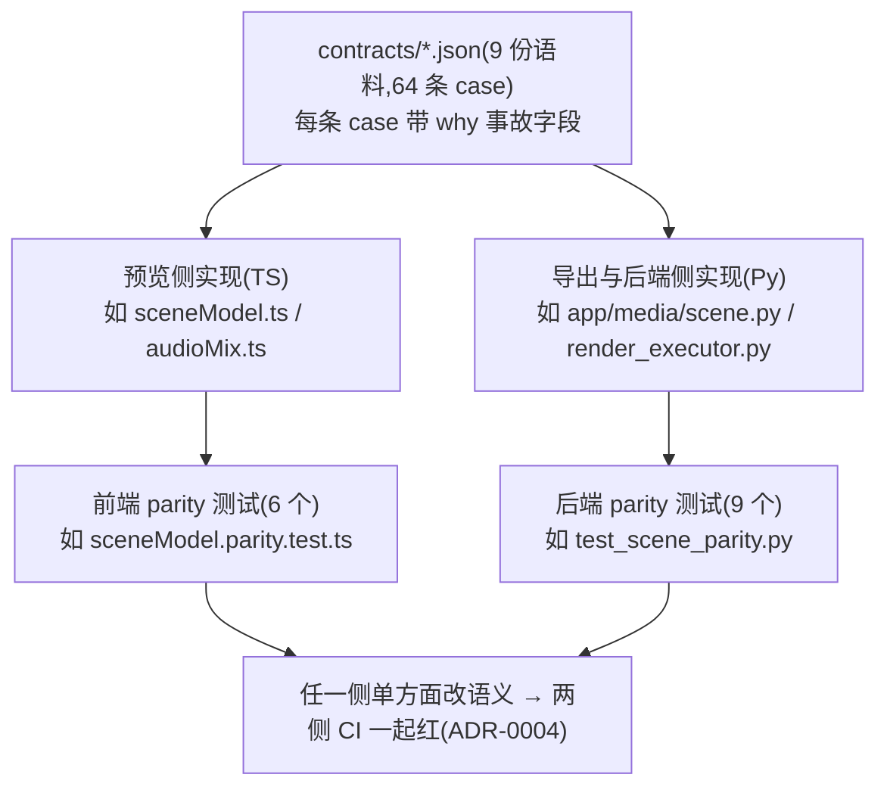
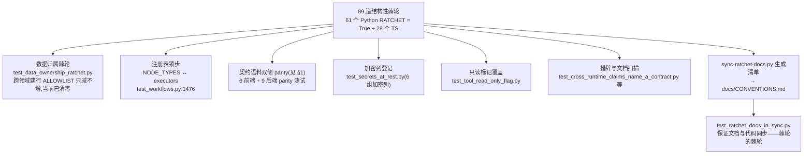
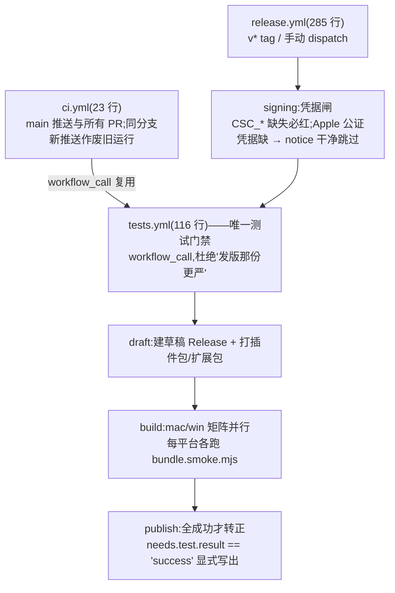
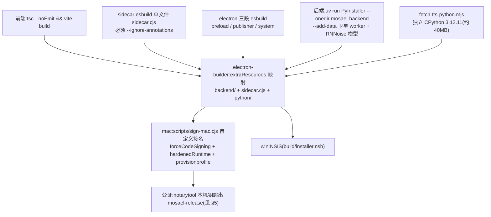
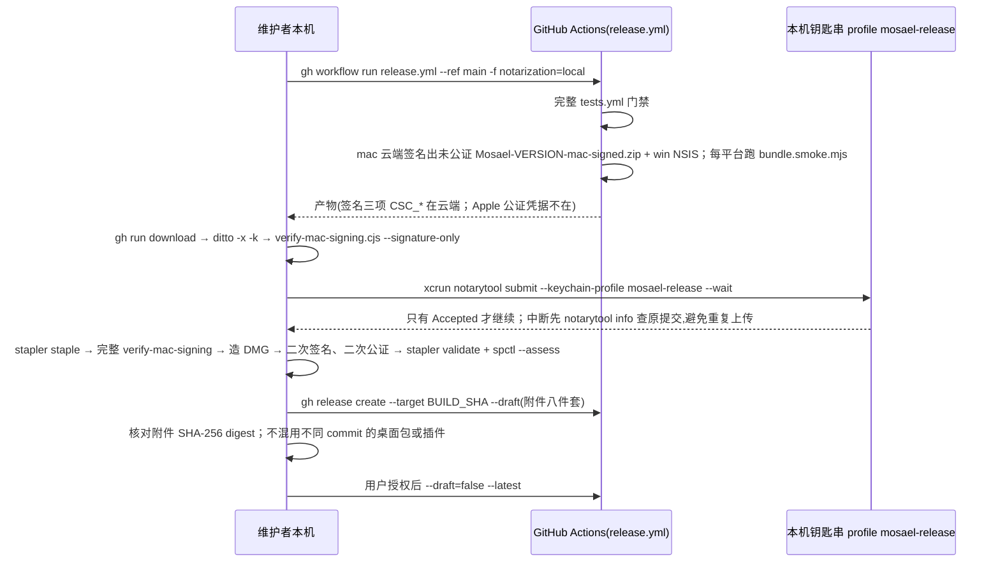

# Mosael 工程体系、测试与发布流水线深度分析

> 分析员：quality-analyst（任务 t5）
> 分析对象：`contracts/`、`test/`、`scripts/`、`build/`、`release/`、`.github/`、包管理与发布流水线、整体测试覆盖与代码质量
> 仓库版本：package.json `1.4.0`，分支 `main`
> 方法：先读 `CONTEXT.md`、`docs/RELEASING.md`、`docs/MACOS_SIGNING.md` 建立语言，再逐层验证文件证据。

---

## 0. 总览：这是一套"吃过亏才长出来"的工程体系

Mosael 的工程体系有一个非常鲜明的特征：**几乎每一道闸门都附带一段事故复盘**。CI 配置、lint 规则、测试文件、契约语料的头部注释里写满了"它此前是怎样的、出了什么事故、为什么现在是这样"。这不是装饰，而是一种刻意的知识固化策略——把"得有人记得"系统性降级为"得有人绕开机制"。

量化轮廓（实测统计）：

| 维度 | 数量 | 证据 |
| --- | --- | --- |
| 后端测试 | 372 个测试文件、**2746 个测试函数** | `backend/tests/`，`grep -c "def test_"` 汇总 |
| 前端+Electron 主进程测试 | 267 个测试文件、约 **1472 条用例** | `frontend/src/**/*.test.ts(x)` + `electron/*.test.ts`（经 `frontend/vite.config.ts` 的 `include` 归入同一套 vitest） |
| agent-sidecar 测试 | 13 个 node 测试文件 | `agent-sidecar/package.json` 的 `test` 脚本逐个列出 |
| 浏览器扩展测试 | vitest | `browser-extension/package.json` |
| 官网测试 | 3 个 node:test 文件（10 条用例） | `website/test/*.test.mjs` |
| 打包冒烟（跨进程 E2E） | 1 套 | `test/bundle.smoke.mjs` + `test/upgrade_db_fixture.py` |
| 契约语料 | 9 份 JSON、64 条 case | `contracts/*.json` |
| 结构性棘轮 | **89 道** | `docs/CONVENTIONS.md` 生成清单（实测 61 个 Python `RATCHET = True` + 28 个 TS `RATCHET = true`，吻合） |
| ADR | 18 份 | `docs/adr/0001`–`0018` |

CI 注释自述："三千多条测试"（`.github/workflows/ci.yml` 第 5 行）——那是当时的数字，现已超过 4200 条。

---

## 1. 契约语料 `contracts/*.json`：语言中立的可执行规约

### 1.1 组织方式

`contracts/README.md`（193 行）本身就是一份出色的机制设计文档。核心定位：

> "这里放**必须在多个实现之间字面一致的语义**，以语言中立的语料形式表达，由各侧的测试套件分别执行。不是文档，是可执行的规约：任何一侧改了语义而其它侧没跟上，**所有侧的 CI 都会红**。"

9 份语料，每份带 `contract`/`version`/`description` 元信息和 `cases` 数组，case 内含 `why` 字段记录历史事故（实测：scene 14 条、transform 9 条、context-meter / audio-mix / marker-shortcut 各 7 条、subtitle / shared-constants 各 6 条、free-element-geometry 5 条、clip-appearance 3 条）。例如 `contracts/scene-cases.json` 第一条：

```json
{"name": "empty-timeline", "why": "没有任何轨:两侧都必须给空层列表,而不是抛错或造一个空 base。", ...}
```

### 1.2 消费者矩阵（语料 → 双侧实现 → 双侧测试）

| 语料 | 预览侧（TS） | 导出/后端侧（Py） | 前端测试 | 后端测试 |
| --- | --- | --- | --- | --- |
| scene-cases | `frontend/src/features/editor/playback/sceneModel.ts` | `backend/app/media/scene.py` | `sceneModel.parity.test.ts` | `test_scene_parity.py` |
| subtitle-cases | `subtitleStyle.ts` | `media/text_render.py` + `render_executor._subtitle_overlay_pos` | `subtitleStyle.parity.test.ts` | `test_subtitle_parity.py` |
| context-meter-cases | `agent-sidecar/src/compaction.ts` | `domain/context_meter.py` | `agent-sidecar/test/context-meter.parity.test.mjs` | `test_context_meter_parity.py` |
| transform-cases | `TransformOverlay.ts` + `keyframes.ts` | `render_plan.py` + `render_executor._kf_sample` | `transform.parity.test.ts` | `test_transform_parity.py` |
| clip-appearance-cases | `clipAppearance.ts` | `render_plan.py._read_appearance` | `clipAppearance.parity.test.ts` | `test_clip_appearance_parity.py` |
| clip-free-element-geometry | `playback/freeElementGeometry.ts` | `render_executor._appearance_filters` | `freeElementGeometry.parity.test.ts` | `test_free_element_geometry_parity.py` |
| audio-mix-cases | `playback/audioMix.ts`（WebAudio） | `render_executor.py`（FFmpeg 滤镜） | `audioMix.test.ts` | `test_audio_mix_parity.py` |
| marker-shortcut-cases | `lib/shortcuts.ts` | `domain/markers.py` | `markerShortcut.parity.test.ts` | `test_marker_shortcut_parity.py` |
| shared-constants | （双侧字面量） | 同左 | — | `test_shared_constants_parity.py` |

以上 6 个前端 parity 测试文件与 9 个后端 parity 测试文件均已实测存在。同一份语料钉住双侧的 parity 结构：



### 1.3 如何钉死预览/导出双实现

`CONTEXT.md` 渲染一节说得很直白：场景模型"有且只有两份实现——预览（`playback/sceneModel.ts`）与导出（`app/media/scene.py`）……两者由**契约语料**钉死"（ADR-0004）。不合并成一份的理由是硬约束：预览要本地同步跑 60fps 且渲染未提交草稿，导出要无头、可被 external worker 跨机认领（ADR-0002）。

值得强调的四个机制细节：

1. **语料记录的是"解析后的结果"而非写法**。字幕契约里预览用 `cqw`/百分比交浏览器解析，导出用 px 与 overlay 坐标，语料只记"在画幅原生宽度上解析到同一个像素值"——这是契约能跨语言成立的关键设计。
2. **后端音频 parity 跑真 FFmpeg**。`test_audio_mix_parity.py` "直接跑真 FFmpeg 出声再逐采样读回增益——滤镜图写错一个参数，拿假的求值器是验不出来的"（README 第 121-123 行）。
3. **"先改语料，看两侧一起红，再改实现"是明文纪律**（README 第 158-164 行），反过来做"就把语料降级成了实现的复读机"。
4. **刻意允许的分歧不进契约**。调色是"ffmpeg 权威、预览近似"（canvas 做不了 `curves`/`lut3d`），写进契约"只会逼两边互相迁就到都变差"。

### 1.4 两道配套的"元机制"测试

契约体系的真正护城河是两个扫描器：

- **`backend/tests/test_cross_runtime_claims_name_a_contract.py`**：措辞扫描棘轮。凡源码注释里写下 "Mirrors the frontend"/「锁步一致」/「必须与…一致」/「改一处就要改另一处」等 10 种措辞（`CLAIMS` 列表，全部来自仓库真实出现过的说法），必须在同段注释点名 `contracts/xxx.json`，否则 CI 红。豁免名单只有 1 条且写清理由（`electron/webauthn.cjs` 的字面量副本）。作者自陈："它挡不住有人换一个全新说法——这是一条措辞扫描，不是定理。但七处历史证据里，作者每一次都自己写下了这句话。"
- **`frontend/src/domain/timeline/transcriptProjection.singleSource.test.ts`**：针对契约管不了的"一份实现、两个调用方"漂移——扫源码强制 `projectTranscript(` 的调用方只从 `transcriptSegmentsFromApi` 拿段落，禁止第二份手写 `tokens:` 映射存在。修法思想是"让第二份不存在"，而不是加比较测试。

**评价**：这是整个仓库工程成熟度最高的子系统。它把"双实现一致性"这个业界公认的难题，分解成了可执行语料 + 措辞扫描 + 单一来源扫描三层，且每层都承认自己的边界（"它挡不住什么"段落）。

---

## 2. 测试体系

### 2.1 目录结构

```
backend/tests/     372 个文件、2746 个用例（pytest，uv 运行）
frontend/src/      267 个测试文件（vitest，与被测代码同目录）
electron/          10 个 *.test.ts（经 frontend/vite.config.ts include 跑）
agent-sidecar/test/  13 个 .mjs（node 原生断言，含 context-meter parity 与 bundle 冒烟）
browser-extension/   vitest
website/test/      3 个 node --test 文件
test/              bundle.smoke.mjs + upgrade_db_fixture.py（仓库级打包冒烟）
```

### 2.2 后端：pytest + 全量隔离

`backend/pyproject.toml`：

```toml
[tool.pytest.ini_options]
testpaths = ["tests"]
pythonpath = ["."]
filterwarnings = ["error::pytest.PytestUnhandledThreadExceptionWarning"]
```

`backend/tests/conftest.py` 在导入任何 app 模块**之前**把 `MOSAEL_DATA_DIR` 指到 `tempfile.mkdtemp()`——注释明确说否则 `reset_db()` 会清掉开发者的真实 `~/.mosael/mosael.db`。同时测试环境固定：关调度器后台循环（测试直接驱动 `tick()`）、关代理生成、强制 libx264 软编码（`MOSAEL_HW_ENCODE=0`，保证渲染确定性）、不开 headless Chromium。部署级开关（注册、代码执行）在测试中打开，但**声明的默认值由单独测试断言是关的**——"默认关这件事不会因为测试环境开着而失去保护"。

**锁步测试**（注册表一致性）实证于 `backend/tests/test_workflows.py:1476`：

```python
def test_node_types_and_executor_registry_stay_in_lockstep() -> None:
    """NODE_TYPES 是节点的元数据接缝,executors 注册表是行为接缝——两边必须一一对应。"""
    assert set(NODE_TYPES) == set(registered_types())
```

**棘轮（ratchet）机制**是后端测试最突出的特色：61 个 Python 棘轮测试（`RATCHET = True` 标记）+ 28 个 TS 棘轮 = 89 道，清单由 `scripts/sync-ratchet-docs.py` 生成进 `docs/CONVENTIONS.md`（`<!-- BEGIN RATCHETS -->` 区块），再由 `test_ratchet_docs_in_sync.py` 保证文档与代码同步——形成"棘轮的棘轮"。典型如 `test_data_ownership_ratchet.py`：AST 扫描全 app 的模型构造调用，跨领域建行冻结在 ALLOWLIST 中**只减不增**，当前 ALLOWLIST 已清零并保持为空。命名风格也值得一记：大量测试文件名是完整句子（`test_a_hung_worker_still_times_out.py`、`test_a_failure_keeps_its_full_output.py`），即行为规约。

89 道棘轮的分类与"棘轮的棘轮"闭环：



### 2.3 前端与 Electron

- `frontend/vite.config.ts` 的 `test.environment = "node"`，DOM 测试需在文件头逐个声明 `/** @vitest-environment jsdom */`。注释坦承："在此之前没有任何 DOM 环境，于是任何碰组件的东西都测不了：24 个测试文件全是纯函数，所有 UI 回归只能靠人手在浏览器里看。"——jsdom 是后补的，组件级测试覆盖仍在还债。
- `include` 显式收纳 `../electron/**/*.test.ts`，注释解释："electron/ 下的主进程代码也归这一套测试跑。它此前没有任何测试——而 esbuild 只打包、不看类型也不跑用例，于是那半边代码的回归只能等打包后在真机上撞见（登录项那条就是）。"
- 测试分布（文件数）：boards 30、agent 30、editor 28、lib 21、workflows 20、scenes 17、settings 16、design 12……design/ 目录的 12 个文件是设计规范棘轮（字阶、按钮尺寸、布局节奏），把视觉规范也变成了可执行检查。

### 2.4 E2E 与打包冒烟

没有 Playwright 式的 UI E2E 套件（`scripts/record-doc-media.py`、`capture-homepage.py` 用 Playwright 但服务官网截图，非测试）。真正的跨进程 E2E 是 **`test/bundle.smoke.mjs`**：

- 用 `test/upgrade_db_fixture.py seed` 造一个**最小旧版数据库**（手写 SQL 建 `publish_tasks`/`boards` 旧表并插 legacy 行）；
- 启动 `release/` 下真正的打包 Electron 产物（mac 找 `Mosael.app/Contents/MacOS/Mosael`，win 找 `win-unpacked/Mosael.exe`）；
- 主进程沿途把阶段写进 `result.json`，断言 `packaged && backendHealthy && rendererLoaded && desktopBridgeReady` 全真，macOS 上还断言 `platformAuthenticatorConfigured`（Touch ID 配置）；
- 退出后再跑 `upgrade_db_fixture.py verify` 验证**旧库被正确升级**；
- 90 秒超时，超时/失败时把 `result.json` + `main.log` 尾 40 行 + `backend.log` 尾 150 行一起打印（注释解释：backend 崩溃的异常在 traceback 最后，15 行窗口正好切掉结论——第一次就是这样）。

这直接落实了 `CONTEXT.md` 的表结构演进纪律："`test/bundle.smoke.mjs` 会拿旧库启动真正的打包 Electron，同时验证冻结后端升级、health、renderer 加载与升级后数据，**不是只检查产物存在**。"

### 2.5 覆盖率与盲区

- **没有任何覆盖率度量**：`backend/pyproject.toml` 无 pytest-cov，`frontend/package.json` 无 `@vitest/coverage`。覆盖率完全盲区——不过考虑到 89 道棘轮 + 契约语料走的是"定点防守关键不变量"路线，这更像是有意的取舍而非疏漏；但代价是"哪些领域测试稀薄"没有数据回答。
- **无 UI E2E**：编辑器拖拽、画布交互这类最复杂的用户路径只有单测+棘轮，没有浏览器级回归。
- ffmpeg 依赖的 9 个测试文件在无 ffmpeg 环境会**整体 skip**——CI 因此显式 `apt-get install ffmpeg`（`tests.yml` 第 36-39 行注释："那样这道闸看着是绿的，实际没验到最该验的那部分"）。
- 沙箱（代码节点隔离）测试依赖 Docker，CI 显式等待 dockerd 并断言 `OSType/MemoryLimit/SwapLimit/PidsLimit` 四项能力、预拉 `python:3.13-alpine`（`tests.yml` 第 43-50 行），并声明"环境不可用必须阻止发版，不能让隔离用例被跳过后仍然显示测试通过"。

---

## 3. CI：三个工作流，一道闸门

`.github/workflows/` 只有三个文件，职责切分干净：



### 3.1 `ci.yml`（23 行）

main 推送与所有 PR 触发，concurrency 同分支新推送作废旧运行。文件头自述其出身："**这条工作流是补上的。**在它之前仓库里只有 release.yml，而那个只在 `v*` tag 上触发——也就是说三千多条测试平时一次都不跑……主干上有一条红着的结构性测试随一个 feat 提交进来后一直没人知道。"

### 3.2 `tests.yml`（116 行）——唯一测试门禁

抽成 `workflow_call` 供 ci.yml 与 release.yml 共用，注释解释为什么："两份会漂，而漂的方向必然是『发版那份更严』，于是主干上跑的其实是另一道更松的闸。"步骤顺序：

1. 依赖安装（pnpm `--frozen-lockfile` + website 独立工作区 + `uv sync --frozen --python 3.13`）；
2. tag 触发时校验 `package.json` 版本 == tag 版本；
3. **Lint 放在测试前**（"它几秒钟就跑完，而且它抓的那类问题在测试里往往表现为一个八竿子打不着的报错"）；
4. 后端 `pytest -q`；前端 `vitest run`（类型检查由 `build` 脚本的 `tsc --noEmit` 覆盖）；
5. **OpenAPI 快照新鲜度**：`export_openapi.py --check` + `pnpm gen:api` + `git diff --exit-code frontend/src/api/generated/schema.d.ts`——注释记录实测漂移过一次（`BoardGenerate.provider_profile_id` 进了路由没进快照）；
6. sidecar typecheck + build + test（"context-meter 契约的 Node 一侧此前在主干没有门"）；
7. `typecheck:electron`（"esbuild 只打包不查类型——发布执行器的类型检查此前只在发版期，攒出过失效的 @ts-expect-error 和死参数"）；
8. browser-extension test + typecheck + build；
9. website test + production build（注释说明当前 typescript-eslint 拒绝 TS 7，"不能把一条必红的 lint 伪装成门禁"）。

### 3.3 `release.yml`（285 行）

`v*` tag 或手动 dispatch 触发。流水线：`signing`（凭据闸）→ `test`（复用 tests.yml）→ `draft`（建草稿 Release + 打插件包/扩展包）→ `build`（mac/win 矩阵并行）→ `publish`（转正）。

设计亮点：

- **凭据闸分两类**：`CSC_*` 三项是签名前提，缺则必须红；`APPLE_ID`/`APPLE_APP_SPECIFIC_PASSWORD` 只服务云端公证路径，缺了不再失败而是输出 notice 并干净跳过——因为"假红叉比没有红叉更坏：它教人忽略这个工作流的红色，而下一次可能是真的"。
- **`needs.test.result == 'success'` 显式写出**（第 160 行注释："`!cancelled()` 会让 build 在依赖失败时照样起来——只写 needs 而不写这一条，测试红了照样出包"）。
- **先建草稿、双平台往同一草稿传产物、全成功才转正**——"避免用户在『检查更新』里看到缺产物的半成品版本"。
- 插件 ZIP 在 draft 阶段打一次而非 mac/win 各打一遍，因为"市场索引里的下载地址指的就是这些附件——不传的话，插件页点「安装」拿到的是 404，而索引看起来一切正常"。
- 构建阶段内嵌 `pnpm --dir agent-sidecar test` 与 `test/bundle.smoke.mjs`，打包产物冒烟在**每个平台各跑一遍**。
- `setup-uv` 锁 commit SHA 而非浮动 tag（第 181-182 行注释说明原因，supply-chain 意识）。

---

## 4. 构建与打包

构建链路全貌（细节见 §4.1–§4.3）：



### 4.1 pnpm workspace 结构

`pnpm-workspace.yaml`：workspace 只含 `frontend`、`agent-sidecar`、`browser-extension`（website 是**独立 pnpm 工作区**，有自己的 lockfile，`tests.yml` 第 110-111 行注释"不会被根目录的 install/build 顺带覆盖"）。backend 是 uv 管理的 Python 项目，electron 主进程代码挂在根包。

### 4.2 后端 → `mosael-backend` 二进制

`package.json` 的 `build:backend` 直接调 PyInstaller：

```
uv run --frozen python -m PyInstaller --noconfirm --clean --onedir --name mosael-backend \
  --hidden-import uvicorn.logging ... \
  --add-data app/ai/runtime/workers/{tts,tts_protocol,asr,asr_protocol,separation,line_protocol}.py:... \
  --add-data app/ai/runtime/models/rnnoise/somnolent-hogwash.rnnn:... \
  --add-data app/domain/blender/worker.py:... run_backend.py
```

`--onedir` 模式，卫星 worker 脚本与 RNNoise 模型以 data 形式随包。产物经根 `package.json` 的 `build.extraResources` 映射进 Electron 包：

```json
{ "from": "backend/dist/mosael-backend", "to": "backend/mosael-backend" },
{ "from": "agent-sidecar/dist/sidecar.cjs", "to": "agent-sidecar/sidecar.cjs" },
{ "from": "build/python", "to": "python" }
```

第三项是 `scripts/fetch-tts-python.mjs` 抓取的 python-build-standalone 独立 CPython 3.12.11（约 40MB）——注释解释：PyInstaller 冻结二进制的 `sys.executable` 指向自己，建不了 venv，而声音克隆（f5-tts/fish-speech）需要真 Python；只带解释器不带引擎依赖是因为 torch 栈 2.5-3.5GB"会把安装包从 ~700MB 顶到约 4GB"。

### 4.3 前端 → Electron

前端 `build` = `tsc --noEmit && vite build`，`vite.config.ts` 用 `base: "./"` 使打包后 `loadFile()` 可用；版本号唯一来源是根 `package.json`（`import pkg from "../package.json"` → `define.__APP_VERSION__`，注释记录了用 `readFileSync` 导致长命 dev server 显示旧版本号的事故）。Electron 侧三段 esbuild bundle：`build:preload`（`electron/preload.cjs`）、`build:publisher`（`electron/publish/index.ts`，发布执行器）、`build:system`（`electron/system/index.ts`），均先过 `typecheck:electron`。sidecar bundle 必须带 `--ignore-annotations`——`agent-sidecar/package.json` 注释记录：pi-ai 的 `sideEffects` 标注会让 esbuild 摘掉 `createModels()` 依赖的初始化，"删掉它会静默复现该故障：类型与单测全绿，只有 test:bundle 抓得到"。

electron-builder 配置（根 `package.json` 的 `build` 字段）：mac 强制签名（`forceCodeSigning: true`）、hardenedRuntime、自定义 `sign: scripts/sign-mac.cjs`、entitlements 分主/Helper 两份、嵌入 `build/mosael.provisionprofile`；win 走 NSIS（`build/installer.nsh`，非一键安装、允许改目录）；注册了 `mosael://` 协议与视频/音频文件关联。

### 4.4 `scripts/` 与 `build/` 清单

- `scripts/sign-mac.cjs`：自定义签名器。只签 Mach-O（按 magic number 判断，资源文件由 bundle 密封）；对两类"会自己好"的签名失败（timestamp 服务不可用 / Code Signing subsystem internal error）重试 3 次并**出声**——注释："静默重试等于把『这次构建其实撞了一下』藏起来。"
- `scripts/verify-mac-signing.cjs`：`codesign --verify --deep --strict` + WebAuthn keychain group 校验 + 安全时间戳校验 +（非 `--signature-only` 时）`stapler validate` + `spctl --assess`。
- `scripts/sync-ratchet-docs.py` / `sync-plugin-registry.py` / `sync-tool-docs.py` / `sync-website-workflows.py` / `verify-docs-navigation.py`：一批"文档/索引与代码同步"的生成器+校验器，全部带 `--check` 模式进 CI 或测试。
- `build/`：entitlements 双 plist、icns/png 图标、托盘图标（含 template 与深浅色）、`installer.nsh`、`mosael.provisionprofile`（gitignored，本地放置）、`python/`（fetch 产物）。

---

## 5. 发布流水线：云端签名 + 本机钥匙串公证交接

`docs/RELEASING.md`（123 行）+ `docs/MACOS_SIGNING.md`（91 行）构成完整的发布操作手册，其设计核心是一条现实约束：**GitHub 只有签名三项 secrets（`CSC_LINK`/`CSC_KEY_PASSWORD`/`MACOS_PROVISION_PROFILE`），Apple 公证凭据只存在于维护者本机钥匙串 profile `mosael-release`**。于是发布被设计成"云端签名 + 本机公证交接"两段式：

1. `gh workflow run release.yml --ref main -f notarization=local` → 跑完整 tests.yml → mac 云端签名出**未公证**的 `Mosael-VERSION-mac-signed.zip`（`ditto` 打包保留符号链接与权限）+ Windows NSIS 安装包，且每平台跑 `bundle.smoke.mjs`；
2. 本机 `gh run download` → `ditto -x -k` 解压 → `verify-mac-signing.cjs --signature-only` → `xcrun notarytool submit --keychain-profile mosael-release --wait`（只有 `Accepted` 才继续；中断先 `notarytool info` 查原提交，避免重复上传）→ `stapler staple` → 完整 `verify-mac-signing.cjs` → 再造 DMG、二次签名、二次公证、`stapler validate` + `spctl --assess`；
3. 附件八件套：mac DMG、win EXE、`mosael-browser-extension.zip`、5 个插件 ZIP（`plugins/examples/{baidu-pan,blender,mcp-everything,text-toolkit,tikhub}`，包名取各自 manifest 的 `id`）；明文规定"不要混用不同 commit 的桌面包或插件"；
4. `gh release create --target BUILD_SHA --draft` → 核对附件 SHA-256 digest → 用户授权后 `--draft=false --latest`。

两段式交接的完整时序：



防呆细节密度很高：

- **版本号多处同步清单**（RELEASING.md 第 11-18 行）：`website/public/media/capture-manifest.json` 的 `documentedVersion`、每篇 MDX frontmatter 的 `version`、中英下载页、`website/README.md`、`website/src/lib/release-copy.ts`——官网测试逐项核对，"漏一处就红在 `'1.3.0' !== '1.3.1'`"；且明确区分截图批次的 `sourceCommit/capturedAt`（拍摄来源，不伪造更新）与 `documentedVersion`（文档对应版本），"这两个曾被读成一个，于是整节都没改，CI 才红的"。
- 代理/时间戳故障处理（MACOS_SIGNING.md 第 43 行、RELEASING.md 第 89 行）：`timestamp.apple.com` 与 `api.apple-cloudkit.com` 的网络要求、fake-IP/TUN 模式的坑、本机实际成功的临时直连例外方案（finally/trap 还原），"不应通过禁用 TLS 验证或系统安全检查解决"。
- 秘钥纪律：不导出钥匙串密码到聊天/脚本/日志/仓库；Windows 构建不获得 Apple 凭据（release.yml 第 228-232 行 env 按 `runner.os == 'macOS'` 条件注入）；`umask 077` 后解码描述文件。
- 过程证据落 `docs/validation/`（现有 7 份，含 `2026-09-09-release-1.2.0.md`、`2026-09-10-release-1.3.0.md`、`2026-09-11-release-1.3.1.md` 三次发布记录）。
- 若未来五项 secrets 配齐，tag 自动发布路径**无需改工作流**即可恢复（signing job 的 notice 设计）。

Touch ID（WebAuthn）也被纳入发布验证链：`electron/webauthn.cjs` 从自身经验证的代码签名读 Team ID 与 entitlements，三处一致才 `configureWebAuthn`；打包冒烟要求签名 mac 包必须成功配置认证器（`bundle.smoke.mjs` 第 112-114 行）。

---

## 6. 依赖与供应链

### 6.1 JS 侧

- 根 `packageManager: pnpm@11.20.0`，锁文件 `pnpm-lock.yaml`（359KB）+ website 独立锁文件，CI 全程 `--frozen-lockfile`。
- `pnpm-workspace.yaml` 的供应链控制：
  - `onlyBuiltDependencies: [electron, electron-winstaller, esbuild]` + `allowBuilds` 逐个点名——"依赖的 install 脚本默认不跑（pnpm 的安全默认值）……漏了会让 `pnpm install --frozen-lockfile` 直接失败"；
  - `overrides: { "@electron/get": "^5.1.0" }`——钉住 electron-builder 26.15.3 的缺陷依赖声明（app-builder-lib 用了只存在于 5.x 的 API 却声明 `^3.0.0`，"npm/yarn 的扁平化会碰巧提升到 5.x 而看不出问题，pnpm 会如实暴露"）；
  - `patchedDependencies: app-builder-lib@26.15.3 → patches/app-builder-lib@26.15.3.patch`——修复"导入证书后误用 PKCS#12 密码解锁随机密码的临时钥匙串"（`SecKeychainUnlock` 失败），由 `electron/mac-signing.test.ts` 用两份独立加密证书覆盖；
  - 根目录注释记录 `openapi-typescript` 必须挂根 devDependencies 的布局坑（peer 是 TS ^5 而 frontend 用 TS 7，`ts.factory` 在原生实现里是 undefined——"overrides 和 packageExtensions 都改不了 peer 的解析，试过"）。
- **疑点（见 §8 风险 R3）**：两个 workspace 文件都只有 `minimumReleaseAgeExclude` 而**没有 `minimumReleaseAge` 本体**（实测 grep 全仓库无 `^minimumReleaseAge:`），排除名单当前是空转配置。

### 6.2 Python 侧

uv 管理：`backend/pyproject.toml` + `uv.lock`（revision 3）。CI 统一 `uv sync --frozen --python 3.13`。依赖声明的注释同样体现"吃过的亏"：`beautifulsoup4`"此前一直没声明，靠环境里碰巧装着——一次 `uv sync` 就把它清掉了，而后端从那一刻起连启动都启动不了"；`websockets`/`cryptography`/`pillow-heif` 显式声明而非借用传递依赖，"依赖别人的传递依赖意味着对方换实现时这里会静默失效——密钥读不出来的失效方式尤其难查"。`requires-python = ">=3.11"` 而 CI/打包实际用 3.13、随包 TTS 解释器是 3.12.11——三个 Python 版本共存，各有分工但值得留意（见风险 R4）。

---

## 7. 代码质量横切面

### 7.1 类型覆盖

全部 TS 工程 `strict: true`（实测 frontend、electron、electron/preload、agent-sidecar、browser-extension 五个 tsconfig）。类型门禁分层：frontend 在 `build` 里 `tsc --noEmit`；electron/sidecar/extension 各有 `typecheck` 脚本且全部进 tests.yml。前端 API 类型由后端 OpenAPI 快照生成（`gen:api` → `openapi-typescript` → `schema.d.ts`），快照新鲜度本身有 CI 门禁——**前后端类型契约是机器生成+强制同步的，不是手写对齐**。

### 7.2 Lint

- 后端 ruff（`pyproject.toml`）：`select = ["F", "E9", "B"]`，`line-length = 120`。注释阐明哲学："**选能抓缺陷的，不选风格。**打开 ruff 的全套会得到七百多条……一个开局七百条警告的 lint，和没有 lint 是同一回事。"首次运行即抓出两处 F821，其中 `domain/agent/judge.py` 是活的 NameError——"它在 autopilot 里被 except 吞成一行日志，判断者从来没工作过……两千多条测试没看见，因为它们把 `ask` 整个换掉了"。`B905`（zip strict）的忽略也是显式判断题而非"以后再说"。`per-file-ignores` 只豁免装配入口 `__init__.py` 的 F401（ADR-0003）；bugbear 的 immutable-calls 扩展了 FastAPI 全套依赖注入函数。
- 前端 oxlint（`frontend/.oxlintrc.json`）：correctness 类别整体关闭，手工点名 14 条规则（no-unused-vars、no-unsafe-optional-chaining、react-hooks/rules-of-hooks 等），其余依赖 tsc strict。策略与 ruff 一致：少而精、零告警、能当闸用。

### 7.3 i18n 体系

双轨制，且两侧都有棘轮：

- **后端** `backend/app/core/i18n.py`：`MESSAGES: dict[key, {zh, en}]`，"文案存 key、出口翻译"；语言按 `Accept-Language` 请求头逐请求解析（多租户远程部署没有"服务端语言"）；`test_backend_i18n.py` 棘轮强制**每个 key 两种语言都必须有**——"缺一种语言就是一处会掉回中文的地方，而它在界面上看起来『就是没翻』，查起来很费劲"。
- **前端** `frontend/src/app/messages.ts`：`{"zh-CN": {...}, "en": ...}` 大字典 + `messages.test.ts` 等校验。
- **浏览器扩展**另有 `i18n.ts` + `_locales/{en,zh_CN}`（`docs/MAINTENANCE_HOTSPOTS.md` 规定"新增可见文案必须同时补"）。
- 1.4.0 的 CHANGELOG 佐证了这套体系的演进方向：工作流模板节点名、失败原因（改为记录"哪一条原因 + 哪几个数据"而非当时那句话，历史任务也能跟着变语言）、模板卡片三处副本收敛为一份。

### 7.4 文档完备度

- `CONTEXT.md`（302 行）：统一语言表（命名、进程协议、任务总线、工作流、剪辑、协作、渲染、数据、智能体、供应商），每个术语带 `_Avoid_` 反模式，末尾还有"Flagged ambiguities"。
- `docs/adr/`：18 份 ADR，从 0001（无网络微服务）到 0018（job 归属与通报），覆盖 worker 协议、数据归属、预览/导出契约、迁移策略、权限模型、执行面网关等全部重大决策。
- `docs/` 另有 15 份子系统文档（ARCHITECTURE 621 行、CONVENTIONS 206 行、PLUGIN_ARCHITECTURE、PERMISSION_MODEL、MAINTENANCE_HOTSPOTS 等）+ `docs/validation/` 7 份发布/修复证据。
- `CHANGELOG.md`（623 行）：用户视角的版本亮点，写法本身带工程解释（如"逐句翻译，不是整篇翻译"的论证）。
- 文档自身也被测试守住：`test_docs_do_not_point_at_ghosts.py`（"文档里指到的代码路径必须真的存在"）、`test_ratchet_docs_in_sync.py`、`test_site_docs_stay_in_sync.py`（官网文档中英对齐且"别把数目写死错"）、`verify-docs-navigation.py`。

---

## 8. 亮点与风险清单

### 8.1 亮点（按价值排序）

1. **契约语料 + 措辞扫描 + 单一来源扫描的三层一致性机制**（§1）。把跨语言双实现一致性这个业界难题做成了可执行、可演进、自知边界的体系，且每份语料的 `why` 字段保留了事故现场。
2. **89 道棘轮 + 生成式清单 + 清单同步测试**（§2.2）。"只能往一个方向走"的检查把架构纪律从 review 负担变成 CI 事实；`RATCHET = True` 标记 + `sync-ratchet-docs.py` 让清单不会腐烂（上一版手写清单"列了 7 条——实际有 30 条"）。
3. **打包冒烟直接验证升级路径**（§2.4）：旧库 fixture + 真实打包产物 + 逐阶段 result.json + 失败时自动带日志尾部，把"新装机好、老用户崩"这一类最痛的桌面应用回归钉死在每个平台的构建里。
4. **测试门禁单一来源**（§3.2）：tests.yml 被 ci 与 release 共用，杜绝"发版闸更松"；release.yml 显式 `needs.test.result == 'success'` 堵住 `!cancelled()` 陷阱。
5. **发布流水线的诚实设计**（§5）：缺云端公证凭据时报 notice 而非假红（"假红叉比没有红叉更坏"）；先草稿后转正防半成品；版本号同步清单精确到"这两个字段曾被读成一个"。
6. **供应链控制细致**（§6）：`--frozen-lockfile` 全域、install 脚本逐个点名、pnpm patch 修复上游签名缺陷且有测试覆盖、setup-uv 锁 SHA。
7. **注释即事故档案**（全仓）：CI、lint 配置、构建脚本、package.json 的 `"//"` 字段里都是"为什么"——这是 AI 协作者与后来者最重要的上下文资产，且与 `improve-codebase-architecture` 类工具链天然契合。

### 8.2 风险清单（按严重度排序）

| # | 风险 | 证据 | 建议 |
| --- | --- | --- | --- |
| R1 | **无 UI 级 E2E**：编辑器拖拽、画布交互、播放器这些最复杂的路径只有单测与 jsdom 组件测试（jsdom 本身也是后补的，`vite.config.ts` 注释自述此前"所有 UI 回归只能靠人手在浏览器里看"）。契约管住了跨端语义，但管不住前端单端内的交互回归。 | `frontend/vite.config.ts` test 段注释；全仓无 playwright/e2e 测试配置 | 对编辑器核心手势（一次手势=一条操作、批量撤销）补少量 Playwright 冒烟；不必求全覆盖 |
| R2 | **覆盖率全盲**：无任何覆盖率度量，2746+1472 条测试的"分布盲区"（哪些领域薄）无从量化。棘轮是定点防守，回答不了"面"的问题。 | pyproject.toml 无 pytest-cov；frontend 无 @vitest/coverage | 至少在后端跑一次 `pytest --cov` 出报告纳入 docs/validation/，识别薄弱领域后决定是否需要门禁 |
| R3 | **`minimumReleaseAgeExclude` 空转**：两处 workspace 文件都配置了排除名单，但全仓库没有 `minimumReleaseAge` 本体——依赖冷静期实际未生效（除非依赖维护者全局 npmrc，而 CI 不会有）。排除名单的存在还容易给人"已开启"的错觉。 | `pnpm-workspace.yaml:16`、`website/pnpm-workspace.yaml`；grep 全仓无 `^minimumReleaseAge:` | 要么补上 `minimumReleaseAge`（如 3-7 天）让排除名单生效，要么删掉排除名单避免假象 |
| R4 | **三个 Python 版本共存**：声明 `>=3.11`、CI/打包用 3.13、随包 TTS 解释器 3.12.11。pytest 只在 3.13 上跑，打包产物与声音克隆 venv 的实际运行版本没有被同一套测试直接覆盖（bundle 冒烟覆盖了启动与升级，但不覆盖声音克隆依赖安装）。 | `backend/pyproject.toml`、`tests.yml`、`scripts/fetch-tts-python.mjs` | 可接受但应在 docs 中显式记录版本矩阵；声音克隆的 venv 安装路径值得一条打包级冒烟 |
| R5 | **`backend/mosael-backend.spec` 疑似陈旧**：spec 的 `datas` 缺 `separation.py`、`line_protocol.py` 与 RNNoise 模型，而实际构建走 `package.json` 的 `build:backend` 内联参数（两者内容已漂移）。任何"按惯例用 spec 文件"的尝试都会打出缺文件的包。 | 对比 `backend/mosael-backend.spec:8` 与 `package.json:17` | 删除 spec 或改为由 build:backend 引用，消除第二事实源 |
| R6 | **发布交接是单点人工流程**：公证依赖维护者本机钥匙串 profile `mosael-release` 与手工执行 RELEASING.md 的十余步；`gh release create` 推 tag 会顺带触发自动路径，靠 signing job 的 notice 设计兜底。流程文档极佳，但仍是"一个人 + 一台 Mac"的 Bus Factor=1。 | `docs/RELEASING.md`、`docs/MACOS_SIGNING.md`、release.yml signing job | 中长期配齐五项 secrets 走云端公证（工作流已为此预留零改动恢复路径）；短期至少把交接步骤脚本化 |
| R7 | **Windows 包无代码签名**：文档明确"不要把它描述为 Windows 代码签名包"，SmartScreen 警告会伤害分发转化；Linux 不出包、Intel Mac 需自签 runner。 | release.yml 第 165-167 行注释；RELEASING.md §4 | 已知取舍，列入路线图即可 |
| R8 | **措辞扫描类棘轮的固有边界**：`test_cross_runtime_claims_name_a_contract.py` 自己承认"挡不住有人换一个全新说法"。这类机制的有效性依赖作者继续写下这类话的习惯。 | 该文件 docstring | 无需行动——机制自知边界且每次发现新说法就收紧一格；保持即可 |

---

## 9. 结语

Mosael 的工程体系是其"本地优先、双实现、多卫星进程"架构的直接产物：既然预览/导出必须两份实现，就长出了契约语料；既然发布必须跨云端与本机，就长出了两段式交接与证据落盘；既然踩过"主干没测试闸"的坑，就长出了单一来源的 tests.yml。整套体系的显著特征不是工具新颖（pytest/vitest/ruff/oxlint/pnpm/uv/electron-builder 全是常规选型），而是**每一道机制都附带对自己边界的诚实陈述**——"它挡不住什么"被反复写进测试 docstring。这使得该体系对 AI 协作者异常友好：机制可查、边界可读、事故可溯。

最值得投入的两个方向：补齐 UI 级 E2E（R1）与覆盖率可见性（R2）；最需要立刻核对的是 `minimumReleaseAge` 空转配置（R3）与陈旧的 PyInstaller spec（R5）。
