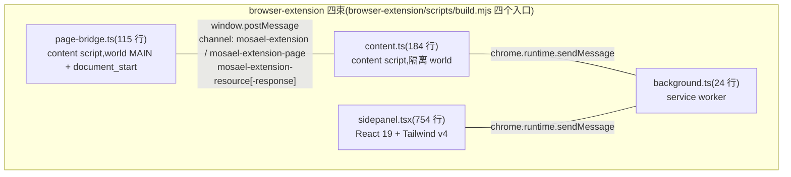
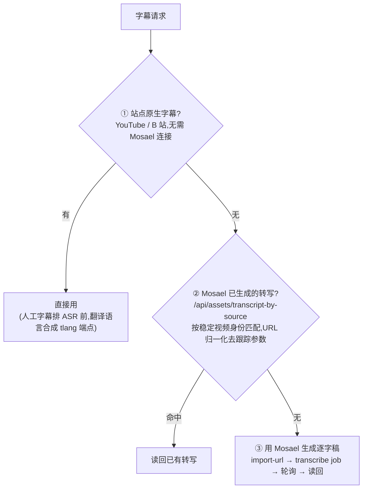
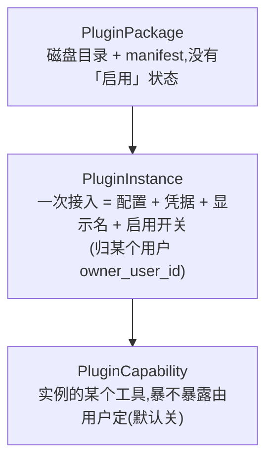
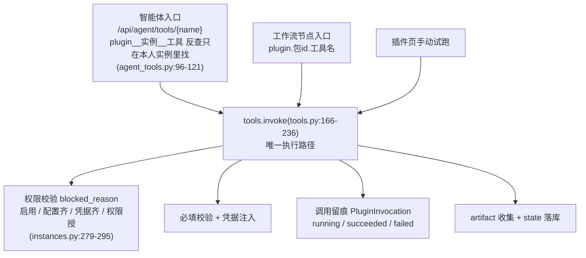
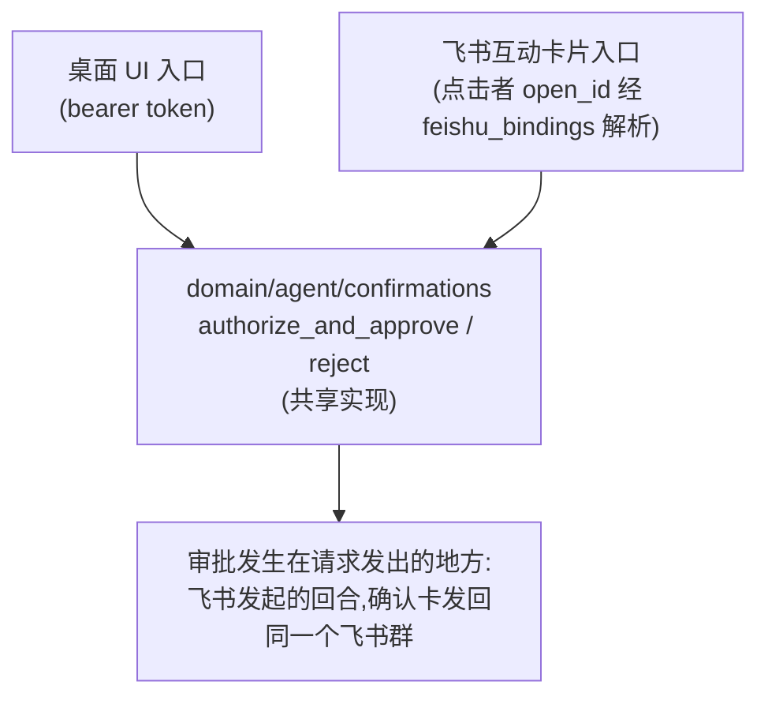

# Mosael 扩展与集成深度分析

> 任务 t4(浏览器扩展、插件与对外集成)。证据均标注到文件与行号。
> 统一语言以 [../CONTEXT.md](../CONTEXT.md) 为准:**事实源**是 FastAPI 后端(127.0.0.1:8800),
> 一切外部面(浏览器扩展、插件、MCP 客户端、飞书 bot、Webhook)都只是它的客户端。

---

## 0. 全景:对外集成面的一张地图

Mosael 的对外集成面可以按「谁主动」分成两类——**进来**的外部调用方与**出去**的第三方能力:

```
┌─ 进来(外部 → Mosael 后端)─────────────────────────────┐
│ Chrome 扩展 (browser-extension/)   Bearer 会话 + CORS 白名单 │
│ MCP 客户端 (backend/mcp_server.py) MOSAEL_API + MOSAEL_TOKEN │
│ 飞书 bot (app/integrations/feishu/) 长连接 + open_id 绑定     │
│ Webhook (app/api/routes/hooks.py)  任务级密钥,不挂登录态      │
│ 发布 worker (routes/publish_worker.py) 启动时下发的共享密钥   │
└──────────────────────────────────────────────────────┘
┌─ 出去(Mosael → 第三方)────────────────────────────────┐
│ 插件体系 (app/domain/plugins/)  process 子进程 / MCP 传输     │
│   ├─ Blender MCP   (plugins/examples/blender + domain/blender)│
│   ├─ TikHub        (MCP over HTTP,16 平台端点)               │
│   ├─ 百度网盘      (process 插件 + OAuth + state 续期)        │
│   └─ 插件市场      (mosael.com/plugins/registry.json)        │
└──────────────────────────────────────────────────────┘
```

两条方向的共同骨架:**所有集成最终都收敛到后端的 HTTP API 或领域函数,没有第二条写入路径**。
插件的"唯一执行路径"(`tools.invoke`)、智能体工具的"唯一注册表"(`mcp_server.py`)、
Blender 互通复用插件调用管道,都是这条原则的具体形态。

---

## 1. 浏览器扩展(browser-extension/)

### 1.1 形态与边界

Chrome MV3 扩展,UI 完全放在**原生 Side Panel**(`manifest.json:16-18`,`side_panel.default_path`),
不在页面里注入浮窗;`background.ts:4` 设了 `openPanelOnActionClick`,点图标开面板。

权限面(`manifest.json:8-9`):

| 权限 | 用途 |
| --- | --- |
| `activeTab` / `tabs` / `sidePanel` / `storage` | 跟随活动标签、截可见帧、存会话 |
| `host_permissions: <all_urls>` | 在任意视频页发现 HTML5 播放器;跨源受限时做干净区域的截帧回退 |

两个收窄动作值得记录:

- **不申请 `cookies` 权限**,从不读取/导出 Chrome 登录态(README.md:64-66)。需要站点身份的
  下载走 Mosael Browser Pool:扩展只把**身份 id** 发给后端,由后端的下载任务复用该身份的
  cookie 与代理。
- **后台代理 fetch 有 URL 白名单**:`platform-resource.ts:5-24` 的 `isAllowedPlatformResource`
  只允许 `api.bilibili.com/x/player/v2`、`*.youtube.com/api/timedtext`、`*.hdslb.com/bfs/(ai_)?subtitle/`。
  `<all_urls>` 因此**没有**把后台变成一个任意 fetch 代理;`platform-resource.ts` 有专门的
  vitest 用例(`tests/platform-resource.test.ts`)。

### 1.2 四束进程结构与协议

构建入口(`browser-extension/scripts/build.mjs`)正好对应四个运行时上下文:

| 束 | 上下文 | 职责 |
| --- | --- | --- |
| `background.ts`(24 行) | service worker | side panel 行为、活动标签广播、`FETCH_PLATFORM_RESOURCE` 白名单代理 |
| `content.ts`(184 行) | content script(隔离 world) | 页面上下文探测、seek、截帧准备/恢复、字幕读取转发 |
| `page-bridge.ts`(115 行) | content script(`world: "MAIN"`,`document_start`) | 读页面全局态(`ytInitialPlayerResponse` / `__INITIAL_STATE__`)拿字幕轨 |
| `sidepanel.tsx`(754 行) | React 19 + Tailwind v4 + 扩展自有 shadcn/ui | 全部 UI:连接设置、双语字幕、搜索、导入、截帧 |

四束结构与三条 channel(`shared/protocol.ts` 显式定义):



每条请求带 `crypto.randomUUID()` 相关 id 和 15s 超时(`content.ts:44-62`);三层转发 page-bridge(MAIN)→ content(隔离)→ background(worker),每一跳的超时都被显式处理。

字幕读取的三级回退策略(`transcript-source.ts` 全文件):



证据:URL 归一化规则 README.md:90-94;生成管道实现 `mosael/client.ts:175-207`。

### 1.3 平台适配

`platforms/detect.ts` 做 URL 级平台识别(youtube / bilibili / pornhub / generic),通用适配器
由 `platforms/video-element.ts` 的 `selectPrimaryVideo` 从一堆 `<video>` 里挑出**真实可见可播**
的那个(排除隐藏的广告/占位元素)。YouTube 轨道枚举(`platforms/youtube.ts:18-52`)把人工字幕
排在 ASR 前面,并为每种翻译语言合成 `tlang` 端点;B 站(`platforms/bilibili.ts`)每次进入都按
`bvid/cid` 重新拉字幕清单,因为字幕 URL 短时效(README.md:68-70)。

后端的支持判定**不重复实现站点逻辑**:`mosael/client.ts:119-122` 调 `/api/assets/url-support`,
由后端按已装 yt-dlp 的 extractor 注册表回答;`detect.ts:41-57` 的 `mergePolledVideoContext`
防止 600ms 轮询把后端判过的"支持"又翻回"不支持"。

### 1.4 与后端的 API 面(`src/mosael/client.ts`,235 行)

- `X-Mosael-Client: browser-extension` 头打标记(`client.ts:83`),`Accept-Language: zh-CN`。
- 密码只用于 `POST /api/auth/login`,**不落 `chrome.storage`**;存的是返回的会话 token、
  后端地址、目标工作区/项目(README.md:49-51)。
- 端点清单:login/logout、workspaces、projects、`/api/browser/profiles`、`/api/assets/url-support`、
  `/api/translate`(500 条/批,`TRANSLATE_BATCH = 500`)、`/api/assets/import-url`、
  `/api/jobs/{id}` 轮询(1.2s 步长,30min 上限)、`/api/assets/{id}/transcribe|transcript`、
  `/api/assets/transcript-by-source`、`/api/assets/import`(截帧 PNG 上传)。
- 一个值得注意的工程细节:`client.ts:70-73` 注释记录了 Chrome Web-IDL 的
  `Illegal invocation` 坑——存下来的 `fetch` 必须以 `globalThis` 为 receiver 调用。

### 1.5 截帧双路径

`video-frame.ts` 优先用 canvas 导出**解码后的视频像素**(不含播放器 HTML 控件);跨源媒体
阻断 canvas 导出时,`content.ts:110-127` 的 `prepareFrameCapture` 走回退:用 8×5 网格的
`elementsFromPoint` 找出压在视频上的控件元素,临时隐藏 + 关 `controls`,等两帧渲染后截
可见区域,3 秒未恢复自动还原 DOM。完全离屏时**拒绝执行**而不是截出黑图(README.md:107-108)。

### 1.6 后端侧的对应防线

CORS(`backend/app/main.py:300-326`):允许来源是显式名单(Electron `null`、两个 dev 端口、
后端自服务、部署方配置的 `MOSAEL_CORS_ORIGINS`),扩展走
`allow_origin_regex=r"^chrome-extension://[a-p]{32}$"`——故意比 `chrome-extension://.*` 窄
(真实扩展 id 恰好是 a-p 的 32 字符),且 `allow_credentials=False`:CORS 只放行读响应,
每条有用路由仍要 Bearer 会话 + 工作区授权。`tests/test_browser_extension_cors.py` 钉死
"扩展 origin 过 preflight / 任意网页 origin 不进信任边界"两条。

### 1.7 构建、分发与测试

- `browser-extension/scripts/build.mjs`:esbuild 打四束(IIFE、target chrome116、minify)+ PostCSS 编 Tailwind +
  拷贝 `_locales`/HTML/图标,**把根 `package.json` 的版本注进 manifest**——扩展版本与桌面
  发布永远一致(`build.mjs` 末尾)。
- Release:`.github/workflows/release.yml:111-153` 单独 filter 安装依赖、构建、打
  `mosael-browser-extension.zip` 并传到 GitHub Release;安装方式是「开发者模式加载已解压
  目录」(README.md:21-28)——**没有走 Chrome Web Store**,这是本地优先产品的合理选择,
  但也意味着没有商店审核背书与自动更新。
- 测试:13 个 vitest 文件覆盖 bilibili/youtube 解析、字幕分组(`transcript.ts` 的词级时间戳
  → 可读行的折叠逻辑)、截帧、平台白名单、client、manifest;i18n 走 Chrome `_locales` +
  面板内 `i18n.ts`(可锁定中/英)。

---

## 2. 插件体系(plugins/ + backend/app/domain/plugins/)

### 2.1 三层模型:包 / 实例 / 能力

这是 ADR-0005 的核心,落地于 v0.8.0(`docs/PLUGIN_ARCHITECTURE.md:25-30`):



它修掉的三个真实故障(`PLUGIN_ARCHITECTURE.md:10-16`):包名与运行时配置脱节(配了 bilibili
还显示"抖音")、MCP 服务 41 个工具默认全灌进节点面板、想接第二个平台要复制目录改 id。

数据表(迁移见 `PLUGIN_ARCHITECTURE.md:165-174` 与 `domain/plugins/migrations.py`):
`plugin_packages` / `plugin_instances(owner_user_id, config JSON, discovered_tools)` /
`plugin_credentials(instance_id, key)` / `plugin_capabilities(instance_id, tool_name, exposed)` /
`plugin_permission_grants` / `plugin_invocations`(调用留痕)。

**接入归人**:`PluginInstance.owner_user_id`;`tools.exposed(db, user_id)` 的 `user_id` 是
**必填位置参数**(`tools.py:131-140`),注释明说理由:漏过滤的地方会让我的智能体拿着别人的
第三方密钥去调,账记在他头上。默认实例建给点扫描的那个人(`install.py:33-51`),不建
"大家共用的"。

### 2.2 manifest:唯一解析入口与旧写法就地迁移

`domain/plugins/manifest.py`(408 行)是清单的**唯一**解析入口:文件形状 → `Manifest` dataclass
(Runtime / Field / ToolOverride / OAuthSpec)。关键决策(`manifest.py:6-11`):**只认当前形状**,
老清单在扫描时由 `migrations.py` 就地改写(改名 + 改内容),读取路径里不留
`if 老 elif 新` 分支——"兼容负担只在升级那一刻付一次",与 core/db.py 的 `_migrate_*` 同思路。

清单的三个字段各管一件事(`PLUGIN_ARCHITECTURE.md:79-84`):`runtime` 怎么跑、`instance`
接一次要什么、`tools`(declare/recommended/overrides)暴露什么。多语言文案贴着被翻译的字段写
(`{"zh": …, "en": …}`),挑选顺序在 `core.i18n.pick_text`;连 `input_schema` 树里的
description/title 也被 `_humanized_schema` 递归定语言(`manifest.py:183-203`)——修的是试运行
面板渲染出 `[object Object]` 的真 bug。

`homepage` 只认 http(s)(`manifest.py:287-294`),理由是它会被直接交给用户浏览器打开,
`javascript:`/`file:` 是从第三方清单直通浏览器的一条路。

### 2.3 两种执行形态与隔离边界

**进程形态**(`domain/plugins/runtime.py`,167 行):`<python> entry`,cwd=插件目录,
stdin 一个 JSON 进、stdout 一个 JSON 出;60s 超时(`PLUGIN_TIMEOUT_SECONDS`)、stdout 上限
1MB(`MAX_OUTPUT_BYTES`)。子进程环境是**最小集**:`PATH/HOME/LANG` + `MOSAEL_PLUGIN=1` +
`MOSAEL_LOCALE` + 本实例声明的配置与凭据(键大写,`instances.py:229-231`)。拿不到应用的
供应商 key、数据库、API token、别的插件的凭据——`runtime.py:17-21` 明说:"插件因此绕不过
确认卡和权限系统,by design"。崩溃/超时/吐非 JSON,失败的是**那次调用记录**,不是应用
(`tools.py:228-233` 的兜底 except)。

**MCP 形态**(`domain/plugins/mcp_bridge.py`,169 行):stdio(spawn 子进程,环境同一条规矩)
或 streamable-http(url/headers 里 `${KEY}` 占位符按声明展开,`manifest.expand`)。**每次调用
都重连**而不是常驻会话(`mcp_bridge.py:20-22`):插件随时会被停用/改配置,常驻意味着要维护
一整套生命周期,而本地握手是毫秒级——"等真出现握手明显拖慢的场景再谈池化"。工具清单从
server 现拉、缓存在 `instance.discovered_tools`,不在 manifest 手抄。返回值统一成 dict:
`structured_content` 优先,否则文本块尝试 JSON 解析(`mcp_bridge.py:142-159`)——免得工作流
的 `{{变量}}` 引用要先自己解一层。

**入口脚本校验**(`runtime.py:63-79`):entry 必须 resolve 后落在插件目录内,挡 `../` 逃逸。

### 2.4 JSON 协议的三条旁路

stdio JSON 搬不动字节、记不住东西,于是有三条显式旁路(全部**只给进程形态**——"MCP 是
别人的协议,我们不往里加字段",`mcp_bridge.py` / `tools.py:203-204`):

1. **artifact(插件 → 宿主交文件)**,`domain/plugins/artifacts.py`:
   `{"artifact": {"path": …}}`(写在 `MOSAEL_PLUGIN_OUTPUT_DIR` 内,路径强校验必须落在暂存
   目录里,`artifacts.py:61-78`——"挡的是随手交出 ~/.ssh/id_rsa,而素材库里的东西能被发布
   出去")或 `{"artifact": {"url", "headers", "filename"}}`(插件换凭据、宿主搬字节,复用任务
   机制的进度/取消/重试)。上限 8GB;url 只认 http(s)。收下后 `artifact` 被**换成**
   `asset_id`(`tools.py:242-264`)——"换掉而不是两个都留:留着的话下游拿到的是指向已删
   暂存目录的路径"。
2. **`"format": "asset"` 输入(宿主 → 插件给文件)**,`domain/plugins/inputs.py`:调用方传
   素材 id,宿主经 media_bridge **拷一份**到暂存目录,插件收到绝对路径;跨工作区直接拒
   (`assets/plugin_bridge.py:51-53`:"挡的是用 A 工作区的连接把 B 工作区的素材传出去")。
   用 JSON Schema 标准 `format` 关键字而非自造键——不认识的工具安静忽略。
3. **state(插件记忆)**,`domain/plugins/state.py`:与 `output` **平级**(output 会交给调用方
   和模型,刚续出的令牌不该出现在那里)。只能写清单声明过的键,写了没声明的**直接失败**
   而非忽略("忽略的话插件以为存下了,下次拿到旧值,错误表现在几十分钟后");credential
   进加密库、config 进明文;单值上限 8192 字符。百度网盘插件的 access_token 三十天续期
   就靠它(`plugins/examples/baidu-pan/tools/main.py` 文件头注释)。

**这道缝两头互不认识**:`domain/plugins` 不 import 素材库一行,只定义契约
(`media_bridge.py` 的 Sink/Source Protocol);真正认识素材库的是
`domain/assets/plugin_bridge.py`(70 行),在装配根把自己登记进去——和 `agent/receipts`
把智能体登记进任务总线是同一手法,有棘轮测试钉着这个方向(`PLUGIN_ARCHITECTURE.md:139-148`)。

### 2.5 唯一执行路径与权限

`tools.invoke`(`tools.py:166-236`)是插件**唯一**的执行路径,三条入口都汇到它:



权限(`manifest.permissions`,自由字符串如 `network:tikhub`、`process:spawn`):**逐项授权、
全部授予后工具才可用**,deny-by-default。它不是沙箱——沙箱是进程隔离本身;它是一次明示的
"我知道这个插件要做什么"(`PLUGIN_MANIFEST.md:306-309`)。

**能力默认不暴露**(`expose: "selected"` 默认):首次启用按 `recommended` 预勾。理由写在
`PLUGIN_ARCHITECTURE.md:86-92`:节点面板和智能体工具表是注意力稀缺的地方,40 个
`bilibili_web_fetch_*` 让每轮对话为 40 条描述付 token——"默认值就是实际行为"。

### 2.6 智能体与工作流里的表达

- **智能体工具**:`plugin__<实例id>__<工具名>`(`tool_manifest.py:54-62`,非法字符折成
  下划线,调用时反查清单而不是把名字拼回 id)。按实例而非按包:同包的两次接入是两套工具,
  模型要能分辨"从 B 站取"和"从抖音取"。描述前缀 `[插件·实例名]` 标明出处。
- **工作流节点**:`plugin.<包id>.<工具名>`(`nodes.py:60-76`,按**最后一个点**切,因为插件
  id 本身带点号)。**节点类型绑包、实例放进节点 config**(`instance_id` 字段,
  `options_from: plugin_instances`,只有一个实例时留空即可)——这是"工作流导出到别的机器"
  与"实例是本机事实"两条约束的唯一交集(`nodes.py:183-193`):导出的图在别人的机器上缺的
  是**连接**(可以现场建),不是**节点类型**(缺了图打不开)。
- **节点表单自动生成**(`nodes.py:79-110`):JSON Schema type → config type(string → template
  以便引用 `{{上游.输出}}`)、enum → 下拉、required → 必填、`x-advanced`(也认 `advanced`)→
  高级区——与内置节点同一套语义。插件可用 `tools.overrides.<tool>.node` 按 ComfyUI 自定义
  节点的方式声明自己的节点形状(config/outputs/output_labels)。
- **插件节点注册表是动态的**(`nodes.py:186-192`),这正是它不能并进 NODE_TYPES 常量的原因。
- **只读默认 false**(`tools.py:82-87`):插件跑的是别人的代码,没有确认门也照样能发请求、
  写文件,所以子智能体只拿 manifest 明写 `read_only: true` 的插件工具——"宁可让子智能体
  少一个工具,也不要让它在一次『帮我查一下』里替用户发了条微博"。

### 2.7 插件市场(`domain/plugins/registry.py`,210 行)

- 索引是一份普通 JSON,地址可配置(`api/routes/plugins.py:60-70`,默认
  `https://mosael.com/plugins/registry.json`,由 `website/public/plugins/registry.json` 托管;
  `DeploymentConfig.plugin_registry_url` 可换)——**谁都能架,包括公司内网**。
- **索引不构成信任背书**:防线在装的那一刻。`preview_from_url` 先下下来读清单、把权限摊开
  给用户看(`plugins.py:96-`);`install_archive` 的 `_safe_extract`(`registry.py:102-121`)
  逐条查落点:符号链接(高 16 位 st_mode == S_IFLNK)拒绝、路径穿越拒绝、解压炸弹(256MB
  解压上限 / 64MB 包上限)拒绝、无清单垃圾包拒绝、非 overwrite 不覆盖已装包。
- 浏览市场要**部署管理员**(`plugins.py:73-77`:"看到的下一步就是装,而装是往这台机器上
  放代码")。市场列表拉取 `max_retries=0`——前台交互不继承 AI 供应商的退避重试。
- `test_plugin_market.py` 18 个用例覆盖这些防线。

### 2.8 插件 OAuth(`domain/plugins/oauth.py`,90 行)

`instance.oauth` 块让插件自己走一次授权:拼 authorize_url、拿 code 换令牌、按 `stores`
映射把令牌写回凭据键。三个有意的选择:`redirect_uri` 默认 `oob`(多一次粘贴换"这条通路上
没有任何可伪造的输入";**不用 mosael:// 深链接回调**——任何网页都能触发自定义协议;**不在
本机开监听端口**——打包版后端端口会变,登记固定端口等于要求它永远可用);令牌响应缺的字段
不写回("刷新时常常只回 access_token,当成空串写回去会抹掉已有 refresh_token");
**声明不全就当没声明**(`OAuthSpec.usable`,半个声明会让界面长出必败的按钮,有测试钉着)。

### 2.9 范例插件(plugins/examples/,5 个)

| 插件 | 形态 | 覆盖的能力面 |
| --- | --- | --- |
| `text-toolkit` | process,零凭据 | `expose:"all"`、declare、`node.output_labels` 双语 |
| `baidu-pan` | process + OAuth + state + artifact + asset 输入 | 最完整范例:三步上传协议、dlink+headers 交宿主下载、refresh_token 轮换 |
| `tikhub` | MCP over http | `${TIKHUB_PLATFORM}` 占位符、16 平台枚举、`multiple:true`、name_template |
| `mcp-everything` | MCP stdio | 最小接入声明(`npx -y @modelcontextprotocol/server-everything`) |
| `blender` | MCP stdio(uvx mcp-for-blender==2.0.3) | 见 §3,官方场景互通的载体 |

官方插件由 `backend/tests/test_plugin_manifest_i18n.py` 钉住中英双语。

### 2.10 API 面与测试

`api/routes/plugins.py`(472 行)实现 `PLUGIN_MANIFEST.md:449-463` 列出的接口表:scan /
market / install(preview)/ instances CRUD / credentials(掩码回显,`MASK="********"` 原样回传
= 没改,`instances.py:205-207`)/ permissions / capabilities / refresh / tools / invoke /
invocations 留痕清理 / oauth。后端测试:`test_plugins.py` 24 例 + runtime/market/artifacts/
inputs/state/oauth/nodes/i18n/blender 等十余个专项文件。

---

## 3. Blender MCP 专项:官方插件 + 场景互通管道

这是"插件体系承载一等产品功能"的样板:Blender 互通**完全复用插件调用管道**,
`domain/blender/bridge.py:1` 开宗明义:"All Blender execution uses plugin invocation."

### 3.1 插件壳(`plugins/examples/blender/mosael.plugin.json`)

- `runtime`: stdio 起 `uvx --python 3.14 mcp-for-blender==2.0.3`(上游 ahujasid/mcp-for-blender,2.0 之前叫 blender-mcp);
  版本钉死,与 README/`install-extension.py:43` 的 `DEFAULT_UPSTREAM` 一致。
- `permissions`: `process:spawn / network:localhost / filesystem:read / filesystem:write`——如实申报。
- config: `BLENDER_HOST`(枚举,只允许 127.0.0.1/localhost/::1)/ `BLENDER_PORT`(默认 9876)/
  `DISABLE_TELEMETRY`(默认关闭上游遥测)。
- recommended 只勾三个:`get_scene_info` / `get_object_info`(都标 `read_only`)/
  `execute_blender_code`——blender-mcp 的其余工具默认不进智能体工具表。

### 3.2 Add-on 安装器(`plugins/examples/blender/install-extension.py`,198 行)

解决一个真实的生态错位:上游只发 legacy 单文件 add-on,而 **Blender 5.x 的 Preferences
默认只列 Extensions**(4.2+ 新体系)——装完"找不到插件"。脚本从上游包里取 `bundled/addon.py`,
读 `bl_info` 版本号,生成 `blender_manifest.toml`(**权限按 add-on 实际做的事写**:network =
serve 本地 MCP socket、files = 读写 .blend/glTF),装进 `extensions/user_default/blender_mcp/`,
并**删掉同版本 legacy 副本**——"两份并存会抢同一个 9876 端口,那种冲突的症状是时好时坏"。
只用标准库,`--list` 干跑预览。

### 3.3 互通协议(domain/blender/,575 行)

三条操作 send / receive / pull,全部由 `scripts.py:12-17` 把 `worker.py` 全文 +
`run(<op>, json.loads(<payload>))` 拼成一段代码,经插件管道调 `execute_blender_code`
在 **Blender 主线程**执行:

```mermaid
sequenceDiagram
    participant BR as domain/blender/bridge.py
    participant SC as scripts.py
    participant INV as 插件管道(tools.invoke)
    participant MCP as blender-mcp(MCP stdio,uvx 起)
    participant BL as Blender 主线程(Add-on 监听 9876)
    BR->>SC: send / receive / pull + JSON payload
    SC->>SC: 拼 worker.py 全文 + run(op, json.loads(payload))
    Note over SC: payload 走 repr(json.dumps(...)):JSON is data, never interpolated
    SC->>INV: execute_blender_code(复用插件调用管道,不另造传输层)
    INV->>MCP: MCP 调用(每次调用都重连)
    MCP->>BL: 在 Blender 主线程执行
    alt send(bridge.py:209-240)
        BL-->>BR: 场景快照 + 整场景 GLB 分块落盘;建「Mosael · 名」Scene;30fps 给每台机位打关键帧;存 .blend
    else receive(bridge.py:243-307)
        BL-->>BR: 每镜头至多 100 个关键帧采回 + GLB 导回(建新场景,或 into_current 借 base_revision CAS 写回编辑器)
    else pull(bridge.py:310-353)
        BL-->>BR: 只取几何体不取相机,成新 Mosael 场景
    end
```

各操作细节:

- **send**(`bridge.py:209-240`):场景快照 + 浏览器导出的整场景 GLB 落盘(分块拷贝,不进
  内存),在 Blender 里建独立命名的 Scene(`Mosael · <名>`,带 `mosael_transfer_id`/
  `mosael_source_id` 自定义属性),按 30fps 给每台机位打关键帧(位置/四元数/
  `mosael_target_distance`/焦距),存 `.blend` 库。
- **receive**(`bridge.py:243-307`):从对应 Scene 采回每镜头至多 100 个关键帧(逐帧
  `evaluated_get` depsgraph,正交/倾斜视角的镜头保留原样并出警告),GLB 导回。两种去处:
  建新场景(默认,原场景一字节不动)或 `into_current` —— 模型进库、内容交回**编辑器**当成
  一次可撤销的普通改动写下去(借自动保存的 base_revision CAS,不另造并发协议)。
- **pull**(`bridge.py:310-353`):不要求先发送,把 Blender 当前打开的场景取成新 Mosael
  场景。**只取几何体不取相机**——Mosael 的镜头要知道"看向哪里",那是发送时写在相机上的
  `mosael_target_distance`;有相机就明说警告,而不是猜一个让构图默默错掉。

坐标系变换在 `worker.py:9-14`(`axis`/`inverse_axis`:Blender Z-up ↔ Mosael Y-up);
`export_glb`(worker.py:66-90)对 Blender glTF 导出器的材质断言失败做**单层降级**:关材质
重导 + 显式警告——"只在这一层降级,不在别处;悄悄少东西比报错更难查"。

防御与一致性设计:

- 领域异常分级(`bridge.py:24-44`):404 连接不存在 / 409 冲突(非本机、正在同步、场景已变)/
  **502 是上游的问题**——"Blender 没响应或回了读不懂的东西,用 4xx 会让人去改自己的请求,
  而该做的是去看 Add-on"。
- 每个实例一把非阻塞锁(`exclusive`,`bridge.py:70-79`),同一连接不并发同步。
- transfer 记录按场景归档在 `data_dir/blender-bridge/<ws>/<scene>/<transfer_id>/transfer.json`
  (临时文件 + `replace` 原子写,`bridge.py:104-107`),`history` 只返回本人创建的最近 30 条;
  `.blend` 下载路由校验路径不逃出 transfer 目录(`api/routes/blender.py:70`)。
- 结果文件必须存在且 ≤4MB(`bridge.py:147-148`),上游把错误当普通文本返回也能识别。
- API 面:`api/routes/blender.py`(72 行)6 个端点,全部过 `ensure_workspace_perm(edit)`;
  连接枚举只列**本人**的 `dev.mosael.blender` 实例。

---

## 4. MCP 集成(backend/mcp_server.py,2183 行)

### 4.1 定位:唯一工具注册表

`mcp_server.py` 是智能体工具的**唯一定义处**(CONTEXT.md「工具注册表」):77 个工具
(`docs/MCP.md` 的表由 `scripts/sync-tool-docs.py` 从注册表生成,`tests/test_tool_docs_in_sync.py`
钉同步)。工具体只是回连后端 HTTP API 的薄壳——"Talks to the local backend HTTP API so
domain rules and permissions apply uniformly"(文件头注释)。错误处理 `_raise_with_detail`
(`mcp_server.py:64-80`)把后端 detail 带进异常文本——"裸的 422 对模型毫无用处,detail 才是
它需要的反馈"。

### 4.2 MOSAEL_API / MOSAEL_TOKEN 与 ContextVar 身份

- stdio 模式:`MOSAEL_API`(默认 `http://127.0.0.1:8800`)+ `MOSAEL_TOKEN`
  (`POST /api/auth/login` 拿的会话令牌),注册方式见 `docs/MCP.md:199-208`
  (`claude mcp add mosael -- …/python …/mcp_server.py`)。
- **两个 ContextVar**(`mcp_server.py:30-59`):`_API_BASE` 与 `_API_TOKEN`。注释记了两次
  真实事故:api_base 曾在 import 时定型,打包版挑了空闲端口后所有工具 401;token 若是模块
  常量,后端**进程内**服务 pi sidecar 时(单进程多用户并发)会把一个调用方的 token 漏进
  另一个的请求。
- `calling_as`(`mcp_server.py:291-306`)把 token/api_base/requested_by/session_id 四个上下文
  变量一起设、一起还原;`agent_tools.py:159-164` 在 `/api/agent/tools/{name}` 里用**调用方
  这次带进来的那份令牌**回连本进程 API("不另铸一个——此前每次调用铸一行永久的 AuthSession")。
- **会话身份取自令牌,不取自参数**:`_SESSION_ID` 由 `core/security.mint_service_session` 铸造
  时绑定;`agent_tools.py:46-47` 明说"参数说的可以是任何值,令牌不行"——填上别人的会话 id
  就能把计划写进别人的对话。

### 4.3 四份显式工具集与 manifest 派生

| 集合 | 内容 | 消费方 |
| --- | --- | --- |
| `CONFIRMATION_TOOLS`(20 个) | 变更类:edit_timeline/render/generate_*/run_workflow/browser_open/publish_asset/run_code/http_request… | manifest 打 `confirmation: true` |
| `ANSWER_TOOLS`(1 个) | `ask_user` | manifest 打 `awaits_answer: true` |
| `READ_ONLY_TOOLS` | 真只读 | 子智能体只拿这些 |
| `MUTATING_TOOLS` | 会改但不走卡(浏览器动作组、记忆、计划…) | 三者并集必须覆盖全部内置工具(`tests/test_tool_read_only_flag.py`) |

关键教训写在 `mcp_server.py:178-188`:只读标记**曾经是算出来的**(不在 CONFIRMATION_TOOLS =
只读),于是 `browser_type/click/upload/evaluate` 被当成只读交给了子智能体——池会话用的是用户
在别人站点上的真实登录身份,一张入口卡之后子智能体可以全程零卡地填表提交。改成显式声明,
漏声明测试红。

`domain/agent/tool_manifest.py` 从注册表派生 manifest(`GET /api/agent/tools`),并把
**插件工具展开成一等公民**(`plugin__…`,见 §2.6);两个元工具(`list_plugin_tools`/
`invoke_plugin_tool`)留在 mcp_server 里只给直连 MCP 客户端用(`tool_manifest.py:45-48`)。
确认卡/选择卡的**等待协议由 manifest 标记驱动、各 runtime 自己生成**(`_CONFIRMATION_PROTOCOL`/
`_ANSWER_PROTOCOL`,tool_manifest.py:93-112)——写死在工具描述里就必然对另一条运行时说谎;
两种卡的超时结局相反(确认卡超时=动作没发生,抛错;选择卡超时=用户没顾上,答案仍会由回执
送回,如实说"还没答")。

**权限档按 payload 派生**(MCP.md:141-145):`run_workflow` 与工作流建/改会扫这次会落库的
那张图,含 `code`/`publish`/`http_request`/`browser_*`/`plugin_tool`/`call_workflow` 的一律提到
`external` 档;`browser_pool_open` 直接是 external——"它接的是用户在别人站点上的真实身份,
不是可撤销的编辑"。

### 4.4 sidecar 消费面(agent-sidecar/src/tools.ts,304 行)

pi 不说 MCP,所以 sidecar 从 `GET /api/agent/tools` 生成全部 AgentTool,经
`POST /api/agent/tools/{name}` 执行——**没有手写的第二份清单**(`agent_tools.py:1-14` 记了
代价:sidecar 曾手写 7 个工具,漂移后静默丢了 19 个,包括 web_search 和 edit_workflow)。
执行包装:

- 确认卡:invoke 拿回 `confirmation_id` → 阻塞轮询 `/api/confirmations/{id}`(1.5s 步长,
  590s 上限压在后端 600s turn 超时之下,"要由我们先到点")→ 把**执行结果**给模型,
  模型从头到尾看不到 confirmation_id。
- 选择卡:同形状指向 `/api/agent/questions/{id}`;超时返回 `status:"pending"` + 明确拦住
  "不要再问一遍"。
- `TOOL_CALL_TIMEOUT_MS = 180s`:低于 undici 默认 headersTimeout(300s)——要由我们先超时,
  否则模型拿到的还是一句没有信息的 `fetch failed`,而"本机回环地址上几乎不可能是网络"
  (tools.ts:26-36)。
- `workspace_id` 只对声明了该参数的工具注入(tools.ts:272-279)——盲注入曾在第一次调用就
  弄坏 web_search 等工具(TypeError 而不是被忽略的额外参数)。
- 拿不到 manifest 就**空手起 turn**(模型会说明情况),也不内置一份注定漂移的副本。

### 4.5 确认流的两个入口、一个实现

确认流两个入口、一个实现(`docs/MCP.md:157-178`):



它曾经是两边手抄的——"HTTP 路由上加的第四个检查会静默不对飞书路径生效,而在授权路径上那是
权限逃逸";`tests/test_feishu_card_confirmation.py` 钉住两个入口都走共享函数。

---

## 5. 其他对外集成面(简述,详析归后端/工程队友)

- **飞书 bot**(`backend/app/integrations/feishu/`:`service.py` 长连接、`cards.py` 互动卡、
  `worker.py`):`api/routes/feishu.py`(130 行)管 bot CRUD/启停/绑定码;绑定 keyed by
  `open_id`,**绝不混用 `user_id`**("混用会静默拒绝已经绑定的人");卡片需要开发者后台两个
  手动开关(`card.action.trigger` + Interactive Card),缺失时发送失败返回 `200340` 并降级为
  指明开关位置的纯文本通知——不静默失败。
- **Webhook**(`api/routes/hooks.py`,50 行):`POST /api/hooks/scheduled-tasks/{task_id}`,
  任务级 `webhook_secret`,`secrets.compare_digest` 比较,只对 `trigger_type="webhook"` 的
  定时任务生效;不挂登录态——密钥即凭证。给 CI/IFTTT/n8n/curl 用。
- **发布 worker**(`api/routes/publish_worker.py`):本机进程不走用户会话,用启动时下发的
  共享密钥(`require_worker_key`,main.py 装配注释),走 CONTEXT.md 的 worker 协议(claim CAS /
  report / heartbeat,后端从不反向连接)。
- **官网托管的集成资产**:`website/public/plugins/registry.json`(官方插件索引,baidu-pan/
  blender/tikhub 等,下载指向 GitHub Release 附件)与 `website/public/workflows/catalog.json`
  (官方工作流模板);MCP 工具表文档由 `scripts/sync-tool-docs.py` 生成。
- **深链**:`mosael://` 只认导航(`electron/main.cjs:179` 一带,plugin oauth 明确不走它)。

---

## 6. 测试与契约钉点(本维度)

| 钉点 | 守护的不变量 |
| --- | --- |
| `tests/test_tool_docs_in_sync.py` | docs/MCP.md 工具表与注册表一致 |
| `tests/test_agent_tools_manifest.py` | manifest 派生注册表;token ContextVar;无第二份清单 |
| `tests/test_confirmable_tools_are_declared_once.py` / `test_agent_workflow_parity.py` | 确认门控单一声明;画布能做的智能体都能做 |
| `tests/test_tool_read_only_flag.py` | READ_ONLY/MUTATING/CONFIRMATION 三分覆盖全部工具 |
| `tests/test_plugins*.py`(24+ 例)、`test_plugin_runtime/market/artifacts/inputs/state/oauth` | 插件隔离、市场安全、旁路协议 |
| `tests/test_plugin_manifest_i18n.py` | 官方插件中英双语 |
| `tests/test_blender_bridge.py` / `test_blender_worker_export.py` | Blender 互通与 GLB 导出降级 |
| `tests/test_browser_extension_cors.py` | 扩展 origin 进白名单,任意网页不进 |
| `tests/test_feishu_card_confirmation.py` | 两个确认入口同一实现 |
| `tests/test_plugin_registry_in_sync.py` | 官方索引与仓库内插件同步 |
| `browser-extension/tests/`(13 个 vitest 文件) | 平台解析、字幕折叠、截帧、白名单、client |
| `.github/workflows/tests.yml:106-107` | CI 跑扩展测试与 typecheck |

---

## 7. 观察与风险(供汇总报告参考)

1. **`mcp_server.py` 单文件 2183 行、77 个工具**。它是"唯一注册表"原则的胜利,但文件本身已
   成为热点;`docs/MAINTENANCE_HOTSPOTS.md` 若未收录值得补。好的一面:每个工具只是 HTTP 薄壳。
2. **MCP 插件每次调用重连**(握手成本换生命周期简单)。文档明说等真出现拖慢再池化——这是
   有意的技术债,但目前对 stdio MCP 插件(如 blender-mcp 每次 `uvx` 冷启)的调用延迟值得
   实测一次。
3. **插件市场无签名、无审核**是明示的取舍("挡不住作者是不是好人"),防线全部压在安装确认
   的权限摊开 + 进程隔离 + deny-by-default 授权上。未来若插件生态长大,这可能是第一个要补的
   信任层。
4. **进程插件 60s 超时**对长任务(大文件处理)是硬边界;artifact-url 旁路(插件换凭据、宿主
   下载)已经把最重的一类(下载)卸给了任务机制,设计自洽,但插件作者文档里这一条的
   重要性怎么强调都不过分。
5. **浏览器扩展分发只靠 GitHub Release zip + 开发者模式加载**:与本地优先定位一致,但没有
   自动更新通道;`build.mjs` 把根 package.json 版本注进 manifest,至少保证了与桌面版同步可见。
6. **`<all_urls>` 是扩展最大的权限面**,但后台代理 fetch 被 `platform-resource.ts` 白名单
   收窄到三个字幕 API 路径,content script 只做 DOM 发现——收窄有据、有测试,README 也
   对权限逐条交代了理由,属于处理得好的那一类。
7. **Blender 互通复用插件管道**是"插件体系承载一等功能"的成功样本:`domain/blender` 不写
   自己的传输层,桥接锁、transfer 归档、502 语义都在领域层表达;`execute_blender_code`
   的代码注入面由 `scripts.py` 的"JSON is data"收口。
8. **接入归人 + user_id 必填位置参数**(`tools.exposed`)是防"我的智能体拿别人的第三方密钥"
   的结构性解法,值得作为跨域模式写进汇总报告。

---

*分析人:extension-analyst(任务 t4)· 证据截至当前工作区 HEAD*
