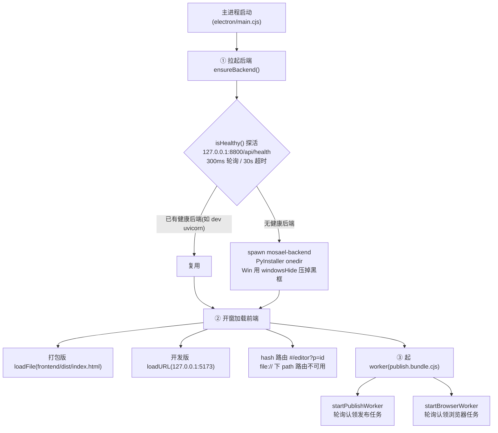
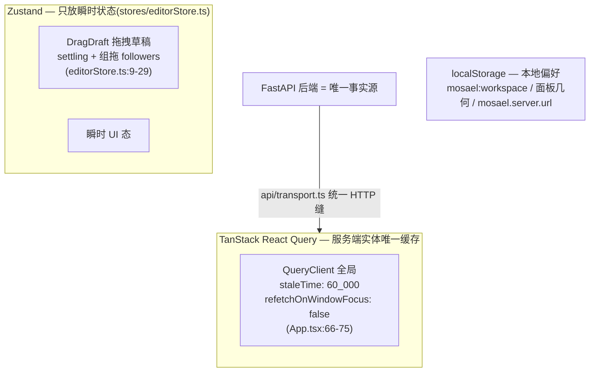
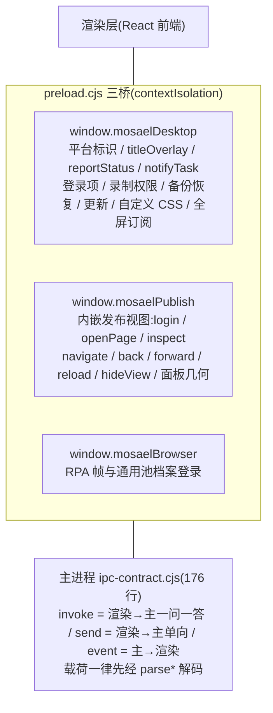
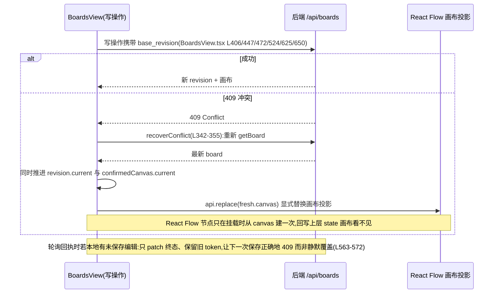

# Mosael 前端、Electron 桌面壳与官网深度分析

> 分析员:frontend-analyst · 维度:前端(`frontend/`)、桌面壳(`electron/`)、官网(`website/`)
> 证据基线:仓库 `/Users/kinda/Developer/Mosael`,版本 1.4.0(根 `package.json`)

## 0. 总览:三段自举与三个运行时

Mosael 的「前端」实际横跨三个运行时,它们的关系由 `electron/main.cjs` 编排(证据:`docs/ARCHITECTURE.md`「三段自举」):



证据:`ensureBackend()` 在 `electron/main.cjs:247`,探活 `main.cjs:226-245`,spawn 细节(含 `windowsHide: true`)`main.cjs:295-308`;开窗分支 `main.cjs:579-583`,hash 路由理由见 `frontend/src/app/App.tsx:385-386` 注释(「Hash routing survives file:// packaging」);两个 worker 的轮询认领在 `main.cjs:587-652`。

后端(FastAPI)是唯一事实源;前端、发布执行器、浏览器执行器都只是它的客户端。

### 规模与测试密度

- `frontend/src` 非测试 TS/TSX 约 **104,650 行**;测试 **267 个文件、约 22,769 行**(其中 111 个 `*.dom.test.*` 跑 jsdom)。
- 前端测试同时覆盖 `electron/` 主进程代码:`vite.config.ts` 的 `test.include` 含 `../electron/**/*.{test,spec}.*`,因为 esbuild 只打包不跑类型与用例(配置内注释)。
- 设计规约由 `frontend/src/design/*.test.ts` 棘轮守护(分层、色彩 token、控件节奏、sticky 条等 12 个测试文件)。

---

## 1. 前端骨架(`frontend/`)

### 1.1 技术栈

- **React 19 + TypeScript 7.0 + Vite 8**(`frontend/package.json`),pnpm workspace 一员。
- **Tailwind CSS v4**(`@tailwindcss/vite`),设计令牌在 `src/design/tokens.css`(`@theme inline` 把 `--color-*` 映射到 CSS 变量);昼「暖纸面」`#f6f4f0`+`#6a5cd8`、夜「暖檀黑」`#141218`+`#8a7bf0`,全平面无阴影(分层靠发丝边框)。
- **状态二分**(`docs/ARCHITECTURE.md`「前端:服务端真相 vs 瞬时状态」):



  注释解释 staleTime 取舍:页面条件挂载,默认 staleTime:0 会让每次切页首帧空态闪一下,Electron 频繁获焦会加剧闪烁;`editorStore.ts` 头注释明写「Server truth stays in React Query」。
- UI 一律 Radix/shadcn(`components/ui/`),表单 react-hook-form + zod,拖拽 dnd-kit(原生 HTML5 DnD 在 Electron 下真实鼠标不触发)。
- lint 用 **oxlint** 而非 eslint:`frontend/LINT.md` 记录了原因——项目用 TS 7.0,typescript-eslint 对 TS7 硬阻塞;只开 14 条能收到零的规则,`react-hooks/exhaustive-deps`(37 处)与 React Compiler 规则组(约 120 处)显式搁置。

### 1.2 入口与组合根

- `src/app/main.tsx`:先 `installWindowChrome()`(无边框窗的 `is-desktop/is-mac/is-win/is-fullscreen` 根类必须在 React 首帧之前,`lib/windowChrome.ts:34-39`),再 `void import("@/app/App")` 异步挂根。
- `src/app/App.tsx` 是唯一组合根之一,Provider 栈:`QueryClientProvider → Preferences → Appearance → CustomCss → Tooltip → Auth → ImagePreview`,然后 `AuthGate`(loading/offline/anonymous 三态分流)。
  - `auth.tsx:17-20` 把 **offline(令牌还在、后端够不着)与 anonymous 分开**——摆登录页等于谎称会话结束;offline 页给「重试 + ServerPicker」。
  - `WorkspaceGate`(`App.tsx:300`)把活动工作区持久化到 `localStorage["mosael:workspace"]`,刷新不会被 `list[0]` 顶掉。
  - hash 路由:`readHash/writeHash`(`App.tsx:384-399`),`PAGE_RENDERERS: Record<StudioView, …>`(`app/pages.tsx:43`)用**穷举 Record** 让「声明了页面没写渲染」变成编译错误而非空白页;3D 工作台 `SceneStudio` 走 `React.lazy`(pages.tsx:23,「带着 three.js,首屏不该为它付代价」)。
- 分层棘轮 `src/design/layering.test.ts`:`components/ lib/ api/ stores/ design/` 不许 import `features/…`,唯一组合根是 `app/`;`api/client.ts` 是 19 个 `api/domains/*` 的纯 re-export 装配入口,由 `clientAssembly.test.ts` 钉住。

### 1.3 API 层

- `api/transport.ts`:`api<T>()` 统一 HTTP 缝——`Authorization: Bearer`、`Accept-Language`(界面语言同步给后端翻它自己的文案)、`X-Mosael-Client: __APP_VERSION__`;网络层 throw 与 HTTP 层 throw 分两种错误(`ApiOfflineError` vs 带 status/body 的 `ApiError`),401 触发全局 `onUnauthorized`。
- **服务器切换(团队模式)**:`API_BASE` 模块加载时从 `localStorage["mosael.server.url"]` 解析一次(`transport.ts:5-7`);切服务器 = 写 localStorage + 整页 reload,因此 `ServerPicker` 同时挂在登录页和设置页。
- 类型由后端 OpenAPI 生成:`pnpm gen:api` = `openapi-typescript backend/openapi.json -o frontend/src/api/generated/schema.d.ts`(根 `package.json:29`)。

### 1.4 i18n 与偏好

- `app/messages.ts` 5,320 行,zh-CN / en-US 键成对(棘轮守着);`useI18n()` 出自 `PreferencesProvider`(`app/preferences.tsx`),切语言时 `setApiLocale` + 作废已缓存 query(否则页面留着上一种语言的数据)。
- 后端任务消息存 key + 参数,读时按 `Accept-Language` 翻——用户切语言后历史记录跟着变(ARCHITECTURE.md「多语言」)。

### 1.5 深链与跨页跳转

- 应用内:`lib/deepLink.ts` 的 `mosael:open-*` CustomEvent(workflow / publish task / settings),`emitOpenEvent` 用 **80/300/800ms 三连发**兜底目标视图的挂载竞速(打开同一条记录幂等)。
- 桌面外部唤起:preload 把主进程 IPC 转成同名 window 事件(`electron/preload.cjs:38-43`),渲染层 `listenDesktopDeepLinks` 落点复用同一套通道;`mosael://` **只导航不执行**(view 白名单、id 限字符集,`electron/system/deepLink.ts`)——任何网页都能触发协议,所以不能让它静默驱动自动化。
- 智能体导航:`useAgentNavigation`(挂在 Studio 层,助手面板收起时也生效),视图白名单后端 `mcp_server._VIEWS` 与前端 `VALID_VIEWS` 双挡(`App.tsx:479-488`)。

### 1.6 任务中心 ↔ 系统层的单向推送

`components/layout/TaskCenter.tsx` 轮询 `/api/jobs`(自适应 `refetchInterval`),顺手把 `{runningJobs, progress}` 经 `window.mosaelDesktop.reportStatus` 推给主进程(`TaskCenter.tsx:106`),任务终态经 `notifyTask` 上报(`:151`)。**系统层不反查后端**——托盘文案、Dock 角标、防睡眠吃同一份快照,这条单向依赖是系统层能单独测、能整体摘掉的原因(`electron/system/index.ts:20-30`)。

---

## 2. Electron 桌面壳(`electron/`)

### 2.1 主进程 `main.cjs`(927 行)的职责清单

- **品牌与单实例**:`app.setName("Mosael")` / `setAppUserModelId("dev.mosael.app")` 必须在 ready 前;`requestSingleInstanceLock`(`main.cjs:185`)防双实例——否则两个发布 worker 抢同一批任务、两套内嵌浏览器争同一个登录分区,而后端因端口健康检查复用,表面「没问题」。`second-instance` 把 argv 交给系统层(`system.adoptSecondInstance`)并唤起前台。
- **拟真开关**:`disable-blink-features=AutomationControlled`(`main.cjs:49`)去掉引擎层自动化标记,页面级补丁在 `account-view-preload.cjs`。
- **环境变量下发**:`MOSAEL_LOCAL_DESKTOP=1`(门控 `/api/assets/import-local`,团队服务器上没有)、`MOSAEL_APP_VERSION`(版本唯一真相在根 package.json,壳读得到、冻结后端读不到)、`MOSAEL_PI_SIDECAR` + `MOSAEL_AGENT_BIN_NODE=process.execPath`(打包版用 Electron 二进制当 node 拉 sidecar)、`MOSAEL_TTS_BASE_PYTHON`(冻结后端建不了 venv,指向随包解释器)(`main.cjs:268-294`)。
- **日志**:`appendMainLog` 落 `userData/logs/main.log`(5MB 轮转、0600、写盘失败不二次崩溃);`uncaughtExceptionMonitor` / `unhandledRejection` / `render-process-gone` / `child-process-gone` 全接(`main.cjs:88-115`)。后端日志打包版落 `backend.log`(10MB 轮转)。
- **冒烟测试**:`MOSAEL_SMOKE_TEST_RESULT` 驱动,阶段轨迹边走边落盘(`markSmokeStage`),结果累积合并而非覆盖;冒烟隔离 userData 到 mkdtemp(否则单实例锁让 CI 撞真实实例);`did-finish-load` 后还要 `executeJavaScript` 验证 `window.mosaelDesktop` 桥真的可用——preload 异常时 Electron 照样 finish-load(`main.cjs:540-573`)。
- **菜单**:`buildAppMenu()` 中文标签;⌘R 重新加载**先问内嵌发布视图是否在前台**(`publish.embeddedViewVisible()`),否则刷掉的是主窗口而原生视图还盖着(`main.cjs:440-455`)。
- **窗口**:1440×900、`titleBarStyle: "hidden"`,mac `trafficLightPosition` 垂直居中 56px 工具栏(`window-chrome.cjs`),Win/Linux `titleBarOverlay`;`contextIsolation: true, nodeIntegration: false`,preload 用 esbuild 打成的 `preload.bundle.cjs`(sandboxed preload 只能 require 白名单,共享 IPC 契约必须打进单文件,`main.cjs:498-501` 注释)。
- **屏幕录制授权**:`setDisplayMediaRequestHandler` 优先系统原生选择器(`useSystemPicker: true`),回退 desktopCapturer 主屏;Windows 上 `audioRequested` 给 `loopback`(`display-media.cjs`)。
- **更新**:`checkForUpdates()` 直连 GitHub API `Alndaly/Mosael`(大小写敏感,注释解释 301 静默失败史);解析不出 `tag_name` 要报错而不是假报「已是最新」(`main.cjs:364-382`);打包版启动 5s 后静默查一次,有更新推 `updateAvailable` 事件。
- **数据管理 IPC**:诊断包(`writeDiagnosticArchive`,`data-management.cjs`:脱敏 HOME/密钥/Bearer/sk- 前缀,日志只取尾部 512KB,zip 0600)、备份(后端流式下载经 `.partial` 临时文件原子改名)、恢复(`activateStagedRestore`:**停后端 → 校验 marker → 旧目录改名保留 → staged 目录换入 → relaunch**;失败回滚;下次启动健康后 `finalizeActivatedRestore` 才删旧目录,`main.cjs:809-824` + `data-management.cjs:110-161`)。

### 2.2 IPC 契约(`ipc-contract.cjs`,176 行)

- 通道名按传输方向分三组冻结:`invoke`(渲染→主,一问一答)/ `send`(渲染→主,单向)/ `event`(主→渲染)。**进入特权主进程的载荷一律先经 parse*** 解码**:`parseUrlRequest` 只放行 http(s)、`parseBrowserLogin` 强制 `persist:pool-` 分区前缀、`parseRestoreStage` 限 32 位 hex、`parseSystemStatus` 校验 `runningJobs` 非负整数与 `progress∈[0,1]`。
- 渲染层桥三个命名空间(`preload.cjs`),经 sandboxed preload 暴露给前端:



  `mosaelDesktop` 的全屏订阅是「preload 加载即订阅并缓存最新值,订阅时先补发」,消除「React 挂载晚于首帧推送」的竞态(`preload.cjs:26-29, 82-85`);`mosaelBrowser` 的 UI 登录由 IPC 强制 `persist:pool-` 分区。
- 类型契约:`preload-api.d.ts` 被前端 `vite-env.d.ts` 直接引用(`frontend/src/vite-env.d.ts:16`),主渲染两侧同一份类型。

### 2.3 系统能力层(`electron/system/`,esbuild → `system.bundle.cjs`)

注册表模式:`CAPABILITIES = [residency, power, tray, badge, notify, protocol, shortcuts, customCss]`(`system/index.ts:32`),一个能力一个模块一个 `register(ctx)`;单个能力注册失败只警告不挡启动,bundle 整体缺失也只是退化(「托盘建不出来时应用还能正常用,只是退化成关窗即退」)。

| 能力 | 要点(证据) |
| --- | --- |
| `residency` | 关窗 = `preventDefault` + `hide()`,不退出;`quitting` 标记由 before-quit/托盘菜单置位(`system/residency.ts:36-52`)。地基性动机:后端是主进程子进程,退 App = 定时任务死 |
| `tray` | 常驻的唯一可见证据,与 residency 成对 |
| `loginItem` | 开机自启带 `--hidden` 静默驻留;dev 返回 null 让设置页隐藏开关(否则开发机开机启动裸 Electron) |
| `power` | 有任务在跑时 `prevent-app-suspension`——合盖会把分钟/小时级的 ffmpeg 挂起 |
| `badge` | mac/Linux 角标、Windows 任务栏进度 |
| `notify` | 任务完成通知,**窗口有焦点时不发**(应用内已有 toast) |
| `protocol` | `mosael://` + 文件关联;只导航不执行;dev 不注册(系统级注册会劫持真实安装版);`MEDIA_EXTENSIONS` 白名单过滤拖入文件 |
| `shortcuts` / `customCss` | 全局快捷键;用户自定义 CSS(userData/custom.css,推送而非轮询) |

### 2.4 发布执行器与浏览器执行器(`electron/publish/`,esbuild → `publish.bundle.cjs`,4,998 行)

- **publishWorker.ts**:轮询后端认领发布任务,驱动每账号一个持久登录的 `WebContentsView` 跑平台适配器。并发模型「**跨账号并发、同账号串行 + 前台单槽**」:`MAX_CONCURRENT=3`(`MOSAEL_PUBLISH_CONCURRENCY` 可覆盖,夹 1–5);`running`/`rechecking`/`loginAccounts` 三个集合分开,避免复检/登录互相误判;`generation` 代数让 stop→restart 后旧回调自我了断。
- **悬浮面板几何**(`accountViews.ts`):卡片 384×244 + 26px 标题条 + 4px 内缩,视图缩放反算使**布局视口恒为 1280×800**——不缩放平台会渲染窄屏版、选择器全变。挂进窗口(参与合成)才有真实布局与 `isTrusted=true` 可信输入;原生 View 画不了圆角,圆角/阴影由渲染层在视图**下方**画(子视图永远盖在宿主页面之上),圆角值只有主进程一份、经 IPC 下发。
- **browserWorker.ts**:RPA/智能体动作队列的第二个拉取循环,与发布共用 `createSharedViews`(同一套内嵌视图与面板);分区严格隔离(`ephemeral-*`/`persist:rpa-*` vs 发布的 `persist:mosael-*`);会话面板 90s 空闲自动撤(智能体常不发 close),发布任务不设空闲撤(可能合理静默十几分钟)。
- **任务通知分工**(`main.cjs:606-634`):success/failed/cancelled 由渲染层 TaskCenter 按 job 终态报;`login_required/waiting_manual/permission_required/blocked` 四个「需要人介入」的中间态 job 仍是 running、TaskCenter 看不到,只有主进程这条 `onTaskSettled` 能报——按这条线切开,两边不重叠。
- **反检测**:`account-view-preload.cjs` 用 `webFrame.executeJavaScript` 往主世界打补丁(contextIsolation 的 preload 改不到主世界):`navigator.webdriver`、`window.chrome`、`languages/plugins`、`permissions.query`、WebGL vendor/renderer,以及 WebAuthn「有认证器就放行、没有就当场说不,唯独不能挂着」。
- **WebAuthn**(`webauthn.cjs`):macOS Touch ID 平台认证器需签名 + keychain-access-group `<TEAM>.dev.mosael.app.webauthn` + Secure Enclave 三前提,缺一静默不可用所以先判掉留日志;`select-webauthn-account` 多凭据时系统对话框选择、**必须回调一次**否则请求永挂;凭据设备绑定不跟 iCloud,用途是「在 Mosael 里新注册一把」。hybrid(扫码)Electron 根本没暴露,做不了。
- **录制权限**(`recording-permissions.cjs`):OS 权限策略收口主进程——macOS 摄像头/麦克风走 `askForMediaAccess`,屏幕录制由系统选择器承担;`openSettings` 按平台拼隐私面板深链(`x-apple.systempreferences:…` / `ms-settings:privacy-*`)。

### 2.5 契约常量

`contracts/shared-constants.json` 钉住「两个运行时都要认、而谁也不拥有」的常量:发布分区前缀 `mosael`(后端 `db.py` 与 `accountViews.ts` 拼同一个磁盘目录,错开则所有已登录账号 cookie 凭空消失且无报错)、内嵌视图头高 56px(四处实现:`publish/types.ts`、`App.tsx PUBLISH_BAR_HEIGHT`、`window-chrome.cjs`、`windowChrome.ts`)、笔记追加分隔符 `\n\n`。

---

## 3. 功能模块深挖

### 3.1 剪辑器(`features/editor/` + `stores/editorStore.ts` + `domain/timeline/`)

剪辑器是全应用最重的模块,核心设计原则:**契约语料钉住前后端一致性、纯函数域层可单测、批量端点保证手势原子性、预览单路径 + 明说式失败态**。

#### 预览渲染内核(`playback/`)

```mermaid
stateDiagram-v2
    [*] --> ready: 图片,或代理就绪且本机可解
    [*] --> transcoding: 代理还在转(或没排上队),可自愈
    [*] --> failed: 后端转码失败
    [*] --> undecodable: 代理在盘上但本机解不动(缺编解码器/文件截断)
    transcoding --> ready: 转码完成
    failed --> transcoding: 用户点重试
    undecodable --> transcoding: 重新生成代理(唯一自救)
    note right of undecodable: 只在代理确实在盘上时才成立——此前顺序反了,新素材一拖进时间线就误报
    note right of failed: blockingPreviewState 按严重度表只报播放头当前要画的素材;末尾还在转码的片段不挡住开头能放的部分
```

- **单路径架构**:预览画面只有 WebCodecs 解 720p 代理 → `CanvasCompositor` 合成一张 canvas 这一条路。曾经的 `<video>`/`` 元素兜底与 localStorage 开关已删(`playback/compositorFlag.ts`),只剩 `compositorSupported()`(`typeof VideoDecoder !== "undefined"`)环境判定。画不出来由 `previewReadiness.ts` 的四态机明说(L12-20),`assetPreviewState` 按 `media_info.proxy_status` 判定:


- **场景模型** `sceneModel.ts`:`sceneLayersAt(tracks, assetById, t)`(L55-74)返回 bottom→top 的 `SceneLayer{clip, asset, trackId, isBase}`。规则:video 轨按 position 升序;`videoTracksWithMedia` 滤掉纯文本轨;**base = 最底一条真正带画面的轨**(跳过空轨以免丢 fill_mode);同轨片段不重叠、半开区间 `[start, end)` 让切换帧恰好画一层;静音轨照样出画面(mute 只管音频)。文本/花字无 asset_id,不进画面层,另走 DOM 叠加。
- **契约语料**:`contracts/scene-cases.json`(803 行)由前端 `sceneModel.parity.test.ts` 与后端 `tests/test_scene_parity.py` 各跑一遍,单侧改语义两边 CI 一起红。改语义**先改语料**(ADR-0004)。
- **CanvasCompositor**(338 行):rAF 循环直接读 `useEditorStore.getState().playhead`,层/transform/filter 全走 ref,React 重渲染不重启绘制。解码源按 `clip.id::proxy_key:proxy_status` 键控(代理重转自动重建;同一 asset 两层不共享解码器);空闲源池按**字节预算** 96MB 保留(`IDLE_SOURCE_BYTE_BUDGET`),`park()` 关解码器留解析样本;`PREWARM_SEC = 0.8`(Monitor.tsx:32)提前建解码器防跨切闪黑;暂停防抖 signature 比对 + `SETTLE_FRAMES = 3`。最终 `paintScene`(scenePaint.ts:65-155)做 cover/contain/blur fill、opacity/transform、自由元素 mask/shadow,与 ffmpeg 导出表达式对应。
- **解码** `ProxyVideoSource.ts`(346 行):mp4box 解析短 GOP 无 B 帧代理(解碼序==呈现序),`LOOKAHEAD=12 / MAX_FRAMES=24 / EVICT_BEHIND=0.4s`,`frameAt(sec)` 按需喂样本、跳变 flush + 回退关键帧,留 `held` 兜底帧防 seek 闪黑。音频走 `WebAudioMixer`:每 clip 一条 AudioBufferSourceNode→GainNode,**AudioContext 时钟是唯一主时钟**驱动 playhead。

#### 时间线与几何

- `domain/timeline/geometry.ts`(245 行)纯函数:`timeToPx/pxToTime/clipDuration/clipEnd/sequenceDuration`;标尺 `rulerStep(minLabelPx=72)` + `rulerTicks`;**两级吸附**(`snapTimeTiered` L117-127):目标轨自身片段边缘优先,播放头/零点/跨轨边缘只在本轨无命中时参与(单一候选池会让字幕 cue 边界劫持同轨对接);`resolveMove` 首尾双边吸附取近边;`resolveTrim` 锚定素材端、`MIN_CLIP_DURATION=0.05`。
- `Timeline.tsx`(1,213 行):拖拽草稿存 `editorStore.dragDraft`,渲染侧把草稿投影成地图;insert 模式涟漪预览;组拖 followers 渲染侧投影、提交合并进一次批量。
- **editorStore.ts(121 行)无 zundo**:撤销在服务端——`undoSequence/redoSequence` mutation(EditorView.tsx:558-570),后端 `sequence_operations` 落一条 revision,zundo 只用于工作流画布。
- **一次手势 = 一条操作 = 一步撤销**:批量端点 `deleteClipsBatch / rippleDeleteClipsBatch / moveClipsBatch / cutClipRangesBatch / splitClipAtPointsBatch`(`api/domains/editor.ts`),后端 `test_delete_clips_batch.py:35` 钉住「一次 revision 一次撤销」。

#### Monitor / Inspector / 调色

- `Monitor.tsx`(580 行):z 序按 DOM 顺序(顶轨最后进 DOM = 最上);fillMode 从 `sequence.reframe.fill_mode`;字幕轨与花字走独立 DOM 层;TransformOverlay 草稿 + `tfSettleRef` 防回弹。
- `TransformOverlay.tsx`:`TRANSFORM_DEFAULTS/BOUNDS`(scale [0.1,4]、rotation ±180° 等)由 `contracts/transform-cases.json` 钉住,`transform.parity.test.ts` 与后端跑同一份语料(测试头记录「四份互不相同答案」的历史事故)。
- `keyframes.ts`:clip 内归一化进度 t∈[0,1](裁切/变速不回改关键帧),每属性独立轨线性插值 + 端点 hold;`applyTransformCommit` 已打帧属性写关键帧点、其余改基值。
- 调色:`monitorFilters.ts` 的 `FILTER_CSS`/`computeFilters` 是 ffmpeg 预设的 **CSS 近似**(函数名与注释即声明了这一点);`colorCurves.ts` 用 Fritsch–Carlson 单调 Hermite,预览走 SVG `feComponentTransfer` 查表,导出由后端烧 `curves=`——**调色 ffmpeg 权威、预览近似,是有意的**(ADR-0004);`clipAppearance.parity.test.ts`、`subtitleStyle.parity.test.ts`、`freeElementGeometry.parity.test.ts`、`audioMix.test.ts` 各跑对应契约语料。
- `Inspector.tsx`(829 行):变速、调色三组 GRADE_GROUPS、CurveEditor、ClipAppearancePanel、LutPicker、文本样式与关键帧打点。

#### 录制链路

- `Recorder.tsx`(694 行)→ `RecordingController`(工厂 + 依赖注入,265 行):状态机 idle→starting→recording→stopping→stopped/cancelled/failed;屏幕走 `getDisplayMedia`(系统音缺失抛 `RecordingStartError("systemAudio")`),摄像头 `getUserMedia` + `createMirroredCapture`;监听 video track `ended` 接屏幕原生停止按钮。`recordingSession.ts` 每路输入一个 `MediaRecorder`,**同一同步 turn 启动全部**保证对齐起点,`timesliceMs=1000`、<2048 字节抛 `EmptyRecordingError`。Provider 挂在 App 层(`RecordingProvider`)防导航卸载。
- Electron 侧:`main.cjs:507-523` `setDisplayMediaRequestHandler` + `useSystemPicker:true`,回退 desktopCapturer 主屏;macOS 首弹屏幕录制授权(`recording-permissions.cjs`)。

#### 文本类面板

- `TranscriptPanel.tsx`(763 行):逐字稿驱动剪辑——token 投影到时间线(`transcriptProjection.ts`),词/句选中→`CutRange`→`cutClipRangesBatch`;静音/填充词检测批量删除;karaoke 高亮;说话人 chips。
- `SubtitlePanel.tsx`(608 行):字幕轨编辑、分批翻译(`translateTexts` 每批 `onBatch` 增量持久化)、样式实时预览。
- `SubtitleDub.tsx`:字幕→逐条 TTS→新音频轨;`VoicePanel.tsx` = SpeechVoiceFields + SubtitleDub + VoiceLibrary 容器。

#### EditorView 编排

`EditorView.tsx`(1,330 行):CSS Grid 布局(`editorColumns` L817-823),左栏四页签独立记忆宽度(`useEditorPanels.ts`,`localStorage["mosael.editor.panels.v2"]`,紧凑断点 ≤1000px 收成两列);React Query 持有全部服务端实体,mutation 成功多用 `applySequence(updated)` 直接写缓存而非 invalidate(避免窗口期);editorStore 只装瞬时态。

### 3.2 画板(`features/boards/`):无限画布

- **画布契约**(`api/domains/boards.ts`):`BoardCanvas { items, edges, markers? }`(L57-61),`Board.revision` 是乐观并发令牌;`BoardItem` 七类 kind(note/image/video/audio/frame/scene/document),每项自带 `form`(prompt/provider/model/parameters/source_assets/prompt_document——**画布 JSON 的一部分,不是 React 选中态副产品**)与 `run`(`{status: idle|queued|running|succeeded|failed|cancelled, job_id?, error?}`,L32-36)。`boardItemState.ts`:`itemIsRunning` 要求**既有 job_id 又是 queued/running**,防止拿脏快照启动永不收敛的轮询;`boardNodes.tsx` 的 `PendingSlot` 把无产出节点分派到 Queued/Generating/Failed/Cancelled/EmptySlot 五种视觉,`RUN_STATE_CLASS` 统一六态描边。
- **base_revision 乐观并发与 409**:`Board.revision` 是乐观并发令牌,所有写操作携带 `base_revision`,冲突恢复收口在 `recoverConflict`:



  原则:「令牌与其描述的投影是一个单元」——后台 refetch 绝不能只推进 token 留下旧画布。
- **产出回执**:`generate`(L387-435)调 `POST /api/boards/:id/generate`(后端即 `create_generation_job` 漏斗),返回后立刻 `api?.patch(itemId, {run:{status:"running", job_id}})` 把那一格标成「在生成」并加入 2.5s 轮询名单;轮询发现 `asset_id`/`error` 后用 `boardSettlementPatch` 把服务端终态整组写回;重进画板从节点自身 run 状态恢复待观察列表,不依赖组件挂载期临时 state。
- **节点与连线**:`toCanvas` 序列化时**过滤悬空边**(两端必须都活着),marker 分回 markers 数组;`boardUpstream.ts` 每次从当前连线**重算**上游——上游图/视频当参考素材,便签/文档文字当提示词,文档取不到则 blocked 禁止生成;`NodeComposer` 的模型默认值全部从后端能力描述符的 `default_*` 取,上游素材按角色槽位自动挂入;`PromptEditor` 用 TipTap 实现提示词句子内的 `@` 素材引用(原子 chip,`prompt_document` 持久化)。
- **协作层**:评论模式点击产生锚点草稿,`moveCommentAnchorByScreenDelta` 在 flow 坐标系量位移保证任意缩放拖动稳定;撤销/重做不走 zundo——`canvasHistory.ts` 存序列化快照串,因为 React Flow 的 nodes/edges 才是事实来源。`BoardPlayer` 的视频节点离视野即卸载 `<video>`(Chrome 解码器上限),`MIN_LIVE_WIDTH=96` 挡缩放误挂载。

### 3.3 工作流(`features/workflows/` + `stores/workflowGraphStore.ts`):声明驱动的 DAG 编辑器

- **节点表单完全由后端 NODE_TYPES 的 config 声明生成**:`ConfigSpec`(WorkflowsView.tsx L2423-2440)镜像 `type`(template/string/number/object/graph/code)、`options`、`default`、`advanced`、`depends_on`、`options_from`、`allow_custom`;`renderField`(L3269-3396)按声明派发控件——graph→只读概览(LoopBodyEditor 钻入子画布)、object→MapField/JsonField、code→CodeMirror、template→RefEditor(`{{上游.输出}}` 渲染成可整体删除的原子标签)。`options_from` 走**唯一**动态接口 `GET /api/workflows/field-options`,父字段值变就重查;前端**不认识任何具体节点**(注释:插件节点是运行时类型,写特例永远覆盖不到)。`allow_custom` 决定能否手填清单外值;ComfyUI 式双模:非 object 字段可切「连接态」暴露输入接点。
- **撤销**:`workflowGraphStore.ts` = zustand + **zundo** temporal(这是 zundo 在前端的唯一用途,剪辑器不用它),每工作流一个 store;拖拽合并用 **leading-quiet**(COALESCE_MS=400,一串连发只记串首快照)——注释记录了 leading+trailing 节流记两条、按一次 ⌘Z 只挪回几像素的历史 bug;撤销上限 100。
- **悬浮面板 z 序**:`components/app/useFloatingPanel.tsx` 模块级 `zOrder` 数组 + `useSyncExternalStore`,`zIndex = 55 + 下标`(Z_BASE=55 保证「降到最低」不沉到画布下);⌘[/⌘] 调层级,`focusedId` 仲裁画布节点与悬浮窗的快捷键冲突。**节点永远不得高于悬浮面板由结构保证**:React Flow viewport 自带 transform 层叠上下文。
- **AI 编辑与修订**:智能体经 `edit_workflow` 细粒度算子(add_node/connect/set_node_config/remove_node)+ 确认卡;批准后画布 5s 轮询 + `updated_at` 比对自动跟进,`syncFromServer` 区分自己保存引发的 refetch(selfSaveRef)与外部改动,重建节点时保留 React Flow 选中态。修订历史 `WorkflowRevisionHistory.tsx` 列不可变修订(v 号 + source 徽标 create/edit/restore/import/template/agent/migration + graph_hash 前 10 位),**恢复是追加新修订而非覆盖**;queryKey 含 `workflow.revision` 防缓存旧窗口。运行事件由 `runSteps.ts` 归约成 per-node step,执行历史面板与画布实时叠加共用同一归约。

### 3.4 3D 工作台(`features/scenes/`)

- `SceneStudio` 走 `React.lazy`(pages.tsx:23)——three.js 是大依赖,lazy + Suspense 移出首屏 bundle;解码器(KTX2/Draco/meshopt)由 `vite.config.ts` 的 `threeDecoders()` 插件**从装着的那个 three 里取**、按固定文件名落盘(升级 three 自动跟上,不走 CDN,可离线)。
- `SceneStudio.tsx`(1,550 行)是容器:SceneViewport(OrbitControls/TransformControls/GLTFExporter)/ SceneDopeSheet / SceneCameraPanel / SceneInspector / SceneHistory / SceneBlender(Blender 联动);保存用同一套乐观并发(`saveScene` 带 `base_revision`,`api/domains/scenes.ts` L60-68)。
- 数据模型:`SceneContent { objects, shots, lighting }`;`track: Keyframe[]` **空轨即静止**;镜头与机位成对创建(`makeShot` 必须指向真实存在的相机,后端会拒);采样 `sampleObject/sampleCamera` 端点保持 + 按镜头 easing 插值(smoothstep `u*u*(3-2*u)`)。
- `sceneTracks.ts` 关键帧纯逻辑层:`MAX_KEYS=100`(与后端上限一致)、`EPSILON=0.001` 判同帧、`moveSceneKeys` 批量平移原子化(碰撞或越界整体不落);`SceneDopeSheet` 拖帧按 `SHOT_FPS` 吸附;手动调整过的物体进 posing 态,采样值不会在下一帧把它抹回去,直到按 `I` 打帧(SceneStudio.tsx L1287-1291)。

### 3.5 智能体对话壳(`features/agent/` + `features/ai-studio/`)

智能体对话是一个**功能模块**而非通用件(此前散在 `components/agent/` 57 个文件,导致 components 反向依赖 features;分层棘轮 `design/layering.test.ts` 守着这条线)。

- **共用面板**:`CanvasAgentChat`(683 行)是工作流/画板/剪辑/3D 四处共用的常驻智能体面板,只收 contextLine/emptyHint/placeholder/rectKey 四个差异参数;`docked | floating` 两态,悬浮几何由 useFloatingPanel 按 rectKey 各记各的。
- **流式协议与确认卡双层时序**:

```mermaid
sequenceDiagram
    participant UI as 会话面板(CanvasAgentChat)
    participant SSE as lib/sse.ts readSseData
    participant BE as 后端 /api/agent
    participant CC as ConfirmationCenter(全局浮层)
    participant IC as InlineConfirmations(会话内联)
    UI->>BE: fetch GET /sessions/{id}/stream(带 AbortController)
    BE-->>SSE: SSE 事件流 {text, timeline}
    SSE-->>UI: 增量解码后整帧替换(坏事件不拆流;切会话/卸载必 abort)
    BE->>BE: 智能体触发需确认工具
    par 双层轮询
        CC->>BE: 轮询 /confirmations?status=pending(2.5s,payload 默认展开 details open)
    and
        IC->>BE: 会话内联三档 once / session / reject
    end
    Note over CC,IC: confirmSurface.ts 注册机制保证同一张卡不两处显示
    IC->>BE: 本会话始终允许 = 先 PATCH auto_allow_tools 白名单再 approve
    BE-->>UI: 批准后结果经 SSE 流回会话
```

  SSE 解码处理 UTF-8 跨包、`\r\n\r\n` 事件边界、多 data 行合并、流尾缺终止空行的兜底;abort 是因为 HTTP/1.1 连接占用。payload 默认展开(`<details open>`)的理由:add_node 可藏任意 Python,摘要不足以构成知情同意。SSE 之外全靠 React Query 多频轮询:sessions 4s、messages 1.5s、queue 1.5s、usage-events 仅 running 时 1.2s。
- **ChatBubble**:主/子智能体共用渲染语言;compaction 折叠为 CompactionNotice;`payload.from_agent_session` 的消息画「来自其他智能体」徽章(结构化字段,不做信封文案匹配);脚注(耗时/token/计费)悬停显形。
- **ChatComposer**:草稿是 TipTap JSONContent 而非字符串,`@` 引用是原子节点;输入法组字/菜单开着/Shift+Enter 均不发送。
- **InlineQuestions**:ask_user 选择卡,2s 轮询;多选/单选统一为集合、「其它」是自由文本;**不能被「本会话始终允许」自动答掉**——自动回答等于让模型自己编一个。
- **SubagentPanel**:子智能体跑在 sidecar、结束即散,会话视图由存档合成——从 timeline 挑 `run_subagent` 工具卡、解 `details.subagent`(存档**只进 details 不进 content**,省父模型上下文正是派子智能体的意义);渲染复用 ChatBubble + TraceView;「看得到全貌,不可继续」如实呈现。
- **ContextMeter**:按实际占用 `used/window` 报「剩余」水位,WARN_RATIO=0.8 与 sidecar `COMPACT_RATIO` 逐字一致(不一致时用户看到的水位和真正触发压缩的时机对不上)。
- **useAgentNavigation**:open_view 工具把跳转意图写在会话行 `pending_view`,前端轮询到后执行跳转并 `DELETE /view` 消费一次;doneRef 防 DELETE 在飞期间连跳;**刻意不走 SSE**——面板关了也要能跳。
- **免提语音**:`useVoiceLoop` 接成环:麦克风 → `UtteranceDetector`(滞回阈值 startFactor 3.5/endFactor 2 + hangover 900ms + 最短 350ms 最长 110s,纯逻辑可测)→ `/api/asr/dictate` → 发消息 → `/api/agent/speech` 临时 TTS;barge-in 是同一 VAD 的副产品;`VoiceDock` 是应用级浮标(App.tsx:546 按本地偏好挂载)——「手在别处、面板收起来了的时候还叫得动」。
- **trace/**:TraceView 是对话的排查视图,九类事件 KIND_LABEL,未知值一律「—」不显示 0。
- **AiStudio**(1,411 行)三 tab:chat(= ChatWorkspace,agent 壳完整版 + SessionList)/ generate(图像视频生成,镜像 chat 的左右栏)/ audio;`GenerationModelGate` 在能力未配默认模型时做闸。

### 3.6 发布、浏览器池与其余页面

- **publish**:`PublishView` 轮询 `publish-tasks`;状态集 ACTIVE={queued,running,pending},BLOCKED 可恢复集(login_required/waiting_manual/permission_required/blocked——与 Electron `onTaskSettled` 的四个通知态一一对应);平台属性全部来自 `/api/publish/platforms` 后端声明。`AddAccountDialog`:**账号 = 挂平台的浏览器池档案**,建成后同刷 publish-accounts 与 browser-profiles。
- **browser-pool**:BrowserProfile 一屏管全,发布账号复用档案的登录/复检;通用档案可被工作流/智能体任意站点复用;UI 登录走 `window.mosaelBrowser.openLogin`(IPC 强制 `persist:pool-` 分区)。
- **scheduler**:定时任务 + webhook `/api/hooks/scheduled-tasks/{id}?secret=`;运行记录复用 jobKinds 图标与 JobChildren。
- **plugins**:实例 CRUD、OAuth、凭据、权限、能力、调用记录;PluginMarket 的 `upToDate` 用**版本字符串判等而非语义化比较**(注释解释:不同源无法比大小)。
- **settings**:`settingsSections.tsx` 是唯一结构声明(导航/内容/搜索/深链都从这一份推出);供应商三层 UI——连接(vendor preset 驱动表单)/ 模型(启用、上下文长度、推理/视觉)/ 能力默认(一个下拉跨连接选模型);执行面 automation = AutopilotRules 三闸(http_request/publish/run_code × ask/judge/always);`AiRuntimeSection` 管 AI 出站重试次数 0..10。
- **statistics / home / media / notes / collaboration / admin**:统计页仅打开时 5s 刷新;素材库含 URL 导入、降噪、对比视图;笔记 tiptap + appendMerge 追加合并(分隔符 `\n\n` 由 shared-constants 契约钉住);CollaborationSheet 对 subject 不认识,board/workflow 共用同一接口;admin 入口仅部署管理员可见但**藏起来的入口不是权限**——后端每条 /api/admin 各自把关。

### 3.7 外壳组件(`components/layout/`)

- `navLabels.ts`:页面清单只有一份,StudioView 联合类型 + 分组 placement;AppShell 侧栏、面包屑、PAGE_RENDERERS 三处都从它推导,`Record<StudioView,…>` 让漏配变成编译错误。
- `TaskCenter.tsx`:任务总线统一入口,轮询 `/api/jobs?top_level=true`(子任务收纳),refetchInterval 按活跃度自适应;监听 `mosael:open-tasks`,带 id 时按 id 现取 getJob 开详情而非在列表里找;只有任务中心播报(ADR-0018)——`jobKinds.tsx` 的名字/提示/跳转页由后端 `GET /api/jobs/kinds` 声明,前端只补图标表与「资源 → 缓存键」表。
- `CommandPalette`:⌘K + `mosael:open-cmdk` 事件;搜素材/工作流/发布任务,命中后走同一套深链事件。
- `ServerPicker`:本地/团队服务器切换,远程先探活 `/api/health` 4s 再给「仍要连接」兜底。

---

## 4. 官网(`website/`)

### 4.1 技术栈与路由

- **Next.js 16.3.4(App Router)+ React 19 + TS 7 + Tailwind v4 + shadcn/ui**;MDX 用 `next-mdx-remote` + `remark-gfm` + `rehype-slug`;主题 `next-themes`;GA4 走 `@next/third-parties/google`(`website/package.json`)。
- 全部路由住在 `src/app/[locale]/` 动态段下,**这一层 layout 就是根布局**——`<html lang>` 必须随语言变,而真正的根布局拿不到动态参数(`src/app/[locale]/layout.tsx:45-48`)。`/` 由 `next.config.ts:29-31` 的 `redirects()` 收口到默认语言;**不做 Accept-Language 协商**(不做 middleware,保证可静态生成)。`generateStaticParams` 按语言静态产出,插件详情页按 `LOCALES × plugins` 全量预渲染,`search.json/route.ts` 用 `force-static`——全站实质是构建期静态生成,但未显式开 `output: "export"`。
- **i18n**:en / zh 两种,默认英文(`src/i18n/config.ts`);UI 文案集中在 `src/i18n/messages.ts`(zh/en 两份,英文受 `Messages` 类型约束防漂移),**文案不进 JSX**——JSX 会把中文换行折叠成多余空格(messages.ts 头注释);文档正文按语言分目录。

### 4.2 页面与内容

- 页面:首页(按「无限画布→3D 场景→素材→剪辑→AI 智能体→工作流」六章节组织,`page.tsx:17-24` CHAPTERS)、changelog、插件市场 + 详情、工作流模板、文档三节,另有 `robots.ts`/`sitemap.ts`/`search.json`。**没有独立下载页**:首页 CTA 直指 GitHub Releases(`src/lib/site.ts`);changelog 实时拉 GitHub Releases API(1h revalidate),失败回退快照 `content/releases.json`;release notes 只做纯文本摘录、不执行 MDX(`release-data.ts:30-40`——不信任外部输入,`javascript:` 注入会被改写)。
- `content/` 是 MDX:`content/docs/<zh|en>/<start|guides|about>/*.mdx`,frontmatter **手写解析而不引入 YAML 依赖**(`src/lib/docs.ts:37-49`);导航六组只在 `src/lib/docs-navigation.ts` 维护,物理目录保持不变以保留已发布 URL。文档配图带 `capture-manifest.json` 哈希清单,由 `scripts/record-doc-media.py` 录制,URL 带 `?v=` 版本号。

### 4.3 插件市场(与桌面端的分工)

- `website/public/plugins/registry.json` 由仓库根的 `scripts/sync-plugin-registry.py` 扫描 `plugins/examples/*/mosael.plugin.json` 生成——**索引不手写**,防版本/权限漂移;`backend/tests/test_plugin_registry_in_sync.py` 校验索引与 examples 一一对应。
- 下载地址刻意用 `releases/latest/download/{id}.zip` 而非钉版本号:索引由网站部署、zip 由发版 CI 产出,各走各的(脚本注释记录了挂不存在 tag 的坑);CI 打 tag 时把每个插件打成 `<id>.zip` 上传。
- **安装动作在桌面应用内**:网站详情页只有安装说明与源码链接;后端默认市场索引 URL 即 `https://mosael.com/plugins/registry.json`(`backend/app/api/routes/plugins.py:63`),前端市场对话框 `disabled={!entry.download}`(`frontend/src/features/plugins/PluginMarket.tsx:345`)——download 为空时按钮禁用而不是点了 404。
- 值得注意:**网站插件页并不读 registry.json**,而是构建期直接重扫 `../plugins/examples` 的 manifest(`src/lib/registry.ts:56-82`);registry.json 是静态托管给桌面应用消费的。

### 4.4 构建、部署与测试

- `website/pnpm-workspace.yaml` 是**独立 workspace**;`next.config.ts:12` 显式 `turbopack.root` 防止 Turbopack 误判仓库根;TS 7 下用 `experimental.useTypeScriptCli` 让 `next build` 调 `tsc` 做类型检查。部署目标 Vercel,生产域名 `https://mosael.com`;GA4 未配置则不注入脚本。
- 测试:`node --experimental-strip-types --test test/*.test.mjs`(直接 import `src/lib/*.ts`)——release 过滤排序与 URL 防注入、双语文档导航恰好出现一次、文档媒体 sha256 与 16 场景 × zh/en × light/dark 录制齐全性。另有 pytest 侧 `test_site_docs_stay_in_sync.py` 与 Playwright 脚本 `verify-docs-navigation.py` 做跨仓库一致性。已知坑与前端一致:`pnpm lint` 跑不了(typescript-eslint 不支持 TS 7)。

## 5. 横向观察与风险

### 5.1 贯穿性设计范式

1. **「一处声明,多处推导」**:navLabels(页面)、settingsSections(设置)、NODE_TYPES(工作流节点表单)、job_catalog(任务播报)、vendor 预设(供应商表单)、generation catalog(生成参数)——前端渲染后端声明,不硬编码;每一处都有棘轮测试守着,因为违反时**不报错,只是安静地少一块能力**。
2. **契约语料钉住跨运行时一致性**:`contracts/*.json` 九份(scene/transform/clip-appearance/subtitle/free-element-geometry/audio-mix/context-meter/marker-shortcut/shared-constants),前端 vitest 与后端 pytest 各跑一遍;改语义先改语料。
3. **明说式失败代替静默降级**:预览画不出来给四态 + 重试按钮而非退回另一条画法;更新检查解析不出版本号要报错而非假报「已是最新」;压缩失败降级为截断但如实回报;「offline ≠ anonymous」。
4. **撤销粒度与用户感知对齐**:剪辑走服务端批量端点(一次手势一条 revision),工作流走 zundo leading-quiet 合并,画板走序列化快照串——三种机制各自贴合其事实来源,没有强行统一。
5. **Electron 特权面的纵深防御**:IPC 载荷进主进程一律先 parse(分区前缀、URL scheme、stageId 字符集);协议只导航不执行;contextIsolation + sandboxed preload;诊断包脱敏;反检测补丁注进主世界。
6. **状态归属纪律**:React Query = 服务端实体唯一缓存;Zustand = 瞬时草稿;localStorage = 本地偏好(工作区选择、面板几何、服务器地址、语音浮标);画布 JSON 自带 form/run 不依赖 React 选中态。logout/401 时 `qc.clear()` 防止下一位用户看到上一位的缓存(auth.tsx:50-55)。

### 5.2 值得注意的风险与权衡

- **轮询密度**:智能体生态在 SSE 之外叠加了 5+ 条 1.2–4s 的轮询回路,画板另有 2.5s 回执轮询、确认卡 2.5s、选择卡 2s——本地单用户无碍,团队服务器模式下并发客户端的 QPS 值得关注。
- **单体大文件**:WorkflowsView.tsx 3,967 行、BoardCanvas.tsx 1,751 行、SceneStudio.tsx 1,550 行、AiStudio.tsx 1,411 行、EditorView.tsx 1,330 行、messages.ts 5,320 行——功能内聚但单文件认知负荷高,靠文件头长注释维系。
- **lint 空缺**:typescript-eslint 不支持 TS 7 导致 eslint 路线封闭(前端与官网同),oxlint 只开 14 条;`react-hooks/exhaustive-deps` 37 处与 React Compiler 规则组约 120 处显式搁置,依赖人工纪律与测试补偿。
- **hash 路由的局限**:`file://` 兼容的代价是 URL 表达力弱(query 参数自拼),深链靠 `mosael:open-*` 事件三连发兜底挂载竞速——务实但脆弱(80/300/800ms 之外挂载的更慢视图会丢事件)。
- **WebAuthn hybrid 缺位**:扫码/手机 passkey 是 Electron 未暴露的能力(webauthn.cjs 头注释),只能等平台开放。
- **预览与导出的有意分歧**:调色预览是 CSS 近似(canvas 做不了 curves/lut3d),UI 已明示;新贡献者容易把「预览和导出不一样」一概当 bug。

