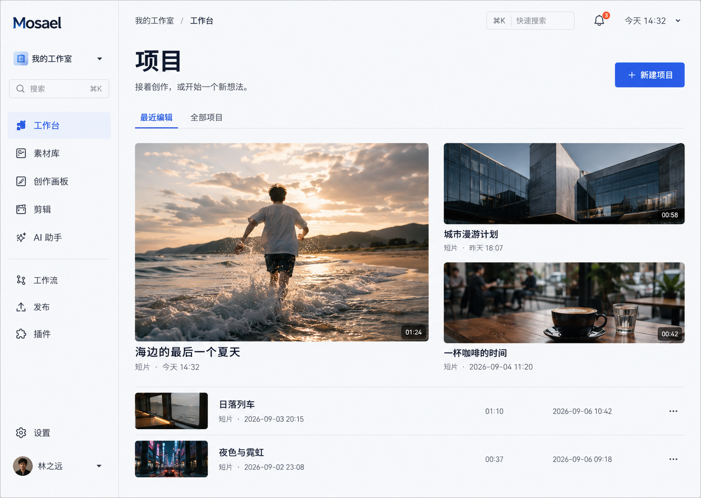
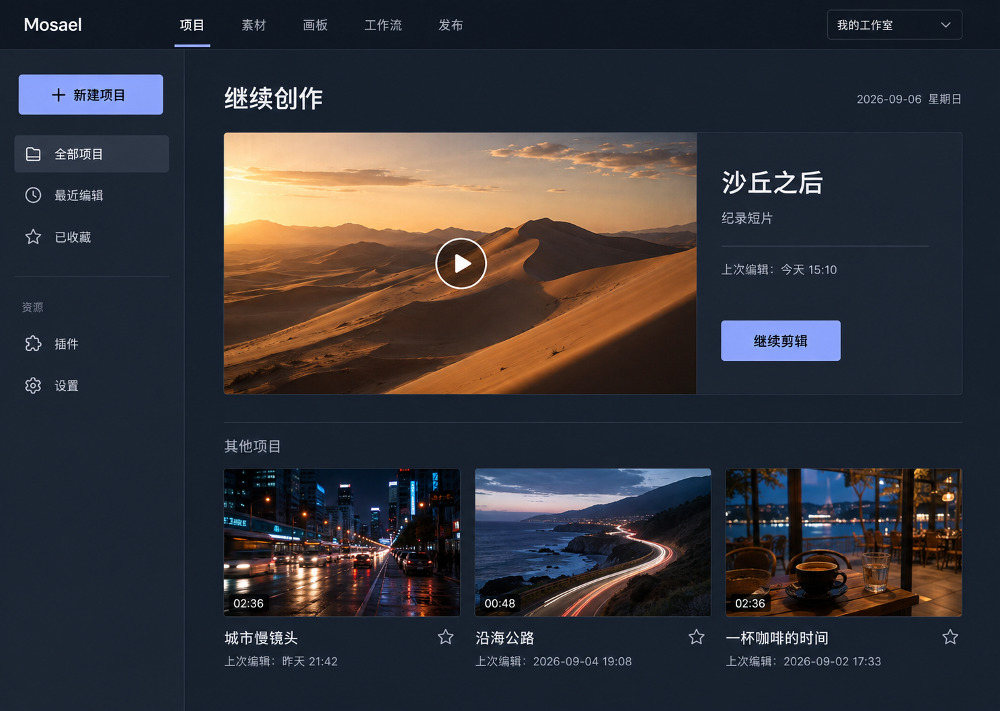
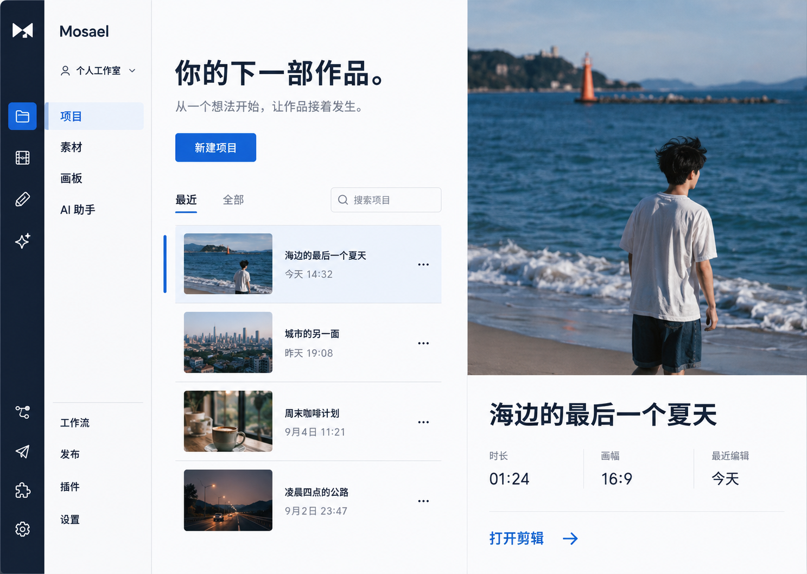

# Mosael 全新设计语言：方向提案

日期：2026-09-06。状态：已选定第一套「开放片场」，并接入产品。本文保留方向探索记录；实际落地规范与验证范围见 [实施记录](implementation.md)。

本提案响应“专业、年轻、完全从零，覆盖布局、结构、文字、配色等所有界面设计”的要求。
产品能力与数据关系来自当前应用源码；现有视觉风格、组件外观和导航布局不构成约束。
方向图是 AI 生成的概念稿，示例作品、人名、时间和图片不是用户数据，也不是可运行界面。
图中的字体与尺寸只能作为视觉意图；实现需要按照选定规范重新测量、校验。

## 设计目标

Mosael 是视频创作工作室。第一层应该让人找到作品和开始创作；精细控制在需要的时候出现。

- 专业：状态可靠、层次明确、操作可预测、密集信息仍可读。
- 年轻：由作品内容、清楚有力的排版和少量鲜明强调色表达。
- 创作优先：首页突出继续工作，编辑器突出监看与时间线，素材库突出内容。
- 全新语言：从任务与内容重新建立结构，再决定组件与视觉细节。

## 三套视觉方向

聊天中的展示顺序：开放片场、剪辑室、创作目录。用户已选定开放片场。

### 开放片场

文字侧栏 + 明亮工作面 + 不对称作品网格。作品缩略图承担主要色彩，控件安静、明确。

| 角色 | 候选色 |
| --- | --- |
| 工作面 | `#F6F8FB` |
| 面板 | `#FFFFFF` |
| 主文字 | `#20283B` |
| 主操作 | `#315AE8` |
| 选中底色 | `#E9EEFF` |
| 少量视觉强调 | `#E88A54` |

适用倾向：日常项目、素材和团队协作。实现时需要删去概念图中重复的搜索入口。

### 剪辑室

顶部产品导航 + 局部目录 + 沉浸内容面。当前作品与继续操作成为主角，深色来自分层表面。

| 角色 | 候选色 |
| --- | --- |
| 工作面 | `#202733` |
| 面板 | `#283241` |
| 主文字 | `#EDF2F8` |
| 次级文字 | `#A5B1C0` |
| 结构分隔 | `#3A4658` |
| 主操作 | `#A8B7FF`，搭配深色文字 |

适用倾向：长时间剪辑与视觉创作。概念图中的“收藏”是待评估的交互提案，不能假定已有后端能力；
若不进入本次功能范围，应替换成已有项目筛选。“新建”与“继续”需要确定一个主操作层级。

### 创作目录

项目列表 + 大预览，以选择作品和阅读内容为核心。排版更鲜明，适合大量项目的快速筛选。

| 角色 | 候选色 |
| --- | --- |
| 工作面 | `#FBFCFD` |
| 主文字 | `#182943` |
| 主操作 | `#0868CF` |
| 选中底色 | `#DCEBFA` |
| 少量视觉强调 | `#E96957` |

适用倾向：以内容浏览和项目管理为中心的创作者。实现时需合并图中重复的图标与文字导航，
压缩标题区，并测试长项目名；不能照搬图中的大幅竖向裁切作为所有视频的预览规则。

## 信息架构提案

能力必须完整保留，菜单按工作任务分组。具体是顶部还是侧栏，由视觉方向决定。

| 分组 | 入口与职责 |
| --- | --- |
| 创作 | 项目、素材、画板、AI 助手；从项目进入剪辑 |
| 自动化 | 工作流、定时任务；提供运行记录和失败定位 |
| 交付 | 发布作品、发布账号、执行设备与历史记录 |
| 工作室 | 插件、成员与权限、偏好设置 |
| 管理 | 部署管理仅在有权限时可见 |

“工作区”始终可识别、可切换；素材和 AI 会话属于工作区，不能在重设计时错误绑定为项目私有。
剪辑展示当前项目。浏览器环境管理保留独立入口，在结构上靠近发布账号与执行设备。
入口重新分组不改变后端权限规则，也不能让管理员入口成为普通用户的功能。

## 布局系统

以下是用于下一轮样板验证的起始规格，不是已验证的生产尺寸。

| 页面类型 | 结构与重点 |
| --- | --- |
| 项目与素材 | 导航、页面标题与主操作、筛选、内容区域；可切换网格与列表 |
| 剪辑 | 项目工具栏、资源区、监看区、属性区、时间线；面板可调整、折叠 |
| 画板 | 画布为主，工具贴近操作；对象属性按选择出现，评论与创作工具分开 |
| AI 助手 | 会话目录、对话、按需展开的结果或引用；输入区持续可达 |
| 工作流 | 工作流列表进入节点画布；运行检查与节点编辑有明确模式 |
| 发布与任务 | 状态驱动的列表，选中后查看详情；错误与下一步同处展示 |
| 插件与设置 | 分类导航和表单主区域；说明、字段、保存反馈形成一个完整操作单元 |

起始尺寸：标准侧栏 208–224px；上下文面板 240–288px；属性面板 280–320px；
标题与工具栏 48–56px；普通页面边距 24–32px；密集编辑区域边距 12–16px。
在 1440×900、1280×800 和 1024×768 下验证，窄窗口优先折叠次级面板。
拖拽区域、窗口控制、系统菜单和内嵌发布视图必须遵循 Electron 的真实窗口边界。

## 字体与文字层级

- 中文界面使用清晰的现代无衬线字体；系统回退为苹方、微软雅黑和通用无衬线。
- 拉丁字体候选是 Manrope 或 IBM Plex Sans，选定一个方向后统一；不增加第三套装饰字体。
- 字体须支持离线使用；交付时记录实际字体文件与回退效果，不能让网络字体决定布局稳定性。
- 页面标题 28–32px，区块标题 18–20px，正文与表单 14–15px，辅助说明 12–13px。
- 时间码、轨道标尺等精密信息可以使用等宽数字；常规按钮与导航不使用小号等宽字。
- 正文行高约 1.5，控件行高约 1.3；长说明限制阅读宽度，文件名可在详情中完整查看。
- 简体中文与英文都需验证；关键操作不因翻译变长而被截断。

## 色彩与主题规则

原始色值与语义角色分开。统一定义工作面、面板、悬浮面、主文字、次级文字、边框、
主操作、选中、焦点、成功、警告和错误，业务页面只消费语义角色。

强调色只承担主操作、当前选择和少量引导。工作流类型和时间线媒体类别可有功能色，
必须配合图标或文字识别，不能让不同页面自行发明一组颜色。

浅色、深色使用同一套结构和语义；深色需要单独调节亮度与层次，不做简单反色。
把正文对比度至少 4.5:1、可识别的控件和焦点边界至少 3:1 作为验收目标，实际组合必须测量。
素材预览的色彩判断区保持中性，彩色装饰不能改变视频周围的视觉适应。

## 组件规则

| 组件 | 起始规范 |
| --- | --- |
| 按钮 | 标准高 36px，密集工具条 28–32px；每个操作区域明确一个主按钮；不普遍胶囊化 |
| 输入 | 标准高 36–40px；标签常驻，单位明确；错误说明关联到对应字段 |
| 选择与开关 | 布尔值使用开关或复选框；选项有可读标签，不暴露参数类型占位符 |
| 圆角 | 工具控件 6–8px、媒体容器 8–12px、浮层 12px；头像可圆形 |
| 间距 | 4px 基础步进，常用 4、8、12、16、24、32；间距表达分组关系 |
| 列表 | 对齐、留白和行分隔优先；每行独立卡片仅用于真正独立的对象 |
| 弹窗 | 聚焦单一决定或短任务；长编辑流程进入页面或侧面板 |
| 图标 | 一套线性图标体系，16/20/24px；首次识别入口带文字；纯图标操作提供可访问名称 |
| 状态 | 默认、悬停、按下、焦点、选中、禁用、进行中、成功、失败均有明确规范 |
| 提示 | 普通成功使用轻量反馈；失败同时说明原因与可执行的下一步 |

点击中的操作不重复触发；按钮宽度不因加载标识出现而跳动。
视觉上“已取消”“已保存”“已发布”的状态只能来自对应操作的真实确认。

## 文案语言

以具体动作和用户对象命名，减少内部术语。每个按钮应让人知道下一步会发生什么。

| 场景 | 文案示例 |
| --- | --- |
| 素材为空 | 还没有素材。导入视频、图片或音频，开始创作。／导入素材 |
| 插件未授权 | 连接百度网盘后，即可导入和上传文件。／连接百度网盘 |
| 文件导入 | 导入到素材库；明确显示目标工作区 |
| 未选工作区 | 先选择一个工作区，确定文件导入到哪里。／选择工作区 |
| 表单失败 | 保存失败：连接已过期。重新连接后再试。／重新连接 |
| 任务进行中 | 正在导出，3 / 8 个片段；只有真实可计算时显示剩余时间 |
| 保存完成 | 更改已保存 |
| 权限不足 | 你没有编辑这个工作区的权限。联系工作区管理员获取权限。 |

“运行”“导入”“上传”“保存”各有固定含义。状态解释与操作放在同一视线范围。
不把 asset_id、fs_id、布尔值或协议错误直接当成普通表单的用户语言。
高级工具调试可以展示技术字段，但应有对象选择、字段说明和工作区归属。

## 动效与可访问性

动效解释动作结果：展开、选择、拖拽、完成。常规反馈从 120–180ms 起评估，
面板过渡从 180–240ms 起评估；尊重减少动态效果偏好。

键盘可以完成导航、检索、选择、提交、取消；浮层管理焦点并支持 Escape。
颜色不是唯一状态载体；焦点不能与选中混淆。触控使用更大的点击区域。
长时间运行、断网、连接过期、权限不足、数据冲突和空内容都有明确的设计状态。

## 后续交付与验收范围

1. 选定视觉方向并修正概念稿中重复导航、重复主操作等问题。
2. 给出完整浅深色语义变量、字体、尺寸、间距、圆角、图标和动效规范。
3. 制作组件展台，涵盖表单、表格、列表、菜单、弹窗、通知与状态。
4. 设计项目、素材、剪辑、画板、AI 助手、工作流、发布、任务、插件和设置的代表状态。
5. 用真实交互样板验证新建项目、导入素材、打开剪辑、运行工作流和连接插件等主要路径。
6. 分模块接入现有业务逻辑；保持数据、权限、取消和工作区归属等已修复行为。
7. 在真实窗口和浅深主题中检查长文字、缩放、键盘操作、滚动、浮层和面板折叠。

本次方向提案不宣称上述实现与验收已经完成。最终方案需要同时通过“是否好看”和
“是否让核心任务更清楚、更顺畅”两项判断。
