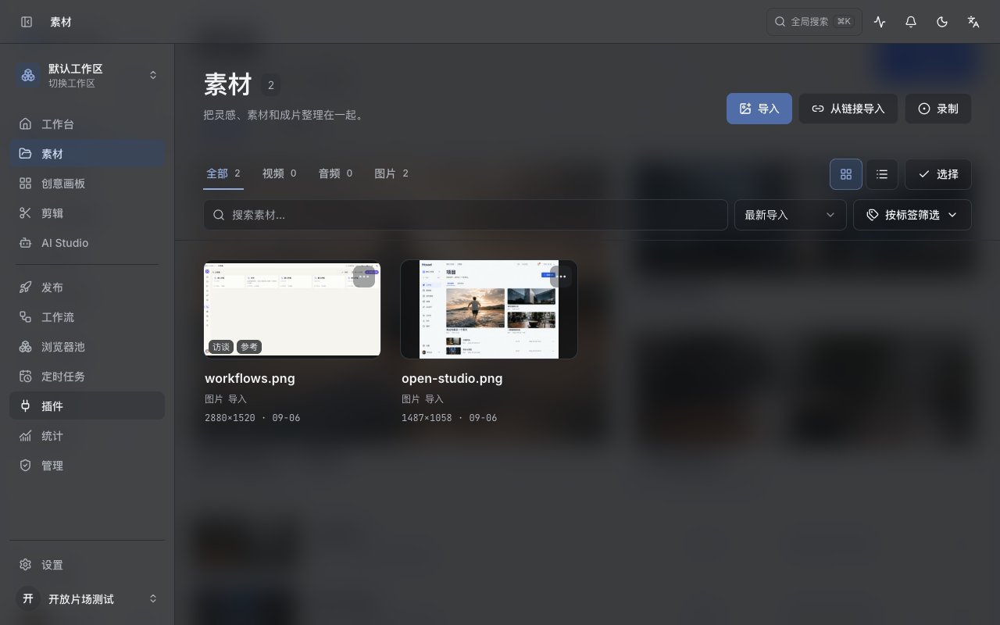
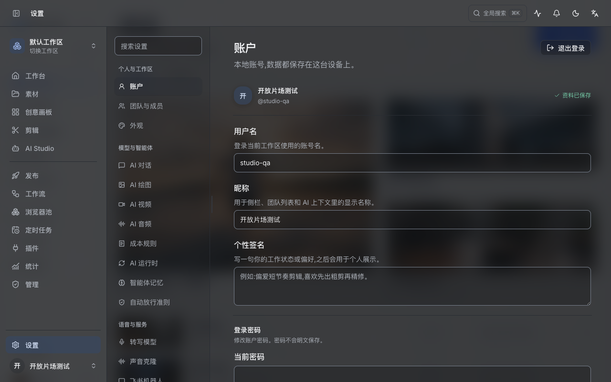
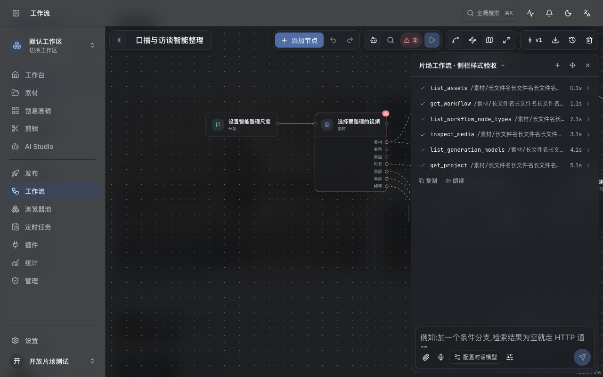

# 自定义背景与页面层级

自定义背景由应用外层统一承载。普通内容面板不再重复叠加底色；覆盖在内容之上的窗口保留独立磨砂表面。

| 层级 | 处理 |
| --- | --- |
| 主内容、并排面板 | `workspace` / `workspace-panel`，自定义外观下透明，默认外观仍沿用原主题表面 |
| 次级导航 | `workspace-subtle`，轻微填色区分区域，背景连续 |
| 输入和描边按钮 | `control`，随外观透明度和明暗主题变化 |
| 吸顶工具栏 | 滚动后使用透明填色与背景模糊，防止内容叠字 |
| 画布工具栏、助手、执行历史 | `canvas-overlay-surface`，78% 表面填色、24px 背景模糊，覆盖后方节点与网格 |
| 剪辑助手 | 并排时共享页面背景；悬浮时切换为独立磨砂表面 |
| 弹窗 | 独立磨砂表面，不再被自定义外观的通用规则覆盖 |

素材、AI Studio、任务、插件、剪辑、设置均接入。视频监视器保留中性底色，便于判断画面的真实色彩。模糊不可用或启用减少透明效果时，画布浮层与弹窗沿用实色回退。

素材筛选栏上下留白和两行间距统一为 12px。未吸顶时保持背景连续，吸顶后才启用模糊。

## 验证

- 独立测试数据库与浏览器会话，未提交生成、下载、运行或删除动作。
- 自定义图片背景、渐变背景与默认背景；深浅主题；1280×800 和 600×500。
- 素材工具栏实测 padding-top、padding-bottom、gap 均为 12px；窄窗口滚动后吸顶且无横向溢出。
- 自定义背景下设置内容面板透明，默认背景下控件恢复 `rgb(30,32,35)`。
- 工作流助手停靠/悬浮均为 24px 模糊；剪辑助手并排时透明，悬浮时为 24px 模糊。
- 186 个前端测试文件、1060 项测试通过，生产构建通过。

