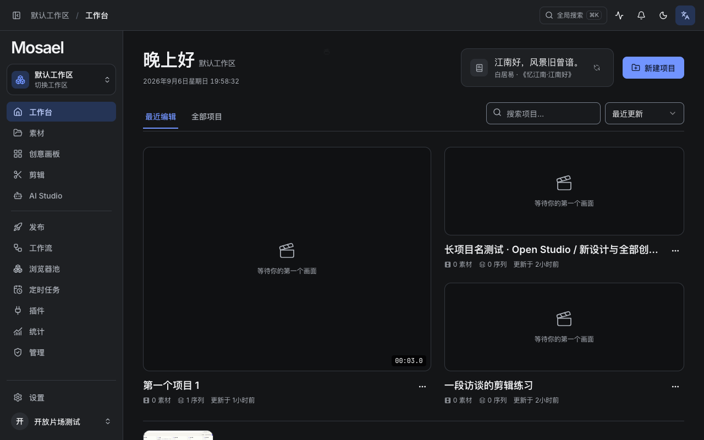
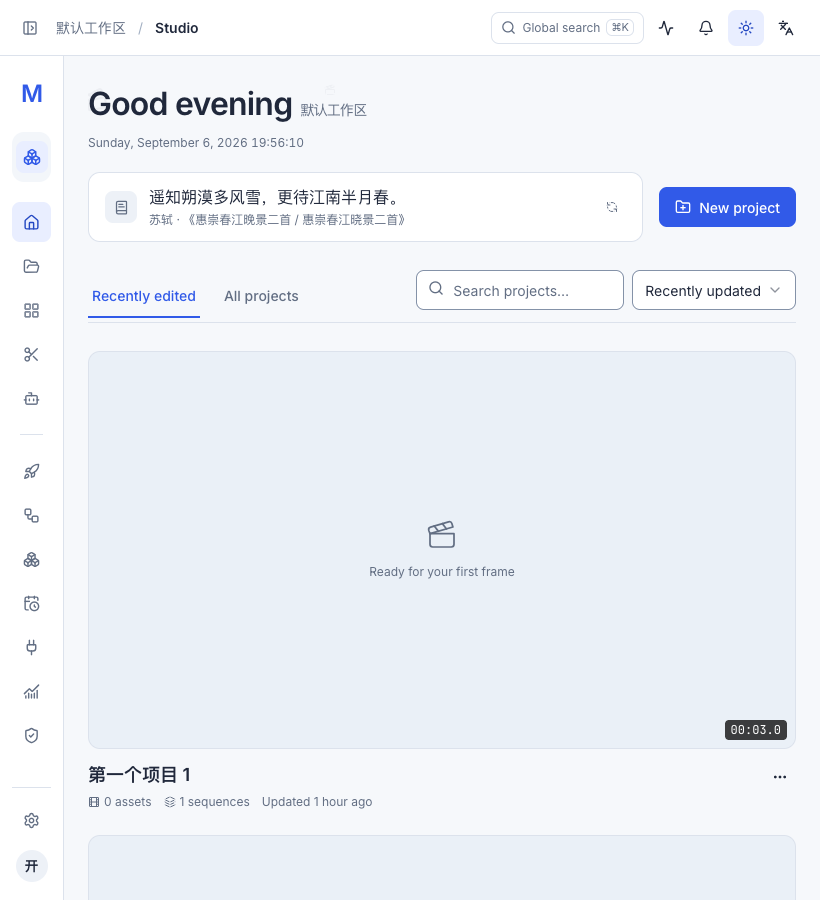
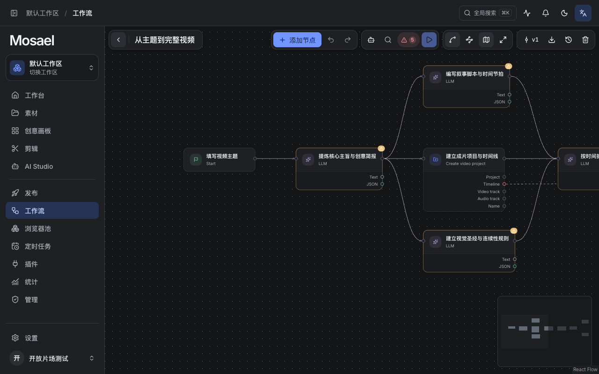
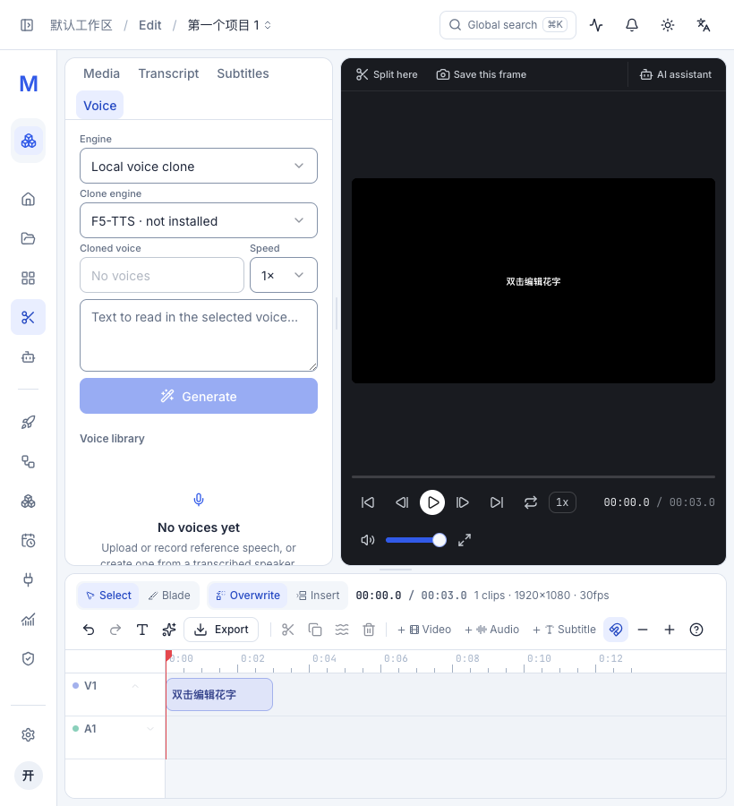

# 逐页视觉一致性复核 · 2026-09-06

本轮针对工作台欢迎区位置、工作流节点底角，以及不同页面字号、间距、颜色和圆角不一致的问题。检查了运行中的 13 个主页面，结合 DOM 的计算样式、截图与组件实现定位原因；额外打开剪辑的素材/逐字稿/字幕/配音、AI 对话/生成/轨迹、画板和工作流编辑界面。使用隔离测试工作区，不涉及真实平台发布。

## 统一规则

| 层级 | 规则 |
| --- | --- |
| 页面标题 | 32px / 600，40px 行高，共享 `text-ui-title`；工作台的问候承担标题角色 |
| 正文与条目 | 条目名称 16px，控件和普通说明 14px，辅助信息 12px；密集画布元信息 11px |
| 页面边距 | 大窗口左右 36px、上下 32px；较窄窗口左右 24px、上下 28px；主要内容区间距 28px |
| 标签 | 集合筛选为 44px 下划线标签；工具内部切换为 40px 分段容器、32px 选项、14px 字号 |
| 控件 | 普通输入、排序框、页面主要动作 40px；编辑器和批量操作保留 28–32px 紧凑规格 |
| 圆角 | 小元件 6px，输入与按钮 8px，卡片/面板 12px，较大浮层 16px；徽标、头像仍为圆形 |
| 颜色 | 选中和主要操作统一蓝色；浅色为冷白、深色为石墨灰；状态和节点类型读取主题语义颜色 |

取消正文令牌中的视口字号插值，缩小窗口时只调整布局，不让同一个控件的文字随窗口漂移。不同层级仍保持字号差异；编辑器预览区域持续使用中性深色，避免影响对作品颜色的判断。

## 逐页结论

| 页面 | 实际发现 | 本轮处理与核对 |
| --- | --- | --- |
| 工作台 | 项目标题 36px，欢迎区在项目列表底部，1280×800 下滚动前看不到；筛选比素材/发布页更高 | 欢迎、工作区、日期时间、诗句和新建项目合并到顶部；接入共享边距、字号及集合筛选；项目打开、搜索、排序、重命名/删除入口保留 |
| 素材 | 标题上边距比集合页少 4px；搜索 36px、排序 32px，高度不一致 | 顶部对齐，搜索和排序统一 40px；核对网格列表、类型筛选、导入/链接导入/录制与批量入口 |
| 创意画板 | 集合结构已合理，但受旧字号和圆角令牌影响，与工作台不同 | 继承统一标题与卡片规则；打开实际画板核对便签、图片、连线与工具栏；便签颜色保留其内容分类含义 |
| 剪辑 | 素材/字幕空状态为 16px，逐字稿为 12px；内部标签与 AI 的选中态不同；820px 英文界面播放栏撑大隐式网格列，画面和控件被裁切 | 空状态正文统一 14px；共用分段标签选中样式；显式约束监视器网格列，播放与画面操作栏允许换行；逐个检查四个左侧标签和窄屏操作边界 |
| AI Studio | 页面标题仅 20px；顶层标签与对话/轨迹标签高度、选中颜色不同 | 页面标题接入 PageHeading；两层工具切换共用分段标签样式；核对对话、生成、轨迹、模型配置提示与输入框 |
| 发布 | 标题和筛选结构正确；字号令牌及圆角随全局变化 | 继承统一规则；检查成功/失败记录与状态颜色、时间、筛选和新建入口，没有改发布逻辑 |
| 工作流 | 列表头部按钮只有 32px；节点外圆角 14px、底部内圆角 9px；预览用 :last-child 判断末层，但后面还有连接点 | 列表动作统一 40px；节点使用同一个半径变量，外框 12px、内层 11px；按视觉末层为端口、运行摘要、素材预览设置底角；保留 overflow:visible，连接点与告警不被裁切；节点和端口颜色改读语义令牌 |
| 浏览器池 | 页面动作 32px、卡片标题 20px，卡片内边距比同类列表更大 | 页面动作 40px、卡片标题 16px、内边距 20px、圆角 12px；核对账号/档案两种入口和启停状态 |
| 定时任务 | 列表和详情结构明确，标题层级与普通页面受同一旧令牌影响 | 继承统一标题、正文和圆角；核对列表选中态、任务详情、绑定工作流与运行记录；详情是铺满的工作面板，保留直角分栏 |
| 插件 | 主标题顶部偏移；插件详情标题 24px，索引头部仅 40px；工具卡片更圆 | 顶部对齐；详情标题 20px、索引头部 56px、工具卡片 12px；核对两个插件、连接、开关、工具搜索与展开入口 |
| 统计 | 自定义页面左右边距 32px，其他集合页为 36px；图表标题 12px/650，卡片内容间距偏紧 | 接入共享页面骨架；图表标题 14px/600、内边距 20px、标题内容间距 16px；保留所有指标、六张图表和跳转 |
| 设置 | 页面标题顶部偏移，内部样式来自共享 SettingsGroup/Row；不同设置内容长短差异大 | 页面顶部对齐；共享正文、字段与圆角规则生效；保留分组、搜索和行级响应式换行，不把设置行套成多层卡片 |
| 管理 | 使用共享标题，但页面主要区块间距与其他集合页不同 | 区块间距统一 28px；核对汇总、任务活动与用量区域；管理数据与权限保持原逻辑 |

## 实测与验证

前端全量测试：184 个测试文件、1054 项通过。生产构建与文档规则检查通过；构建仍提示已有的大体积分包建议。

- 1280×800、中文、深色：13 个主页面逐页截图与计算样式检查，页面无横向溢出。普通标题均为 32px，左坐标 260px，上坐标 88px；工作台问候因欢迎行垂直居中为 89px。
- 820×900、英文、浅色：工作台欢迎区自然换行；新建、诗句刷新、筛选、搜索和排序可见。剪辑四个左侧标签可访问，监视器完整，播放、倍速、音量、全屏和 AI 入口都在窗口内。
- AI 对话/生成及对话/轨迹切换：选项实测均为 14px、32px 高，选择反馈一致。
- 实际工作流的 10 个节点：检查外框与末层圆角关系、连接点数量、overflow；浅色和深色下均保留完整节点和端口。
- HomeView 的现有交互测试改为渲染真实 HomeHero，验证欢迎区是首项，工作区、诗句、刷新和新建入口存在，同时继续检查项目筛选、打开和创建回调。
- 监视器补全网格轴后，从历史缺陷豁免清单移除该项，由现有布局规则持续保护。

本轮验证范围是界面与既有前端行为。测试工作区没有配置付费模型或真实平台凭证，因此没有调用 AI 生成、网盘传输或外部发布来验证这些业务链路。

## 实际界面

工作台顶部（深色）：

窄窗口工作台（浅色、英文）：

工作流节点（深色）：

窄窗口剪辑控制栏：

