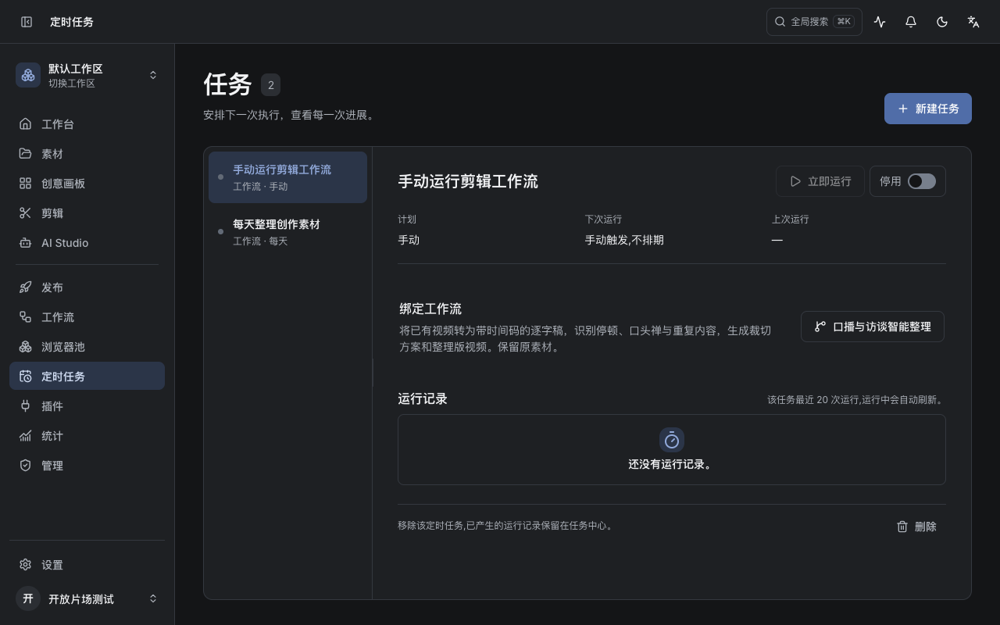
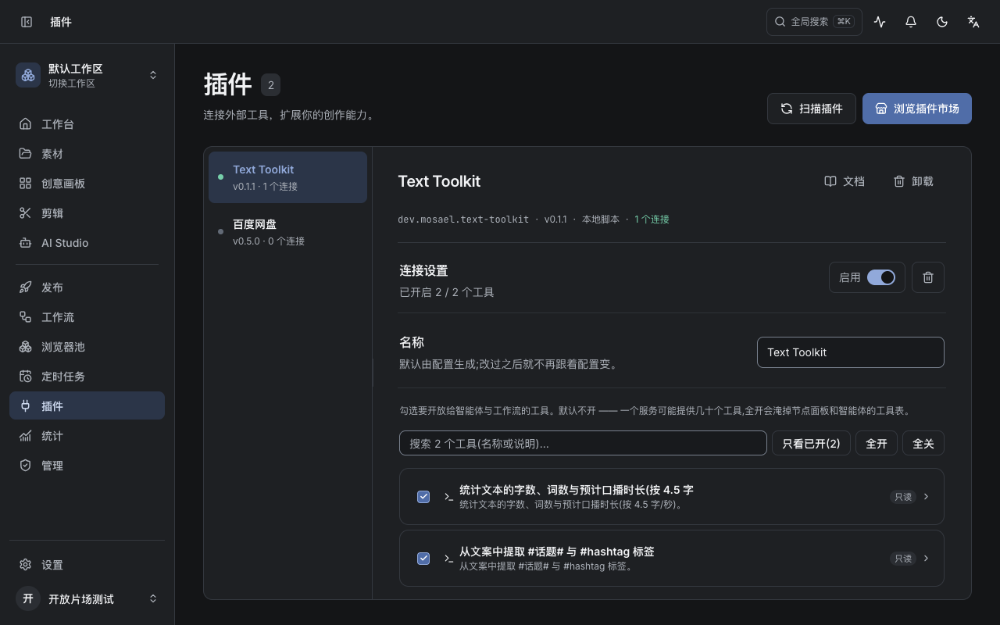
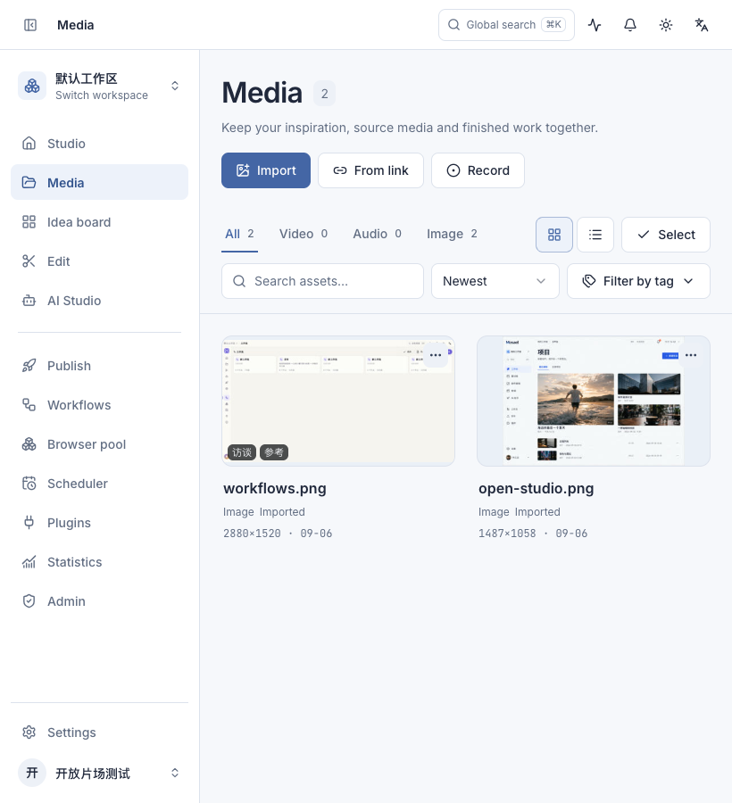
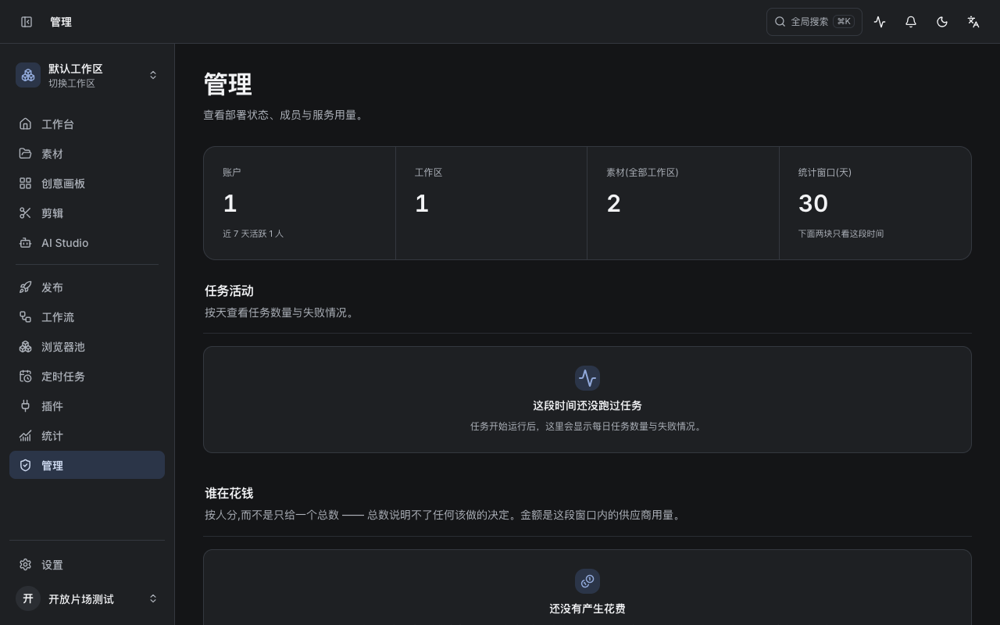

# 控件、主从页面与按钮配色复核 · 2026-09-06

> 后续布局调整：插件与定时任务恢复原插件页的通栏双栏结构，取消内容外框、圆角和外围留白；标题区使用透明背景。两页共用 `COLLECTION_DETAIL_PAGE` 与 `COLLECTION_DETAIL_HEADING`，继续保留独立滚动、拖动调宽和窄屏横向列表。1280×800 下两页内容均从 x=224 铺至右边界及底边，标题背景实测透明；820×900 下切换条目正常，无横向溢出。以下截图与坐标记录为前一轮版本。

本轮根据实际界面修正素材筛选、首页诗词、任务与插件布局、管理页任务活动，以及聊天输入框阴影。功能入口和业务操作继续保留。

## 设计规则与改动

- 集合页面的同排控件统一为 40px、14px 字号、8px 圆角。素材的类型和视图选择放第一排；搜索、排序、标签放第二排；批量操作仅在选择模式显示。标签改成可搜索菜单，当前标签可一键清除，避免大量标签铺满页面。
- 首页诗词是 40px 高的单行辅助信息，诗句与作者均为 12px，完整诗句和出处通过悬停可读。刷新、节日效果、彩蛋、新建项目保留。项目搜索和排序取消额外下边距，和筛选项垂直对齐。
- 任务和插件使用同一个 `CollectionDetail`，共用列表、详情面板、拖动边界和窄屏横向列表。标题区都使用页面背景，移除左列重复标题。列表选中态、正文与状态颜色一致。插件单连接与插件同名时，第二层标题显示“连接设置”，多个连接仍保留各自名称。
- 任务详情的计划、下次运行、上次运行分列呈现，窄空间自动换行；运行按钮和启停控件均为 40px。插件工具筛选保留内部 32px 紧凑规格，同一排输入框和按钮一致。
- 管理页的任务与花费空状态使用紧凑提示，不绘制空网格。任务活动原来读取不存在的 `succeeded` 字段；接口实际返回 `total` 和 `failed`。现在按“未失败 / 失败”堆叠，避免把排队、取消等任务错误标成成功。加载、读取失败及零记录分开呈现，失败可重试。
- 主对话、生成及画布侧栏输入框使用 12px 圆角和细边框，移除抬升阴影与焦点阴影；保留焦点边框反馈。
- 主按钮和其他带文字/图标的实心交互使用独立的动作色。浅色主题为 `#4466a5`，深色主题为 `#506da8`，均配白色文字和图标，对比度分别为 5.69:1、5.13:1。深色链接和强调文字使用浅蓝 `#91a9da`，不会随按钮底色变暗。选中背景也降低饱和度；提示气泡使用中性浮层颜色。

## 实际验证

1280×800 中文深色与 820×900 英文浅色界面复核：素材、首页、任务、插件、管理及 AI 对话。素材类型、搜索、排序、视图和选择控件实测均为 40px；筛选行边框圆角均为 8px。标签搜索、应用、清除用测试素材实际操作验证。

任务与插件在同一窗口下的标题起点均为 `(260, 88)`，详情区起点均为 `(260, 186.75)`；两页标题背景透明，工作面背景一致。两页左列不再渲染重复标题。窄窗口下列表横向排列，详情仍可独立滚动。

管理活动使用隔离测试库临时的已完成任务验证正常、部分失败和全部失败三种柱形；验证后清理临时任务。没有执行真实发布、付费生成或网盘传输。聊天输入框计算样式确认为 `box-shadow: none`。

前端 186 个测试文件、1060 项测试通过，生产构建及文档规则检查通过。新增测试覆盖标签搜索/选择/清除、接口总数正确进入图表、零记录、加载与失败重试；颜色测试覆盖新按钮配色的对比度。共享布局还消除了两个旧网格布局豁免项。构建保留已有的大体积分包提示。

## 界面对照

任务与插件共用布局：

素材筛选（浅色、窄窗口）：

管理页空状态：

