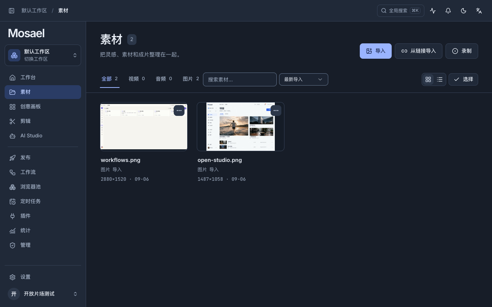
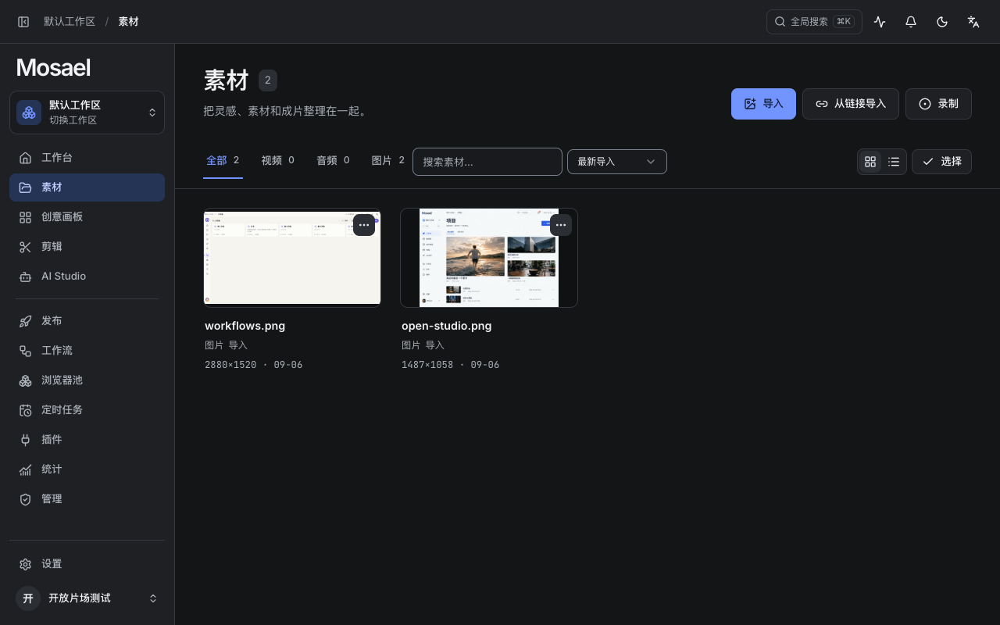

# 深色配色补全

2026-09-06。此前全页面重构仍沿用首轮偏蓝灰的深色底色，视觉变化不足。这次单独重做深色主题的表面、文字、操作、状态、轨道和图表配色。

| 角色 | 之前 | 现在 |
| --- | --- | --- |
| 工作面 | #171D28 | #141517 |
| 面板 | #202938 | #1E2023 |
| 浮层 | #283346 | #292C30 |
| 主文字 | #EDF2FA | #F2F3F5 |
| 辅助文字 | #A5B3C8 | #ADB2BA |
| 主操作 | #9AB4FF | #7194FF |
| 选中背景 | #2A3C65 | #253455 |
| 输入底色 | #1C2432 | #181A1D |

大面积背景采用中性石墨灰，避免蓝灰底色影响媒体周围的色彩观感。操作与选中状态使用蓝色；视频、音频、字幕、叠加轨分别采用蓝、青绿、沙金、紫色。浮层比页面更亮，输入底色下沉。浅色主题与业务功能保持原样。

磨玻璃模式的五个表面底色同步更新，Windows 原生标题栏同步到面板与文字色，防止出现旧色块。

验证：实际查看素材、剪辑时间线、AI Studio、设置、插件及通知浮层；浏览器计算样式确认默认与磨玻璃底色生效。正文、辅助文字、操作与状态色在全部深色内容表面达到 4.5:1，轨道文字及标尺文字达到 4.5:1，输入与焦点边界通过原有 3:1 检查。新增标题栏随主题切换并匹配主题色的测试。完整前端 184 个文件、1,054 项测试通过，TypeScript 与生产构建通过；现有分块体积提示仍在。Windows 标题栏使用桥接自动化测试验证，未在 Windows 实机检查。

同一真实页面、同一窗口的前后对照：

