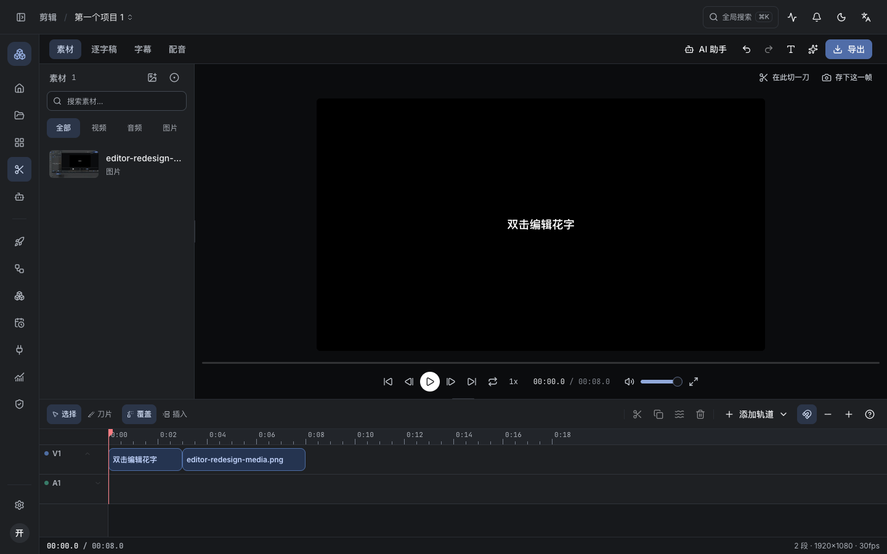
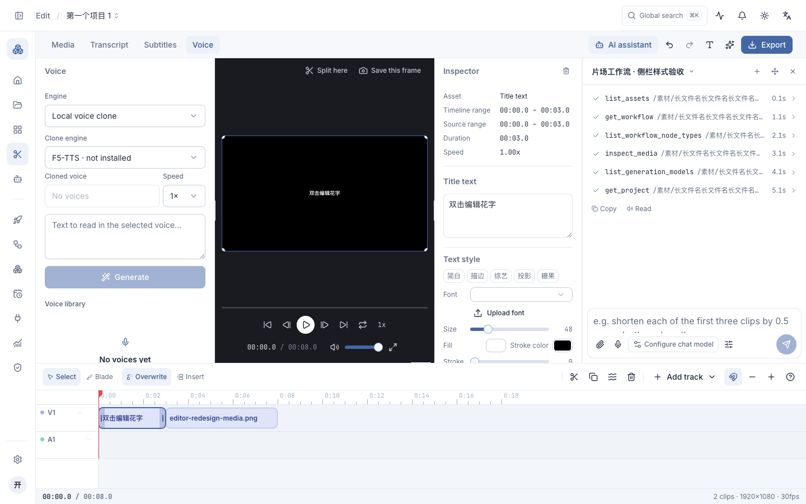
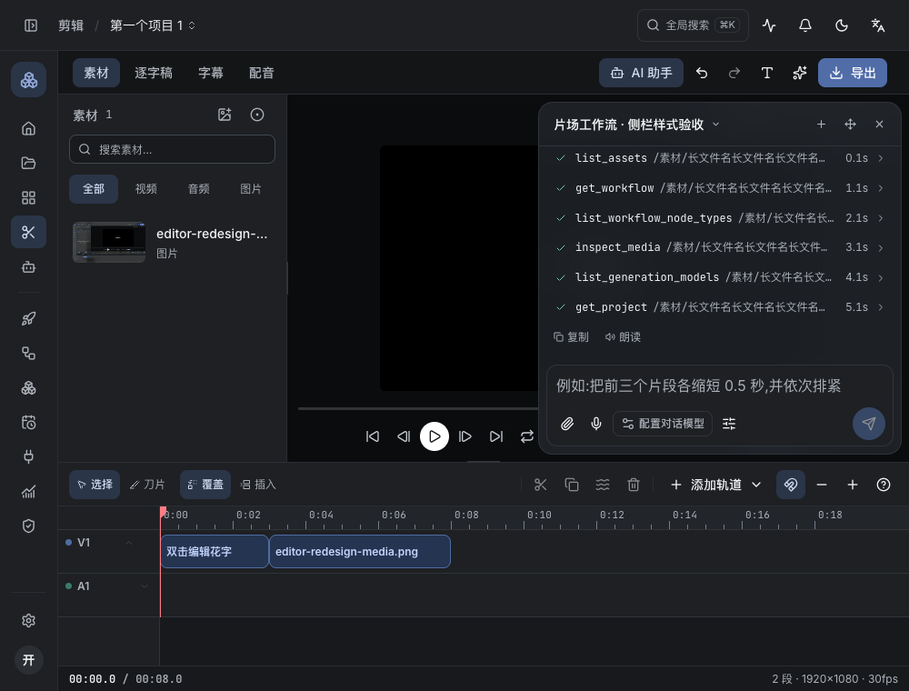

# 剪辑工作台重构

剪辑页从多个带圆角描边的独立卡片，改为共用边界的编辑工作台。素材、逐字稿、字幕、配音在顶部切换；助手、撤销重做、添加文本与导出也集中到同一工具栏。

- 左侧素材使用无描边缩略图列表，搜索与标签筛选并排，类型选择统一为 32px。标签弹层保留多选交集逻辑；导入、录制、拖入时间线、图片预览和右键操作保留。
- 预览区域保持中性底色，当前帧操作位于顶部，播放控制集中在下方，统一为 32px。
- 时间线工具分成编辑模式、片段操作、轨道与缩放；三种新增轨道入口收进一个菜单，时间码、片段数、分辨率和帧率放到底部状态栏。
- 去掉面板的重复圆角边框；配音、字幕与逐字稿工具采用一致的留白、控件色和交互尺寸。
- 助手与检查器根据工作台实际可用宽度安排。宽度不足时使用带模糊的覆盖层，保证预览区域不会被多列面板挤没；扩大窗口后恢复停靠。
- 页面面板沿用自定义背景；浮层独立模糊。下拉选择器、模型选择器、代码输入、弹窗表单等补齐 `field-border`，避免沿用高对比的状态控件边框。

## 验证

在独立测试数据库内检查，无需修改用户项目：

- 素材导入、加入时间线、新增字幕轨道、撤销、选中片段打开检查器、助手开合与停靠、四种工作模式、导出设置。
- 900×700、1000×760、1280×800、1440×900，深浅色、中英文及自定义图片背景。
- 900px 窗口下工作台内容宽度等于可用宽度，助手和检查器切换到覆盖层；助手背景模糊为 24px。
- 普通状态颜色过渡 160ms，吸顶栏 180ms；减少动态效果下过渡为 0ms。
- 187 个测试文件、1062 项测试通过，生产构建通过。新增窄工作台覆盖/恢复停靠的回归测试。
- 本次没有实际运行 AI 生成或完整导出编码；它们的入口和既有处理逻辑保留。

