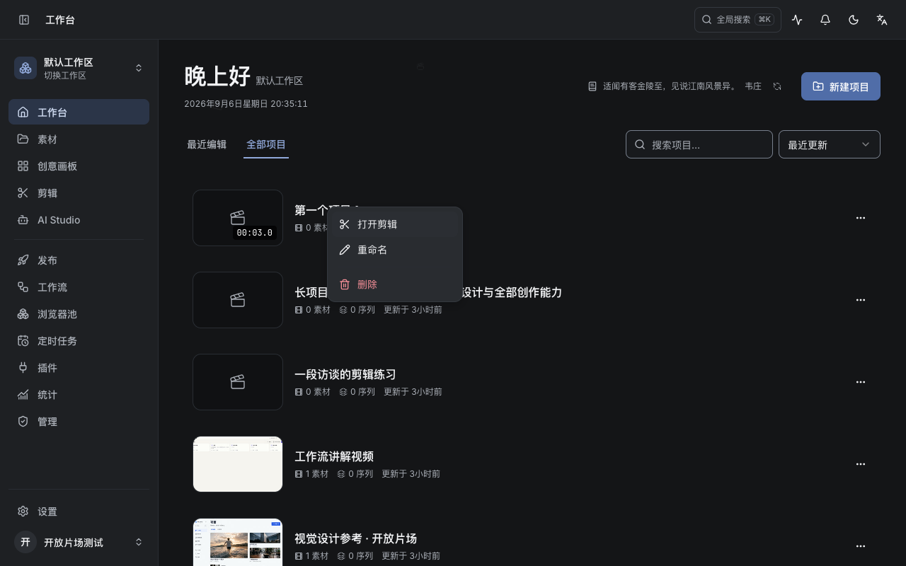
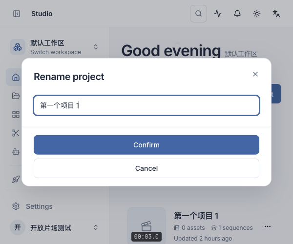
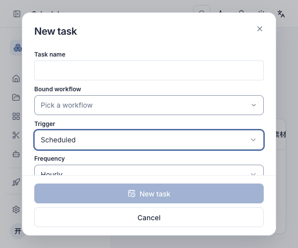

# 弹窗与菜单

先用项目重命名和项目菜单验证样式，再统一到公共组件与画布浮层。浮层承载操作，以清晰的文字、紧凑的动作行和适量留白建立层级；不用磨玻璃或多层阴影装饰。

| 元素 | 统一规则 |
| --- | --- |
| 普通弹窗、确认框 | 16px 圆角，24px 内边距，20px 标题，14px 正文 |
| 弹窗动作 | 40px 高，取消使用描边，主操作用品牌色，危险确认用语义危险色 |
| 菜单、子菜单、下拉选择 | 12px 圆角，36px 行高，14px 文字，16px 图标，6px 菜单内边距 |
| 内容分隔 | 淡色细线，菜单分组线向内收，不贯穿外框 |
| 浮层深度 | 单层柔和阴影；弹窗遮罩分别适配深浅主题 |
| 状态 | 悬停/键盘焦点使用柔和底色；危险文字保持红色；禁用项弱化；选中项保留勾选标记 |
| 动效 | 150ms 淡入淡出；尊重减少动态效果设置 |

公共规则集中在 `frontend/src/components/ui/floating.ts`。Dialog、AlertDialog、ModalShell、ContextMenu（含子菜单）、Popover、Select 和命令菜单共享这套语言。项目/素材/工作流/模型的操作菜单、会话切换菜单、画布编辑浮层、建议菜单与工作流检查面板同步接入。不同内容保留所需尺寸、表单结构和操作入口。

## 实际界面

## 验证

- 实测右键菜单项为 36px / 14px，弹窗为 16px 圆角、确认动作 40px。
- 项目右键菜单进入删除确认；取消默认获焦，取消后页面恢复可点击。
- 会话右键子菜单可用鼠标及方向键展开，“新建分组”可进入弹窗并取消。
- 浅色英文、深色中文；600×500 窗口长表单高度 450px，内容内部滚动，底部操作仍在窗口内；下拉选项可正常选择。
- 全部 186 个前端测试文件、1060 项测试通过；生产构建通过。保留焦点管理、Portal、滚动锁与禁用/提交逻辑。
