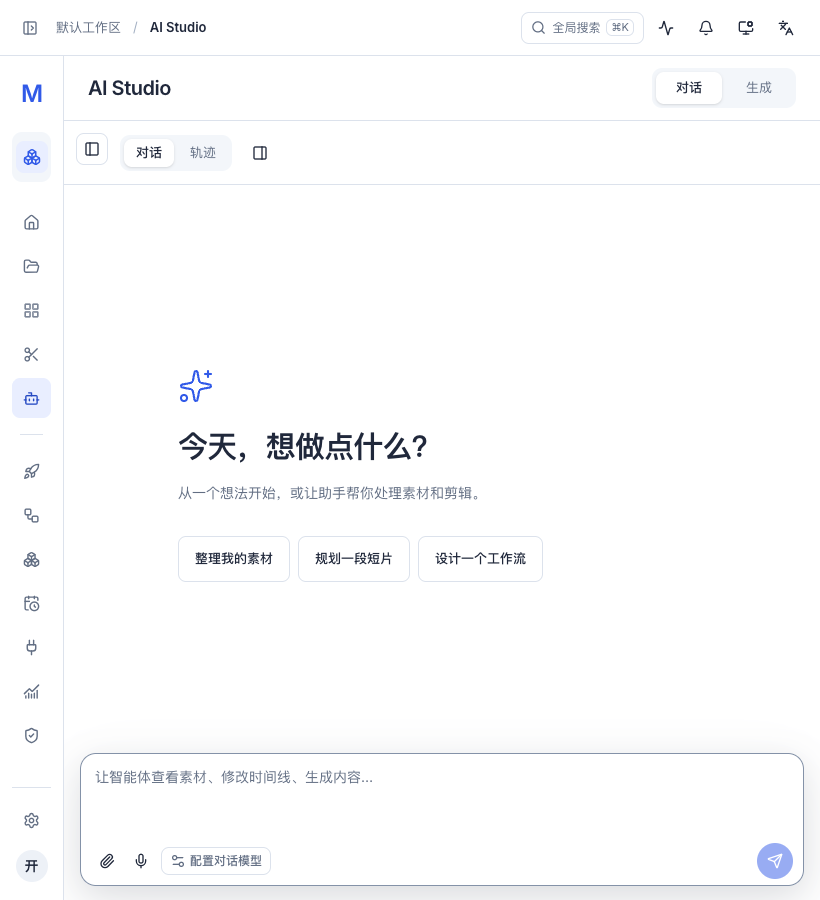
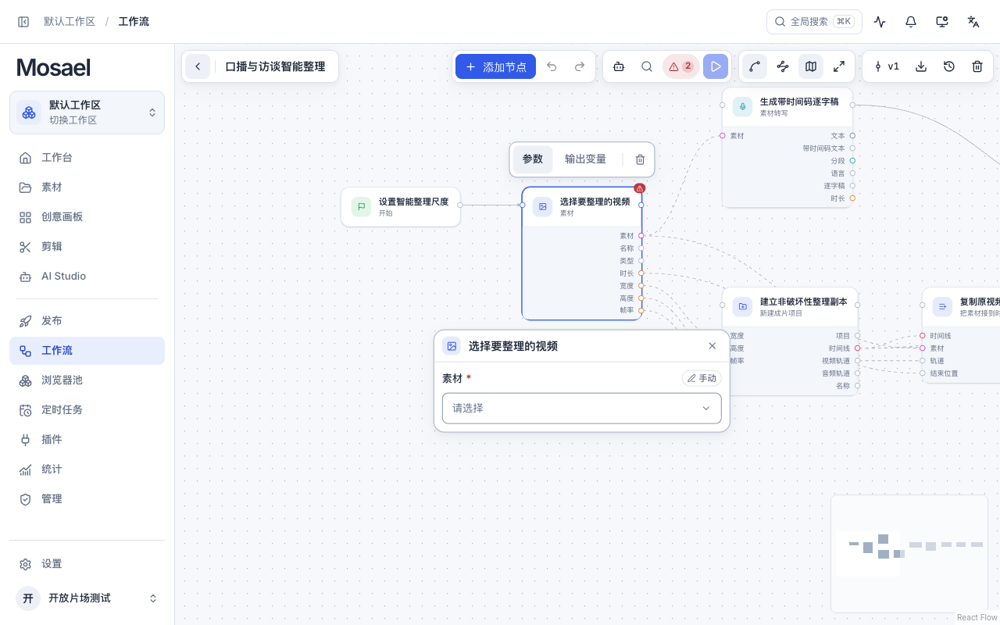
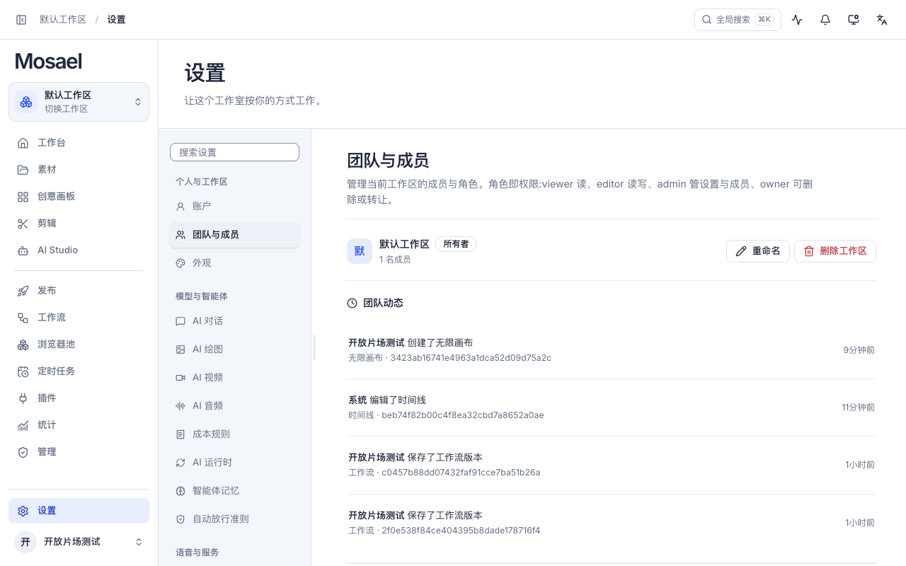

# 开放片场：全页面与组件落地

2026-09-06。在首轮导航、工作台、独立统计页和主题基础上，重新组织实际业务页面的内容层级与操作方式。

## 页面与交互

- 素材：标题与导入操作常驻页面起点，类型筛选带数量，支持保存网格/列表偏好；缩略图与说明分层，菜单直接提供保存、重命名、标签、转 GIF 和删除。预览使用媒体与元信息双栏。
- 创意画板：列表显示保存的便签、图片和连线布局；画布增加明确的“添加”入口，便签与共享浮层采用新组件语言。
- 工作流：列表使用真实节点布局预览，提供可见操作菜单；节点、参数面板与画布工具栏重排。首次打开较大的图聚焦起始区域，已有视口继续恢复，“适应画布”仍能查看全图。
- 剪辑：资源栏、监视器、时间线与属性栏统一分区；字幕、逐字稿、配音、调色、曲线、LUT、关键帧和 AI 面板保留，统一标题、间距、控件与窄窗口属性面板位置。
- AI Studio：对话/生成切换放在顶层；会话列表集成在工作面，窄窗口通过弹出列表访问；环境与引擎参数可以展开/收起。对话起始页提供只填入草稿、不自动发送的三个建议入口。
- 插件：安装列表与连接详情分层，市场由明确入口打开；权限、凭据、OAuth、工具暴露、调试与记录保留。布尔参数区分默认值/是/否，结构参数提供多行输入，并继续传递当前工作区。
- 发布：按状态筛选与日期组织记录，突出成功、失败、受阻信息。全选只作用于筛选后的可见记录，隐藏项自动退出选中集合。
- 浏览器池：环境卡片重新分层，代理、登录、共享、绑定状态与菜单保留。
- 定时任务：列表与详情分区，窄窗口列表变为横向索引；保留工作流绑定、创建、执行、启停、共享与执行记录。
- 设置：16 个既有分区重组为“个人与工作区 / 模型与智能体 / 语音与服务”，支持查找分区；详情采用清晰的区块标题和响应式表单行。
- 管理与登录：管理指标统一对齐；登录使用非对称图片/表单布局，窄窗口聚焦表单。权限与认证流程保留。
- 工作台、工作区切换、独立统计页延续首轮已选方案；本轮与其他页面一起检查。

共享按钮与输入默认高度 40px；密集编辑器保留小尺寸。页面标题、带数量的筛选、操作菜单、会话索引、真实画布预览、空状态、弹窗、全局搜索、通知与任务中心统一使用浅冷白/钴蓝语言，深色使用同一套语义色。

## 实际验证

使用独立临时后端、测试账号与工作区；未向真实工作区写入测试数据。

- 1280×800 检查全部 13 个主页面的实际界面，未发现页面级横向溢出。
- 820×900 检查中英文、浅深主题，以及 AI、设置、插件、定时任务、浏览器池、素材、发布、管理。修复 820px 断点处 CSS 与 matchMedia 边界不一致导致的 AI 双栏残留；单列设置等页面不再显示列宽拖柄。
- 实际打开素材网格/列表与预览、保存的画板与节点图、工作流节点参数、发布创建表单、全部 16 个设置分区、搜索、通知、任务中心、窄屏会话索引、环境与生成参数面板。
- QA 数据包含真实保存的项目、两张图片、带文字片段的时间线、便签与图片画板、官方工作流、禁用的定时任务和浏览器环境。发布记录使用明确的终态测试数据展示成功/失败，未触发外部发布。
- 安装本地示例插件，在实际界面执行 Text Toolkit 字数统计成功。百度网盘凭据及外部上传/下载未执行；工作区传参与布尔/JSON 调试参数由自动化测试覆盖。
- 前端完整测试：184 个文件、1,051 项通过。新增共享筛选、真实预览、操作菜单、插件参数类型与工作区、发布筛选后批量选择回归；发布批量选择测试先在错误行为上失败，再在修复后通过。
- TypeScript 与生产构建通过；原有大产物分块提示仍存在。`git diff --check` 通过。

未把界面检查等同于所有第三方集成端到端验证：本轮未调用付费模型、未执行第三方公开发布、未执行百度云端传输，也未重测每项桌面原生能力。

## 实机截图

以下图片来自运行中的应用，使用隔离测试数据。

## 参考

用户选定的第一套“开放片场”概念是主要方向。查看了 Dribbble 的 [Video Editing UI — Media Library, Timeline & Motion Tools](https://dribbble.com/shots/26849256-Video-Editing-UI-Media-Library-Timeline-Motion-Tools)，参考其工作面分区、媒体层级与面板组织；产品仍使用自己的颜色、控件与业务结构，未引入该作品图片作为产品资产。
