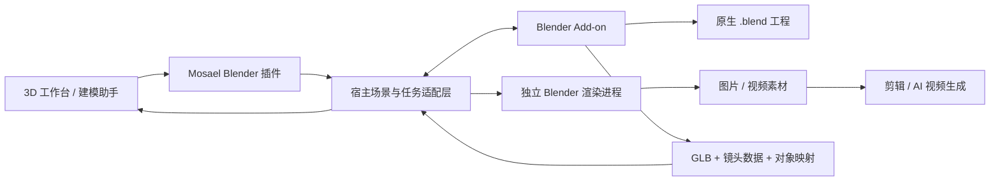

# Blender 与 Mosael 3D 的接入调研

日期：2026-09-07。代码基线：`d7632a16`。

**状态：第一阶段已实现：Blender MCP 插件、连接检测、模型/镜头发送、修改回传（默认更新当前场景，可另存为新场景）和 `.blend` 下载。真实 Blender 5.2.0 LTS + MCP 1.9.1 已验证。安装与范围见 [插件使用说明](../../plugins/examples/blender/README.md)。**

以下保留总体设计方向；结构化高级工具、后台渲染队列、逐物体合并尚未实现。当前实现复用现有 MCP 插件执行路径，应用同步 API 使用固定 Python 脚本。社区 Add-on 连接限本机，没有额外实现配对协议；不能把后文的配对鉴权目标视为已经具备。

建议增加一个可选的 **Blender Bridge**：Mosael 继续负责场景组织、镜头设计、素材、智能体与视频生成，Blender 负责精细建模、原生工程和高质量渲染。建模助手沿用用户选择的模型，连接协议不绑定 Astra 或某一家模型服务。

## 搜索结果与技术选择

| 路线 | 证据 | 在本项目中的用途 |
| --- | --- | --- |
| Blender Python API | 官方提供场景、物体、材质、相机等 API | 实现 Blender 端操作 |
| 社区 Blender MCP | `ahujasid/blender-mcp` 使用 MCP 服务与 Blender Add-on 连接，提供场景检查、物体与材质操作、代码执行 | 参考工具设计与连接方式；单独接入它不会自动完成 Mosael 的场景、权限、版本和素材映射 |
| glTF / GLB | Blender 的 glTF 实现支持网格、PBR 材质、纹理、相机和部分动画；自定义属性可写入 extras | 传递可预览的几何与材质；稳定 ID 通过 extras 关联 |
| Blender 命令行 | 支持后台运行 Python 脚本，以及控制脚本错误的退出码 | 独立转换与渲染任务，不阻塞用户正在操作的 Blender 窗口 |

以上是接口能力，下面的 Bridge 结构是结合项目代码做出的设计建议，并非这些项目已经实现的 Mosael 集成。

来源：[Blender MCP 原项目](https://github.com/ahujasid/blender-mcp)、[Blender glTF 实现文档](https://github.com/KhronosGroup/glTF-Blender-IO/blob/main/docs/blender_docs/scene_gltf2.rst)、[Blender 命令行参数](https://docs.blender.org/manual/en/5.1/advanced/command_line/arguments.html)。

采用自有薄桥接层，复用现有插件系统。MCP 可以作为工具入口，但实际互通协议必须拥有明确的版本、场景身份和产物契约，不应让核心 3D 功能依赖社区插件的内部 socket 协议。

## 当前代码具备什么、缺什么

- [`SceneContent`](../../backend/app/domain/scene_types.py) 已包含对象 ID、父子关系、米制位置、角度旋转、基本材质和镜头关键帧。当前没有任意网格编辑、修改器、几何节点、骨骼动画，也没有相机 roll/up 描述。
- [`SceneViewport`](../../frontend/src/features/scenes/SceneViewport.tsx) 使用 Three.js，已有真实 GLB 导出。对象的 `sceneObjectId` 写在包装节点上，网格可能是它的子节点。导入模型时会删除子节点的此字段，避免编辑器误选内部对象。因此目前不能靠“重新导入 GLB”恢复独立可编辑的所有场景对象。
- GLB 导出只导出对象根，不包含 `SceneShot` 运镜；场景 JSON 又只引用模型 ID，没有打包模型文件。发送场景需要统一的快照包，不能只交出其中一个文件。
- [`模型导入`](../../backend/app/domain/scenes.py) 接受自包含 GLB/内嵌 glTF；当前限 25 MB、5000 个节点、2000 个网格。复杂 Blender 场景需要生成预览版本，并提供明确的超限反馈。
- [`插件调用`](../../backend/app/domain/plugins/tools.py) 已支持进程和 MCP。进程调用上限 60 秒、标准输出上限 1 MB，调用后清理暂存目录。它可以发送短命令，不能承担长渲染或保存 `.blend` 工程。
- 插件只收到声明的配置、凭据与输入，不获得应用数据库、工作区令牌。场景文件的读取、回传登记与版本写入应由宿主适配层完成，继续执行工作区权限检查。
- 插件当前产物入口登记一个素材文件；场景模型使用独立的 `Scene3DModel` 存储。不能把 GLB 当成图片/视频素材直接塞进现有产物入口。

## 建议的交互

插件页面提供 Blender Bridge 的启用、安装指引、程序路径、检测连接与版本。3D 工作台工具栏增加紧凑的 Blender 入口，连接状态与操作放在同一菜单：

1. **在 Blender 中编辑**：先保存或取得当前草稿快照，发送选中对象或整个场景，在独立的 Mosael Collection 中打开。
2. **从 Blender 更新**：显示本次新增、修改、删除的对象与材质，然后按对应 ID 更新。发生版本冲突时保留两边内容。
3. **使用 Blender 渲染**：选择镜头与质量，显示进度、取消和结果；产物进入素材库，可继续进入剪辑或视频生成。

未安装时展示安装指引；已安装但插件未连接时展示连接步骤。技术参数放入连接设置，日常操作不要求用户填写端口、脚本路径或导出目录。

首版使用显式发送/接收。实时同步需要在增量合并与冲突处理成熟后再开启，避免在用户拖动一个物体时双方反复覆盖。

## 桥接与数据归属

建议快照包包含：

- `manifest.json`：协议版本、工作区/场景 ID、基础版本、同步 ID、对象映射、文件哈希、坐标与单位约定。
- `scene.json`：完整 `SceneContent`，作为原生对象参数和镜头的显式交换数据。
- `scene.glb` 与必要的模型文件：自包含的预览几何、贴图和基础材质。
- `.blend`：单独作为持久工程保存；保留修改器、几何节点、复杂着色器和其他 Blender 原生能力。

包和工程存储在宿主管理的持久目录，拥有归属和保留策略，不能引用调用结束就会删除的 scratch 文件。解析包时校验文件大小、路径与归属，导入方不接受任意应用令牌或任意服务器路径。

对象按 ID 匹配而不是按名称匹配。首版可把加工结果回传为一个关联模型对象；后续再支持逐对象替换。经过 Blender 加工的模型不能继续伪装成只由宽高深参数决定的原生立方体。保留来源与上次同步版本，通过现有场景版本机制恢复原始内容。

`.blend` 保存原生建模状态；Mosael 保存场景组织与用户采纳的快照。任一侧都不能在没有版本校验时自动覆盖另一侧的新修改。

## 镜头、材质与渲染

镜头桥接必须明确以下契约：

- Mosael/Three.js 为 Y-up；本次实测 Blender 导入转换为 `(x, -z, y)`。只对自定义 JSON 数据手动转换；GLB 导入导出已执行轴变换，不能再重复旋转。
- Mosael FOV 为垂直视角。Blender 要明确 sensor fit、sensor height、镜头焦距及渲染比例，不能直接把角度当成毫米值。
- 按 [`sampleCamera`](../../frontend/src/features/scenes/sceneGraph.ts) 的 smoothstep 规则逐帧采样位置、target 与 FOV，再烘焙到 Blender。仅发送起终点、让 Blender 自行使用默认插值会改变运动。
- Blender 相机回传为原生 `SceneShot` 时，需要明确 roll/up、约束和更复杂动画的兼容策略；超出当前模型的镜头不能静默丢字段。首版先支持无 roll 的透视镜头与显式烘焙。
- 原生 PBR 材质可以转换；复杂材质、几何节点与修改器保留在 `.blend`，预览端使用烘焙或求值后的结果。不能承诺 GLB 与 Cycles 画面逐像素一致。

GLB 格式与导出器存在能力边界。例如 Blender Area light 和 World lighting 不属于 glTF 的常规灯光支持；导出器的动画指针扩展也不能默认等同于所有客户端都支持。因此环境光、背景、FOV 与镜头身份优先采用显式 sidecar 数据。[Blender glTF 灯光说明](https://docs.blender.org/manual/en/5.1/addons/import_export/scene_gltf2.html)、[导出器参数与实验性动画指针](https://github.com/KhronosGroup/glTF-Blender-IO/blob/main/addons/io_scene_gltf2/__init__.py)。

长渲染由独立 job 管理：提交迅速返回 job ID，状态查询、取消、日志、重试与产物登记分开。优先渲染可恢复的 PNG 帧序列，再通过现有媒体链路合成视频；渲染源绑定场景/镜头版本，结果记录来源。AI 视频生成继续使用现有首尾帧/参考视频能力描述，不能保证生成模型严格执行三维轨迹。

## 插件执行方式

Blender Add-on 处理当前打开的交互工程，后台 Blender 进程处理转换与渲染。连接默认限本机并配对鉴权；用户手动选择工程，不自动打开或修改任意现有 `.blend`。

建议先提供结构化工具：`inspect_scene`、`capture_viewport`、`send_scene`、`receive_scene`、`edit_objects`、`set_camera`、`submit_render`、`render_status`、`cancel_render`。这些是拟定接口，不是当前已注册的工具。

所有 `bpy` 修改在 Blender 主线程执行，可以通过非阻塞消息队列与 `bpy.app.timers` 调度。渲染另起进程。Blender 官方明确说明 Python 线程与 Blender 数据访问存在稳定性问题，不能直接让后台 socket 线程操作场景。[线程限制](https://docs.blender.org/api/main/info_gotchas_threading.html)、[Application Timers](https://docs.blender.org/api/4.5/bpy.app.timers.html)。

智能体沿用现有读写权限与确认模式。需要任意 Python 的高级建模能力时，单独声明工具能力和执行范围，优先在工作副本中执行，保留执行日志与预览；普通导入、同步、镜头操作不应依赖任意代码工具。Python 代码过滤不能声称是沙箱。

## 接入前的模型原型验证

环境：本机 Blender **5.2.0 LTS**，独立 QA 后端与测试场景，未使用用户的实际项目数据，也未安装 Add-on。

1. 从正在运行的 Mosael 3D 界面导出真实 GLB，测试对象位置 `(1, 2, 3)`，旋转 `(10, 20, 30)`，含基础材质与点光源。
2. 独立 Blender 后台进程导入该 GLB。`sceneObjectId=probe-box` 保留在包装节点；位置读取为 `(1, -3, 2)`。网格在其子节点上，修改器不能直接施加给包装 Empty。
3. 给实际网格增加三段倒角，保存 `.blend`，导出应用修改器的 GLB。回传 GLB 的对象 ID 保留，位置恢复为 `(1, 2, 3)`。
4. 将一秒镜头按 30 fps 采样为 31 个端点在内的姿态关键帧。起、中、末三个垂直 FOV 校验为约 `45° / 50° / 55°`；相机位置与目标按同一坐标规则转换。
5. 导出的 GLB 有一个相机、两个动画通道（位置、旋转）。本次默认导出没有 FOV 动画，验证了单独同步镜头数据的必要性。
6. GLB 经现有场景模型 API 导回 Mosael，实际视图加载并显示成功，还能再次导出。该原型回传是一个模型对象，当时未恢复原生 `SceneShot`；后续正式桥接已加入镜头 sidecar。

测试产物：`.blend` 100886 字节，Blender GLB 10412 字节。结果证明基础模型链路可行；该原型没有验证高质量渲染、实时连接、Windows、其他 Blender 版本、复杂材质或任意工程的无损往返。

## 顺序与完成标准

1. **连接和显式互通**：实现宿主适配层、可安装插件与 Add-on；检测连接；发送模型和镜头；保留 `.blend`；从 Blender 回传关联模型。验收包括基本材质、坐标、ID、草稿、失败重试和工作区隔离。
2. **镜头与渲染**：完成镜头 sidecar、FOV/比例/插值、渲染 jobs、取消与产物入库，并接通已有视频生成入口。用不同画幅的固定测试镜头比对投影和关键时刻。
3. **精细建模与增量更新**：增加逐对象回传、修改器/几何节点能力、冲突合并与可选实时预览。完整往返测试通过后再承诺更广泛的同步。

首轮兼容性以已经实测的 Blender 5.2 为基线；其他版本需要单独验证导出参数、相机与动画 API，不能因为存在 `bpy` 就标记兼容。

## 第一阶段接入验收

- 使用固定版本 Blender MCP 1.9.1，通过项目已有插件实例、权限与工具调用路径连接独立 Blender 5.2.0 LTS 图形界面。
- 实际点击 Mosael 3D 工具栏发送展厅及镜头，接收为新场景；没有浏览器运行错误。
- 通过 MCP 新增铜色球体、给网格添加倒角、平移摄像机 1.25 单位后回传，核对相机位置变化及垂直 FOV。原 Blender Scene 的三个物体和原 Mosael 版本保持不变。
- 重新读取下载的 `.blend`，确认包含新增球体、只包含关联的 Mosael Scene；接收结果在实际 Mosael 视图中显示。
- 检查浅色/深色界面、窄窗口、刷新后记录与采样提示、原生工程下载及新场景跳转。
- 自动回归覆盖本机限制、插件所有者与授权、源版本冲突、非法传输 ID、缺少完成标记、无效模型回传不创建半成品等。

后台渲染、逐物体合并、其他 Blender 版本及 Windows 仍需后续实现或验证。
